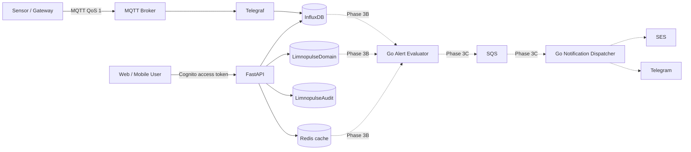

# Limnopulse Architecture

**Version:** 1.1
**Updated:** 2026-07-15

Limnopulse is the successor to the AquaFarm prototype. AquaFarm names in historical material describe the predecessor only; all active resources, topics, buckets, code, and new documentation use the Limnopulse name.

## Delivery status

| Slice | Status | Delivered boundary |
|---|---|---|
| Phase 1 | Current | FastAPI, Cognito/dev authentication, tenant membership authorization, tenants, ponds, devices, DynamoDB, Redis cache-aside |
| Phase 2A | Current | authorized InfluxDB telemetry reads |
| Phase 2B/2C | Current local scaffold | MQTT, Telegraf, local registry enrichment, InfluxDB writes |
| Phase 2D | Current scaffold | OpenTofu for DynamoDB, Cognito, SQS/DLQ, and optional SES identity |
| Phase 3A | Current | Alert Rule configuration, optimistic updates, replacement idempotency, transactional audit, TTL |
| Phase 3B | Target | Go evaluator, InfluxDB window evaluation, Redis cooldown/deduplication, Alert Events |
| Phase 3C | Target | SQS notification dispatcher, SES/Telegram delivery, retries, delivery records |

“Current” means implemented in this repository. “Target” is architectural direction and must not be interpreted as a deployed capability.

## System view



Solid edges are present repository responsibilities or local scaffolds. Dotted edges are later alert phases.

## Canonical names

### MQTT

```text
limnopulse/v1/devices/{device_id}/readings
limnopulse/v1/devices/{device_id}/health
```

Devices publish their identity and sensor readings. Tenant and pond ownership are resolved by trusted registry enrichment; tenant IDs, credentials, and tokens do not belong in device payloads or topic names.

### InfluxDB

| Bucket | Purpose | Status |
|---|---|---|
| `limnopulse_raw` | authorized raw water-quality readings | current |
| `limnopulse_1h` | long-retention hourly aggregates | target |
| `limnopulse_events` | lightweight operational time-series events | target |

The `water_quality` measurement uses `tenant_id`, `pond_id`, `device_id`, `source`, and `schema_version` tags. Sensor values remain fields.

### DynamoDB

```text
LimnopulseDomain
LimnopulseAudit
```

Both tables use string `PK` and `SK`, on-demand billing, encryption, point-in-time recovery in cloud infrastructure, and TTL on the numeric `expires_at` attribute. DynamoDB TTL deletion is eventual, so application logic treats expired records as expired before physical deletion.

Core `LimnopulseDomain` keys:

| Entity | PK | SK |
|---|---|---|
| Tenant | `TENANT#<tenant_id>` | `META` |
| Pond | `TENANT#<tenant_id>` | `POND#<pond_id>` |
| Device | `TENANT#<tenant_id>` | `DEVICE#<device_id>` |
| Device lookup | `DEVICE#<device_id>` | `META` |
| Membership | `USER#<cognito_sub>` | `TENANT#<tenant_id>` |
| Tenant member | `TENANT#<tenant_id>` | `MEMBER#<cognito_sub>` |
| Alert Rule | `TENANT#<tenant_id>` | `ALERT_RULE#<rule_id>` |
| Alert Rule replacement replay | `TENANT#<tenant_id>` | `IDEMPOTENCY#ALERT_RULE_REPLACE#<sha256>` |

Critical list paths use `Query` or known-key reads. Application code does not use DynamoDB `Scan`.

Audit keys:

```text
PK = TENANT#<tenant_id>#MONTH#YYYY-MM
SK = <UTC timestamp>#<audit event id>
```

Audit records retain actor, action, resource, before/after SHA-256 hashes, IP, user agent, creation time, and 90-day expiry. They never store JWTs, credentials, or mutation payloads.

## Authentication and tenant authorization

The access token authenticates a user; it does not grant tenant access by itself. Every tenant route resolves an active DynamoDB membership and then enforces the required role.

```text
JWT or local dev identity
  -> active tenant membership
  -> role check
  -> tenant-scoped repository access
```

Owner and admin roles may mutate Alert Rules. Member and viewer roles may list them.

## Phase 3A: Alert Rule configuration

Alert Rule identity consists of tenant, pond, optional device, and metric. These fields cannot be patched. Mutable fields are name, operator, threshold, aggregation, window, duration, severity, channels, cooldown, and enabled state.

Supported metric values:

```text
temp_c
ph
do_mg_l
turbidity_ntu
salinity_ppt
battery_v
rssi
```

Rules support `<`, `<=`, `>`, and `>=`; `min`, `max`, `mean`, and `last`; warning/critical severity; and email/Telegram channel declarations. Channel declarations are configuration only in Phase 3A.

Windows and durations use compact values from 60 seconds through 24 hours, such as `60s`, `5m`, and `24h`. Cooldown is 60 through 86,400 seconds.

Changing semantic identity uses the replace endpoint. One DynamoDB transaction disables and versions the old rule, links both records, creates the replacement, records audit, and stores a 24-hour replay result. The same `Idempotency-Key` and payload returns that result; a different payload with the same key returns `409`.

## Phase 3B: evaluation target

The future Go evaluator will:

1. read active rules from `LimnopulseDomain`;
2. query bounded InfluxDB windows;
3. apply aggregation/operator thresholds;
4. use Redis only for cooldown and short deduplication;
5. atomically create Alert Events;
6. enqueue notification jobs.

Phase 3B does not change the Phase 3A API identity or replacement contract.

## Phase 3C: delivery target

The future notification dispatcher will consume SQS with a DLQ, apply retry and permanent-failure policies, resolve verified preferences, send through SES and Telegram, and persist delivery attempts. WhatsApp, SMS, and mobile push remain later commercial/product decisions.

## Security boundaries

- InfluxDB, Redis, and DynamoDB are service-side resources; clients do not connect directly.
- Redis is cache/ephemeral coordination, never source of truth or durable queue.
- Production MQTT requires TLS/mTLS, per-device credentials, and topic ACLs.
- Tenant/pond/device target mismatches return `404` to avoid cross-tenant disclosure.
- Conditional writes and expected versions prevent silent lost updates.
- Secrets, raw tokens, and idempotency keys are excluded from domain/audit records.
- IAM, network exposure, real remote state, and secret management require environment-specific hardening before production deployment.
