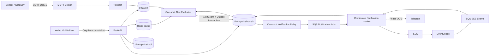

# Limnopulse Architecture

**Version:** 1.2
**Updated:** 2026-07-17

Limnopulse is the successor to the AquaFarm prototype. AquaFarm names in historical material describe the predecessor only; all active resources, topics, buckets, code, and new documentation use the Limnopulse name.

## Delivery status

| Slice | Status | Delivered boundary |
|---|---|---|
| Phase 1 | Current | FastAPI, Cognito/dev authentication, tenant membership authorization, tenants, ponds, devices, DynamoDB, Redis cache-aside |
| Phase 2A | Current | authorized InfluxDB telemetry reads |
| Phase 2B/2C | Current local scaffold | MQTT, Telegraf, local registry enrichment, InfluxDB writes |
| Phase 2D | Current scaffold | OpenTofu for DynamoDB, Cognito and base cloud resources |
| Phase 3A | Current | Alert Rule configuration, optimistic updates, replacement idempotency, transactional audit, TTL |
| Phase 3B | Current | one-shot Go evaluator, 64-bucket due index, InfluxDB windows, durable Alert Events and notification outboxes |
| Phase 3C-A | Current | one-shot outbox relay, SQS email jobs, continuous SES worker/feedback, durable deliveries and attempts |
| Phase 3C-B | Target | Telegram delivery of currently deferred Telegram outboxes |

“Current” means implemented in this repository. “Target” is architectural direction and must not be interpreted as a deployed capability.

## System view


```mermaid
flowchart LR
    Sensor[Sensor / Gateway] -->|MQTT QoS 1| Broker[MQTT Broker]
    Broker --> Telegraf
    Telegraf --> Influx[(InfluxDB)]

    User[Web / Mobile User] -->|Cognito access token| API[FastAPI]
    API --> Dynamo[(LimnopulseDomain)]
    API --> Audit[(LimnopulseAudit)]
    API --> Redis[(Redis cache)]
    API --> Influx

    Influx --> Evaluator[One-shot Alert Evaluator]
    Dynamo --> Evaluator
    Redis --> Evaluator
    Evaluator -->|AlertEvent + Outbox transaction| Dynamo
    Dynamo --> Relay[One-shot Notification Relay]
    Relay --> Jobs[SQS Notification Jobs]
    Jobs --> Worker[Continuous Notification Worker]
    Worker --> Dynamo
    Worker --> SES
    SES --> EventBridge
    EventBridge --> Feedback[SQS SES Events]
    Feedback --> Worker
    Worker -. Phase 3C-B .-> Telegram
```

Solid edges are present repository responsibilities or local/cloud scaffolds.
The dotted Telegram edge is a later slice.

## Canonical names

### MQTT

```text
limnopulse/v1/devices/{device_id}/readings
limnopulse/v1/devices/{device_id}/health
```

Devices publish their identity and sensor readings. Tenant and pond ownership are resolved by trusted registry enrichment; tenant IDs, credentials, and tokens do not belong in device payloads or topic names.

### InfluxDB

| Bucket | Purpose | Status |
|---|---|---|
| `limnopulse_raw` | authorized raw water-quality readings | current |
| `limnopulse_1h` | long-retention hourly aggregates | target |
| `limnopulse_events` | lightweight operational time-series events | target |

The `water_quality` measurement uses `tenant_id`, `pond_id`, `device_id`, `source`, and `schema_version` tags. Sensor values remain fields.

### DynamoDB

```text
LimnopulseDomain
LimnopulseAudit
```

Both tables use string `PK` and `SK`, on-demand billing, encryption, point-in-time recovery in cloud infrastructure, and TTL on the numeric `expires_at` attribute. DynamoDB TTL deletion is eventual, so application logic treats expired records as expired before physical deletion.

Core `LimnopulseDomain` keys:

| Entity | PK | SK |
|---|---|---|
| Tenant | `TENANT#<tenant_id>` | `META` |
| Pond | `TENANT#<tenant_id>` | `POND#<pond_id>` |
| Device | `TENANT#<tenant_id>` | `DEVICE#<device_id>` |
| Device lookup | `DEVICE#<device_id>` | `META` |
| Membership | `USER#<cognito_sub>` | `TENANT#<tenant_id>` |
| Tenant member | `TENANT#<tenant_id>` | `MEMBER#<cognito_sub>` |
| Alert Rule | `TENANT#<tenant_id>` | `ALERT_RULE#<rule_id>` |
| Alert Rule replacement replay | `TENANT#<tenant_id>` | `IDEMPOTENCY#ALERT_RULE_REPLACE#<sha256>` |
| Alert Event | `TENANT#<tenant_id>` | `ALERT_EVENT#<event_id>` |
| Notification Outbox | `TENANT#<tenant_id>` | `NOTIFICATION_OUTBOX#<outbox_id>` |
| Notification Delivery | `NOTIFICATION_OUTBOX#<outbox_id>` | `DELIVERY#<delivery_id>` |
| Notification Attempt | `NOTIFICATION_DELIVERY#<delivery_id>` | `ATTEMPT#<attempt_id>` |
| Email suppression | `EMAIL_IDENTITY#<sha256(normalized_email)>` | `DELIVERABILITY` |

Critical list paths use `Query` or known-key reads. Application code does not use DynamoDB `Scan`.

Audit keys:

```text
PK = TENANT#<tenant_id>#MONTH#YYYY-MM
SK = <UTC timestamp>#<audit event id>
```

Audit records retain actor, action, resource, before/after SHA-256 hashes, IP, user agent, creation time, and 90-day expiry. They never store JWTs, credentials, or mutation payloads.

## Authentication and tenant authorization

The access token authenticates a user; it does not grant tenant access by itself. Every tenant route resolves an active DynamoDB membership and then enforces the required role.

```text
JWT or local dev identity
  -> active tenant membership
  -> role check
  -> tenant-scoped repository access
```

Owner and admin roles may mutate Alert Rules. Member and viewer roles may list them.

## Phase 3A: Alert Rule configuration

Alert Rule identity consists of tenant, pond, optional device, and metric. These fields cannot be patched. Mutable fields are name, operator, threshold, aggregation, window, duration, severity, channels, cooldown, and enabled state.

Supported metric values:

```text
temp_c
ph
do_mg_l
turbidity_ntu
salinity_ppt
battery_v
rssi
```

Rules support `<`, `<=`, `>`, and `>=`; `min`, `max`, `mean`, and `last`; warning/critical severity; and email/Telegram channel declarations. Channel declarations are configuration only in Phase 3A.

Windows and durations use compact values from 60 seconds through 24 hours, such as `60s`, `5m`, and `24h`. Cooldown is 60 through 86,400 seconds.

Changing semantic identity uses the replace endpoint. One DynamoDB transaction disables and versions the old rule, links both records, creates the replacement, records audit, and stores a 24-hour replay result. The same `Idempotency-Key` and payload returns that result; a different payload with the same key returns `409`.

The domain table exposes three sparse GSIs: `AlertEvaluationByDue` for 64
versioned evaluation buckets, `AlertEventsByTenantTime` for incident reads, and
`NotificationRelayByAvailableAt` for 64 versioned notification relay buckets.
Both one-shot processes discover work with paginated `Query`; they never Scan.

## Phase 3B: evaluation

The one-shot Go evaluator:

1. read active rules from `LimnopulseDomain`;
2. query bounded InfluxDB windows;
3. apply aggregation/operator thresholds;
4. use Redis only for cooldown and short deduplication;
5. atomically creates Alert Events, transitions and NotificationOutboxes;
6. exits and leaves scheduling to an external 60-second scheduler.

One AlertEvent represents one continuous episode. Opening requires `duration`;
recovery occurs on the first complete, sufficiently covered, fresh and valid
clean window. No-data or query failure never resolves an incident. Phase 3B does
not publish SQS and does not change the Phase 3A API identity or replacement
contract.

## Phase 3C-A: email delivery

The one-shot relay expands an email outbox into deterministic immutable
deliveries, publishes compact SQS jobs, and conditionally records publication.
The continuous worker uses fenced DynamoDB leases and attempt transactions,
rechecks membership/suppression, rate limits SES calls, retries typed transient
failures and reconciles SES feedback routed by EventBridge. Duplicate jobs are
safe; DynamoDB, not SQS or Redis, owns identity and state.

Opening and recovery are separate deliveries. A recovery delivery depends on a
succeeded opening delivery and is cancelled when the opening was not sent.
Hard bounce and complaint feedback create a hashed suppression record without a
plain address. The normalized address and rendered content remain durable only
on the Delivery snapshot; Attempt rows and telemetry do not duplicate them.

The worker does not consume any DLQ automatically, and the EventBridge routing
DLQ is not a worker input. Phase 3C-A exposes no public Delivery/Attempt API.
Telegram remains deferred to Phase 3C-B. WhatsApp, SMS and mobile push remain
later commercial/product decisions.

## Security boundaries

- InfluxDB, Redis, and DynamoDB are service-side resources; clients do not connect directly.
- Redis is cache/ephemeral coordination, never source of truth or durable queue.
- Production MQTT requires TLS/mTLS, per-device credentials, and topic ACLs.
- Tenant/pond/device target mismatches return `404` to avoid cross-tenant disclosure.
- Conditional writes and expected versions prevent silent lost updates.
- Notification jobs and SES events are at-least-once; deterministic identities,
  leases, fencing and transactions make duplicate processing safe.
- SES feedback associations trust only provider message ID plus exact
  `delivery_id`/`attempt_id` tags; provider destination arrays are discarded.
- Secrets, raw tokens, and idempotency keys are excluded from domain/audit records.
- IAM, network exposure, real remote state, and secret management require environment-specific hardening before production deployment.
