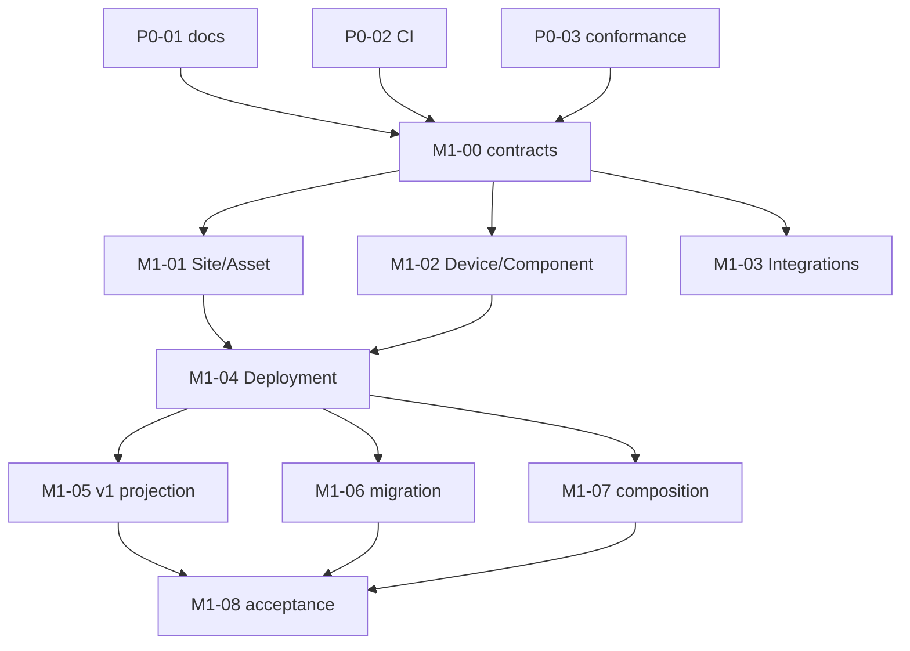

# LimnoPulse V4 Phase 0 and M1 Implementation Plan

> **For agentic workers:** REQUIRED SUB-SKILL: Use superpowers:subagent-driven-development (recommended) or superpowers:executing-plans to implement this plan task-by-task. Steps use checkbox (`- [ ]`) syntax for tracking.

**Goal:** Establish a reproducible V4 baseline and ship the additive `/v2` Site, Asset, Device, Component, Capability, Integration and temporal Deployment foundation without breaking any current `/v1` behavior.

**Architecture:** Use a short serial contract spine followed by independently reviewable vertical slices in isolated worktrees. New v2 adapters are bounded by context; legacy `/v1` behavior, migration, and application-composition hotspots each have one exclusive owner. Every dependency boundary is merged to `main`; there is no long-lived integration branch.

**Tech Stack:** Python 3.12+, FastAPI, Pydantic v2, boto3/DynamoDB, pytest, uv, Go 1.26 from `go.mod`, OpenTofu 1.8+, Docker Compose, GitHub Actions.

**Spec:** `docs/superpowers/specs/2026-08-16-limnopulse-platform-redesign-tech-spec-v4.md` and `docs/superpowers/specs/2026-08-25-limnopulse-v4-parallel-execution-design.md`

## Global Constraints

- Every worktree starts from `origin/main` only after all blocking task PRs are merged. The planning baseline is `main@141e108a479c983ed3a5efcbe729a30a43ab0ecb`.
- Branch names are `agent/v4-<task-code>-<short-name>`. One executable issue maps to one worktree and one PR.
- Python remains `>=3.12`; Go uses the exact version declared by `go.mod`; OpenTofu remains `>=1.8.0`.
- Preserve every current `/v1` path, request shape, response shape, status code, role gate, email/Telegram identity, and legacy telemetry behavior.
- All tenant-owned reads use a tenant-scoped key or a known canonical key after tenant ownership is established. Application code never calls DynamoDB `Scan`.
- The client never supplies authoritative tenant ownership. `tenant_id` comes from the authenticated path/membership boundary.
- Device v2 has no canonical `pond_id`, `auth_type`, AWS Thing/certificate/shadow identifier, Redis identifier, or provider credential.
- Canonical Deployment targets a `DeviceComponent`. A legacy Device is represented through one deterministic default Component; this resolves the spec's “component/device” wording in favor of its ER model and DynamoDB key design.
- Deployment intervals are UTC-aware half-open intervals `[started_at, ended_at)` and never overlap for one Component. History is immutable except for ending the active interval.
- Redis is not authoritative for identity, tenant mapping, idempotency, deployment, quota dimensions, or compatibility state.
- Creates in `/v2` require `Idempotency-Key` with 8–128 characters. The stored key is SHA-256 hashed, receipts expire after 24 hours, same-key/same-body replays the original snapshot, and same-key/different-body returns `409`.
- Mutations use optimistic `expected_version >= 1`. There are no public DELETE endpoints in M1; terminal lifecycle transitions are explicit.
- No new GSI is introduced in M1. Access patterns use known `PK` plus `SK` prefix/range, `GetItem`, or `TransactWriteItems`.
- M1 does not implement AWS IoT, Stripe, canonical telemetry v2 writes, advanced health, Push/SMS, notification policy/escalation/budgets, or commands.
- Existing GitHub issue `#6` remains canonical for presence-aware evaluator values; issue `#8` remains canonical for notification PII retention/offboarding.
- Every PR records the exact test commands and observed results. Expected results in this plan are gates, not claims that the planning environment ran them.
- Names beginning with `Fake` and lowercase fixture factories shown in test snippets are local helpers created at the top of that task's test file. They implement only the explicitly asserted calls/state and never become production interfaces or shared cross-worktree files.

---

## Execution Graph and Merge Gates



| Wave | Tasks allowed in parallel | Start condition |
|---:|---|---|
| 0 | P0-01, P0-02, P0-03 | This plan and GitHub graph accepted |
| 1 | M1-00 only | All P0 task PRs merged and green |
| 2 | M1-01, M1-02, M1-03 | M1-00 merged and green |
| 3 | M1-04 only | M1-01 and M1-02 merged and green |
| 4 | M1-05, M1-06, M1-07 | M1-01 through M1-04 merged and green |
| 5 | M1-08 only | M1-05, M1-06, M1-07 merged and green |

M1-03 consumes the `DeviceReader` protocol from M1-00 and therefore does not wait for M1-02. Its unit/API tests inject a fake reader. M1-05, M1-06, and M1-07 consume only M1-00–04 contracts; none imports another Wave 4 task.

## Locked Cross-Task Contracts

### Canonical identifiers

| Entity/value | Prefix or format |
|---|---|
| Site | `site_<32 lower-hex>` |
| Asset | `ast_<32 lower-hex>` |
| Device | existing/new `dev_<32 lower-hex>`; historical IDs remain readable |
| Component | `cmp_<32 lower-hex>` |
| Probe profile | `prb_<32 lower-hex>` |
| Actuator profile | `act_<32 lower-hex>` |
| IntegrationAccount | `ia_<32 lower-hex>` |
| DeviceIntegration | `di_<32 lower-hex>` |
| Deployment | `dep_<32 lower-hex>` |
| CapabilityDeclaration | `cap_<32 lower-hex>` |
| Capability key | `[a-z][a-z0-9]*(?:[._][a-z0-9]+)*` |
| Provider key | `[a-z][a-z0-9_]*(?:\.[a-z0-9_]+)*` |

Compatibility IDs use UUIDv5 with `NAMESPACE_URL` and these exact discriminators:

```python
from uuid import NAMESPACE_URL, uuid5


def _legacy_v2_id(prefix: str, discriminator: str) -> str:
    return f"{prefix}_{uuid5(NAMESPACE_URL, f'limnopulse/v4/{discriminator}').hex}"


def default_site_id(tenant_id: str) -> str:
    return _legacy_v2_id("site", f"default-site/{tenant_id}")


def asset_id_for_legacy_pond(tenant_id: str, pond_id: str) -> str:
    return _legacy_v2_id("ast", f"legacy-pond/{tenant_id}/{pond_id}")


def default_component_id_for_legacy_device(tenant_id: str, device_id: str) -> str:
    return _legacy_v2_id("cmp", f"legacy-device-component/{tenant_id}/{device_id}")


def default_probe_profile_id_for_legacy_device(tenant_id: str, device_id: str) -> str:
    return _legacy_v2_id("prb", f"legacy-device-probe/{tenant_id}/{device_id}")


def deployment_id_for_legacy_device(tenant_id: str, device_id: str) -> str:
    return _legacy_v2_id("dep", f"legacy-device-deployment/{tenant_id}/{device_id}")
```

New `/v2` create services generate and strictly validate canonical IDs. Deserializers also accept historical Device IDs already stored by the repository, including `local-device-001`; compatibility reads never rename existing identity.

### Shared app-state interfaces

M1-07 creates exactly these app-scoped dependencies with the same DynamoDB client:

```text
app.state.site_asset_repository
app.state.device_component_repository
app.state.integration_repository
app.state.deployment_repository
```

M1-05's dependency factory builds the compatibility projection from those four repositories only when `V1_POND_DEVICE_PROJECTION_ENABLED=true`; otherwise it delegates safely to the legacy domain repository and excludes v2-only Device rows.

### DynamoDB keys

| Value | PK | SK |
|---|---|---|
| Site | `TENANT#<tenant>` | `SITE#<site>` |
| Asset | `TENANT#<tenant>` | `ASSET#<asset>` |
| PondProfile | `ASSET#<asset>` | `PROFILE#POND` |
| Device | `TENANT#<tenant>` | `DEVICE#<device>` |
| Device lookup | `DEVICE#<device>` | `META` |
| Component tenant mirror | `TENANT#<tenant>` | `COMPONENT#<component>` |
| Component canonical | `COMPONENT#<component>` | `META` |
| Capability | `COMPONENT#<component>` | `CAPABILITY#<capability>` |
| IntegrationAccount | `TENANT#<tenant>` | `INTEGRATION_ACCOUNT#<account>` |
| DeviceIntegration | `TENANT#<tenant>` | `DEVICE_INTEGRATION#<integration>` |
| External identity lookup | `EXTERNAL_ID#<provider>#<sha256>` | `META` |
| Deployment tenant mirror | `TENANT#<tenant>` | `DEPLOYMENT#<deployment>` |
| Deployment history | `COMPONENT#<component>` | `DEPLOYMENT#<UTC fixed-6>#<deployment>` |
| Current Deployment | `COMPONENT#<component>` | `DEPLOYMENT#CURRENT` |
| Idempotency receipt | `TENANT#<tenant>` | `IDEMPOTENCY#<scope>#<sha256>` |
| M1 migration receipt | `TENANT#<tenant>` | `MIGRATION#M1#DEFAULT_SITE_ASSET_DEVICE` |

`canonical_timestamp_key()` serializes UTC as `YYYY-MM-DDTHH:MM:SS.ffffffZ`, so lexicographic order is chronological.

## File Ownership Map

| Task | Exclusive responsibility | Shared/hotspot restriction |
|---|---|---|
| P0-01 | Current-state docs and ADR records | Documentation only |
| P0-02 | Make targets and credential-free CI | No dependencies or lockfile changes |
| P0-03 | `/v1` golden and static conformance | No runtime behavior change |
| M1-00 | IDs, pure domain contracts, repository protocols, key/base adapter, v2 dependencies | Serial owner of shared vocabulary |
| M1-01 | Site/Asset persistence, service, schemas, unmounted routers | No app composition or `/v1` files |
| M1-02 | Device/Component/Capability persistence, service, schemas, unmounted routers | No legacy Device adapter/router |
| M1-03 | Integration persistence, service, schemas, unmounted routers | Uses only `DeviceReader` protocol |
| M1-04 | Deployment persistence, temporal service, schemas, unmounted router | Starts after M1-01/02 |
| M1-05 | Existing Pond/Device behavior and compatibility projection | No `main.py`, `api/router.py`, config, seed, README |
| M1-06 | Explicit-tenant migration CLI and migration adapter | No app/config/router/seed files |
| M1-07 | `main.py`, router mounting, settings, env and global wiring docs | No `/v1` behavior or migration code |
| M1-08 | Acceptance contracts and rollout runbook | No production feature code |

---

### Task 1: P0-01 — Current-State Inventory and ADR Mapping

**Branch:** `agent/v4-p0-01-current-state-adrs`

**Files:**
- Create: `docs/current-state.md`
- Create: `docs/adr/README.md`
- Create: `docs/adr/ADR-001-aws-iot-is-an-integration-adapter.md`
- Create: `docs/adr/ADR-002-site-and-asset-preserve-v1-pond.md`
- Create: `docs/adr/ADR-003-device-component-and-temporal-deployment.md`
- Create: `docs/adr/ADR-004-effective-capability-is-derived.md`
- Create: `docs/adr/ADR-005-canonical-telemetry-is-metric-based.md`
- Create: `docs/adr/ADR-006-telemetry-has-three-timestamps.md`
- Create: `docs/adr/ADR-007-influx-v2-dual-write-migration.md`
- Create: `docs/adr/ADR-008-hardware-accuracy-remains-customer-vendor-owned.md`
- Create: `docs/adr/ADR-009-edge-is-optional-and-customer-hosted.md`
- Create: `docs/adr/ADR-010-stripe-is-an-adapter-internal-entitlements-are-canonical.md`
- Create: `docs/adr/ADR-011-limnopulse-owns-notification-semantics.md`
- Create: `docs/adr/ADR-012-commands-use-a-separate-safety-plane.md`
- Create: `docs/adr/ADR-013-v1-remains-compatible-v2-is-generalized.md`
- Create: `docs/adr/ADR-014-commercial-tier-does-not-imply-safety.md`
- Create: `docs/adr/ADR-015-automatic-cloud-control-is-deferred.md`
- Create: `docs/adr/ADR-016-eventbridge-is-selective-sqs-is-durable.md`
- Create: `docs/adr/ADR-017-sns-is-provider-feedback-not-notification-service.md`
- Create: `docs/adr/ADR-018-eum-push-and-sms-are-provider-adapters.md`
- Create: `docs/adr/ADR-019-redis-valkey-is-optional-acceleration.md`
- Modify: `docs/architecture.md`
- Test: `tests/unit/test_architecture_inventory.py`

**Interfaces:**
- Consumes: V4 sections 3, 24, 27 and 31; runtime baseline `ce46b47fd646de762098a632b12e02d482c66485`.
- Produces: status vocabulary `implemented | local | scaffold | planned | obsolete`; ADR index `001..019`; phase owner for every decision.
- Produces no runtime interface.

- [ ] **Step 1: Write the failing inventory test.**

```python
from pathlib import Path

ROOT = Path(__file__).resolve().parents[2]
EXPECTED = {
    "FastAPI control plane": "implemented",
    "Tenant membership authorization": "implemented",
    "Pond/Device v1 and Influx reads": "implemented",
    "Alert evaluator and durable notifications": "implemented",
    "MQTT/Telegraf/Starlark registry": "local",
    "OpenTofu cloud foundation": "scaffold",
    "Site/Asset/Component/Deployment": "planned",
    "Billing/AWS IoT/Push/SMS/commands": "planned",
    "Device permanently bound to a pond": "obsolete",
}


def inventory_rows() -> dict[str, str]:
    rows: dict[str, str] = {}
    text = (ROOT / "docs/current-state.md").read_text(encoding="utf-8")
    for line in text.splitlines():
        cells = [cell.strip() for cell in line.strip().split("|")]
        if len(cells) == 7 and cells[1] not in {"", "Surface"}:
            rows[cells[1]] = cells[2].strip("`")
    return rows


def test_inventory_uses_the_approved_statuses() -> None:
    assert inventory_rows() == EXPECTED


def test_adr_index_is_complete_and_accepted() -> None:
    index = (ROOT / "docs/adr/README.md").read_text(encoding="utf-8")
    assert [f"ADR-{number:03d}" in index for number in range(1, 20)] == [True] * 19
    for path in sorted((ROOT / "docs/adr").glob("ADR-*.md")):
        assert "**Status:** Accepted" in path.read_text(encoding="utf-8")
```

- [ ] **Step 2: Run the focused test and verify the expected failure.**

Run: `uv run --locked --extra dev pytest -q tests/unit/test_architecture_inventory.py`

Expected: FAIL because `docs/current-state.md` and `docs/adr/README.md` do not exist.

- [ ] **Step 3: Create the exact current-state table and architecture link.**

Start `docs/current-state.md` with:

```markdown
# LimnoPulse Current-State Inventory

**Execution baseline:** `main@141e108a479c983ed3a5efcbe729a30a43ab0ecb`  
**Runtime baseline:** `ce46b47fd646de762098a632b12e02d482c66485`  
**Reconciliation:** `141e108` adds the approved V4 planning documents and does not change runtime behavior.

| Surface | Status | Evidence | V4 treatment | Owning phase |
|---|---|---|---|---|
```

Populate exactly the nine test rows. Evidence must be a repository path, and the treatment/phase values come from V4 section 24. In `docs/architecture.md`, set version `1.4`, date `2026-08-25`, and link this inventory and both approved V4 documents without changing historical Phase 1–3 descriptions.

- [ ] **Step 4: Create the ADR index and 19 complete records.**

Every ADR file contains these exact headings:

```markdown
# ADR-NNN — Decision title

**Status:** Accepted

## Context
## Decision
## Consequences
## V4 traceability
## Implementation gate
## Non-goals
```

Use the decision titles and entry phases in V4 section 27. ADR-011 records localized revisions, generic lock-screen default, bounded owner/admin asset context, one Android/iOS destination model, and SMS readiness. ADR-018 records Android first, iOS second, both before broad launch, BR/US-only SMS, Brazil shared-route readiness, US toll-free readiness, and deferred direct FCM/APNs/Web Push.

- [ ] **Step 5: Run the focused test and check the diff.**

```bash
uv run --locked --extra dev pytest -q tests/unit/test_architecture_inventory.py
git diff --check
test -z "$(git diff --name-only | grep -Ev '^(docs/|tests/unit/test_architecture_inventory.py$)' || true)"
```

Expected: tests PASS, whitespace check exits `0`, and no runtime file is listed.

- [ ] **Step 6: Commit the documentation baseline.**

```bash
git add docs/architecture.md docs/current-state.md docs/adr tests/unit/test_architecture_inventory.py
git commit -m "docs: record V4 current state and ADR inventory"
```

**Rollback:** Revert this documentation/test commit. No runtime state exists.

---

### Task 2: P0-02 — Reproducible Verification and Credential-Free CI

**Branch:** `agent/v4-p0-02-reproducible-ci`

**Files:**
- Create: `.github/workflows/verify.yml`
- Create: `Makefile`
- Create: `docs/verification.md`
- Test: `tests/unit/test_ci_contract.py`

**Interfaces:**
- Produces: `make verify-python`, `make verify-go`, `make verify-tofu`, `make verify-compose`, and aggregate `make verify`.
- Produces: GitHub Actions jobs `python`, `go`, `opentofu`, `compose` on pull requests and pushes to `main`.
- Consumes no cloud credential and changes no dependency or lock file.

- [ ] **Step 1: Write the failing workflow contract.**

```python
from pathlib import Path

ROOT = Path(__file__).resolve().parents[2]


def test_verify_workflow_is_read_only_and_credential_free() -> None:
    text = (ROOT / ".github/workflows/verify.yml").read_text(encoding="utf-8")
    assert "pull_request:" in text
    assert "branches: [main]" in text
    assert "contents: read" in text
    assert 'AWS_EC2_METADATA_DISABLED: "true"' in text
    assert "secrets." not in text
    assert "AWS_ACCESS_KEY_ID" not in text
    assert "AWS_SECRET_ACCESS_KEY" not in text
    assert "tofu plan" not in text
    assert "tofu apply" not in text
    assert "uses: actions/" in text
    assert "@v" not in text
    for target in ("verify-python", "verify-go", "verify-tofu", "verify-compose"):
        assert f"make {target}" in text
```

- [ ] **Step 2: Run it and verify failure.**

Run: `uv run --locked --extra dev pytest -q tests/unit/test_ci_contract.py`

Expected: FAIL because `.github/workflows/verify.yml` is absent.

- [ ] **Step 3: Add deterministic local targets.**

Create `Makefile` with tab-indented recipes:

```make
UV ?= uv
TOFU ?= tofu

.PHONY: verify verify-python verify-go verify-tofu verify-compose

verify: verify-python verify-go verify-tofu verify-compose

verify-python:
	$(UV) lock --check
	$(UV) sync --locked --extra dev
	$(UV) run --locked --no-sync python -m pytest -q

verify-go:
	go test -race ./...

verify-tofu:
	$(TOFU) -chdir=infra/opentofu init -backend=false -input=false
	$(TOFU) -chdir=infra/opentofu fmt -check -recursive
	$(TOFU) -chdir=infra/opentofu validate -no-color

verify-compose:
	docker compose config --quiet
```

- [ ] **Step 4: Add the GitHub Actions workflow.**

```yaml
name: verify

on:
  pull_request:
  push:
    branches: [main]

permissions:
  contents: read

concurrency:
  group: verify-${{ github.workflow }}-${{ github.ref }}
  cancel-in-progress: true

env:
  AWS_EC2_METADATA_DISABLED: "true"

jobs:
  python:
    runs-on: ubuntu-latest
    steps:
      - uses: actions/checkout@fbc6f3992d24b796d5a048ff273f7fcc4a7b6c09 # v5
      - uses: actions/setup-python@ece7cb06caefa5fff74198d8649806c4678c61a1 # v6
        with:
          python-version: "3.12"
      - uses: astral-sh/setup-uv@d0cc045d04ccac9d8b7881df0226f9e82c39688e # v6.8.0
      - run: make verify-python
  go:
    runs-on: ubuntu-latest
    steps:
      - uses: actions/checkout@fbc6f3992d24b796d5a048ff273f7fcc4a7b6c09 # v5
      - uses: actions/setup-go@924ae3a1cded613372ab5595356fb5720e22ba16 # v6
        with:
          go-version-file: go.mod
      - run: make verify-go
  opentofu:
    runs-on: ubuntu-latest
    steps:
      - uses: actions/checkout@fbc6f3992d24b796d5a048ff273f7fcc4a7b6c09 # v5
      - uses: opentofu/setup-opentofu@9d84900f3238fab8cd84ce47d658d25dd008be2f # v1
        with:
          tofu_version: 1.8.0
          tofu_wrapper: false
      - run: make verify-tofu
  compose:
    runs-on: ubuntu-latest
    steps:
      - uses: actions/checkout@fbc6f3992d24b796d5a048ff273f7fcc4a7b6c09 # v5
      - run: make verify-compose
```

- [ ] **Step 5: Document the verification boundary.**

`docs/verification.md` must state that Python/Go use repository tests, OpenTofu only initializes without backend and validates, Compose only parses configuration, `tests/integration/test_notifications_local.py` remains opt-in via `RUN_NOTIFICATION_INTEGRATION=1`, and AWS sandbox/production readiness is a later gate.

- [ ] **Step 6: Run every target available in the worktree.**

```bash
uv run --locked --extra dev pytest -q tests/unit/test_ci_contract.py
make verify-python
make verify-go
make verify-tofu
make verify-compose
git diff --check
```

Expected in the implementation worktree: every command exits `0`; no command requests AWS credentials. A missing local executable is an environment failure to record, not a passing gate; the GitHub Actions jobs must still run before merge.

- [ ] **Step 7: Commit the verification slice.**

```bash
git add .github/workflows/verify.yml Makefile docs/verification.md tests/unit/test_ci_contract.py
git commit -m "ci: add reproducible verification gates"
```

**Rollback:** Revert the workflow/Makefile commit. No cloud resource was created.

---

### Task 3: P0-03 — Golden `/v1` OpenAPI and Architecture Conformance

**Branch:** `agent/v4-p0-03-v1-conformance`

**Files:**
- Create: `src/limnopulse_api/api/openapi_contract.py`
- Create: `scripts/dev/export_v1_openapi.py`
- Create: `tests/contracts/openapi/v1.json`
- Create: `tests/contracts/test_v1_openapi_contract.py`
- Create: `tests/unit/test_tenant_mapping_conformance.py`
- Modify: `tests/unit/test_no_scan_guard.py`

**Interfaces:**
- Produces: `build_v1_openapi_contract(app: FastAPI) -> dict[str, Any]`.
- Produces: `render_v1_openapi_contract(app: FastAPI) -> str`.
- Produces: `python scripts/dev/export_v1_openapi.py [--check] [--output PATH]`.
- Golden scope contains only `/v1` paths and recursively reachable OpenAPI components; it excludes health and public webhooks.

- [ ] **Step 1: Write the failing golden test.**

```python
import json
from pathlib import Path

from limnopulse_api.api.openapi_contract import build_v1_openapi_contract
from limnopulse_api.core.config import Settings
from limnopulse_api.main import create_app

ROOT = Path(__file__).resolve().parents[2]
GOLDEN = ROOT / "tests/contracts/openapi/v1.json"


def test_v1_openapi_matches_checked_in_golden() -> None:
    app = create_app(Settings(app_env="test", auth_mode="dev"))
    actual = build_v1_openapi_contract(app)
    assert all(path.startswith("/v1/") for path in actual["paths"])
    assert actual == json.loads(GOLDEN.read_text(encoding="utf-8"))
```

- [ ] **Step 2: Run the test and verify the expected import/file failure.**

Run: `uv run --locked --extra dev pytest -q tests/contracts/test_v1_openapi_contract.py`

Expected: FAIL because the helper and golden do not exist.

- [ ] **Step 3: Implement deterministic extraction and rendering.**

```python
from __future__ import annotations

import json
from collections.abc import Iterable
from typing import Any

from fastapi import FastAPI


def _component_refs(value: Any) -> set[tuple[str, str]]:
    refs: set[tuple[str, str]] = set()

    def visit(node: Any) -> None:
        if isinstance(node, dict):
            ref = node.get("$ref")
            if isinstance(ref, str) and ref.startswith("#/components/"):
                _, _, section, name = ref.split("/", 3)
                refs.add((section, name))
            for child in node.values():
                visit(child)
        elif isinstance(node, list):
            for child in node:
                visit(child)

    visit(value)
    return refs


def _reachable_components(components: dict[str, Any], roots: Iterable[Any]) -> dict[str, Any]:
    pending = list(_component_refs(list(roots)))
    selected: dict[str, dict[str, Any]] = {}
    while pending:
        section, name = pending.pop()
        values = components.get(section, {})
        if name not in values or name in selected.get(section, {}):
            continue
        selected.setdefault(section, {})[name] = values[name]
        pending.extend(_component_refs(values[name]))
    return {
        section: {name: selected[section][name] for name in sorted(selected[section])}
        for section in sorted(selected)
    }


def build_v1_openapi_contract(app: FastAPI) -> dict[str, Any]:
    schema = app.openapi()
    paths = {
        path: schema["paths"][path]
        for path in sorted(schema["paths"])
        if path.startswith("/v1/")
    }
    return {
        "openapi": schema["openapi"],
        "info": schema["info"],
        "paths": paths,
        "components": _reachable_components(schema.get("components", {}), paths.values()),
    }


def render_v1_openapi_contract(app: FastAPI) -> str:
    return json.dumps(build_v1_openapi_contract(app), indent=2, sort_keys=True) + "\n"
```

- [ ] **Step 4: Add the exporter and generate the golden.**

Create this exact `main()` in `scripts/dev/export_v1_openapi.py`:

```python
import argparse
from pathlib import Path

from limnopulse_api.api.openapi_contract import render_v1_openapi_contract
from limnopulse_api.core.config import Settings
from limnopulse_api.main import create_app


def main() -> int:
    parser = argparse.ArgumentParser()
    parser.add_argument(
        "--output", type=Path, default=Path("tests/contracts/openapi/v1.json")
    )
    parser.add_argument("--check", action="store_true")
    args = parser.parse_args()
    rendered = render_v1_openapi_contract(
        create_app(Settings(app_env="test", auth_mode="dev"))
    )
    if args.check:
        return int(
            not args.output.exists()
            or args.output.read_text(encoding="utf-8") != rendered
        )
    args.output.parent.mkdir(parents=True, exist_ok=True)
    args.output.write_text(rendered, encoding="utf-8")
    return 0


if __name__ == "__main__":
    raise SystemExit(main())
```

```bash
uv run --locked --extra dev python scripts/dev/export_v1_openapi.py
uv run --locked --extra dev python scripts/dev/export_v1_openapi.py --check
```

Expected: the first command creates the deterministic file; the second exits `0` without writing.

- [ ] **Step 5: Add membership/tenant-key conformance tests.**

```python
from fastapi.routing import APIRoute

from limnopulse_api.adapters.dynamodb import DynamoKeyBuilder
from limnopulse_api.api.dependencies import require_tenant_access
from limnopulse_api.core.config import Settings
from limnopulse_api.main import create_app


def dependency_calls(dependant):
    yield dependant.call
    for dependency in dependant.dependencies:
        yield from dependency_calls(dependency)


def test_every_mounted_tenant_route_requires_membership() -> None:
    app = create_app(Settings(app_env="test", auth_mode="dev"))
    routes = [
        route for route in app.routes
        if isinstance(route, APIRoute) and "{tenant_id}" in route.path_format
    ]
    assert routes
    for route in routes:
        assert require_tenant_access in set(dependency_calls(route.dependant))


def test_legacy_tenant_keys_cannot_cross_partitions() -> None:
    keys = DynamoKeyBuilder()
    assert keys.pond("tnt_a", "pond_1")["PK"] == "TENANT#tnt_a"
    assert keys.device("tnt_a", "dev_1") != keys.device("tnt_b", "dev_1")
    assert keys.membership("sub_1", "tnt_a")["SK"] == "TENANT#tnt_a"
```

- [ ] **Step 6: Replace the string guard with Python AST and Go call detection.**

```python
import ast
import re
from pathlib import Path

ROOT = Path(__file__).resolve().parents[2]
GO_SCAN_CALL = re.compile(r"\.\s*Scan\s*\(")


def python_offenders(root: Path) -> list[str]:
    offenders: list[str] = []
    for path in root.rglob("*.py"):
        tree = ast.parse(path.read_text(encoding="utf-8"), filename=str(path))
        if any(
            isinstance(node, ast.Call)
            and isinstance(node.func, ast.Attribute)
            and node.func.attr == "scan"
            for node in ast.walk(tree)
        ):
            offenders.append(str(path.relative_to(ROOT)))
    return offenders


def go_offenders(root: Path) -> list[str]:
    return [
        str(path.relative_to(ROOT))
        for path in root.rglob("*.go")
        if not path.name.endswith("_test.go")
        and GO_SCAN_CALL.search(path.read_text(encoding="utf-8"))
    ]


def test_no_dynamodb_scan_in_application_code() -> None:
    offenders = (
        python_offenders(ROOT / "src")
        + python_offenders(ROOT / "scripts")
        + go_offenders(ROOT / "cmd")
        + go_offenders(ROOT / "internal")
    )
    assert offenders == []
```

- [ ] **Step 7: Run focused and full regression gates.**

```bash
uv run --locked --extra dev pytest -q \
  tests/contracts/test_v1_openapi_contract.py \
  tests/unit/test_tenant_mapping_conformance.py \
  tests/unit/test_no_scan_guard.py
uv run --locked --extra dev python scripts/dev/export_v1_openapi.py --check
uv run --locked --extra dev python -m pytest -q
go test -race ./...
git diff --check
```

Expected: all commands exit `0`; app lifespan/network clients are not entered by the schema tests.

- [ ] **Step 8: Commit the compatibility baseline.**

```bash
git add src/limnopulse_api/api/openapi_contract.py \
  scripts/dev/export_v1_openapi.py tests/contracts \
  tests/unit/test_tenant_mapping_conformance.py tests/unit/test_no_scan_guard.py
git commit -m "test: freeze v1 contract and architecture conformance"
```

**Rollback:** Revert deterministic helper/tests/golden. Runtime routing is unchanged.

---

### Task 4: M1-00 — Freeze the Core v2 Contract Spine

**Branch:** `agent/v4-m1-00-contract-spine`

**Files:**
- Modify: `src/limnopulse_api/domain/ids.py`
- Create: `src/limnopulse_api/domain/v2_common.py`
- Create: `src/limnopulse_api/domain/assets.py`
- Create: `src/limnopulse_api/domain/devices_v2.py`
- Create: `src/limnopulse_api/domain/integrations.py`
- Create: `src/limnopulse_api/domain/deployments.py`
- Create: `src/limnopulse_api/repositories/v2_contracts.py`
- Create: `src/limnopulse_api/adapters/dynamodb_v2.py`
- Create: `src/limnopulse_api/api/v2/__init__.py`
- Create: `src/limnopulse_api/api/v2/dependencies.py`
- Create: `src/limnopulse_api/api/v2/routers/__init__.py`
- Create: `src/limnopulse_api/api/v2/schemas/__init__.py`
- Create: `src/limnopulse_api/api/v2/schemas/common.py`
- Test: `tests/unit/test_v2_contracts.py`
- Test: `tests/unit/test_v2_key_builder.py`
- Test: `tests/unit/test_v2_repository_protocols.py`

**Interfaces:**
- Produces every pure entity/value type consumed by M1-01–07; later tasks do not redefine their fields or enums.
- Produces `new_site_id`, `new_asset_id`, `new_component_id`, `new_probe_profile_id`, `new_actuator_profile_id`, `new_integration_account_id`, `new_device_integration_id`, `new_deployment_id`, `new_capability_id`, `is_canonical_id`, and `require_canonical_id`; the existing `new_device_id` remains unchanged.
- Produces `DynamoV2KeyBuilder`, `DynamoV2RepositoryBase`, `canonical_timestamp_key`, `external_identity_hash`, `idempotency_key_hash`, and `canonical_request_hash`.
- Produces `SiteAssetRepository`, `DeviceComponentRepository`, `IntegrationRepository`, `DeploymentRepository`, plus narrow readers `SiteAssetReader`, `DeviceReader`, and `ComponentReader`.
- Produces FastAPI dependency aliases `SiteAssetRepositoryDep`, `DeviceComponentRepositoryDep`, `IntegrationRepositoryDep`, and `DeploymentRepositoryDep` backed by the four locked `app.state` names.

#### Frozen enum and entity shapes

```python
from enum import StrEnum


class SiteStatus(StrEnum):
    ACTIVE = "active"
    ARCHIVED = "archived"


class AssetType(StrEnum):
    POND = "pond"


class AssetStatus(StrEnum):
    ACTIVE = "active"
    ARCHIVED = "archived"


class DeviceStatus(StrEnum):
    PROVISIONING = "provisioning"
    ACTIVE = "active"
    SUSPENDED = "suspended"
    DECOMMISSIONED = "decommissioned"


class ComponentKind(StrEnum):
    PROBE = "probe"
    ACTUATOR = "actuator"
    HYBRID = "hybrid"


class ComponentStatus(StrEnum):
    ACTIVE = "active"
    REPLACED = "replaced"
    DECOMMISSIONED = "decommissioned"


class CapabilityOperation(StrEnum):
    READ = "read"
    WRITE = "write"
    COMMAND = "command"
    CALIBRATION = "calibration"


class CapabilitySupport(StrEnum):
    SUPPORTED = "supported"
    UNSUPPORTED = "unsupported"
    UNKNOWN = "unknown"


class CapabilityAvailability(StrEnum):
    AVAILABLE = "available"
    UNAVAILABLE = "unavailable"
    UNKNOWN = "unknown"


class CapabilityProvenance(StrEnum):
    MODEL_PROFILE = "model_profile"
    INTEGRATION = "integration"
    DISCOVERED = "discovered"
    INSTANCE_OVERRIDE = "instance_override"


class CommandRiskClass(StrEnum):
    R0 = "r0"
    R1 = "r1"
    R2 = "r2"
    R3 = "r3"
    R4 = "r4"


class IntegrationAccountStatus(StrEnum):
    PENDING = "pending"
    ACTIVE = "active"
    ERROR = "error"
    REVOKED = "revoked"


class DeviceIntegrationStatus(StrEnum):
    PROVISIONING = "provisioning"
    ACTIVE = "active"
    ERROR = "error"
    DECOMMISSIONED = "decommissioned"


class DeploymentStatus(StrEnum):
    ACTIVE = "active"
    ENDED = "ended"


class CompatibilityLevel(StrEnum):
    CERTIFIED = "certified"
    COMPATIBLE = "compatible"
    CUSTOM = "custom"


class QuotaDimension(StrEnum):
    SITES = "sites"
    ASSETS = "assets"
    DEVICES = "devices"
    COMPONENTS = "components"
    NOTIFICATION_DESTINATIONS = "notification_destinations"
```

`V2VersionedEntity` is frozen, rejects naive datetimes, requires `created_at <= updated_at`, `version >= 1`, and has literal `schema_version=2`. Concrete models are:

```python
class V2VersionedEntity(BaseModel):
    model_config = ConfigDict(frozen=True, extra="forbid")

    created_at: datetime
    updated_at: datetime
    version: int = Field(ge=1)
    schema_version: Literal[2] = 2

    @model_validator(mode="after")
    def validate_utc_version_window(self) -> "V2VersionedEntity":
        if self.created_at.tzinfo is None or self.updated_at.tzinfo is None:
            raise ValueError("timestamps must be timezone-aware")
        if self.created_at.utcoffset() != timedelta(0) or self.updated_at.utcoffset() != timedelta(0):
            raise ValueError("timestamps must be UTC")
        if self.created_at > self.updated_at:
            raise ValueError("created_at must not be after updated_at")
        return self


class IdempotencyReceipt(BaseModel):
    model_config = ConfigDict(frozen=True, extra="forbid")

    tenant_id: str
    scope: str
    key_hash: str
    request_hash: str
    response_snapshot_json: str
    created_at: datetime
    expires_at: datetime
```

`expires_at` is exactly `created_at + timedelta(hours=24)`; the adapter writes its epoch seconds to DynamoDB TTL. Define and consume these exact transition functions: `ensure_site_transition`, `ensure_asset_transition`, `ensure_device_transition`, `ensure_component_transition`, `ensure_integration_account_transition`, `ensure_device_integration_transition`, and `ensure_deployment_transition`.

Concrete models are:

```python
class Site(V2VersionedEntity):
    tenant_id: str
    site_id: str
    name: str
    status: SiteStatus = SiteStatus.ACTIVE


class Asset(V2VersionedEntity):
    tenant_id: str
    asset_id: str
    site_id: str
    asset_type: AssetType
    name: str
    status: AssetStatus = AssetStatus.ACTIVE


class PondProfile(V2VersionedEntity):
    tenant_id: str
    asset_id: str
    description: str | None = None
    legacy_pond_id: str | None = None


class AssetWithPondProfile(BaseModel):
    model_config = ConfigDict(frozen=True)
    asset: Asset
    pond_profile: PondProfile


class DeviceV2(V2VersionedEntity):
    tenant_id: str
    device_id: str
    name: str
    model_profile_key: str | None = None
    firmware_version: str | None = None
    compatibility_level: CompatibilityLevel = CompatibilityLevel.CUSTOM
    status: DeviceStatus = DeviceStatus.ACTIVE


class ProbeProfile(BaseModel):
    model_config = ConfigDict(frozen=True, extra="forbid")
    probe_profile_id: str
    serial_number: str | None = None
    measurement_metric_keys: tuple[str, ...] = ()


class ActuatorProfile(BaseModel):
    model_config = ConfigDict(frozen=True, extra="forbid")
    actuator_profile_id: str
    actuator_type: str


class DeviceComponent(V2VersionedEntity):
    tenant_id: str
    component_id: str
    device_id: str
    kind: ComponentKind
    name: str
    model_profile_key: str | None = None
    probe_profile: ProbeProfile | None = None
    actuator_profile: ActuatorProfile | None = None
    status: ComponentStatus = ComponentStatus.ACTIVE


class CapabilityDeclaration(V2VersionedEntity):
    tenant_id: str
    component_id: str
    capability_id: str
    capability_key: str
    operation: CapabilityOperation
    support: CapabilitySupport
    availability: CapabilityAvailability
    provenance: CapabilityProvenance
    parameter_schema: dict[str, object] | None = None
    result_schema: dict[str, object] | None = None
    provider_implementation_key: str | None = None
    risk_class: CommandRiskClass | None = None
    verified_at: datetime | None = None


class IntegrationAccount(V2VersionedEntity):
    tenant_id: str
    integration_account_id: str
    provider_key: str
    display_name: str
    credential_reference: str | None = None
    public_identifier: str | None = None
    status: IntegrationAccountStatus = IntegrationAccountStatus.PENDING


class DeviceIntegration(V2VersionedEntity):
    tenant_id: str
    device_integration_id: str
    device_id: str
    integration_account_id: str
    provider_key: str
    external_identity_hash: str
    status: DeviceIntegrationStatus = DeviceIntegrationStatus.PROVISIONING


class Deployment(V2VersionedEntity):
    tenant_id: str
    deployment_id: str
    component_id: str
    site_id: str
    asset_id: str
    started_at: datetime
    ended_at: datetime | None = None
    status: DeploymentStatus = DeploymentStatus.ACTIVE
```

All models use `extra="forbid"`. `DeviceV2` therefore rejects `pond_id`, `auth_type`, `thing_name`, `certificate_arn`, and `shadow_name`. Component validation requires a probe profile for `PROBE`, an actuator profile for `ACTUATOR`, both for `HYBRID`, and rejects incompatible extras. Capability schemas are deep-copied on construction and serialized as JSON objects.

#### Frozen repository protocols

```python
class SiteAssetReader(Protocol):
    async def get_site(self, tenant_id: str, site_id: str) -> Site | None: ...
    async def get_asset(self, tenant_id: str, asset_id: str) -> AssetWithPondProfile | None: ...


class SiteAssetRepository(SiteAssetReader, Protocol):
    async def list_sites(self, tenant_id: str) -> list[Site]: ...
    async def create_site(self, site: Site, receipt: IdempotencyReceipt) -> Site: ...
    async def update_site(
        self, tenant_id: str, site_id: str, expected_version: int,
        *, name: str | None, status: SiteStatus | None,
    ) -> Site: ...
    async def list_assets(self, tenant_id: str) -> list[AssetWithPondProfile]: ...
    async def create_asset(
        self, asset: Asset, profile: PondProfile, receipt: IdempotencyReceipt,
    ) -> AssetWithPondProfile: ...
    async def update_asset(
        self, tenant_id: str, asset_id: str, expected_version: int,
        *, name: str | None, status: AssetStatus | None,
        pond_description: str | None, pond_profile_expected_version: int | None,
    ) -> AssetWithPondProfile: ...


class DeviceReader(Protocol):
    async def get_device(self, tenant_id: str, device_id: str) -> DeviceV2 | None: ...


class ComponentReader(Protocol):
    async def get_component(
        self, tenant_id: str, component_id: str,
    ) -> DeviceComponent | None: ...


class DeviceComponentRepository(DeviceReader, ComponentReader, Protocol):
    async def list_devices(self, tenant_id: str) -> list[DeviceV2]: ...
    async def create_device(self, device: DeviceV2, receipt: IdempotencyReceipt) -> DeviceV2: ...
    async def update_device(
        self, tenant_id: str, device_id: str, expected_version: int,
        *, name: str | None, firmware_version: str | None,
        status: DeviceStatus | None,
    ) -> DeviceV2: ...
    async def list_components(
        self, tenant_id: str, device_id: str,
    ) -> list[DeviceComponent]: ...
    async def create_component(
        self, component: DeviceComponent, receipt: IdempotencyReceipt,
    ) -> DeviceComponent: ...
    async def update_component(
        self, tenant_id: str, component_id: str, expected_version: int,
        *, name: str | None, status: ComponentStatus | None,
    ) -> DeviceComponent: ...
    async def list_capabilities(
        self, tenant_id: str, component_id: str,
    ) -> list[CapabilityDeclaration]: ...
    async def create_capability(
        self, declaration: CapabilityDeclaration, receipt: IdempotencyReceipt,
    ) -> CapabilityDeclaration: ...


class IntegrationRepository(Protocol):
    async def get_integration_account(
        self, tenant_id: str, integration_account_id: str,
    ) -> IntegrationAccount | None: ...
    async def list_integration_accounts(self, tenant_id: str) -> list[IntegrationAccount]: ...
    async def create_integration_account(
        self, account: IntegrationAccount, receipt: IdempotencyReceipt,
    ) -> IntegrationAccount: ...
    async def list_device_integrations(
        self, tenant_id: str, device_id: str,
    ) -> list[DeviceIntegration]: ...
    async def create_device_integration(
        self, integration: DeviceIntegration, receipt: IdempotencyReceipt,
    ) -> DeviceIntegration: ...


class DeploymentRepository(Protocol):
    async def list_component_deployments(
        self, tenant_id: str, component_id: str,
    ) -> list[Deployment]: ...
    async def get_current_deployment(
        self, tenant_id: str, component_id: str,
    ) -> Deployment | None: ...
    async def get_deployment_at(
        self, tenant_id: str, component_id: str, observed_at: datetime,
    ) -> Deployment | None: ...
    async def start_deployment(
        self, deployment: Deployment, receipt: IdempotencyReceipt,
    ) -> Deployment: ...
    async def end_deployment(
        self, tenant_id: str, deployment_id: str,
        *, expected_version: int, ended_at: datetime,
    ) -> Deployment: ...
```

- [ ] **Step 1: Write failing ID, model, lifecycle, and compatibility-ID tests.**

```python
from datetime import UTC, datetime

import pytest
from pydantic import ValidationError

from limnopulse_api.domain.devices_v2 import DeviceV2
from limnopulse_api.domain.ids import default_site_id, new_component_id


def test_new_component_id_has_canonical_shape() -> None:
    value = new_component_id()
    assert value.startswith("cmp_")
    assert len(value) == 36
    int(value[4:], 16)


def test_compatibility_ids_are_stable_and_tenant_scoped() -> None:
    assert default_site_id("tnt_a") == default_site_id("tnt_a")
    assert default_site_id("tnt_a") != default_site_id("tnt_b")


def test_device_v2_rejects_legacy_pond_binding() -> None:
    with pytest.raises(ValidationError):
        DeviceV2(
            tenant_id="tnt_a", device_id="dev_" + "1" * 32,
            name="Gateway", pond_id="pond_1",
            created_at=datetime.now(UTC), updated_at=datetime.now(UTC), version=1,
        )
```

- [ ] **Step 2: Run model tests and confirm import failures.**

Run: `uv run --locked --extra dev pytest -q tests/unit/test_v2_contracts.py`

Expected: FAIL because the new factories/models do not exist.

- [ ] **Step 3: Implement ID factories, deterministic compatibility IDs, enums, models, and transition validators.**

Use the exact shapes above. Implement status transition functions that permit `Device SUSPENDED -> ACTIVE`, forbid leaving `DECOMMISSIONED`, and forbid leaving terminal Site/Asset/Component/Integration/Deployment states. `Deployment` validates UTC timestamps and `ended_at > started_at`.

- [ ] **Step 4: Run model tests to green and commit pure contracts.**

```bash
uv run --locked --extra dev pytest -q tests/unit/test_v2_contracts.py
git add src/limnopulse_api/domain tests/unit/test_v2_contracts.py
git commit -m "feat(v2): freeze M1 domain contracts"
```

Expected: PASS; no existing v1 entity file changes except additive factories in `domain/ids.py`.

- [ ] **Step 5: Write failing key/hash vectors.**

```python
from datetime import UTC, datetime

from limnopulse_api.adapters.dynamodb_v2 import (
    DynamoV2KeyBuilder,
    canonical_timestamp_key,
    external_identity_hash,
)


def test_deployment_keys_are_ordered_and_component_scoped() -> None:
    keys = DynamoV2KeyBuilder()
    started = datetime(2026, 8, 25, 12, 30, 5, 42, tzinfo=UTC)
    assert keys.current_deployment("cmp_1") == {
        "PK": "COMPONENT#cmp_1", "SK": "DEPLOYMENT#CURRENT"
    }
    assert keys.deployment_history("cmp_1", started, "dep_1") == {
        "PK": "COMPONENT#cmp_1",
        "SK": "DEPLOYMENT#2026-08-25T12:30:05.000042Z#dep_1",
    }


def test_external_identity_hash_is_provider_scoped() -> None:
    assert external_identity_hash("vendor.cloud", "abc") != external_identity_hash(
        "native.https", "abc"
    )
```

- [ ] **Step 6: Implement key builder, SHA-256 helpers, receipts, and base adapter.**

`external_identity_hash` hashes `provider_key + "\0" + external_identity`; `canonical_request_hash` hashes canonical JSON with sorted keys and compact separators. `DynamoV2RepositoryBase` exposes only serialized `get_item`, paginated `query_prefix`, conditional put/update builders, transaction invocation, and `ConditionalCheckFailedException`/`TransactionCanceledException -> ConflictError` mapping. It has no entity-specific methods and no `scan` method.

- [ ] **Step 7: Run key/base tests and commit persistence contracts.**

```bash
uv run --locked --extra dev pytest -q \
  tests/unit/test_v2_key_builder.py tests/unit/test_no_scan_guard.py
git add src/limnopulse_api/adapters/dynamodb_v2.py tests/unit/test_v2_key_builder.py
git commit -m "feat(v2): freeze DynamoDB keys and idempotency receipts"
```

- [ ] **Step 8: Write and implement protocol/dependency contract tests.**

The test uses `isinstance(fake, SiteAssetRepository)` with `@runtime_checkable`, checks exact app-state attribute names through dependency overrides, and asserts the protocol signatures listed above using `inspect.signature`. Implement `api/v2/dependencies.py` with one `_get_state_dependency(request, name)` helper that maps missing state to `HTTPException(503, "service unavailable")`.

- [ ] **Step 9: Run the full M1-00 gate and commit.**

```bash
uv run --locked --extra dev pytest -q \
  tests/unit/test_v2_contracts.py \
  tests/unit/test_v2_key_builder.py \
  tests/unit/test_v2_repository_protocols.py \
  tests/unit/test_no_scan_guard.py
make verify-python
make verify-go
git diff --check
git add src/limnopulse_api/repositories/v2_contracts.py \
  src/limnopulse_api/api/v2 tests/unit/test_v2_repository_protocols.py
git commit -m "feat(v2): publish M1 repository and API contracts"
```

Expected: all gates exit `0`; `/v1` golden remains byte-identical.

**Rollback:** Revert the additive contract commits. No new router is mounted and no data was written.

---

### Task 5: M1-01 — Site and Asset/PondProfile Vertical Slice

**Branch:** `agent/v4-m1-01-sites-assets`

**Files:**
- Create: `src/limnopulse_api/adapters/dynamodb_sites_assets.py`
- Create: `src/limnopulse_api/services/sites.py`
- Create: `src/limnopulse_api/services/assets.py`
- Create: `src/limnopulse_api/api/v2/schemas/sites.py`
- Create: `src/limnopulse_api/api/v2/schemas/assets.py`
- Create: `src/limnopulse_api/api/v2/routers/sites.py`
- Create: `src/limnopulse_api/api/v2/routers/assets.py`
- Test: `tests/unit/test_sites_assets_repository.py`
- Test: `tests/unit/test_sites_assets_services.py`
- Test: `tests/api/test_v2_sites_assets.py`

**Interfaces:**
- Consumes: M1-00 `Site`, `Asset`, `PondProfile`, `AssetWithPondProfile`, `IdempotencyReceipt`, `SiteAssetRepository`, `DynamoV2RepositoryBase`, and v2 dependency helpers.
- Produces: `DynamoSiteAssetRepository` implementing `SiteAssetRepository`; `SiteService`; `AssetService`; unmounted `sites.router` and `assets.router`.
- Produces the concrete `SiteAssetReader` consumed by M1-04 and app composition.

**Public contract (router is tested in isolation and mounted only by M1-07):**

```text
GET/POST   /tenants/{tenant_id}/sites
GET/PATCH  /tenants/{tenant_id}/sites/{site_id}
GET/POST   /tenants/{tenant_id}/assets
GET/PATCH  /tenants/{tenant_id}/assets/{asset_id}
```

M1-07 adds the `/v2` prefix. Reads allow `READ_ROLES`; writes allow `WRITE_ROLES`. `AssetCreate` accepts `site_id`, public field `type="pond"`, `name`, and optional `pond_description`. `AssetPatch` accepts `expected_version`, optional `name/status`, and optional `pond_profile_expected_version` plus `pond_description`. `site_id` and `type` never patch.

- [ ] **Step 1: Write failing service tests for tenant ownership and lifecycle.**

```python
import pytest

from limnopulse_api.core.errors import ConflictError, NotFoundError
from limnopulse_api.services.assets import AssetService


@pytest.mark.asyncio
async def test_create_pond_asset_requires_active_site_in_same_tenant() -> None:
    repository = FakeSiteAssetRepository()
    repository.sites[("tnt_other", "site_1")] = active_site("tnt_other", "site_1")
    service = AssetService(repository, clock=fixed_clock)
    with pytest.raises(NotFoundError):
        await service.create(
            tenant_id="tnt_a", site_id="site_1", asset_type="pond",
            name="North pond", pond_description=None, idempotency_key="asset-create-01",
        )


@pytest.mark.asyncio
async def test_archived_asset_cannot_return_to_active() -> None:
    repository = FakeSiteAssetRepository.with_archived_asset("tnt_a", "ast_1")
    with pytest.raises(ConflictError):
        await AssetService(repository, clock=fixed_clock).update(
            tenant_id="tnt_a", asset_id="ast_1", expected_version=2,
            name=None, status="active", pond_description=None,
            pond_profile_expected_version=None,
        )
```

- [ ] **Step 2: Run service tests and confirm missing-module failures.**

Run: `uv run --locked --extra dev pytest -q tests/unit/test_sites_assets_services.py`

Expected: FAIL because the services do not exist.

- [ ] **Step 3: Implement services with server-derived IDs and receipts.**

`SiteService.create` and `AssetService.create` generate canonical IDs, use one injected UTC clock, build `IdempotencyReceipt` with scope `site-create` or `asset-create`, and pass only frozen domain objects to the repository. `AssetService` reads Site by `tenant_id/site_id` and requires `ACTIVE`. Update methods load current state, validate lifecycle, and then call the version-fenced repository method.

- [ ] **Step 4: Write failing repository transaction tests.**

```python
@pytest.mark.asyncio
async def test_create_asset_writes_asset_profile_and_receipt_once() -> None:
    client = FakeDynamoClient()
    repository = DynamoSiteAssetRepository("LimnopulseDomain", client)
    created = await repository.create_asset(asset(), pond_profile(), receipt())
    transaction = client.transact_write_items_calls[0]["TransactItems"]
    assert [item_kind(item) for item in transaction] == ["asset", "pond_profile", "receipt"]
    assert created.asset.asset_id == asset().asset_id


@pytest.mark.asyncio
async def test_asset_profile_patch_fences_both_versions() -> None:
    client = FakeDynamoClient.with_asset_and_profile(asset_version=4, profile_version=2)
    repository = DynamoSiteAssetRepository("LimnopulseDomain", client)
    await repository.update_asset(
        "tnt_a", "ast_1", 4, name="East", status=None,
        pond_description="covered", pond_profile_expected_version=2,
    )
    assert transaction_expected_versions(client) == [4, 2]
```

- [ ] **Step 5: Implement `DynamoSiteAssetRepository`.**

Use `Query PK=TENANT#tenant AND begins_with(SK, "SITE#")` and `"ASSET#"` for lists, `GetItem` for individual resources, and `GetItem PK=ASSET#asset/SK=PROFILE#POND` only after tenant Asset ownership is known. Creates write entity plus receipt transactionally; Asset creation also writes PondProfile. Asset/profile patches use one transaction and both expected versions when the profile changes. Receipt replay returns its stored response snapshot; a request-hash mismatch raises `ConflictError`.

- [ ] **Step 6: Run repository/service tests and commit the vertical core.**

```bash
uv run --locked --extra dev pytest -q \
  tests/unit/test_sites_assets_repository.py \
  tests/unit/test_sites_assets_services.py \
  tests/unit/test_no_scan_guard.py
git add src/limnopulse_api/adapters/dynamodb_sites_assets.py \
  src/limnopulse_api/services/sites.py src/limnopulse_api/services/assets.py \
  tests/unit/test_sites_assets_repository.py tests/unit/test_sites_assets_services.py
git commit -m "feat(v2): add Site and Asset persistence"
```

- [ ] **Step 7: Write failing isolated-router tests.**

```python
def test_admin_can_create_pond_asset_and_replay_idempotently() -> None:
    app, repository = app_with_site_asset_repository(role="admin")
    payload = {"site_id": "site_" + "1" * 32, "type": "pond", "name": "North"}
    first = TestClient(app).post(
        "/tenants/tnt_a/assets", json=payload,
        headers={"Idempotency-Key": "asset-create-01"},
    )
    second = TestClient(app).post(
        "/tenants/tnt_a/assets", json=payload,
        headers={"Idempotency-Key": "asset-create-01"},
    )
    assert first.status_code == 201
    assert second.json() == first.json()
    assert repository.asset_create_count == 1


def test_viewer_cannot_patch_site() -> None:
    app, _ = app_with_site_asset_repository(role="viewer")
    response = TestClient(app).patch(
        "/tenants/tnt_a/sites/site_1", json={"expected_version": 1, "name": "New"}
    )
    assert response.status_code == 403
```

- [ ] **Step 8: Implement schemas and unmounted routers.**

Schemas set `extra="forbid"`, serialize `asset_type` with alias `type`, and include IDs, status, `schema_version`, timestamps, and version. Map missing/cross-tenant resource to `404`, optimistic/lifecycle/idempotency conflict to `409`, and missing repository state to `503`. Do not edit `api/router.py`.

- [ ] **Step 9: Run API and shared gates, then commit.**

```bash
uv run --locked --extra dev pytest -q \
  tests/api/test_v2_sites_assets.py tests/api/test_ponds_devices.py \
  tests/contracts/test_v1_openapi_contract.py
make verify-python
make verify-go
git diff --check
git add src/limnopulse_api/api/v2/routers src/limnopulse_api/api/v2/schemas \
  tests/api/test_v2_sites_assets.py
git commit -m "feat(v2): expose unmounted Site and Asset APIs"
```

Expected: all tests pass; checked-in `/v1` golden is unchanged.

**Rollback:** Do not mount the routers. Revert additive files; any test data rows are additive and may remain until an explicit cleanup.

---

### Task 6: M1-02 — Device, Component, and Capability Vertical Slice

**Branch:** `agent/v4-m1-02-devices-components`

**Files:**
- Create: `src/limnopulse_api/adapters/dynamodb_devices_v2.py`
- Create: `src/limnopulse_api/services/devices_v2.py`
- Create: `src/limnopulse_api/services/components.py`
- Create: `src/limnopulse_api/services/capabilities.py`
- Create: `src/limnopulse_api/api/v2/schemas/devices.py`
- Create: `src/limnopulse_api/api/v2/schemas/components.py`
- Create: `src/limnopulse_api/api/v2/schemas/capabilities.py`
- Create: `src/limnopulse_api/api/v2/routers/devices.py`
- Create: `src/limnopulse_api/api/v2/routers/components.py`
- Test: `tests/unit/test_devices_components_repository.py`
- Test: `tests/unit/test_devices_components_services.py`
- Test: `tests/api/test_v2_devices_components.py`

**Interfaces:**
- Consumes: M1-00 Device/Component/Capability types, `DeviceComponentRepository`, idempotency/key/base adapter contracts.
- Produces: `DynamoDeviceComponentRepository`, `DeviceV2Service`, `ComponentService`, `CapabilityService`; concrete `DeviceReader` and `ComponentReader` for M1-03/04.
- Does not modify `domain/entities.py`, `services/devices.py`, `api/v1`, or `adapters/dynamodb.py`.

**Public contract (unmounted until M1-07):**

```text
GET/POST   /tenants/{tenant_id}/devices
GET/PATCH  /tenants/{tenant_id}/devices/{device_id}
GET/POST   /tenants/{tenant_id}/devices/{device_id}/components
GET/PATCH  /tenants/{tenant_id}/components/{component_id}
GET/POST   /tenants/{tenant_id}/components/{component_id}/capabilities
```

Device/component/capability POSTs require idempotency. Public creation starts Device/Component as `active`; later provider adapters may use internal `provisioning`. Component `device_id`, `kind`, profiles, and model profile are immutable. Capability declarations are append-only in M1.

- [ ] **Step 1: Write failing domain/service invariant tests.**

```python
import pytest
from pydantic import ValidationError

from limnopulse_api.domain.devices_v2 import DeviceComponent


def test_probe_requires_only_a_probe_profile() -> None:
    component = component_payload(kind="probe", probe_profile=probe_profile())
    assert DeviceComponent(**component).actuator_profile is None
    with pytest.raises(ValidationError):
        DeviceComponent(**component_payload(kind="probe", actuator_profile=actuator_profile()))


@pytest.mark.asyncio
async def test_one_gateway_can_have_two_distinct_probes() -> None:
    repository = FakeDeviceComponentRepository.with_device("tnt_a", "dev_gateway")
    service = ComponentService(repository, clock=fixed_clock)
    first = await service.create("tnt_a", "dev_gateway", probe_request("Probe A"), "key-a-000")
    second = await service.create("tnt_a", "dev_gateway", probe_request("Probe B"), "key-b-000")
    assert first.component_id != second.component_id
    assert len(await service.list("tnt_a", "dev_gateway")) == 2
```

- [ ] **Step 2: Run tests and confirm missing service/repository failures.**

Run: `uv run --locked --extra dev pytest -q tests/unit/test_devices_components_services.py`

- [ ] **Step 3: Implement services and capability validation.**

Services generate IDs and receipts, confirm parent Device/Component in the same tenant, reject terminal lifecycle transitions, and never accept `tenant_id` inside request bodies. Capability keys use the frozen regex. `risk_class` is required for operation `command` and forbidden for a pure `read` declaration. `provider_implementation_key` is opaque provider-neutral text, not an AWS identifier.

- [ ] **Step 4: Write failing mirror and isolation tests.**

```python
@pytest.mark.asyncio
async def test_create_device_writes_tenant_record_lookup_and_receipt() -> None:
    client = FakeDynamoClient()
    repository = DynamoDeviceComponentRepository("LimnopulseDomain", client)
    await repository.create_device(device_v2(), receipt())
    assert transaction_item_keys(client) == [
        ("TENANT#tnt_a", "DEVICE#dev_1"),
        ("DEVICE#dev_1", "META"),
        ("TENANT#tnt_a", "IDEMPOTENCY#device-create#hash"),
    ]


@pytest.mark.asyncio
async def test_component_lookup_rejects_tenant_mismatch() -> None:
    client = FakeDynamoClient.with_component(tenant_id="tnt_b", component_id="cmp_1")
    repository = DynamoDeviceComponentRepository("LimnopulseDomain", client)
    assert await repository.get_component("tnt_a", "cmp_1") is None
```

- [ ] **Step 5: Implement `DynamoDeviceComponentRepository`.**

Device create/update transactionally maintains tenant record and global lookup with the same version. Component create/update maintains tenant and canonical mirrors with the same version. Component lists query the tenant Component prefix and retain only matching `device_id`; capability lists query the known Component partition. The global Device lookup contains only `tenant_id`, `device_id`, status, and version. It contains no pond, profile, external identity, provider credential, or capability.

- [ ] **Step 6: Run focused unit tests and commit the vertical core.**

```bash
uv run --locked --extra dev pytest -q \
  tests/unit/test_devices_components_repository.py \
  tests/unit/test_devices_components_services.py \
  tests/unit/test_no_scan_guard.py
git add src/limnopulse_api/adapters/dynamodb_devices_v2.py \
  src/limnopulse_api/services/devices_v2.py \
  src/limnopulse_api/services/components.py \
  src/limnopulse_api/services/capabilities.py \
  tests/unit/test_devices_components_repository.py \
  tests/unit/test_devices_components_services.py
git commit -m "feat(v2): add Device Component and Capability persistence"
```

- [ ] **Step 7: Write failing API contract tests.**

```python
def test_device_create_rejects_legacy_fields() -> None:
    app = app_with_device_component_repository(role="owner")
    response = TestClient(app).post(
        "/tenants/tnt_a/devices",
        json={"name": "Gateway", "pond_id": "pond_1", "auth_type": "mtls"},
        headers={"Idempotency-Key": "device-create-01"},
    )
    assert response.status_code == 422


def test_capability_is_append_only() -> None:
    app = app_with_device_component_repository(role="admin")
    paths = {route.path for route in app.routes}
    assert "/tenants/{tenant_id}/components/{component_id}/capabilities/{capability_id}" not in paths
```

- [ ] **Step 8: Implement strict schemas and unmounted routers.**

Responses expose only canonical v2 fields. Create/PATCH bodies use `extra="forbid"`; roles and error mapping match M1-01. Capability response includes support, availability, provenance, schemas, risk class, verification time, and provider implementation key. Do not mount the routers.

- [ ] **Step 9: Run API/shared gates and commit.**

```bash
uv run --locked --extra dev pytest -q \
  tests/api/test_v2_devices_components.py tests/api/test_ponds_devices.py \
  tests/contracts/test_v1_openapi_contract.py
make verify-python
make verify-go
git diff --check
git add src/limnopulse_api/api/v2/schemas/devices.py \
  src/limnopulse_api/api/v2/schemas/components.py \
  src/limnopulse_api/api/v2/schemas/capabilities.py \
  src/limnopulse_api/api/v2/routers/devices.py \
  src/limnopulse_api/api/v2/routers/components.py \
  tests/api/test_v2_devices_components.py
git commit -m "feat(v2): expose unmounted Device Component and Capability APIs"
```

**Rollback:** Leave routers unmounted or revert additive files. Existing `/v1` Device rows/readers are untouched.

---

### Task 7: M1-03 — IntegrationAccount and DeviceIntegration Vertical Slice

**Branch:** `agent/v4-m1-03-integrations`

**Files:**
- Create: `src/limnopulse_api/adapters/dynamodb_integrations.py`
- Create: `src/limnopulse_api/services/integrations.py`
- Create: `src/limnopulse_api/api/v2/schemas/integrations.py`
- Create: `src/limnopulse_api/api/v2/routers/integrations.py`
- Test: `tests/unit/test_integrations_repository.py`
- Test: `tests/unit/test_integrations_services.py`
- Test: `tests/api/test_v2_integrations.py`

**Interfaces:**
- Consumes: M1-00 `IntegrationRepository`, `DeviceReader`, Integration types, key/hash/idempotency contracts.
- Produces: `DynamoIntegrationRepository`, `IntegrationService`, and unmounted `integrations.router`.
- M1-03 compiles before M1-02 merges because tests inject a `DeviceReader` fake. M1-07 later injects the concrete M1-02 repository.

**Public contract (unmounted until M1-07):**

```text
GET/POST   /tenants/{tenant_id}/integration-accounts
GET/POST   /tenants/{tenant_id}/devices/{device_id}/integrations
```

Account creation starts `pending`; DeviceIntegration creation starts `provisioning`. M1 exposes no credential/status PATCH. Request `external_identity` is write-only: the service hashes it, the repository stores only the digest and lookup, and responses omit it.

- [ ] **Step 1: Write failing provider/secret boundary tests.**

```python
import pytest
from pydantic import ValidationError

from limnopulse_api.api.v2.schemas.integrations import IntegrationAccountCreate


def test_provider_key_is_namespaced_and_not_an_aws_enum() -> None:
    assert IntegrationAccountCreate(
        provider_key="vendor.cloud", display_name="Vendor"
    ).provider_key == "vendor.cloud"
    with pytest.raises(ValidationError):
        IntegrationAccountCreate(provider_key="AWS IoT", display_name="Vendor")


def test_api_rejects_secret_material() -> None:
    with pytest.raises(ValidationError):
        IntegrationAccountCreate(
            provider_key="vendor.cloud", display_name="Vendor", api_key="plaintext"
        )
```

- [ ] **Step 2: Run tests and confirm missing-module failure.**

Run: `uv run --locked --extra dev pytest -q tests/unit/test_integrations_services.py`

- [ ] **Step 3: Implement services with tenant-scoped parent validation.**

`create_device_integration` reads the Device through `DeviceReader`, reads the IntegrationAccount through `IntegrationRepository`, requires both in the same tenant and account status `pending` or `active`, rejects `error`/`revoked`, derives `provider_key` from the account, hashes the write-only identity, and passes no raw identity to persistence.

- [ ] **Step 4: Write failing unique-lookup transaction tests.**

```python
@pytest.mark.asyncio
async def test_device_integration_claims_external_identity_once() -> None:
    client = FakeDynamoClient()
    repository = DynamoIntegrationRepository("LimnopulseDomain", client)
    await repository.create_device_integration(device_integration(), receipt())
    assert transaction_item_keys(client) == [
        ("TENANT#tnt_a", "DEVICE_INTEGRATION#di_1"),
        (
            "EXTERNAL_ID#vendor.cloud#"
            + external_identity_hash("vendor.cloud", "serial-raw"),
            "META",
        ),
        ("TENANT#tnt_a", "IDEMPOTENCY#device-integration-create#hash"),
    ]
    assert "external_identity" not in flatten_transaction(client)


@pytest.mark.asyncio
async def test_external_identity_collision_maps_to_conflict() -> None:
    client = FakeDynamoClient.rejecting_conditional_put()
    with pytest.raises(ConflictError):
        await DynamoIntegrationRepository("LimnopulseDomain", client).create_device_integration(
            device_integration(), receipt()
        )
```

- [ ] **Step 5: Implement `DynamoIntegrationRepository`.**

Account list/query uses the tenant Account prefix. DeviceIntegration list queries the tenant Integration prefix and retains only the requested `device_id`. Creation transacts tenant row, unique external identity lookup, and receipt. The lookup contains `tenant_id`, `device_id`, `device_integration_id`, provider key, digest, status, and version—never credentials or raw identity.

- [ ] **Step 6: Run unit tests and commit persistence/service.**

```bash
uv run --locked --extra dev pytest -q \
  tests/unit/test_integrations_repository.py \
  tests/unit/test_integrations_services.py \
  tests/unit/test_no_scan_guard.py
git add src/limnopulse_api/adapters/dynamodb_integrations.py \
  src/limnopulse_api/services/integrations.py \
  tests/unit/test_integrations_repository.py tests/unit/test_integrations_services.py
git commit -m "feat(v2): add tenant integration identities"
```

- [ ] **Step 7: Write failing API role, replay, and redaction tests.**

```python
def test_device_integration_response_omits_external_identity() -> None:
    app = app_with_integration_repository(role="owner")
    response = TestClient(app).post(
        "/tenants/tnt_a/devices/dev_1/integrations",
        json={"integration_account_id": "ia_1", "external_identity": "serial-raw"},
        headers={"Idempotency-Key": "device-integration-01"},
    )
    assert response.status_code == 201
    assert "external_identity" not in response.json()
    assert response.json()["external_identity_hash"] == sha256_for_fixture("vendor.cloud", "serial-raw")


def test_viewer_cannot_create_integration_account() -> None:
    app = app_with_integration_repository(role="viewer")
    response = TestClient(app).post(
        "/tenants/tnt_a/integration-accounts",
        json={"provider_key": "vendor.cloud", "display_name": "Vendor"},
        headers={"Idempotency-Key": "integration-account-01"},
    )
    assert response.status_code == 403
```

- [ ] **Step 8: Implement strict schemas/unmounted router and run gates.**

```bash
uv run --locked --extra dev pytest -q \
  tests/api/test_v2_integrations.py tests/unit/test_no_scan_guard.py \
  tests/contracts/test_v1_openapi_contract.py
make verify-python
make verify-go
git diff --check
git add src/limnopulse_api/api/v2/schemas/integrations.py \
  src/limnopulse_api/api/v2/routers/integrations.py tests/api/test_v2_integrations.py
git commit -m "feat(v2): expose unmounted Integration APIs"
```

Expected: all gates pass; raw identity/credential strings are absent from stored-call fixtures and responses.

**Rollback:** Routers remain unmounted. Disable/revert additive integration files; unique lookup rows may remain reserved for explicit cleanup.

---

### Task 8: M1-04 — Temporal Component Deployment

**Branch:** `agent/v4-m1-04-temporal-deployments`

**Files:**
- Create: `src/limnopulse_api/adapters/dynamodb_deployments.py`
- Create: `src/limnopulse_api/services/deployments.py`
- Create: `src/limnopulse_api/api/v2/schemas/deployments.py`
- Create: `src/limnopulse_api/api/v2/routers/deployments.py`
- Test: `tests/unit/test_deployments_repository.py`
- Test: `tests/unit/test_deployments_services.py`
- Test: `tests/api/test_v2_deployments.py`

**Interfaces:**
- Consumes: M1-00 Deployment contract and repository protocol; M1-01 `SiteAssetReader`; M1-02 `ComponentReader`.
- Produces: `DynamoDeploymentRepository`, `DeploymentService`, unmounted `deployments.router`, and temporal resolution for M1-05/P2.

**Public contract (unmounted until M1-07):**

```text
GET  /tenants/{tenant_id}/deployments?component_id=<required>
POST /tenants/{tenant_id}/deployments
POST /tenants/{tenant_id}/deployments/{deployment_id}/end
```

Start body contains `component_id`, `asset_id`, `started_at`; it does not accept `site_id`. The service derives Site through the tenant-owned Asset. End body contains `expected_version` and `ended_at`.

- [ ] **Step 1: Write failing temporal validation and tenant-isolation tests.**

```python
from datetime import UTC, datetime, timedelta

import pytest
from pydantic import ValidationError


def test_deployment_is_a_nonempty_utc_half_open_interval() -> None:
    started = datetime(2026, 8, 25, 10, tzinfo=UTC)
    with pytest.raises(ValidationError):
        deployment(started_at=started, ended_at=started)
    with pytest.raises(ValidationError):
        deployment(started_at=started.replace(tzinfo=None), ended_at=None)


@pytest.mark.asyncio
async def test_start_rejects_component_or_asset_from_another_tenant() -> None:
    service = DeploymentService(
        deployments=FakeDeploymentRepository(),
        components=FakeComponentReader(tenant_id="tnt_b"),
        sites_assets=FakeSiteAssetReader(tenant_id="tnt_a"),
        clock=fixed_clock,
    )
    with pytest.raises(NotFoundError):
        await service.start("tnt_a", start_request(), "deployment-create-01")
```

- [ ] **Step 2: Run tests and confirm missing implementation.**

Run: `uv run --locked --extra dev pytest -q tests/unit/test_deployments_services.py`

- [ ] **Step 3: Implement `DeploymentService`.**

Start verifies tenant-owned active Component, Asset, and Site; derives `site_id`; requires no current deployment; and requires `started_at` later than the previous interval's `ended_at`. End loads tenant projection, requires active status/exact version, and validates `ended_at > started_at`. The service never edits an ended interval or changes component/site/asset/start.

- [ ] **Step 4: Write failing start/end transaction and resolution tests.**

```python
@pytest.mark.asyncio
async def test_start_writes_projection_history_pointer_and_receipt() -> None:
    client = FakeDynamoClient.without_current_deployment()
    repository = DynamoDeploymentRepository("LimnopulseDomain", client)
    await repository.start_deployment(active_deployment(), receipt())
    assert transaction_item_keys(client) == [
        ("TENANT#tnt_a", "DEPLOYMENT#dep_1"),
        ("COMPONENT#cmp_1", "DEPLOYMENT#2026-08-25T10:00:00.000000Z#dep_1"),
        ("COMPONENT#cmp_1", "DEPLOYMENT#CURRENT"),
        ("TENANT#tnt_a", "IDEMPOTENCY#deployment-create#hash"),
    ]


@pytest.mark.asyncio
async def test_resolve_returns_the_interval_containing_event_time() -> None:
    repository = deployment_repository_with_history(
        interval("ast_west", "2026-08-25T10:00:00Z", "2026-08-25T11:00:00Z"),
        interval("ast_east", "2026-08-25T11:00:00Z", None),
    )
    assert (await repository.get_deployment_at(
        "tnt_a", "cmp_1", dt("2026-08-25T10:30:00Z")
    )).asset_id == "ast_west"
    assert (await repository.get_deployment_at(
        "tnt_a", "cmp_1", dt("2026-08-25T11:30:00Z")
    )).asset_id == "ast_east"
```

- [ ] **Step 5: Implement `DynamoDeploymentRepository`.**

Start transacts conditioned puts for tenant projection, timestamped history, absent current pointer, and receipt. End transacts version-fenced updates of tenant projection and history plus a conditioned delete of the current pointer. `get_current_deployment` reads the pointer by known key. `get_deployment_at` queries `PK=COMPONENT#component` with `SK BETWEEN "DEPLOYMENT#" AND "DEPLOYMENT#<observed fixed-6>#\uffff"`, descending, `Limit=1`, then returns the row only when `started_at <= observed_at < ended_at` or end is null. It validates row `tenant_id` before returning.

- [ ] **Step 6: Run unit gates and commit temporal persistence.**

```bash
uv run --locked --extra dev pytest -q \
  tests/unit/test_deployments_repository.py \
  tests/unit/test_deployments_services.py \
  tests/unit/test_no_scan_guard.py
git add src/limnopulse_api/adapters/dynamodb_deployments.py \
  src/limnopulse_api/services/deployments.py \
  tests/unit/test_deployments_repository.py tests/unit/test_deployments_services.py
git commit -m "feat(v2): add temporal Component deployments"
```

- [ ] **Step 7: Write failing API tests for required partition and concurrency.**

```python
def test_list_requires_component_id() -> None:
    app = app_with_deployment_repository(role="viewer")
    assert TestClient(app).get("/tenants/tnt_a/deployments").status_code == 422


def test_concurrent_start_has_one_winner() -> None:
    app = app_with_deployment_repository(role="owner", reject_second_start=True)
    first = start_deployment_request(app, key="deployment-create-01")
    second = start_deployment_request(app, key="deployment-create-02")
    assert sorted([first.status_code, second.status_code]) == [201, 409]
```

- [ ] **Step 8: Implement strict schemas/unmounted router and run gates.**

```bash
uv run --locked --extra dev pytest -q \
  tests/api/test_v2_deployments.py tests/unit/test_no_scan_guard.py \
  tests/api/test_ponds_devices.py tests/contracts/test_v1_openapi_contract.py
make verify-python
make verify-go
git diff --check
git add src/limnopulse_api/api/v2/schemas/deployments.py \
  src/limnopulse_api/api/v2/routers/deployments.py tests/api/test_v2_deployments.py
git commit -m "feat(v2): expose unmounted temporal Deployment APIs"
```

Expected: move tests prove old-time lookup returns the prior Asset and new-time lookup returns the new Asset; one current pointer exists.

**Rollback:** Keep router unmounted or disable v2. Never delete deployment history as rollback.

---

### Task 9: M1-05 — `/v1` Pond/Device Compatibility Projection

**Branch:** `agent/v4-m1-05-v1-compatibility`

**Files:**
- Create: `src/limnopulse_api/repositories/v1_pond_device_projection.py`
- Create: `src/limnopulse_api/services/v1_pond_device_projection.py`
- Create: `src/limnopulse_api/adapters/dynamodb_v1_pond_device_projection.py`
- Modify: `src/limnopulse_api/adapters/dynamodb.py`
- Modify: `src/limnopulse_api/api/dependencies.py`
- Modify: `src/limnopulse_api/api/v1/routers/ponds.py`
- Modify: `src/limnopulse_api/api/v1/routers/devices.py`
- Modify: `src/limnopulse_api/services/ponds.py`
- Modify: `src/limnopulse_api/services/devices.py`
- Modify: `tests/api/test_ponds_devices.py`
- Test: `tests/unit/test_v1_pond_device_projection.py`

**Forbidden files:** `main.py`, `api/router.py`, `core/config.py`, `.env.example`, `compose.yaml`, `scripts/dev/*`, migration scripts, README, and `docs/architecture.md`.

**Interfaces:**
- Consumes: M1-01–04 repositories and frozen deterministic IDs.
- Produces `V1PondDeviceProjection`, whose method signatures are exactly the current Pond/Device subset of `DomainRepository`.
- Produces `V1PondDeviceProjectionDep`. When projection state/contracts are unavailable, it delegates to legacy behavior; when the flag is enabled but a required v2 repository is absent, it returns `503` rather than silently falling back.
- Does not change existing v1 request/response schema files.

```python
class V1PondDeviceProjection(Protocol):
    async def list_ponds(self, tenant_id: str) -> list[Pond]: ...
    async def get_pond(self, tenant_id: str, pond_id: str) -> Pond | None: ...
    async def create_pond(
        self, tenant_id: str, pond_id: str, name: str, description: str | None,
    ) -> Pond: ...
    async def update_pond(
        self, tenant_id: str, pond_id: str, expected_version: int,
        name: str | None, description: str | None,
    ) -> Pond: ...
    async def list_devices(self, tenant_id: str) -> list[Device]: ...
    async def get_device(self, tenant_id: str, device_id: str) -> Device | None: ...
    async def create_device(
        self, tenant_id: str, pond_id: str, device_id: str,
        name: str, firmware_version: str | None,
    ) -> Device: ...
    async def update_device(
        self, tenant_id: str, device_id: str, expected_version: int,
        name: str | None, pond_id: str | None, firmware_version: str | None,
    ) -> Device: ...
```

#### Compatibility storage rules

- `POND#pond` remains the public v1 identity and gains only `v2_site_id`, `v2_asset_id`, `v2_projection_version=1`.
- `PondProfile.legacy_pond_id` is the reverse v2-to-v1 alias; Asset core has no `pond_id`.
- A compatibility Device retains legacy `pond_id` and `auth_type="mtls"` fields for rollback, plus `default_component_id` and `v2_projection_version=1`. `DeviceV2` ignores those compatibility fields.
- A native v2-only Device without an active default Component Deployment to a legacy Pond is not listed/read through `/v1`.
- `DynamoDomainRepository.list_devices/get_device` must safely skip/return `None` for rows without `pond_id`, so disabling projection after v2 writes cannot crash v1.
- Reads never create or promote data.

- [ ] **Step 1: Write failing pure mapping tests.**

```python
def test_asset_pond_projection_preserves_v1_shape() -> None:
    projected = pond_from_asset(asset(), pond_profile(legacy_pond_id="pond_west"))
    assert projected.model_dump(mode="json") == {
        "created_at": "2026-08-25T10:00:00Z",
        "updated_at": "2026-08-25T10:00:00Z",
        "version": 1,
        "schema_version": 1,
        "status": "active",
        "tenant_id": "tnt_a",
        "pond_id": "pond_west",
        "name": "West",
        "description": None,
    }


def test_native_v2_device_without_legacy_deployment_has_no_v1_projection() -> None:
    assert device_v1_projection(device_v2(), current_deployment=None, pond_profile=None) is None
```

- [ ] **Step 2: Run mapping tests and verify missing-module failure.**

Run: `uv run --locked --extra dev pytest -q tests/unit/test_v1_pond_device_projection.py`

- [ ] **Step 3: Implement pure mappers, protocol, and safe dependency fallback.**

The dependency reads `request.app.state.settings`; it uses `getattr(settings, "v1_pond_device_projection_enabled", False)` so this branch does not import M1-07. If false, return `domain_repository`. If true, require all four M1 repository state names and instantiate `DynamoV1PondDeviceProjection`; missing state maps to `503`.

- [ ] **Step 4: Write failing transactional create/update tests.**

```python
@pytest.mark.asyncio
async def test_v1_device_create_writes_default_component_and_deployment_atomically() -> None:
    store = FakeProjectionStore.with_pond_asset("tnt_a", "pond_west")
    result = await V1PondDeviceProjectionService(store, clock=fixed_clock).create_device(
        "tnt_a", "pond_west", "dev_1", "Gateway", "1.0.0"
    )
    assert result.pond_id == "pond_west"
    assert store.transaction_count == 1
    assert store.current_deployment(
        default_component_id_for_legacy_device("tnt_a", "dev_1")
    ).asset_id == asset_id_for_legacy_pond("tnt_a", "pond_west")


@pytest.mark.asyncio
async def test_v1_pond_change_closes_history_without_reassignment() -> None:
    store = projection_store_with_device_in_pond("pond_west", started_at=dt("2026-08-25T10:00:00Z"))
    store.add_pond_asset("pond_east")
    result = await V1PondDeviceProjectionService(
        store, clock=lambda: dt("2026-08-25T11:00:00Z")
    ).update_device("tnt_a", "dev_1", 1, None, "pond_east", None)
    component_id = default_component_id_for_legacy_device("tnt_a", "dev_1")
    assert result.pond_id == "pond_east"
    assert store.deployment_at(component_id, dt("2026-08-25T10:30:00Z")).asset_id == asset_id_for_legacy_pond("tnt_a", "pond_west")
    assert store.deployment_at(component_id, dt("2026-08-25T11:30:00Z")).asset_id == asset_id_for_legacy_pond("tnt_a", "pond_east")
```

- [ ] **Step 5: Implement the compatibility adapter and atomic move.**

Pond create requires the deterministic default Site already migrated and transacts Asset, PondProfile, and legacy Pond. Pond update transacts version-fenced Asset/Profile/legacy Pond updates. Device create transacts Device tenant/lookup, deterministic Probe Component tenant/canonical mirrors, Deployment tenant/history/current, and compatibility fields.

A `pond_id` move uses `transition_at = max(clock(), current.started_at + timedelta(microseconds=1))` and one transaction: end old tenant/history rows; put new tenant/history rows; replace the current pointer conditionally on old deployment ID/version; update Device tenant/lookup `pond_id` and version. It never deletes or overwrites old history.

- [ ] **Step 6: Harden the legacy adapter for rollback-safe v2 rows.**

In `DynamoDomainRepository.list_devices`, retain only deserialized items with a string `pond_id`. In `get_device`, return `None` when the item lacks `pond_id`. Do not alter valid legacy item mapping or create/update semantics in the flag-off path.

- [ ] **Step 7: Run projection unit tests and commit the compatibility core.**

```bash
uv run --locked --extra dev pytest -q \
  tests/unit/test_v1_pond_device_projection.py \
  tests/unit/test_domain_repository.py \
  tests/unit/test_no_scan_guard.py
git add src/limnopulse_api/repositories/v1_pond_device_projection.py \
  src/limnopulse_api/services/v1_pond_device_projection.py \
  src/limnopulse_api/adapters/dynamodb_v1_pond_device_projection.py \
  src/limnopulse_api/adapters/dynamodb.py tests/unit/test_v1_pond_device_projection.py
git commit -m "feat(m1): add v1 Pond and Device projection"
```

- [ ] **Step 8: Extend existing API tests before changing routers.**

Add cases that assert the current response JSON exactly for list/get/create/patch, `403/404/409/503`, flag-off delegation, flag-on missing-state `503`, Device creation projection, and Pond move history. Do not edit current Pydantic schema files.

- [ ] **Step 9: Switch Pond/Device services and routers to the projection protocol.**

Only type/dependency wiring changes: route paths, decorators, response builders, schemas, status codes, roles, and body semantics remain byte-for-byte. `PondService` and `DeviceService` accept `V1PondDeviceProjection` structurally.

- [ ] **Step 10: Run the exact v1 regression gate and commit.**

```bash
uv run --locked --extra dev pytest -q \
  tests/api/test_ponds_devices.py \
  tests/contracts/test_v1_openapi_contract.py \
  tests/unit/test_tenant_mapping_conformance.py \
  tests/unit/test_no_scan_guard.py
uv run --locked --extra dev python scripts/dev/export_v1_openapi.py --check
make verify-python
make verify-go
git diff --check
git add src/limnopulse_api/api/dependencies.py \
  src/limnopulse_api/api/v1/routers/ponds.py \
  src/limnopulse_api/api/v1/routers/devices.py \
  src/limnopulse_api/services/ponds.py src/limnopulse_api/services/devices.py \
  tests/api/test_ponds_devices.py
git commit -m "feat(m1): preserve v1 through the v2 domain projection"
```

Expected: golden check exits `0`; a Pond change creates a deployment transition; old event-time lookup is unchanged.

**Rollback:** Set `V1_POND_DEVICE_PROJECTION_ENABLED=false` and restart. Compatibility rows retain all fields required by the hardened legacy repository. Never delete v2 rows/history during rollback.

---

### Task 10: M1-06 — Idempotent Default Site/Asset and Legacy Device Migration

**Branch:** `agent/v4-m1-06-default-site-asset-migration`

**Files:**
- Create: `src/limnopulse_api/migrations/__init__.py`
- Create: `src/limnopulse_api/migrations/default_site_asset.py`
- Create: `src/limnopulse_api/adapters/dynamodb_default_site_asset_migration.py`
- Create: `scripts/migrations/__init__.py`
- Create: `scripts/migrations/m1_backfill_default_site_assets.py`
- Test: `tests/unit/test_default_site_asset_migration.py`
- Test: `tests/unit/test_m1_backfill_default_site_assets_cli.py`

**Forbidden files:** `main.py`, API routers, config, `.env.example`, `compose.yaml`, `scripts/dev/*`, README, and architecture docs.

**Interfaces:**
- Consumes only M1-00–04 domain/key contracts and deterministic compatibility IDs.
- Produces dry-run-by-default CLI with repeatable `--tenant`, optional `--tenant-file`, `--apply`, `--page-size`, and `--deadline-seconds`.
- Extends the approved default Site/Asset migration with the explicit V4 legacy Device → DeviceV2/default Component/current Deployment requirement. This closes compatibility; it is not a new phase.

```bash
python -m scripts.migrations.m1_backfill_default_site_assets \
  --tenant tnt_local_001 --page-size 25 --deadline-seconds 300

python -m scripts.migrations.m1_backfill_default_site_assets \
  --tenant-file /secure/path/tenant_ids.txt --apply \
  --page-size 25 --deadline-seconds 300
```

There is no `--all` and no tenant discovery. At least one explicit tenant source is required. Exit `0` means all scoped tenants completed, `2` means schema/ownership conflict, and `1` means configuration/DynamoDB/deadline/unclassified failure. Output is one stable-key-order JSON object.

- [ ] **Step 1: Write failing deterministic, dry-run, and no-discovery tests.**

```python
def test_dry_run_has_no_writes_and_reports_exact_scope() -> None:
    client = FakeMigrationDynamo.with_legacy_tenant(
        tenant_id="tnt_1", ponds=[legacy_pond("pond_1")],
        devices=[legacy_device("dev_1", "pond_1")],
    )
    result = DefaultSiteAssetMigrator(client, clock=fixed_clock).run(
        ["tnt_1"], apply=False, page_size=25, deadline_seconds=300
    )
    assert result.model_dump() == {
        "apply": False, "tenants_completed": 1, "default_sites_created": 0,
        "assets_created": 0, "devices_projected": 0, "components_created": 0,
        "deployments_created": 0, "legacy_links_updated": 0,
        "already_migrated": 0, "schema_conflicts": 0,
        "scope_completed": True, "result": "success",
    }
    assert client.write_calls == []
    assert client.scan_calls == []
```

- [ ] **Step 2: Run it and verify missing-module failure.**

Run: `uv run --locked --extra dev pytest -q tests/unit/test_default_site_asset_migration.py`

- [ ] **Step 3: Implement explicit-tenant pagination and dry-run planning.**

For each tenant: `GetItem TENANT#tenant/META`; paginated `Query` for `POND#`; paginated `Query` for `DEVICE#`. Build a deterministic operation plan without writes. Reject missing tenant, Device referring to missing Pond, or any existing target/link with conflicting ownership.

- [ ] **Step 4: Write failing apply-twice and conflict tests.**

```python
def test_apply_twice_creates_one_projection_per_legacy_record() -> None:
    client = FakeMigrationDynamo.with_legacy_tenant(
        tenant_id="tnt_1",
        ponds=[legacy_pond("pond_1"), legacy_pond("pond_2")],
        devices=[legacy_device("dev_1", "pond_1")],
    )
    migrator = DefaultSiteAssetMigrator(client, clock=fixed_clock)
    first = migrator.run(["tnt_1"], apply=True, page_size=25, deadline_seconds=300)
    second = migrator.run(["tnt_1"], apply=True, page_size=25, deadline_seconds=300)
    assert (first.default_sites_created, first.assets_created) == (1, 2)
    assert (first.components_created, first.deployments_created) == (1, 1)
    assert second.default_sites_created == 0
    assert second.assets_created == 0
    assert second.components_created == 0
    assert second.deployments_created == 0
    assert second.already_migrated == 3
    assert client.scan_calls == []


def test_divergent_existing_asset_is_a_schema_conflict() -> None:
    client = FakeMigrationDynamo.with_conflicting_asset(
        tenant_id="tnt_1", pond_id="pond_1", site_id="site_wrong"
    )
    result = DefaultSiteAssetMigrator(client, clock=fixed_clock).run(
        ["tnt_1"], apply=True, page_size=25, deadline_seconds=300
    )
    assert result.result == "schema_conflict"
    assert result.schema_conflicts == 1
```

- [ ] **Step 5: Implement conditional migration transactions.**

Create/validate deterministic Site named from the Tenant. For each Pond, create Asset/PondProfile and update only compatibility-link attributes on the Pond; copy name, description, status, timestamps, and version. For each legacy Device, preserve its row/public fields, add projection links, create deterministic probe Component/profile and Deployment starting at Device `created_at`, and update the Device lookup consistently. A conditional failure triggers known-key reread: identical content counts as idempotent; divergent content is conflict. The migration marker records counts/timestamps but never skips later validation.

- [ ] **Step 6: Add CLI parsing and exit-code tests.**

```python
def test_cli_requires_explicit_tenant_scope(capsys) -> None:
    assert main([]) == 1
    assert "--tenant or --tenant-file is required" in capsys.readouterr().err


def test_cli_deduplicates_tenants_and_maps_conflict_to_exit_two(tmp_path) -> None:
    tenant_file = tmp_path / "tenants.txt"
    tenant_file.write_text("tnt_1\ntnt_1\n", encoding="utf-8")
    assert main(["--tenant-file", str(tenant_file), "--apply"]) == 2
    assert invoked_tenants() == ["tnt_1"]
```

Reject NUL bytes, blank IDs, page size outside `1..100`, deadline outside `1..3600`, and expired deadlines between pages.

- [ ] **Step 7: Run migration gates and commit.**

```bash
uv run --locked --extra dev pytest -q \
  tests/unit/test_default_site_asset_migration.py \
  tests/unit/test_m1_backfill_default_site_assets_cli.py \
  tests/unit/test_no_scan_guard.py
make verify-python
make verify-go
git diff --check
git add src/limnopulse_api/migrations \
  src/limnopulse_api/adapters/dynamodb_default_site_asset_migration.py \
  scripts/migrations tests/unit/test_default_site_asset_migration.py \
  tests/unit/test_m1_backfill_default_site_assets_cli.py
git commit -m "feat(m1): backfill default Sites Assets and Device projections"
```

**Rollback:** Stop the CLI and leave additive rows/links. Re-run to recover interruption. Never bulk-delete migrated rows; correct a divergent known key before retry.

---

### Task 11: M1-07 — `/v2` Mounting, App Composition, and Shared Configuration

**Branch:** `agent/v4-m1-07-v2-composition`

**Files:**
- Create: `src/limnopulse_api/api/v2/router.py`
- Modify: `src/limnopulse_api/main.py`
- Modify: `src/limnopulse_api/api/router.py`
- Modify: `src/limnopulse_api/core/config.py`
- Modify: `.env.example`
- Modify: `README.md`
- Modify: `docs/architecture.md`
- Test: `tests/api/test_v2_composition.py`
- Test: `tests/unit/test_m1_configuration.py`
- Modify: `tests/api/test_app_runtime.py`

**Reserved but unchanged:** `compose.yaml`, `scripts/dev/init_dynamodb.py`, `scripts/dev/seed_local.py`. M1 adds no service, table, key attribute, or GSI. Local seed remains legacy; M1-08 runs the explicit M1-06 migration after seeding.

**Forbidden files:** `/v1` Pond/Device files, `api/dependencies.py`, compatibility adapter, migration files.

**Interfaces:**
- Consumes concrete M1-01–04 repositories and unmounted routers.
- Produces settings `api_v2_enabled: bool = False` and `v1_pond_device_projection_enabled: bool = False`.
- Produces `build_api_router(*, enable_v2: bool) -> APIRouter` and mounts exactly the M1 resource groups when enabled.
- Produces four locked app-state repository objects; it does not import M1-05 or M1-06, preserving Wave 4 independence.

- [ ] **Step 1: Write failing settings/env tests.**

```python
from pathlib import Path

from limnopulse_api.core.config import Settings


def test_m1_feature_flags_default_off() -> None:
    settings = Settings(app_env="test", auth_mode="dev")
    assert settings.api_v2_enabled is False
    assert settings.v1_pond_device_projection_enabled is False


def test_example_environment_documents_both_flags() -> None:
    text = Path(".env.example").read_text(encoding="utf-8")
    assert "API_V2_ENABLED=false" in text
    assert "V1_POND_DEVICE_PROJECTION_ENABLED=false" in text
```

- [ ] **Step 2: Run settings tests and confirm missing-field failure.**

Run: `uv run --locked --extra dev pytest -q tests/unit/test_m1_configuration.py`

- [ ] **Step 3: Add independent flags and exact router factory.**

```python
def build_api_router(*, enable_v2: bool) -> APIRouter:
    router = APIRouter()
    router.include_router(telegram_webhook.router)
    router.include_router(health.router)
    router.include_router(me.router, prefix="/v1")
    router.include_router(notification_preferences.router, prefix="/v1")
    router.include_router(telegram_bindings.router, prefix="/v1")
    router.include_router(tenants.router, prefix="/v1")
    router.include_router(ponds.router, prefix="/v1")
    router.include_router(telemetry.router, prefix="/v1")
    router.include_router(devices.router, prefix="/v1")
    router.include_router(alert_rules.router, prefix="/v1")
    router.include_router(alert_events.router, prefix="/v1")
    if enable_v2:
        router.include_router(v2_router, prefix="/v2")
    return router
```

`api/v2/router.py` includes Site, Asset, Device, Component/Capability, Deployment, and Integration routers only. Do not include telemetry, health/calibration, billing, AWS IoT, notification destinations, or commands.

- [ ] **Step 4: Write failing OpenAPI/mount tests.**

```python
def test_v2_paths_are_absent_when_flag_is_off() -> None:
    app = create_app(Settings(app_env="test", auth_mode="dev", api_v2_enabled=False))
    assert not any(path.startswith("/v2/") for path in app.openapi()["paths"])


def test_v2_flag_mounts_only_m1_groups() -> None:
    app = create_app(Settings(app_env="test", auth_mode="dev", api_v2_enabled=True))
    paths = set(app.openapi()["paths"])
    assert "/v2/tenants/{tenant_id}/sites" in paths
    assert "/v2/tenants/{tenant_id}/assets" in paths
    assert "/v2/tenants/{tenant_id}/devices" in paths
    assert "/v2/tenants/{tenant_id}/deployments" in paths
    assert "/v2/tenants/{tenant_id}/integration-accounts" in paths
    assert not any("observations" in path or "commands" in path for path in paths)
```

- [ ] **Step 5: Mount the settings-specific router in `create_app`.**

Replace the module-level `api_router` import/use with `build_api_router(enable_v2=resolved_settings.api_v2_enabled)`. App construction remains deterministic and does not enter lifespan while generating OpenAPI.

- [ ] **Step 6: Write failing lifespan repository-composition tests.**

```python
def test_lifespan_wires_all_m1_repositories_to_one_dynamo_client(monkeypatch) -> None:
    dynamo = FakeDynamoClient()
    monkeypatch.setattr("limnopulse_api.main.boto3.client", fake_boto_factory(dynamo))
    app = create_app(Settings(app_env="test", auth_mode="dev"))
    with TestClient(app):
        repositories = [
            app.state.site_asset_repository,
            app.state.device_component_repository,
            app.state.integration_repository,
            app.state.deployment_repository,
        ]
        assert {id(repository.client) for repository in repositories} == {id(dynamo)}
```

- [ ] **Step 7: Instantiate four M1 repositories in lifespan.**

Use `resolved_settings.dynamodb_domain_table` and the already-created `dynamodb_client`. Add their four names to the existing “prewired test app” state guard. Do not create another boto client, Redis client, table, queue, or GSI. Keep every current alert/notification/auth/telemetry object unchanged.

- [ ] **Step 8: Run composition, golden, and current-runtime tests.**

```bash
uv run --locked --extra dev pytest -q \
  tests/unit/test_m1_configuration.py \
  tests/api/test_v2_composition.py \
  tests/api/test_app_runtime.py \
  tests/unit/test_settings.py \
  tests/contracts/test_v1_openapi_contract.py
uv run --locked --extra dev python scripts/dev/export_v1_openapi.py --check
docker compose config --quiet
```

Expected: all tests/commands exit `0`; `/v1` golden is unchanged; v2 flag controls only router presence.

- [ ] **Step 9: Document flags and M1 route surface.**

README documents both default-off flags and lists only M1 v2 route groups. `docs/architecture.md` marks the M1 code as “implemented behind disabled rollout flags,” not deployed. It points rollout details to the M1-08 runbook once merged.

- [ ] **Step 10: Run shared gates and commit.**

```bash
make verify-python
make verify-go
make verify-tofu
make verify-compose
git diff --check
git add src/limnopulse_api/main.py src/limnopulse_api/api/router.py \
  src/limnopulse_api/api/v2/router.py src/limnopulse_api/core/config.py \
  .env.example README.md docs/architecture.md \
  tests/api/test_v2_composition.py tests/api/test_app_runtime.py \
  tests/unit/test_m1_configuration.py
git commit -m "feat(m1): compose and feature-gate v2 domain APIs"
```

**Rollback:** Set both flags false and restart. Router presence and compatibility reads revert without deleting any data.

---

### Task 12: M1-08 — Acceptance Gate, Hardening, and Rollout Runbook

**Branch:** `agent/v4-m1-08-acceptance-gate`

**Files:**
- Create: `tests/contracts/m1_fakes.py`
- Create: `tests/contracts/test_m1_acceptance_gate.py`
- Create: `docs/m1-acceptance-runbook.md`
- Modify production files: none

**Interfaces:**
- Consumes all merged P0/M1 contracts, P0 `/v1` golden, M1 migration CLI, and both feature flags.
- Produces the release gate for M1 and an operator sequence. It adds no runtime capability.
- A failing invariant is corrected in a focused follow-up owned by M1-05, M1-06, or M1-07; it is not hidden inside the gate commit.

- [ ] **Step 1: Write the final invariant contract.**

Create `tests/contracts/m1_fakes.py` with an in-memory implementation of the four M1 repository protocols. It stores `sites`, `assets`, `devices`, `components`, and per-component ordered `deployments` dictionaries, rejects a second current interval, and exposes these exact synchronous test-only conveniences: `create_device`, `create_probe`, `list_components`, `start`, `move`, and `resolve`. `move` ends the current interval at `transition_at` before starting the next; `resolve` applies `[started_at, ended_at)`.

```python
from limnopulse_api.domain.devices_v2 import DeviceV2
from limnopulse_api.domain.v2_common import QuotaDimension


def test_gateway_can_expose_multiple_probes() -> None:
    store = M1AcceptanceStore()
    gateway = store.create_device("tnt_a", "Gateway")
    first = store.create_probe("tnt_a", gateway.device_id, "Probe A")
    second = store.create_probe("tnt_a", gateway.device_id, "Probe B")
    assert first.component_id != second.component_id
    assert {item.component_id for item in store.list_components(gateway.device_id)} == {
        first.component_id, second.component_id
    }


def test_relocation_preserves_old_event_time_assignment() -> None:
    history = DeploymentHistoryFixture()
    history.start("dep_west", "cmp_probe", "ast_west", dt("2026-08-25T10:00:00Z"))
    history.move("dep_west", "dep_east", "ast_east", dt("2026-08-25T11:00:00Z"))
    assert history.resolve("cmp_probe", dt("2026-08-25T10:30:00Z")).asset_id == "ast_west"
    assert history.resolve("cmp_probe", dt("2026-08-25T11:30:00Z")).asset_id == "ast_east"


def test_core_model_and_future_quota_dimensions_are_stable() -> None:
    assert "pond_id" not in DeviceV2.model_fields
    assert {
        "sites", "assets", "devices", "components", "notification_destinations"
    } <= {dimension.value for dimension in QuotaDimension}
```

Add tests that:

1. run the migration twice and assert no duplicate Site/Asset/Component/Deployment;
2. enable projection without all four app-state repositories and assert `503`;
3. compare `/v1` against `tests/contracts/openapi/v1.json`;
4. confirm v2 is absent with flag false and all M1 groups present with flag true;
5. inspect pure core domain/repository source and reject `aws_iot`, `thing_name`, `certificate_arn`, `shadow_name`, or `redis`;
6. run tenant-route dependency traversal for v2-enabled app;
7. assert the expanded Python/Go no-Scan guard still has no offender.

- [ ] **Step 2: Run the focused gate and route failures to their owner.**

Run: `uv run --locked --extra dev pytest -q tests/contracts/test_m1_acceptance_gate.py`

Expected after M1-05–07 are merged: PASS. If it fails, stop this task and open a focused corrective PR against the owning package before continuing.

- [ ] **Step 3: Write the exact operational runbook.**

`docs/m1-acceptance-runbook.md` uses this order:

1. confirm backup/PITR and environment/table names;
2. run the migration dry-run for an explicit pilot tenant;
3. review zero schema conflicts and expected counts;
4. run migration `--apply`, then re-run to prove idempotency;
5. deploy with both flags false;
6. enable `API_V2_ENABLED=true` for the pilot and smoke each M1 group;
7. run the `/v1` golden and tenant/no-scan checks;
8. enable `V1_POND_DEVICE_PROJECTION_ENABLED=true` for the rollout environment;
9. run full acceptance and observe `409/503` error rates;
10. rollback by disabling flags only; preserve all additive rows/history.

Include the exact local rehearsal:

```bash
docker compose up -d redis dynamodb-local influxdb mqtt-broker telegraf elasticmq
python scripts/dev/init_dynamodb.py
python scripts/dev/seed_local.py
python -m scripts.migrations.m1_backfill_default_site_assets \
  --tenant tnt_local_001 --page-size 25 --deadline-seconds 300
python -m scripts.migrations.m1_backfill_default_site_assets \
  --tenant tnt_local_001 --apply --page-size 25 --deadline-seconds 300
python -m scripts.migrations.m1_backfill_default_site_assets \
  --tenant tnt_local_001 --apply --page-size 25 --deadline-seconds 300
```

Expected: dry-run makes no writes; first apply creates the deterministic projection; second apply reports already migrated with zero new rows.

- [ ] **Step 4: Execute the local idempotency rehearsal.**

Run the three migration commands from the runbook against the local Compose services. Capture the three JSON summaries in the PR body. Expected: dry-run has `apply=false`; first apply has `result="success"`; second apply has zero new Site/Asset/Component/Deployment rows and a nonzero `already_migrated` count.

- [ ] **Step 5: Run the complete release gate.**

```bash
uv run --locked --extra dev pytest -q \
  tests/contracts/test_v1_openapi_contract.py \
  tests/contracts/test_m1_acceptance_gate.py \
  tests/unit/test_tenant_mapping_conformance.py \
  tests/unit/test_no_scan_guard.py
uv run --locked --extra dev python scripts/dev/export_v1_openapi.py --check
make verify
git diff --check
```

Expected: all commands exit `0`; no production credential or cloud mutation is used.

- [ ] **Step 6: Commit only the gate and runbook.**

```bash
git add tests/contracts/m1_fakes.py tests/contracts/test_m1_acceptance_gate.py \
  docs/m1-acceptance-runbook.md
git commit -m "test(m1): add acceptance gate and rollout runbook"
```

**Rollback:** M1-08 has no runtime change. Block release and correct the owning task; do not weaken the gate or update the `/v1` golden to mask drift.

---

## Final Acceptance Matrix

| V4/M1 requirement | Enforced by |
|---|---|
| Approved/current/planned inventory and ADR ownership | P0-01 |
| Reproducible Python, Go, OpenTofu, Compose CI | P0-02 |
| Golden current `/v1` API | P0-03, M1-05, M1-07, M1-08 |
| Tenant mapping and no DynamoDB Scan | P0-03 plus every slice gate |
| Site and Pond-compatible Asset | M1-00, M1-01, M1-05/06 |
| Device has no canonical Pond/AWS binding | M1-00, M1-02, M1-08 |
| Gateway with multiple probes | M1-02, M1-08 |
| Provider-neutral IntegrationAccount/DeviceIntegration | M1-03 |
| Temporal non-overlapping Component Deployment | M1-04, M1-05, M1-08 |
| Probe relocation preserves history | M1-04, M1-05, M1-08 |
| Idempotent default Site/Asset/legacy Device migration | M1-06, M1-08 |
| v2 rollback flags, no hidden fallback | M1-05, M1-07 |
| Future quota dimensions representable | M1-00, M1-08 |
| Redis not a source of truth | M1-00, M1-08 |
| No premature P2–P9 feature | File ownership and M1-08 source checks |

## Worktree Execution Checklist

For each task issue:

```bash
git fetch origin
git worktree add ../limnopulse-<task-code> -b agent/v4-<task-code>-<short-name> origin/main
cd ../limnopulse-<task-code>
git status --short --branch
```

Before opening the PR:

```bash
git fetch origin
git rebase origin/main
git diff --check
git status --short
```

The PR body closes exactly one task issue and records focused/shared commands with their exit codes. A dependent worktree starts only after the blocking PR is merged and `main` is green.

## Plan Self-Review Record

- Spec coverage: Phase 0 and every item in the V4 “Implement only” M1 list map to a task in the acceptance matrix.
- Deliberate scope refinement: M1-06 also projects legacy Devices to deterministic Components/Deployments because V4 explicitly requires `legacy Device -> DeviceV2 + active/default deployment`; the operation remains the same explicit-tenant, idempotent compatibility migration.
- Red-flag scan: the plan contains no deferred implementation marker or unspecified error/edge-case instruction. Future P2–P9 work is explicitly out of M1, not left incomplete inside a task.
- Type consistency: app-state names, entity field names, repository signatures, feature flags, golden paths, migration module, ID functions, and task dependencies are identical across producer and consumer tasks.
- Parallel safety: Wave 4 tasks share no modified files and import no code produced by another Wave 4 task.

## Execution Handoff

Use parallel agent worktrees as approved: dispatch one fresh agent per ready task, run focused tests in its worktree, review the PR, merge to `main`, and only then release dependent tasks. Start with all three Wave 0 tasks; M1-00 remains the serial contract gate.
