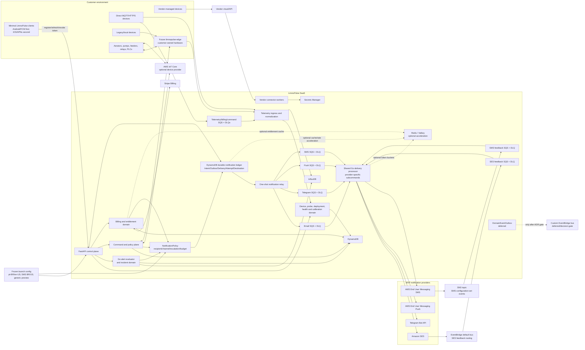
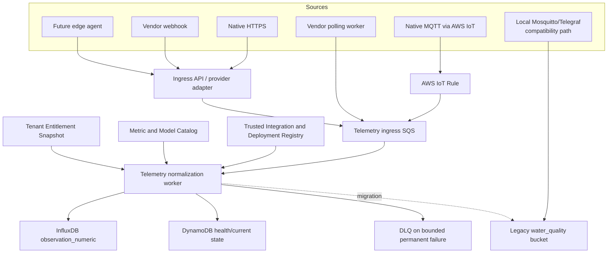
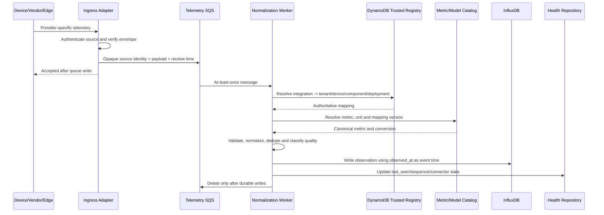
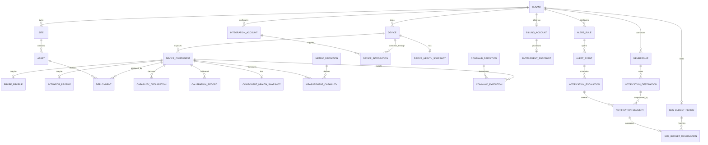
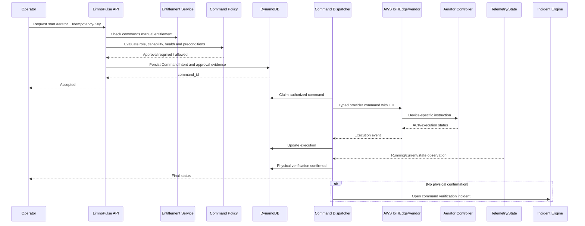
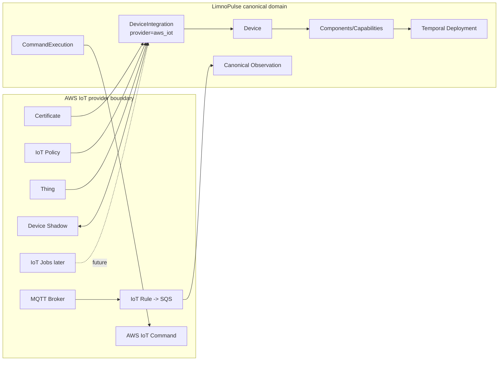
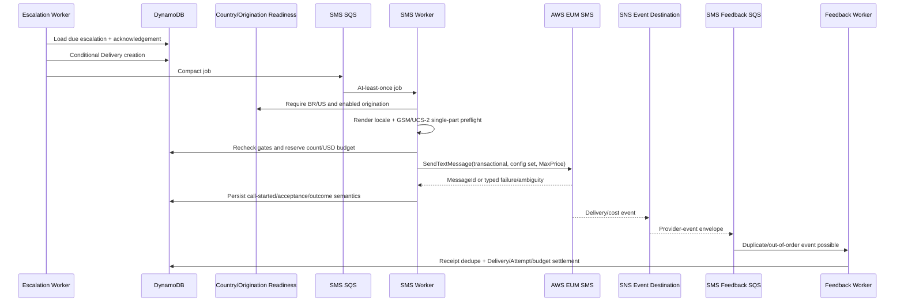
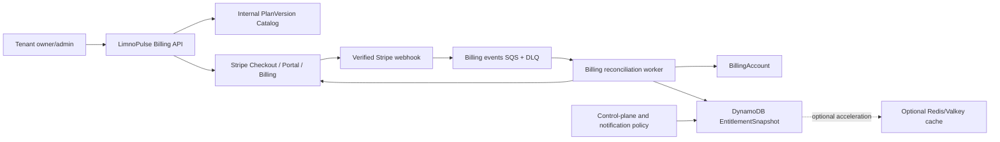
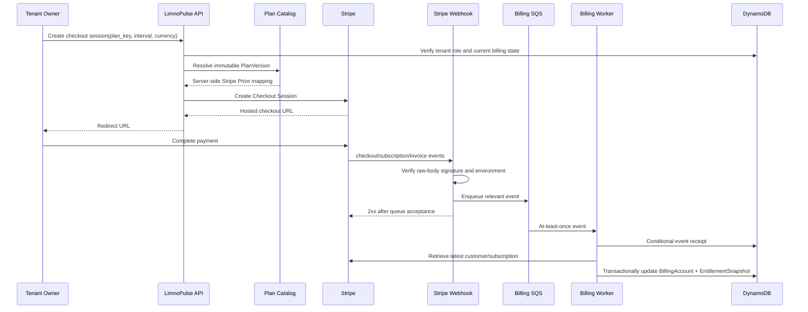

# LimnoPulse Platform Redesign — Technical Design Document / Tech Spec V4

**Date:** 2026-08-16  
**Document version:** 4.0  
**Status:** Proposed for launch-readiness architecture review  
**Supersedes:** `2026-08-16-limnopulse-platform-redesign-tech-spec_V3.md`  
**Repository baseline:** `VINIClUS/limnopulse` at `ce46b47fd646de762098a632b12e02d482c66485`  
**Scope:** Frozen platform architecture plus launch configuration for Brazil and the United States, `pt-BR`/`en-US` localization, Android/FCM and iOS/APNs Push readiness, BR/US SMS origination controls, immutable PlanVersion SMS budgets, secure lock-screen policy, AWS IoT, EventBridge/SNS, commands, entitlements and Stripe billing  
**Implementation status:** No production code is changed by this document  
**Primary product:** Water-quality operational intelligence and device management SaaS  
**Internal platform posture:** Device-agnostic and provider-independent; water quality remains the first and only committed commercial vertical

---

## 1. Executive decision

LimnoPulse should evolve into a **hardware-independent SaaS for water-quality monitoring, device intelligence, incidents and controlled actuation**.

V4 does not change the approved architecture. It resolves the four launch decisions that remained open in V3:

1. **Market and localization:** Brazil is the primary operational beachhead; the United States is the second initial market for directed pilots and higher-ARPU opportunities. The initial product locales are `pt-BR` and `en-US`. Locale support does not itself enable commercial operation, SMS delivery or regulatory readiness in a country.
2. **Push clients:** Android/FCM is implemented and validated first. iOS/APNs is implemented second and is required, together with Android, before broad commercial launch across Brazil and the United States. Generic Web Push and Safari support are outside the MVP.
3. **SMS geography and cost:** production SMS is allowlisted only for `BR` and `US`. Brazil uses an AWS shared/international route only after account-, Region- and carrier-level readiness validation; the United States uses a registered toll-free origination identity/pool. Exact per-plan message quotas and USD safety budgets are part of immutable `PlanVersion` contracts.
4. **Lock-screen privacy:** `lock_screen_preview=generic` is the global and new-tenant default. Full incident detail is loaded only after authentication and renewed tenant-membership authorization. A narrowly bounded `asset_context` preview is an explicit owner/admin opt-in recorded in a new policy revision.

It should not become:

- a hardware manufacturer;
- a generic “connect anything and draw charts” IoT platform;
- an aquaculture ERP with inventory, purchasing, payroll, accounting or sales;
- a thin user interface over AWS IoT;
- a notification system whose policy, incident semantics or durable state belong to a channel provider;
- a billing system whose authorization decisions require a live Stripe request;
- a cloud-only safety controller on which emergency aeration depends;
- a microservice fleet or stateful orchestration platform introduced before its product value is proven.

The selected architecture remains:

> **A modular monolith for control-plane APIs and domain logic, specialized one-shot and queue workers for telemetry, alerts, notifications, billing and commands, and provider-independent adapters around AWS IoT, Stripe, AWS/direct notification providers, vendor clouds and future edge software.**

The commercial MVP continues to include four notification channels:

1. Amazon SES for transactional email;
2. Telegram while it continues to provide product value;
3. AWS End User Messaging Push for authenticated LimnoPulse Android and iOS client destinations;
4. AWS End User Messaging SMS for acknowledgement-aware critical escalation in Brazil and the United States after country-specific readiness gates pass.

AWS End User Messaging is the initial delivery implementation, not the canonical notification domain. LimnoPulse continues to own `NotificationPolicyRevision`, `NotificationIntent`/Outbox, immutable `NotificationDelivery`, `NotificationAttempt`, authorized destinations, preferences, suppression, acknowledgement relationships, escalation, quota, monetary budget, provider reconciliation and audit.

The core product promise remains:

> **Connect heterogeneous water-quality equipment, normalize and preserve its data, assess whether devices and readings are trustworthy, detect operational incidents, and safely coordinate human or automated response.**

The design preserves the strongest existing decisions:

- FastAPI with thin routers and explicit service/repository boundaries;
- Cognito identity plus DynamoDB membership authorization;
- server-controlled tenant isolation;
- DynamoDB single-table persistence and no-scan access patterns;
- optimistic concurrency and idempotency;
- InfluxDB for time-series data;
- the Go alert evaluator, its quality gating and incident state machine;
- LimnoPulse-owned notification intent, delivery, attempt, preference and suppression records;
- SQS/DLQ as durable at-least-once work transport rather than source of truth;
- the current SES and Telegram delivery paths;
- the current SES feedback path through EventBridge to SQS;
- Redis/Valkey only as optional cache or rate-limit acceleration, never as a correctness prerequisite;
- OpenTofu and Docker Compose;
- incremental migration rather than a rewrite.

The architecture assumptions changed by the platform redesign remain unchanged from V3:

1. `Device` is no longer synonymous with a probe or permanently attached to a pond.
2. `Pond` becomes one type of managed `Asset`, under an explicit `Site`.
3. A device may expose many components: probes, actuators or hybrid components.
4. Assignment to a site/asset becomes a temporal `Deployment`, preserving historical truth.
5. Telemetry becomes a transport-independent observation envelope with metric identity, units, three timestamps, replay state and quality provenance.
6. AWS IoT is one device-integration provider, not the LimnoPulse domain model.
7. Capabilities are explicit and may differ by model, connector, instance and current availability.
8. Commands are a separate, audited safety plane with authorization, policy checks, approval and physical-result verification.
9. Billing and entitlements are first-class LimnoPulse domain concepts; Stripe is the payment provider.
10. Notification semantics, policy and durable delivery state remain owned by LimnoPulse; SES, Telegram, AWS End User Messaging Push/SMS and future providers are replaceable adapters.
11. `NotificationDestination` is an explicit tenant/user-authorized lifecycle.
12. SMS uses durable count and USD monetary-budget reservation before a provider call and remains critical-escalation-first.
13. EventBridge is used only where routing and scheduling are concrete—currently SES provider feedback and AWS deployment scheduling. A custom domain event bus remains deferred.
14. SNS has one concrete MVP role: AWS End User Messaging SMS configuration-set events feeding a durable SQS feedback queue. It is not the send path or notification service.
15. A production deployment must preserve correctness and bounded behavior without Redis/Valkey.
16. Launch configuration is fail-closed: an absent, stale or unapproved client-platform, SMS-country, origination or preview-policy configuration cannot silently widen delivery.

## 2. Source basis, architecture review summary and reconciliation

This specification combines:

- the uploaded product-direction document;
- the uploaded V2-to-V3 review requesting AWS End User Messaging Push and SMS in the MVP;
- the V4 launch-decision review freezing markets/locales, Push platform order, SMS country/origination policy, PlanVersion budgets and lock-screen content;
- the previous notification-delivery/EventBridge review;
- the current repository at the baseline commit above;
- the existing architecture, operations and phase design documents;
- the decisions developed in the accompanying product discussion;
- current official AWS documentation for SQS, SNS, EventBridge, EventBridge Scheduler, SES, AWS End User Messaging Push, AWS End User Messaging SMS, IAM, AWS IoT Commands and Device Shadows;
- current official Stripe Billing documentation;
- current official Novu documentation, evaluated only as a future optional orchestration platform;
- the conceptual models in OGC SensorThings Sensing/Tasking and Eclipse Sparkplug.

### 2.1 Architecture review summary

#### What changes from V3

- The four V3 open questions become frozen launch decisions rather than architecture alternatives.
- Brazil becomes the primary launch market and the United States the second initial market for directed pilots; `pt-BR` and `en-US` become the initial product locales.
- Android/FCM is the first Push vertical slice; iOS/APNs is the second and both are required before broad Brazil+United States commercial launch.
- Safari in the AWS APNs documentation is explicitly treated as Safari on macOS, not generic Web Push or a substitute for Android/iOS field clients.
- SMS country policy becomes `BR=ALLOW`, `US=ALLOW`, all other countries `BLOCK`, with an additional application-level readiness gate.
- Brazil uses only a validated AWS shared/international route at launch. No Brazilian short code, Sender ID or long code is provisioned or assumed.
- United States production SMS requires a registered toll-free number/pool for the `Notifications` use case before enablement.
- `Trial`, `Starter`, `Farm`, `Pro` and `Business` receive exact integer SMS count, USD budget and maximum-price defaults.
- SMS templates in `pt-BR` and `en-US` must pass real GSM-7/UCS-2 single-part preflight.
- `lock_screen_preview=generic` becomes the secure default; `asset_context` is a bounded, audited owner/admin opt-in.
- The four corresponding V3 open questions are removed and replaced by deployment-readiness items.

#### Decisions that remain unchanged

- modular monolith plus specialized workers;
- DynamoDB as authoritative operational and notification state;
- InfluxDB for time series;
- SQS/DLQ for durable asynchronous work, retries and backpressure;
- provider ports/adapters;
- AWS IoT as adapter rather than Device identity;
- Stripe as billing provider rather than hot-path entitlement authority;
- existing SES and Telegram paths;
- AWS End User Messaging Push and SMS as initial MVP providers;
- SMS exclusively as acknowledgement-aware critical escalation;
- SES feedback through EventBridge and SMS feedback through SNS/SQS;
- `/v1` compatibility;
- one-shot evaluator/relay patterns, leases, fencing and idempotency;
- Redis/Valkey as optional acceleration only;
- command safety and local fail-safe ownership;
- no big-bang rewrite, event sourcing, Kafka/Kinesis or microservice fleet.

#### New concrete launch dependencies

- one Android client application identity and FCM credential set per environment;
- one iOS client application identity, APNs credential set and production/sandbox separation per environment;
- token registration/rotation/revocation validation for both platforms;
- localized `pt-BR` and `en-US` notification templates;
- versioned `SmsCountryConfiguration` for `BR` and `US`, with all other countries blocked;
- a production-validated Brazilian shared/international route reference;
- a registered United States toll-free number/pool reference for the `Notifications` use case;
- exact immutable `PlanVersion` SMS count/budget/max-price fields;
- a real SMS encoding/message-part preflight implementation;
- secure default lock-screen rendering and authenticated deep-link retrieval;
- carrier/operator delivery testing for the Brazilian pilot;
- account spend limits, alarms and independent Push/SMS kill switches.

#### Explicitly deferred

- Web Push and Safari/macOS Push;
- generic browser notification clients;
- countries other than Brazil and the United States for SMS;
- Brazilian dedicated short code;
- United States short code and 10DLC;
- promotional/campaign SMS or Push;
- custom EventBridge domain bus;
- EventBridge Pipes/API Destinations unless separately approved for a concrete point-to-point case;
- Novu and Knock runtime adoption;
- OneSignal runtime adoption;
- direct server-side FCM/APNs adapters;
- persistent Inbox;
- mandatory Redis/ElastiCache;
- MongoDB;
- Kinesis/Kafka;
- automatic commands;
- broad vendor catalog and full edge implementation.

#### Additional launch risks

- dual mobile-platform readiness increases work before broad commercial launch;
- Android and iOS token lifecycle behavior may diverge despite sharing one domain model;
- lock-screen content can expose operational information on a locked personal device;
- a Brazilian shared route can have unstable displayed origin and increased filtering;
- United States toll-free registration can delay production readiness;
- carrier fees or country pricing can exceed the immutable per-message cap;
- SMS encoding changes can silently increase message parts and cost unless preflight is exact;
- fixed small-plan budgets can suppress escalation if not surfaced clearly;
- market locale, SMS allowlist and commercial enablement can drift if modeled as one setting;
- stale country/origination readiness data could cause unsafe assumptions unless production fails closed.

#### Contradictions found in V3 and resolved by V4

V3 correctly selected Push/SMS as MVP channels and kept provider-independent durable state, but still contained four unresolved launch values: “APNs and/or FCM,” an unspecified first SMS country set, non-final monetary caps, and an undecided lock-screen preview policy. V4 replaces every occurrence with the frozen launch values and removes no approved architecture.

### 2.2 Reconciled product scope

The approved product direction remains **a SaaS for heterogeneous water-quality monitoring equipment**, initially focused on aquaculture.

The launch posture is:

- **Brazil:** primary market and operational beachhead, supported by geographic/operational proximity and a large, growing aquaculture sector measured by the IBGE Municipal Livestock Survey.
- **United States:** second initial market, approached through directed pilots, with higher average farm sales and purchasing capacity reflected in the USDA Census of Aquaculture.
- **Initial locales:** `pt-BR` and `en-US`.
- **Second-wave candidates:** Portugal and Canada.
- **Future higher-value markets:** United Kingdom/Scotland and Norway, subject to their greater concentration, competition and entry cost.

This is a launch configuration, not a universal market-ranking mechanism. The TDD uses the minimum market rationale needed to determine client platforms, localization, SMS origination and budgets.

The following distinctions are mandatory:

```text
supported locale
    != commercially enabled country
    != SMS-allowlisted country
    != provider readiness
```

A United States customer may use `pt-BR`; a Brazilian user may use `en-US`. Adding `en-CA`, `pt-PT` or another locale does not enable SMS or sales in that country. Likewise, the AWS ability to send internationally does not enable a market until LimnoPulse country, compliance, pricing and rollout gates pass.

The internal canonical model remains generic enough to represent devices, probes, actuators, capabilities, observations, health, calibration and commands without aquaculture-specific coupling. No home, transport, generic industrial or plugin-marketplace product is added by V4.

### 2.3 Notification and event-routing review outcome

The repository and official service documentation support distinct concerns:

```text
DynamoDB durable domain/notification state
    != EventBridge event routing/scheduling
    != SNS provider-event fan-out
    != SQS durable asynchronous work
    != channel provider delivery
```

The V4 decision is therefore:

- preserve the existing notification domain and durable ledger;
- preserve SQS as worker queue and backpressure/retry boundary;
- preserve SES and Telegram;
- add AWS End User Messaging Push and SMS behind provider-neutral adapters;
- preserve SES -> EventBridge default bus -> SQS feedback because it is an existing provider-native route;
- add AWS End User Messaging SMS configuration set -> SNS -> SQS provider-feedback routing;
- do not place EventBridge or SNS between ordinary NotificationDelivery jobs and their workers;
- use EventBridge Scheduler for bounded one-shot tasks in AWS deployments where it is operationally preferable;
- defer a custom EventBridge domain bus until its decision gate passes;
- keep Novu, Knock and OneSignal as evaluated extension points rather than planned runtime dependencies.

### 2.4 Frozen launch configuration

The following values are frozen for V4 and may change only through the versioned configuration/PlanVersion mechanisms described later:

```yaml
commercial_markets:
  primary: BR
  secondary_pilots:
    - US
  second_wave:
    - PT
    - CA
  future:
    - GB
    - NO

locales:
  supported:
    - pt-BR
    - en-US

push:
  implementation_order:
    - android_fcm
    - ios_apns
  broad_commercial_launch_gate:
    - android_fcm_operational
    - ios_apns_operational
  deferred:
    - web_push
    - safari_macos

sms:
  allowed_countries:
    - BR
    - US
  default_country_policy: BLOCK
  purpose: critical_escalation
  overage: disabled
  budget_currency: USD

notification_preview:
  default: generic
  optional_tenant_policy:
    - asset_context
```

These values parameterize the approved architecture; they do not create new bounded contexts or providers.

## 3. Current repository assessment

### 3.1 Current architecture

The repository remains a meaningful product foundation rather than a blank prototype.

| Area | Current state at baseline | V4 treatment |
|---|---|---|
| FastAPI API | Implemented | Preserve |
| Cognito/dev authentication | Implemented | Preserve |
| Tenant membership authorization | Implemented in DynamoDB | Preserve as a core invariant |
| Tenant/Pond/Device CRUD | Implemented | Preserve `/v1`; redesign behind `/v2` |
| DynamoDB single-table domain model | Implemented | Extend incrementally |
| Redis membership/cache use | Implemented | Make optional acceleration; DynamoDB remains fallback |
| InfluxDB telemetry reads | Implemented | Preserve storage engine; introduce v2 schema |
| Local Mosquitto/Telegraf ingestion | Development scaffold | Keep for compatibility tests and local lab |
| Static Starlark device registry | Local-only | Replace in production with trusted mappings |
| Alert rules | Implemented | Preserve behavior; generalize metric and target model |
| Go alert evaluator | Implemented | Preserve state machine, quality and fencing |
| Alert events/acknowledge/resolve | Implemented | Preserve |
| Email notification relay/worker | Implemented | Preserve and adapt to shared typed provider boundary |
| Telegram binding and worker | Implemented | Preserve and adapt to shared destination/provider boundary |
| Durable notification ledger | Implemented | Retain as LimnoPulse source of truth |
| SES feedback through EventBridge/SQS | Implemented/scaffolded | Preserve |
| Push destination/provider | Not present | Required in MVP Phase 7B |
| SMS destination/provider/budget/feedback | Not present | Required in MVP Phase 7C |
| SQS/DLQ | Implemented for notifications; scaffolded elsewhere | Extend with Push/SMS lanes and SMS feedback |
| OpenTofu | Implemented scaffold | Extend |
| Stripe/billing/entitlements | Not present | Add |
| AWS IoT direct integration | Not present | Add as provider adapter |
| Device/probe/deployment model | Not present | Add in `/v2` |
| Commands/actuation | Not present | Add after capability and safety foundations |
| Web/mobile client | Not present in this repository | Android/FCM client slice first; iOS/APNs slice second; both required before broad BR+US launch. Full client architecture remains a separate spec |

### 3.2 Existing strengths

The existing code has properties that must be treated as assets:

1. **Identity is not tenant authority.** Cognito or local headers authenticate a principal; active DynamoDB membership grants tenant access.
2. **Server-controlled telemetry scope.** The API resolves tenant and pond from authenticated routes, and local ingestion enriches device identity through a trusted registry rather than trusting a tenant ID in a device payload.
3. **Thin HTTP layer.** Routers delegate to services and repository protocols.
4. **Durable alert lifecycle.** Alert state, incident transitions, leases, revisions, cooldown and outboxes are persisted.
5. **Data-quality-aware evaluation.** The Go evaluator accounts for coverage, missing buckets, stale samples, duplicate samples and multiple devices.
6. **At-least-once correctness.** Notification workers distinguish durable state from SQS transport and model attempts and ambiguous provider outcomes.
7. **Recipient gates.** Existing email/Telegram delivery checks durable membership, preference, binding/destination and event state before attempts.
8. **Provider feedback.** SES feedback is already routed through EventBridge to SQS and reconciled against durable delivery identity.
9. **Operational discipline.** Existing designs include rollout order, backfill, rollback, DLQ handling and bounded secrets/PII.

### 3.3 Structural problems under the new model

#### Device is coupled to a pond

The current `Device` contains `pond_id`, conflating gateway, probe, deployment and current location. V4 retains the temporal `Deployment` solution from V2.

#### Telemetry and alert metrics are field-based

The current fixed water-quality fields and alert metric enum make new metrics, multiple probes for one metric, source/canonical units and per-observation provenance expensive. V4 retains the generic observation/metric design from V2.

#### Production ingestion is not yet a first-class service

The local Mosquitto/Telegraf/Starlark path is useful for development but cannot provide dynamic trusted mappings, replay policy, entitlement enforcement or rich quality classification. V4 retains the common SQS/normalizer path.

#### Notification channel abstractions are narrower than the durable model

The durable worker machinery is reusable, but current public/domain data structures are explicitly email/Telegram-shaped. Push and SMS cannot be added safely by appending more nullable fields to a common Delivery struct; V4 also requires platform-neutral `android|ios` identity rather than exposing provider channel names in public APIs. Typed destination/content/provider snapshots and a channel-neutral provider port are required.

#### Notification destination lifecycle is incomplete for Push/SMS

Email uses a verified identity snapshot and Telegram uses a separate binding/destination lifecycle. Push requires multiple rotating tokens per user/app/client instance, while SMS requires E.164 normalization, verification, consent/opt-out state and reassignment risk. Those concepts need a canonical cross-channel boundary without deleting the existing records.

#### Notification policy is only partially explicit

Existing minimum severity, preferences and opening/recovery dependencies are strong, but acknowledgement-aware escalation, quiet hours, count/currency budget reservation, anti-storm state and destination selection need a first-class policy service.

#### Redis currently appears more important than the target architecture permits

Membership and JWKS caches already fall back to DynamoDB, but Telegram rate limiting is currently Redis-based. V4 does not pretend this implementation is already cache-optional; Phase 7A must add a conservative no-Redis path before declaring production Redis optional.

#### There is no commercial control plane or command safety plane

The billing/entitlement and command-plane gaps identified in V2 remain unchanged.

## 4. Goals, non-goals and invariants

### 4.1 Product goals

The target architecture must support:

1. Customer-owned equipment with no LimnoPulse hardware CAPEX.
2. Direct MQTT/HTTPS devices, AWS IoT-connected devices, vendor-cloud devices and future customer-owned edge gateways.
3. Device, gateway, probe and actuator separation.
4. Vendor-independent telemetry and historical continuity.
5. Unit normalization and metric cataloging.
6. Delayed, duplicated and out-of-order telemetry.
7. Device and connector health distinct from environmental state.
8. Calibration records and provenance without claiming physical certification.
9. Data-quality state and confidence without overstating accuracy.
10. Alert and incident preservation.
11. Manual and assisted commands, followed later by bounded automation.
12. Tiered SaaS entitlements and Stripe subscriptions.
13. LimnoPulse-owned notification policy and durable delivery state.
14. MVP transactional email, Telegram, Push and critical-escalation SMS.
15. `pt-BR` and `en-US` localized operational notifications.
16. Android/FCM delivery as the first Push slice and iOS/APNs as the second, sharing one destination/queue/provider contract.
17. Both Android and iOS operational before broad commercial launch in Brazil and the United States.
18. Multiple Push destinations per authenticated user and token rotation/invalidation.
19. Generic lock-screen previews by default, with authenticated retrieval of full incident detail.
20. Verified SMS destinations, opt-out/compliance state and durable per-tenant count/USD controls.
21. Production SMS limited to Brazil and the United States, with all other destination countries blocked before provider dispatch.
22. Brazilian shared-route and United States toll-free readiness gates.
23. Exact GSM-7/UCS-2 message-part validation with multipart critical SMS rejected in the MVP.
24. Provider-specific feedback semantics without pretending acceptance equals human acknowledgement.
25. Correctness and bounded notification behavior without a mandatory Redis/Valkey deployment.
26. Self-service onboarding for supported paths.
27. An incremental path from current HEAD.

### 4.2 Non-goals

The following are explicitly outside this design or launch:

- manufacturing, stocking, selling, financing or warranting hardware;
- installation services as a required business model;
- physical certification of sensor accuracy;
- inventory, feed stock, purchasing, accounting, payroll, CRM or harvest finance;
- supporting every vendor in the MVP;
- arbitrary customer code inside the SaaS runtime;
- a public arbitrary MQTT payload-to-relay API;
- a generic dashboard builder;
- a custom MQTT broker;
- custom PKI or OTA infrastructure;
- Kubernetes;
- event sourcing;
- a plugin marketplace;
- a full implementation of OGC SensorThings;
- emergency closed-loop control that requires cloud connectivity;
- autonomous actuation in the first commercial release;
- generic engagement campaigns, bulk SMS or marketing Push;
- persistent Inbox in the MVP;
- Novu, Knock or OneSignal runtime adoption in the MVP;
- direct server-side FCM/APNs adapters in the MVP;
- Web Push or Safari/macOS Push in the MVP;
- a custom EventBridge domain bus in the MVP;
- mandatory Redis/ElastiCache solely for correctness;
- SMS delivery to countries other than Brazil and the United States at launch;
- a Brazilian dedicated short code, Sender ID or outbound long code at launch;
- United States short code or 10DLC at launch;
- automatic SMS overage;
- synchronous exchange-rate conversion in the notification hot path;
- sensitive operational data in lock-screen-visible Push content.

### 4.3 Architectural invariants

```text
Authenticated infrastructure identity
    != tenant ownership
    != deployment authorization
```

```text
Hardware capability
AND runtime availability
AND plan entitlement
AND user authorization
AND safety policy
    = executable operation
```

```text
Command delivered
    != equipment changed state
    != physical outcome verified
```

```text
Sensor reports a value
    != LimnoPulse certifies that value as physically accurate
```

```text
Stripe subscription state
    != a synchronous Stripe call on every request
```

```text
Notification provider
    != LimnoPulse notification source of truth
```

```text
Provider accepted message
    != device/carrier confirmed delivery
    != recipient saw the message
    != notification or incident acknowledged
    != incident resolved
```

```text
Notification acknowledgement
    != incident resolution
```

```text
Push token submitted by a client
    != authorized NotificationDestination
```

```text
Phone number format is valid
    != recipient ownership verified
    != consent/compliance satisfied
```

```text
SMS entitlement enabled
    != unlimited usage
    != budget reserved
    != safe to send
```

```text
Redis/Valkey unavailable or absent
    != loss of durable state
    != bypass of quota/budget/storm protection
    != permission to send without bounds
```

```text
EventBridge route accepted
    != consumer processed event
```

```text
AWS Thing
    != LimnoPulse Device
```

```text
Supported locale
    != commercial market enablement
    != SMS country enablement
```

```text
Android implemented first
    != Android is the only committed commercial client
```

```text
Missing lock_screen_preview setting
    -> generic
    != asset_context
```

```text
SMS country not explicitly BR or US
    -> blocked before provider call
```

```text
BR shared route not validated
OR US toll-free registration not approved
    -> blocked before provider call
```

```text
SMS template resolves to more than one message part
    -> preflight failure
    -> no provider call
```

```text
PlanVersion SMS budget currency
    = USD at launch
    != Stripe subscription currency
    != transferable customer credit
```

```text
Brazilian short code technically available
    != selected
    != provisioned
    != required by the MVP
```

## 5. Alternatives considered

### 5.1 Alternative A — AWS-centric device domain

```text
Device == AWS IoT Thing
Telemetry == AWS topic payload
State == Device Shadow
Command == AWS Command
```

**Advantages**

- Fast direct-device implementation.
- Many infrastructure capabilities available.
- Fewer internal abstractions initially.

**Rejected because**

- Vendor-cloud devices and non-AWS edge sources become second-class.
- AWS identifiers leak into APIs and persistence.
- Tenant portability and multi-provider device identity become difficult.
- A device may have several integrations over its lifetime.
- LimnoPulse would confuse infrastructure state with product-level health, deployment and trust.

### 5.2 Alternative B — build on a generic IoT platform

Candidate categories include ThingsBoard, OpenRemote, EdgeX or a digital-twin platform.

**Advantages**

- Ready-made protocol adapters, dashboards, RPC and rule engines.
- Faster generic demonstrations.

**Rejected as the primary foundation because**

- LimnoPulse would become a vertical application over another platform with overlapping device, rule, tenant and command concepts.
- Existing alert, authorization and notification-ledger work would be duplicated or subordinated.
- Operational footprint and upgrade coupling would grow.
- The differentiating domain would become harder to own.

EdgeX remains a possible optional edge adapter framework for complex industrial installations. It is not the cloud domain foundation.

### 5.3 Alternative C — adapter-based LimnoPulse device domain

```text
Providers and transports
        |
Integration adapters
        |
Canonical LimnoPulse model
        |
Water-quality intelligence, incidents and control
```

**Selected.**

It provides provider independence, incremental migration, compatibility with current layers and a stable product domain for billing, alerts and commands.

### 5.4 Notification delivery alternatives

#### Alternative A — continue direct provider workers without abstraction

Lowest immediate work, but each new channel would widen email/Telegram-specific records, repeat retry logic and make provider replacement expensive.

#### Alternative B — Novu or Knock as primary orchestrator

Provides rich workflows, templates, preferences and Inbox features, but overlaps domains LimnoPulse has explicitly chosen to own and adds an external control plane or stateful self-hosted stack. It is not selected for the MVP.

#### Alternative C — LimnoPulse-owned durable semantics plus lightweight providers

Preserves the existing ledger, leases, attempts, suppression and incident relationships while extracting a typed provider boundary. This is the selected semantic architecture.

#### Alternative D — AWS-native delivery implementations behind LimnoPulse ports

Uses SES, AWS End User Messaging Push, AWS End User Messaging SMS and provider-native feedback without making AWS authoritative. This is the selected MVP implementation combined with Alternative C.

#### Push provider alternatives

| Option | Product fit | Operational fit | V4 decision |
|---|---|---|---|
| AWS End User Messaging Push | Transactional direct sends to APNs/FCM identifiers with per-address results; aligns with AWS footprint | Managed/pay-per-use; requires application/channel credentials and client token lifecycle | **MVP provider** |
| OneSignal | Strong client SDK/subscription lifecycle, analytics and product tooling | Additional provider/data plane and dependency | Future Push-provider alternative only |
| Direct FCM/APNs | Maximum direct control | Two provider APIs/credential and retry semantics owned by LimnoPulse | Future escape hatch |
| Amazon SNS mobile push | Useful when SNS endpoint/topic fan-out is itself required | SNS endpoint model would overlap LimnoPulse destinations for the current one-recipient transactional use case | Not selected for MVP |

#### SMS provider alternatives

| Option | Product fit | Operational fit | V4 decision |
|---|---|---|---|
| AWS End User Messaging SMS `SendTextMessage` | Transactional recipient-specific send, configuration sets, event destinations, origination/protect configuration and `MaxPrice` | Managed; variable cost and compliance remain | **MVP provider** |
| SNS direct SMS publish | Simple send API | Weaker fit for the selected durable budget/feedback boundary and risks making SNS look like the notification service | Not selected as send path |
| Other SMS providers | May improve country coverage or economics | Additional integration and reconciliation semantics | Future replaceable adapters |

### 5.5 Notification destination alternatives

1. **Keep separate unrelated records only.** Rejected because Push/SMS lifecycle, list/revoke APIs and immutable snapshots need common ownership/status semantics.
2. **Replace all current email/Telegram records with one generalized table immediately.** Rejected because it creates a high-risk rewrite and could break current deliveries.
3. **Add a canonical destination boundary with typed channel records and compatibility projections.** **Selected.** Existing verified email snapshots and Telegram bindings remain valid while Push/SMS use the generalized lifecycle from inception.

### 5.6 Event routing alternatives

- **Direct domain-specific outbox/SQS:** selected for notification, billing, command and telemetry work.
- **EventBridge default bus:** selected only for current SES provider feedback.
- **EventBridge Scheduler:** preferred AWS scheduler option for bounded one-shot jobs.
- **Custom EventBridge domain bus:** deferred until multiple independent consumers, dynamic routing, cross-account or justified archive/replay exists.
- **SNS:** selected narrowly as the AWS End User Messaging SMS event destination feeding SQS; not used in the normal send path.
- **Pipes/API Destinations:** deferred use-case-specific tools.

### 5.7 Redis/Valkey alternatives

1. **Mandatory distributed Redis for all production rate limits/caches.** Rejected for MVP idle cost and correctness coupling.
2. **No cache ever.** Valid but unnecessarily limits performance and distributed rate-limit precision.
3. **Optional acceleration over durable DynamoDB and bounded workers.** **Selected.** Implementations may use Redis/Valkey, but a conservative no-cache path is mandatory.

### 5.8 Billing alternatives

| Alternative | Decision |
|---|---|
| Stripe objects are the only entitlement source | Rejected; couples hot authorization and quota logic to provider semantics |
| Fully custom billing | Rejected; unnecessary payment/compliance burden |
| Stripe for commercial lifecycle plus internal versioned entitlements | **Selected** |

## 6. Target system context



The diagram deliberately distinguishes:

- **DynamoDB**, which owns logical notification state and safety/cost decisions;
- **SQS**, which owns durable work, retry/backpressure and DLQ boundaries;
- **EventBridge**, which currently routes SES provider events and may schedule one-shot jobs;
- **SNS**, which is a concrete SMS provider-event transport to SQS, not a send orchestrator;
- **Redis/Valkey**, which is optional acceleration and is not required for correctness;
- **AWS End User Messaging**, which is the initial Push/SMS delivery implementation rather than canonical domain authority.

A custom EventBridge domain bus remains visibly deferred and is not provisioned for the small MVP.

## 7. Deployment shape and bounded contexts

The deployment remains a **modular monolith plus specialized workers**, not a microservice fleet. Notification channel isolation is achieved with queue lanes and subcommands in the same Go codebase, not four repositories or independently governed products.

### 7.1 FastAPI control plane

Responsibilities:

- user authentication and tenant membership authorization;
- CRUD for sites, assets, devices, components, deployments and integrations;
- calibration and health APIs;
- alert/incident APIs;
- billing Checkout/Portal session creation;
- command request/approval/cancellation APIs;
- connector onboarding and webhook verification endpoints;
- notification preference and destination lifecycle APIs;
- Push token registration/rotation/revocation;
- SMS destination verification and opt-out-aware state;
- entitlement and quota enforcement before control-plane writes.

It does not:

- synchronously process high-volume telemetry;
- run long vendor polling loops;
- synchronously wait for physical command completion;
- call Stripe, notification providers or AWS IoT on ordinary read requests;
- accept arbitrary recipient addresses/tokens for a NotificationDelivery;
- publish a custom EventBridge domain event before the authoritative transaction commits.

### 7.2 Telemetry ingestion worker

Initially Python, to reuse Pydantic contracts and adapters.

Responsibilities:

- consume ingress messages from SQS;
- authenticate/resolve trusted integration identity;
- map external device/component/metric identifiers;
- normalize units and value types;
- classify deterministic baseline quality flags;
- deduplicate within defined semantics;
- write InfluxDB v2 observations;
- update device/component last-seen and ingestion health;
- dual-write the legacy `water_quality` shape during migration;
- emit bounded operational metrics.

### 7.3 Go alert evaluator

Preserved.

Changes are adapter-oriented:

- rule target becomes a selector rather than only pond/device;
- metric identity becomes `metric_key`;
- window reads consume the v2 observation schema;
- quality gating incorporates observation quality policy;
- new condition families can evaluate stale telemetry, device offline, degraded component and connector failure.

The one-shot, sharded, fenced scheduling model remains.

### 7.4 Connector workers

Provider-specific polling and synchronization remain outside the API process.

Responsibilities:

- OAuth/API-key token refresh;
- vendor rate limits;
- pagination and cursors;
- webhook/poll deduplication;
- connector health;
- mapping external resources to DeviceIntegration records;
- enqueueing canonical-ingress candidates, not writing InfluxDB directly.

### 7.5 Billing webhook and worker

- Public webhook verifies Stripe signature using the raw request body.
- Successfully verified, relevant events are placed on a dedicated SQS queue.
- A worker processes at least once, deduplicates event IDs and retrieves current Stripe objects when necessary.
- The worker updates internal BillingAccount and EntitlementSnapshot records.
- No request hot path depends on Stripe availability.

### 7.6 Command dispatcher and result consumer

- Persists command intent before provider dispatch.
- Evaluates capability, entitlement, authorization and policy.
- Dispatches through a provider adapter.
- Consumes provider/device execution events.
- Evaluates postconditions using reported state and telemetry.
- Opens an incident when a command is delivered but the physical result is not confirmed.

### 7.7 Notification policy, relay and shared delivery processor

The existing durable relay remains the scheduling and audit boundary. The target layers are:

```text
NotificationPolicyService
  -> NotificationIntent / Outbox / immutable Delivery
  -> NotificationRelay and channel SQS lane
  -> shared delivery processor
  -> typed DeliveryProvider
```

Responsibilities:

- policy resolves recipients, active membership, preferences, minimum severity, quiet hours, escalation, acknowledgement, entitlement, count quota, monetary budget and storm controls;
- DynamoDB owns canonical destinations, immutable Delivery snapshots, Attempts, escalation and provider-feedback receipts;
- the relay creates compact deterministic jobs and selects the channel lane;
- the shared processor owns leases, durable gates, attempt limits, ambiguity policy, retries and terminal state;
- provider adapters own only request/response translation and provider-specific destination invalidation.

MVP lanes:

```text
notifications relay
notifications worker                 # existing SES lane
notifications telegram-worker        # existing Telegram lane
notifications push-worker            # AWS EUM Push lane
notifications sms-worker             # AWS EUM SMS send lane
notifications sms-feedback-worker    # SNS/SQS provider-event reconciliation
```

These may be separate deployments/containers for blast-radius isolation while remaining one Go module/codebase.

### 7.8 Minimal Push client surface

Push requires two client-platform vertical slices that share one backend contract.

#### Implementation order

```text
1. Android / FCM
2. iOS / APNs
3. broad Brazil + United States commercial launch only after both are operational
```

Android is first to reduce initial implementation and validation risk. It is not the only commercially committed platform. iOS is a defined second slice, not an indefinite future option.

Each client must be able to:

1. obtain its platform token;
2. refresh it when FCM or APNs rotates it;
3. authenticate to LimnoPulse;
4. register the token against a stable `client_instance_id`, `client_app_id`, canonical platform and environment;
5. revoke it on sign-out, device removal or account transfer;
6. receive the generic visible notification;
7. open an authenticated deep link and fetch incident detail only after renewed membership authorization.

Shared backend contract:

```text
platform = android | ios

provider mapping:
  android -> AWS EUM channel GCM/FCM
  ios     -> AWS EUM channel APNS or APNS_SANDBOX
```

Provider channel names are not exposed as canonical client-platform identity.

Credentials, AWS application/channel references and environments remain separated by client application and platform. Production and sandbox credentials cannot be reused implicitly.

The complete client architecture and the choice among React Native, Flutter, Kotlin, Swift or another technology remain outside this TDD and require a separate client specification.

AWS documentation also mentions APNs delivery to Safari on macOS. That capability is not generic Web Push and does not replace Android/iOS clients for field operators. Safari/macOS and generic Web Push remain deferred.

### 7.9 Event routing boundary

Three EventBridge uses remain deliberately separated:

1. **Provider-native feedback — current.** SES publishes configuration-set events to the EventBridge default bus; rules transform and route them to the durable SES feedback SQS queue.
2. **Scheduling — selected for AWS deployments.** EventBridge Scheduler may invoke one-shot evaluator, relay, reconciliation and backfill tasks. Jobs remain idempotent because Scheduler delivery is at least once.
3. **Custom integration-event bus — deferred.** A versioned `DomainEventOutbox` may publish low/medium-volume integration events only after the decision gate in Section 5.6.

AWS End User Messaging SMS uses its own provider-native route:

```text
SMS configuration set -> SNS event destination -> SQS feedback -> reconciler
```

Push uses the synchronous per-address result from the transactional send API. No EventBridge/SNS path is introduced merely to make providers look uniform.

EventBridge is never inserted between `NotificationDelivery` and the channel workers.

### 7.10 Redis/Valkey deployment boundary

A small production environment may run without Redis/Valkey.

When provisioned, it may accelerate:

- membership/JWKS/entitlement reads;
- distributed token buckets;
- short-lived mapping hints;
- duplicate hints;
- anti-storm counters that are also durably enforced.

When absent or unavailable:

- DynamoDB remains authoritative;
- workers use bounded concurrency and conservative local/provider limits;
- paid/critical actions fail closed or defer rather than bypass durable controls;
- SMS count/currency budgets and storm state remain effective;
- durable notification state is never lost.

### 7.11 Launch configuration boundary

Launch parameters are versioned configuration, not hardcoded provider behavior:

| Configuration | Authority | Hot-path behavior when absent/invalid |
|---|---|---|
| Supported locale (`pt-BR`, `en-US`) | Product release config | Reject unsupported template locale or fall back only through explicit policy |
| Push client app/platform/environment | Deployment config + Secrets Manager references | Reject registration/send |
| SMS country (`BR`, `US`) | Versioned platform country config + ProtectConfiguration | Block before provider call |
| SMS origination readiness | Environment-specific deployment state | Block before provider call |
| PlanVersion quotas/budgets | Immutable PlanVersion + EntitlementSnapshot | Deny/suppress audibly and audit |
| Lock-screen preview | NotificationPolicyRevision | Default to `generic` |

Production must fail closed when country/origination/client-platform configuration is missing. A provider’s global capability list never enables a LimnoPulse market automatically.

## 8. Ingestion paths



### 8.1 Why SQS is the first common ingress

SQS matches existing repository operations and provides:

- at-least-once delivery;
- bounded retries and DLQ;
- backpressure;
- isolation between provider callbacks and InfluxDB;
- compatibility with AWS IoT Rules;
- no need for Kinesis before measured scale requires it.

Ordering is not guaranteed and is not required for correctness. Event-time and sequence-aware normalization must handle reordering.

Kinesis, Kafka or a dedicated stream platform are deferred until actual sustained throughput or replay requirements exceed the queue/Influx design.

### 8.2 Telemetry ingestion sequence



---

## 9. Core domain model

### 9.1 Relationship model



### 9.2 Entity decisions

| Entity | Why it exists | Canonical ID | Tenant ownership | Persistence | Lifecycle | Relation to current model | Timing |
|---|---|---|---|---|---|---|---|
| `Tenant` | Commercial/security boundary | existing `tnt_*` | Self | DynamoDB | Existing | Preserve | Now |
| `Site` | Farm/facility/unit boundary and multi-site tiering | `site_*` | Direct | DynamoDB | Create/rename/archive | New; default Site per legacy tenant | Now |
| `Asset` | Monitored physical/operational subject | `ast_*` | Direct through Site | DynamoDB | Create/archive | Current `Pond` maps to `Asset(type=pond)` | Now |
| `PondProfile` | Water-specific attributes without polluting generic Asset | same asset reference | Tenant | DynamoDB embedded/separate | Optional | Current Pond projection | Now, minimal |
| `Device` | Logical gateway/controller/standalone hardware record | existing/new `dev_*` | Direct | DynamoDB | Provision/active/suspended/decommissioned | Remove canonical `pond_id`; keep v1 projection | Now |
| `DeviceComponent` | Replaceable probe, actuator or logical channel | `cmp_*` | Direct | DynamoDB | Active/replaced/decommissioned | New | Now |
| `ProbeProfile` | Sensor-specific identity and calibration behavior | `prb_*` or subtype | Tenant | DynamoDB | Installed/replaced/retired | Separates probe from gateway | Now |
| `ActuatorProfile` | Commandable equipment/channel and safety classification | `act_*` or subtype | Tenant | DynamoDB | Active/disabled/retired | New | Before commands |
| `Manufacturer` | Minimal vendor catalog identity | `mfr_*` | Global catalog | DynamoDB/config | Versioned | New | Later/MVP seed |
| `ModelProfile` | Known metrics, protocols and baseline capabilities | `mdl_*` | Global catalog | DynamoDB/config | Immutable versions | New | Minimal now |
| `IntegrationAccount` | Tenant connection to provider/vendor account | `ia_*` | Direct | DynamoDB + secret reference | Pending/active/error/revoked | New | Now |
| `DeviceIntegration` | Provider-specific identity for a Device | `di_*` | Direct | DynamoDB | Provisioning/active/error/decommissioned | Replaces one `auth_type` assumption | Now |
| `Deployment` | Temporal assignment of component/device to Site/Asset | `dep_*` | Direct | DynamoDB | Starts/ends; immutable history | Replaces mutable `Device.pond_id` | Now |
| `MetricDefinition` | Canonical semantic metric and unit | namespaced key | Global/tenant extension | Config/DynamoDB | Versioned | Replaces fixed field enum | Now |
| `MeasurementCapability` | Component can produce a metric | derived ID | Tenant/catalog | DynamoDB/model snapshot | Effective while active | New | Now |
| `CapabilityDeclaration` | Read/write/command/calibration capability and provenance | `cap_*` | Tenant | DynamoDB | Versioned snapshots | New | Now |
| `CalibrationRecord` | Immutable calibration metadata/provenance | `cal_*` | Tenant | DynamoDB | Append-only/superseded | New | Health phase |
| `DeviceHealthSnapshot` | Current connectivity/integration health | Device ID | Tenant | DynamoDB + Influx details | Continuously updated | Separate from water quality | Health phase |
| `ComponentHealthSnapshot` | Probe/actuator trust/degradation | Component ID | Tenant | DynamoDB | Continuously updated | New | Health phase |
| `ConnectorHealth` | Vendor/edge synchronization state | IntegrationAccount ID | Tenant | DynamoDB | Continuously updated | New | Integration phase |
| `AlertRuleV2` | Metric/health/connector condition over selector | `rule_*` | Tenant | DynamoDB | Versioned/replacement | Evolves current rule | Telemetry v2 |
| `AlertEvent` | Continuous incident episode | existing event ID | Tenant | DynamoDB | Preserve | Existing | Preserve |
| `NotificationPolicyRevision` | Immutable policy inputs for channel selection/escalation/budget | `npol_*` | Tenant | DynamoDB/audit | Draft/active/superseded | Evolves current preference/rule channel logic | Phase 7A |
| `NotificationDestination` | Canonical user/tenant-authorized destination identity and lifecycle | `ndst_*` | Tenant + recipient membership | DynamoDB | Pending verification/active/invalid/revoked/suppressed | Generalizes without deleting email/Telegram records | Phase 7A |
| `EmailDestination` | Typed verified email payload/provenance | Destination subtype | Tenant/user | DynamoDB or compatibility projection | Active/suppressed/revoked | Existing verified email snapshot | Phase 7A projection |
| `TelegramDestination` | Typed private chat destination/binding | Destination subtype | Tenant/user | DynamoDB or compatibility projection | Pending/verified/suppressed/revoked | Existing TelegramBinding/Destination | Phase 7A projection |
| `PushDestination` | One app/client/platform token per user device | `ndst_*` | Tenant/user | DynamoDB; encrypted token/provider metadata | Active/invalid/revoked; rotated by stable client instance | New | MVP Phase 7B |
| `SmsDestination` | Verified E.164 critical-escalation recipient with compliance state | `ndst_*` | Tenant/user | DynamoDB; encrypted number + hash | Pending verification/active/opted_out/revoked/invalid | New | MVP Phase 7C |
| `NotificationEscalation` | Durable due state that survives restart and stops on acknowledgement | `nesc_*` | Tenant | DynamoDB + relay due index | Pending/ready/cancelled/completed | Extends opening/recovery dependencies | MVP Phase 7C |
| `SmsBudgetPeriod` | Authoritative monthly count/currency usage | tenant+period | Tenant | DynamoDB | Open/closed/reconciled | New | MVP Phase 7C |
| `SmsBudgetReservation` | Reserves worst-case message count/cost before provider call | Delivery ID | Tenant | DynamoDB | Reserved/committed/released/expired/unknown | New | MVP Phase 7C |
| `CommandDefinition` | Typed, versioned operation schema | namespaced key+version | Global/model | Config/DynamoDB | Immutable | New | Commands phase |
| `CommandIntent` | User/system request and reason | `cmd_*` | Tenant | DynamoDB | Requested to terminal | New | Commands phase |
| `CommandApproval` | Human authorization evidence | `appr_*` | Tenant | Audit/DynamoDB | Append-only | New | Commands phase |
| `CommandExecution` | Provider dispatch/execution lifecycle | `cex_*` | Tenant | DynamoDB | Versioned state machine | New | Commands phase |
| `AutomationPolicy` | Conditions for proposed/executed commands | `auto_*` | Tenant | DynamoDB + audit | Disabled/draft/active | New | Assisted now; automatic later |
| `BillingAccount` | Provider-independent tenant billing state | tenant-scoped | Tenant | DynamoDB | Trial/active/grace/restricted/suspended/canceled | New | Billing phase |
| `PlanVersion` | Immutable commercial contract | `plan_key@version` | Global | DynamoDB/config | Immutable | New | Billing phase |
| `EntitlementSnapshot` | Hot-path feature/limit snapshot | tenant-scoped version | Tenant | DynamoDB + optional cache | Replaced transactionally | New | Billing phase |
| `UsageCounter` | Enforces hard quotas | resource/period key | Tenant | DynamoDB | Increment/decrement/reconcile | New | Billing/Phase 7 |
| `ExternalProviderEventReceipt` | Stripe, notification/integration provider idempotency | provider event identity | Provider scope | DynamoDB with TTL | Append-only | New | Billing/notifications/integrations |

### 9.3 Notification destination model

`NotificationDestination` supplies shared identity, authorization and lifecycle fields:

```text
destination_id
tenant_id
recipient_id / cognito_sub
channel
status
purpose
created_at / updated_at
verified_at / last_verified_at
invalidated_at / revoked_at
version
provider_binding_version
```

Typed channel data remains explicit rather than one bag of nullable fields.

#### PushDestination

Canonical fields:

```text
client_app_id
client_instance_id
platform = android | ios
environment = development | staging | production
provider_application_ref
provider_channel_ref
encrypted_platform_token
token_hash
token_updated_at
app_version
locale = pt-BR | en-US
last_seen_at
invalidation_reason
```

Rules:

- Android/FCM is the first implemented slice; iOS/APNs is the second.
- Both platforms use the same `PushDestination` lifecycle, APIs, queue lane and `PushDeliveryProvider` contract.
- Public APIs use `android|ios`; adapter metadata maps them to AWS `GCM`, `APNS` or `APNS_SANDBOX`.
- One user may own several active client instances.
- Registration is authenticated and tenant-membership scoped.
- The client supplies a token only to register/refresh its own destination, never to create a Delivery.
- A stable client instance rotates to a new token without changing historical Delivery snapshots.
- A token claimed by another principal is rejected or enters an explicit security-recovery flow.
- Provider permanent failures invalidate the destination conditionally by version.
- A provider-returned updated token creates a fenced rotation.
- Delivery snapshots contain the exact encrypted destination/token reference selected at fanout and remain immutable.
- Credentials and provider application/channel IDs are separated by client application, platform and environment.
- Safari/macOS and generic Web Push do not reuse the mobile destination contract in the MVP.

#### SmsDestination

Canonical fields:

```text
encrypted_e164_number
phone_hash
country_code = BR | US
verification_source
verification_status
verified_at
consent_source / consent_at
opt_out_status / opt_out_at
reassignment_last_checked_at
purpose = critical_escalation
locale = pt-BR | en-US
```

Rules:

- E.164 format is necessary but not sufficient.
- A number must be verified or come from an explicitly trusted verified identity source.
- Production country allowlist is `BR` and `US`; every other country is blocked before provider dispatch.
- Opt-out and country/origination rules override preference and entitlement.
- Ordinary notification requests never choose an arbitrary phone number.
- A changed number creates a new destination identity or explicit versioned transition rather than silently retargeting an immutable Delivery.
- Verification traffic uses a separate platform verification budget and does not consume the tenant’s critical-escalation quota silently.
- Country readiness is evaluated again immediately before the provider call.
- Phone plaintext never enters SQS, logs, metrics or ordinary audit records.

#### Launch configuration related to destinations

`ClientApplicationConfiguration` is environment/provider configuration, not a customer-owned destination. It records the approved Android/FCM and iOS/APNs application/channel references and credential versions.

`SmsCountryConfiguration` is a versioned platform deployment record:

```text
country_code
status = blocked | readiness_pending | enabled
origination_strategy
origination_reference
protect_configuration_reference
registration_status
pricing_reviewed_at
deliverability_reviewed_at
configuration_version
```

Only `BR` and `US` may reach `enabled` in V4. Missing records are equivalent to `blocked`.

### 9.4 Site, device, component and deployment

The Site/Asset and temporal Device/Component/Deployment model from V2 remains unchanged. Historical observations carry the resolved deployment and are never retroactively moved when hardware is reassigned.

### 9.5 Capability model

Capability keys remain namespaced strings with support, availability, provenance, parameter/result schemas, risk class, verification time and provider implementation key.

The effective capability is derived from connector/provider implementation, model profile, discovered evidence, instance override and current health. Device claims cannot grant tenant ownership or authorization.

### 9.6 Compatibility level

Compatibility remains separate from commercial tier:

- **Certified:** explicitly tested model/firmware/integration mapping.
- **Compatible:** standards-based integration expected to work within documented limits.
- **Custom:** customer/integrator mapping with limited guarantees.

The same separation applies to notification clients: paying for Push does not make an unregistered or invalid client destination deliverable.

## 10. Canonical telemetry contract

### 10.1 Envelope

The canonical envelope is an internal contract. Public/provider payloads are transformed into it.

```json
{
  "schema_version": 2,
  "event_id": "evt_...",
  "source_event_id": "vendor-or-device-id",
  "source": {
    "integration_id": "di_...",
    "integration_type": "aws_iot",
    "connector_version": "1.2.0",
    "received_at": "2026-08-16T12:00:04.123Z"
  },
  "resolved": {
    "tenant_id": "tnt_...",
    "site_id": "site_...",
    "asset_id": "ast_...",
    "deployment_id": "dep_...",
    "device_id": "dev_...",
    "component_id": "cmp_...",
    "probe_id": "prb_..."
  },
  "observation": {
    "metric_key": "water.dissolved_oxygen",
    "value": 4.82,
    "value_type": "float",
    "source_unit": "mg/L",
    "canonical_unit": "mg/L",
    "observed_at": "2026-08-16T12:00:00Z",
    "sequence": 99123
  },
  "delivery": {
    "ingested_at": "2026-08-16T12:00:04.210Z",
    "delayed": false,
    "replay": false
  },
  "quality": {
    "state": "valid",
    "flags": [],
    "confidence": null,
    "provenance": ["schema_validation", "unit_mapping"]
  },
  "source_metadata": {
    "allowlisted_key": "allowlisted-value"
  }
}
```

### 10.2 Trusted mapping rule

Public ingress may accept an external device identity, metric name and event timestamp. It must not accept authoritative tenant, site, asset or deployment ownership.

The normalizer resolves:

```text
authenticated source
  -> DeviceIntegration
  -> Device/Component
  -> active Deployment at observed_at
  -> Tenant/Site/Asset
```

If no valid temporal deployment exists:

- preserve the source event in bounded quarantine/DLQ metadata;
- mark connector health;
- do not silently assign it to the device’s current location;
- provide an operator reconciliation path.

### 10.3 Time model

Every observation distinguishes:

- `observed_at`: event/device time;
- `received_at`: first supported LimnoPulse interface time;
- `ingested_at`: canonical write time.

Rules:

- Influx `_time` uses `observed_at`.
- Delay is `received_at - observed_at`.
- Negative or extreme skew is flagged.
- Replayed events retain original `observed_at`.
- Alert evaluation uses event-time windows and a completeness delay.
- Current-health views use receive/ingest time so a replay cannot make a device appear currently online.

### 10.4 Idempotency, duplicates and ordering

- HTTP ingress requires `Idempotency-Key` or a stable `source_event_id` for batch writes.
- MQTT/vendor events use a deterministic identity derived from integration, source event ID or device/component/metric/observed time/sequence.
- SQS is at least once; duplicate processing must be safe.
- The normalizer applies deterministic canonical point identity.
- Exact duplicate Influx writes target the same series/time.
- Sequence gaps and regressions update health/quality state.
- The system never assumes arrival order.

A per-observation DynamoDB receipt table is intentionally avoided in the MVP because its cost would scale with telemetry volume. Persistent deduplication is limited to sources requiring strict event receipts; ordinary sensor points use canonical time-series identity and bounded in-memory/Redis hints.

### 10.5 Baseline quality states

Initial states:

- `valid`;
- `suspect`;
- `stale`;
- `out_of_range`;
- `uncalibrated`;
- `calibration_unknown`;
- `duplicate`;
- `delayed`;
- `impossible_jump`;
- `missing`.

Quality provenance must explain why a state was assigned.

The initial normalizer implements only deterministic checks:

- schema/type validity;
- known unit conversion;
- plausible absolute ranges from metric/model profile;
- timestamp skew;
- duplicate/sequence logic;
- calibration age/unknown state;
- impossible rate-of-change where explicitly configured.

Statistical drift, cross-probe inference and predictive degradation are deferred until enough production data exists.

### 10.6 InfluxDB v2 schema

Primary numeric measurement:

```text
_measurement = observation_numeric
_time        = observed_at
```

Tags:

```text
tenant_id
site_id
asset_id
device_id
component_id
probe_id          when applicable
deployment_id
metric_key
source_type
quality_state
schema_version
```

Fields:

```text
value                 float
sequence              integer when available
received_at_ns        integer
ingested_at_ns        integer
delay_ms              integer
source_unit           string
source_event_id       string
quality_flags_json    bounded string
integration_id        string unless a measured query requires it as a tag
```

Cardinality controls:

- never tag event IDs, firmware version, arbitrary metadata or error messages;
- metric keys come from the catalog;
- source metadata is allowlisted;
- component and deployment counts are entitlement-bounded;
- tenant-created custom metric keys require validation and plan support.

Migration:

- keep the legacy `water_quality` measurement readable;
- dual-write supported legacy metrics during migration;
- move the v2 alert adapter first;
- stop dual-write only after `/v1` compatibility reads are proven against v2 or the legacy retention window expires.

### 10.7 Retention

Retention has two dimensions:

1. **Physical storage policy**, selected for operational cost.
2. **Tenant entitlement query horizon**, selected by plan.

Suggested initial policies:

- raw observations: one operationally manageable shared retention, for example 90–180 days;
- hourly/daily rollups: longer retention;
- plan APIs restrict accessible historical range;
- avoid a bucket per tenant or per plan in the MVP;
- export/archival is an enterprise feature later.

Exact durations are a product/cost decision and remain configurable.

---

## 11. Device health, calibration and degradation

### 11.1 Health dimensions

Health is not a single online boolean.

```text
DeviceHealth
  connectivity
  telemetry_freshness
  integration_sync
  power/battery
  signal quality
  firmware visibility
  reboot/uptime behavior
  command reachability
  security/credential state

ComponentHealth
  measurement freshness
  calibration status
  range violations
  noise
  drift suspicion
  disagreement with redundant probes
  degradation score
  trust state
```

State machine:

```text
UNKNOWN -> HEALTHY -> WARNING -> DEGRADED -> UNRELIABLE -> FAILED
```

Transitions require evidence and hysteresis. “Online” does not imply “healthy,” and missing observations never imply safe water.

### 11.2 Calibration boundary

A `CalibrationRecord` can contain:

- source: manual, vendor cloud, device-reported, LimnoPulse-observed;
- performed timestamp;
- performed by;
- method;
- reference standard and reference value;
- before/after values;
- correction coefficients when available;
- environmental conditions;
- validity/expiry;
- attachments/reference IDs;
- provenance and confidence;
- device/component firmware/model snapshot.

LimnoPulse wording must distinguish:

```text
Device-reported calibration current
```

from:

```text
Calibration metadata recorded by operator
```

and from:

```text
LimnoPulse detected no current calibration evidence
```

It must never claim independent physical certification unless a future explicitly contracted service provides it.

### 11.3 Degradation roadmap

MVP:

- calibration age;
- missing/stale telemetry;
- sequence gaps;
- connection instability;
- range/rate checks;
- noise variance against configured baseline.

Later:

- redundancy comparison;
- cross-variable physical consistency;
- per-model expected maintenance interval;
- drift probability;
- useful-life forecasting;
- maintenance recommendation.

---

## 12. Command and automation plane

### 12.1 Principle

Commands are not part of the telemetry ingestion path and are not generic MQTT messages exposed to customers.

A command must be:

- typed;
- versioned;
- capability-bound;
- entitlement-checked;
- tenant-authorized;
- policy-evaluated;
- idempotent;
- time-bounded;
- auditable;
- provider-dispatched;
- result-tracked;
- physically verified where possible.

### 12.2 Command lifecycle

```text
REQUESTED
  -> POLICY_EVALUATED
  -> PENDING_APPROVAL | AUTHORIZED | REJECTED
  -> DISPATCHED
  -> ACKNOWLEDGED
  -> EXECUTING
  -> SUCCEEDED | FAILED | TIMED_OUT | UNKNOWN | CANCELLED
```

A separate result dimension records:

```text
physical_verification =
  confirmed | not_confirmed | unknown | not_applicable
```

### 12.3 Risk classes

| Class | Meaning | Example | Initial policy |
|---|---|---|---|
| R0 | Read-only diagnostic | request logs/state | Owner/admin or device operator |
| R1 | Reversible low-risk configuration | sampling interval | Explicit permission; confirmation optional |
| R2 | Operational actuation | start aerator/pump | Human approval in MVP; safety checks |
| R3 | High-risk/irreversible or safety interlock | stop last aerator under low DO, firmware operation affecting control | Not automatically executed; stricter role and site policy |
| R4 | Unsupported safety-critical action | bypass protection, arbitrary register write | Never exposed |

Risk is defined by command plus context. Starting an aerator may be R2, while stopping the only running aerator during low dissolved oxygen becomes R3 or prohibited.

### 12.4 Execution gate

```text
Effective provider capability
AND component availability
AND tenant entitlement
AND actor permission
AND idempotency validity
AND command definition validation
AND safety preconditions
AND approval requirement
AND non-expired TTL
    -> dispatch
```

Commercial entitlements never override physical or safety restrictions.

### 12.5 Preconditions and postconditions

Example:

```yaml
command: command.aerator.start
target: cmp_aerator_03
ttl: 30s

preconditions:
  - component.health not_in [FAILED, UNRELIABLE]
  - integration.command_availability == available
  - no conflicting command executing

postconditions:
  within: 10s
  any:
    - state.running == true
    - electrical.current_a >= 1.0
```

If provider delivery succeeds but postconditions fail:

```text
Command transport: succeeded
Physical verification: not_confirmed
Result: failed
Incident: aerator failed to start
```

### 12.6 Aerator sequence



### 12.7 Manual, assisted and automatic modes

- **Manual:** a permitted user requests a command.
- **Assisted:** LimnoPulse recommends a command; a human approves it.
- **Automatic:** an approved policy initiates the command.

MVP supports Manual and Assisted.

Automatic mode is deferred until:

- command adapters have production evidence;
- edge/offline ownership is defined;
- rollback/fail-safe behavior is tested;
- tenant-specific approval and liability language exist;
- operational incident data demonstrates safe thresholds.

### 12.8 Cloud/edge responsibility

Cloud commands are not an emergency interlock.

Critical local rules such as emergency aeration should execute on:

- equipment-native controls;
- PLC;
- customer-owned edge gateway;
- another local fail-safe.

LimnoPulse may distribute/configure approved policies later, but loss of Internet, AWS or LimnoPulse must not disable essential local protection.

### 12.9 Policy implementation

Define an internal `CommandPolicyEvaluator` port.

Initial implementation:

- deterministic code and versioned policy data;
- easy unit testing;
- no new runtime service.

OPA remains a later adapter if policy complexity, customer-specific governance or shared policy evaluation justifies it.

---

## 13. Integration architecture

### 13.1 Provider ports

Conceptual interfaces:

```python
class TelemetryIngressProvider:
    async def authenticate(self, request_or_message): ...
    async def extract(self, payload): ...

class DeviceManagementProvider:
    async def provision(self, integration): ...
    async def decommission(self, integration): ...
    async def read_state(self, integration): ...

class CommandDispatchProvider:
    async def dispatch(self, execution, command): ...
    async def cancel(self, execution): ...

class CapabilityProvider:
    async def declared_capabilities(self, model_or_integration): ...
    async def runtime_availability(self, integration): ...

class ConnectorProvider:
    async def sync(self, integration_account, cursor): ...
    async def verify_webhook(self, request): ...
```

Notification delivery uses a provider boundary in the existing Go worker codebase rather than the Python device integration ports:

```text
DeliveryProvider
  preflight(DeliverySnapshot)
  deliver(AttemptContext, DeliverySnapshot) -> ProviderResult
```

Typed channel implementations:

```text
SesEmailProvider                         current
TelegramProvider                         current
AwsEndUserMessagingPushProvider          MVP
AwsEndUserMessagingSmsProvider           MVP
WebhookProvider                          future
OneSignalPushProvider                    future Push alternative
DirectFcmProvider / DirectApnsProvider   future escape hatch
NovuProvider / KnockProvider             future orchestration-platform evaluation only
```

The exact interface names follow the existing `worker.EmailSender`, `telegramworker.Sender`, `Store`, `Queue` and `GateFence` conventions during implementation. The design goal is to generalize without rewriting the shared processor.

### 13.2 IntegrationAccount versus DeviceIntegration

`IntegrationAccount` represents shared credentials/context:

- one vendor account;
- one customer API credential set;
- one edge gateway enrollment;
- one AWS IoT provisioning group or account-level context.

`DeviceIntegration` represents one device identity through that account/provider.

This supports one vendor account exposing many devices, provider replacement and parallel read/command providers.

Notification provider configuration is deliberately not a `DeviceIntegration`. Provider application/configuration identities belong to environment/provider adapters, while tenant/user destinations live in the notification domain.

### 13.3 Secrets and provider configuration

DynamoDB stores only safe references and metadata:

- provider type;
- secret reference ARN/key;
- public identifier;
- status/scopes;
- token expiry metadata;
- connector cursor;
- provider application/channel/configuration-set references;
- credential version/fingerprint;
- environment and canonical client platform;
- SMS country readiness/origination-reference state;
- last success/error classification.

Secrets Manager or an equivalent environment secret manager stores:

- vendor API secrets and OAuth refresh tokens;
- webhook secrets;
- Stripe secret key/webhook secret;
- Telegram bot token/webhook secret;
- Android/FCM service-account or token credentials;
- iOS/APNs signing key or certificate material;
- future provider credentials.

Rules:

- Android and iOS credentials are separate by application, platform and environment.
- Production APNs and APNs sandbox references are not interchangeable.
- Use IAM roles and temporary AWS credentials for AWS SDK calls.
- OpenTofu may create resource containers, references and IAM policies but must not embed FCM service-account JSON, APNs private material, Stripe keys or bot tokens in state.
- Push platform tokens and SMS phone numbers are destination PII, not infrastructure secrets; protect them with application-level envelope encryption using KMS or the AWS Database Encryption SDK.
- Restrict decryption to destination-management and channel-delivery roles.
- Exclude plaintext tokens, phone numbers and notification content from jobs, logs and metrics.
- SMS origination identity/pool references are environment configuration. No Brazilian short code is created or required by this design.
- Future Novu/Knock/OneSignal credentials do not exist until those adapters are explicitly approved.

## 14. AWS IoT adapter design

### 14.1 Boundary

AWS IoT owns infrastructure concerns for direct-capable devices:

- MQTT/TLS connectivity;
- X.509 identity;
- IoT policy;
- optional fleet provisioning;
- Thing registry metadata;
- Rule routing;
- Device Shadows;
- Commands;
- Jobs later.

LimnoPulse owns:

- Tenant/Site/Asset/Device/Component/Deployment;
- capability meaning;
- metric normalization;
- health and trust;
- calibration;
- incidents;
- command policy and approval;
- entitlements;
- historical records.

### 14.2 Adapter boundary



### 14.3 Naming

Use opaque names:

```text
ThingName = lp-<env>-<device_integration_id>
```

Do not encode tenant names, farm names, emails or pond names.

Persist provider details only in `DeviceIntegration.provider_details`, including:

- Thing name;
- certificate ID/ARN/fingerprint;
- IoT policy name/version;
- provisioning template/version;
- Shadow names used;
- command adapter version.

### 14.4 Topics

Proposed direct contract:

```text
lp/v2/<device_integration_id>/telemetry
lp/v2/<device_integration_id>/health
lp/v2/<device_integration_id>/state/reported
```

Device-specific command/system topics are managed by AWS IoT mechanisms rather than exposed as arbitrary tenant topics.

IoT policies allow a certificate/client to:

- connect only as its mapped client ID;
- publish only its telemetry/health/reported topics;
- subscribe only to the AWS command/shadow topics required;
- never select a tenant or another device topic.

### 14.5 Routing

```text
Device MQTT
  -> AWS IoT Rule
  -> standard SQS telemetry queue
  -> LimnoPulse normalizer
```

The Rule has:

- least-privilege IAM to one queue;
- CloudWatch logging;
- an error action;
- no direct InfluxDB write;
- no authoritative tenant lookup from payload.

Because AWS IoT Rule-to-SQS delivery is not ordered, the canonical sequence/time logic remains mandatory.

### 14.6 Provisioning

MVP:

- one-at-a-time API-assisted enrollment;
- generate/claim identity only after tenant authorization and device quota reservation;
- return private key only at creation if LimnoPulse generates it, or prefer CSR/device-side key generation where supported;
- store certificate ID/fingerprint, not private key;
- explicit activation after successful first connection.

Later:

- Fleet Provisioning by claim or trusted user;
- manufacturing enrollment only if a hardware partner requires it;
- bulk enterprise workflows.

### 14.7 Shadows, Commands and Jobs

- **Shadow:** persistent desired/reported configuration and operational state, such as sampling interval or control mode.
- **Command:** one-shot action such as `aerator.start`, diagnostics or reboot; LimnoPulse still owns policy and execution record.
- **Jobs:** fleet/maintenance operations such as firmware update or supported calibration routine, deferred beyond the first command MVP.

A Shadow version/client token maps to LimnoPulse expected version and execution correlation where applicable.

### 14.8 Rotation and decommissioning

Rotation:

1. request new certificate through a supported device/edge flow;
2. attach least-privilege policy;
3. verify new identity;
4. disable old certificate;
5. retain mapping/audit metadata.

Decommission:

1. disable new commands;
2. revoke/disable credentials;
3. detach policy and mark provider resource decommissioned;
4. end active deployments when appropriate;
5. retain historical Device, Integration and observations.

---

## 15. Direct HTTPS/MQTT and vendor-cloud connectors

### 15.1 Native HTTPS

Public endpoint:

```text
POST /ingest/v2/observations
```

Authentication options by integration:

- scoped API token;
- request signature;
- mTLS where practical;
- edge enrollment token exchanged for rotating credentials.

Properties:

- batch support;
- bounded payload size;
- idempotency key;
- no tenant ID authority in payload;
- response after durable queue acceptance;
- per-integration rate and entitlement limits.

### 15.2 Native MQTT without AWS IoT

The domain does not require AWS IoT. A future managed broker or customer bridge can implement the same provider interface.

The repository’s Mosquitto remains local development infrastructure. LimnoPulse does not operate a custom production broker in the MVP.

### 15.3 Vendor cloud

Flow:

```text
Sensor -> Vendor cloud -> webhook/polling connector -> ingress SQS
```

Connector requirements:

- credentials per `IntegrationAccount`;
- cursor/checkpoint;
- retry/backoff;
- rate-limit state;
- webhook signature verification;
- event dedupe;
- mapping version;
- connector health;
- bounded source metadata;
- no direct Influx writes.

The first commercial vendor connector should be selected by actual pilot demand, not by speculative catalog breadth.

### 15.4 Future limnopulse-edge

`limnopulse-edge` is software installed on customer-owned gateway hardware.

Potential adapters:

- Modbus TCP/RTU;
- serial;
- local MQTT;
- HTTP;
- OPC UA later;
- vendor protocols.

Responsibilities:

- local source identity;
- protocol polling/subscription;
- mapping to LimnoPulse metric/component IDs;
- local buffering;
- replay;
- command agent;
- local safety rules where explicitly configured;
- secure cloud enrollment and rotation;
- signed/versioned configuration.

It must not run arbitrary untrusted plugins inside the LimnoPulse cloud.

AWS Greengrass may be one deployment adapter, not a mandatory edge runtime.

---

## 16. Alerts and incidents

### 16.1 Preserve the existing engine

Keep:

- one-shot Go execution;
- virtual buckets/shards;
- due index;
- conditional lease and fencing;
- quality-gated transitions;
- duration/cooldown;
- continuous-episode AlertEvent;
- optimistic revisions;
- outboxes and recovery dependencies;
- no-scan discipline.

### 16.2 V2 alert target

Replace only the public/internal rule target representation:

```text
target_type:
  asset | device | component | probe | integration | site

target_id:
  canonical ID

metric_key:
  water.dissolved_oxygen
```

Health rules may use condition keys instead of numeric metrics:

```text
health.telemetry_stale
health.device_offline
health.component_degraded
integration.sync_failed
command.physical_verification_failed
```

### 16.3 Quality gating

Each rule declares a quality policy:

```text
require_quality in [valid]
allow_suspect = false
minimum_confidence = optional
on_insufficient_data = indeterminate
```

No-data/stale/query error behavior preserves the current invariant: it must not silently open or resolve a water-condition incident unless the rule is specifically a stale/offline condition.

### 16.4 V1 compatibility

Current `/v1` alert rules remain valid for the fixed legacy metrics.

Migration adapter:

- maps legacy `pond_id` to its v2 Asset;
- maps legacy field to `metric_key`;
- maps optional `device_id` target;
- preserves rule IDs, versions and current events;
- keeps existing evaluator revision behavior.

New generalized rules are created only through `/v2`.

---

### 16.5 Notification acknowledgement and escalation boundary

Alert/incident state remains authoritative. Notification acknowledgement is evidence used by an escalation policy, not an automatic incident resolution.

For an incident-triggered sequence:

```text
AlertEvent open
    -> NotificationPolicy revision
    -> immediate email/push Deliveries
    -> durable NotificationEscalation due_at
    -> incident acknowledged before due_at? cancel escalation
    -> otherwise create SMS Delivery within entitlement/budget gates
```

The escalation record fences:

- AlertEvent ID/status/revision;
- acknowledgement revision/time;
- NotificationPolicy revision;
- selected recipient/destination revision;
- entitlement snapshot version;
- due time and lease epoch.

A late acknowledgement and an escalation worker race are resolved by one conditional DynamoDB transaction. The losing operation reloads state; duplicate SMS Delivery identity remains deterministic.

## 17. MVP multichannel notifications, delivery architecture and event routing

### 17.1 Architecture decision

LimnoPulse owns:

- whether a notification should exist;
- tenant and authorized recipient resolution;
- originating incident, command, billing or health event;
- severity and notification kind;
- policy and escalation state;
- acknowledgement relationship;
- destination identity and lifecycle;
- delivery identity and idempotency;
- immutable destination/content snapshots;
- attempts and provider outcomes;
- suppression and opt-out state;
- quotas, count/currency budgets and anti-storm state;
- audit and safety-critical behavior.

No channel provider, SNS topic, EventBridge bus, Redis instance or external notification platform is the source of truth for those concepts.

```text
Domain event/state transition
    -> NotificationPolicy decision
    -> NotificationIntent / Outbox
    -> immutable NotificationDelivery
    -> durable channel SQS lane
    -> shared processor + typed provider adapter
    -> provider
    -> provider-specific reconciliation when available
```

The MVP provider set is:

```text
email     -> Amazon SES
telegram  -> Telegram Bot API
push      -> AWS End User Messaging Push
sms       -> AWS End User Messaging SMS
```

### 17.2 Preserve and evolve the current durable model

Do not delete or rewrite the current notification subsystem. It already contains the difficult correctness work:

- deterministic outbox and delivery identities;
- opening/recovery dependency semantics;
- immutable rendered content and destination snapshots;
- membership and preference fences;
- provider-attempt limits and leases;
- retryable, permanent and ambiguous outcomes;
- hashed email suppression;
- Telegram destination suppression;
- SQS duplicate safety;
- SES feedback reconciliation;
- DLQ and rollout runbooks.

V4 evolves it additively:

1. generalize `EmailSender`/Telegram sender behavior behind typed provider contracts;
2. move channel-specific fields out of a widening nullable Delivery structure into typed snapshots;
3. formalize `NotificationDestination` ownership and status;
4. introduce durable policy, escalation and SMS budget decisions before provider dispatch;
5. preserve deterministic IDs and existing email/Telegram schemas through compatibility adapters;
6. add Push and SMS without changing current email/Telegram logical identities;
7. make Redis/Valkey optional while preserving bounded rate/cost behavior.

Existing email and Telegram data is not mass-rewritten before a vertical migration proves compatibility.

### 17.3 Notification policy

A `NotificationPolicyService` is a LimnoPulse domain service, not an external workflow product. It evaluates:

```text
event type and severity
    -> authorized recipient resolution
    -> active membership
    -> preference and active verified destination
    -> supported locale and template revision
    -> minimum severity / quiet hours
    -> entitlement and channel availability
    -> acknowledgement and escalation state
    -> Push preview policy
    -> SMS country/origination readiness
    -> count quota and USD monetary budget
    -> per-recipient/per-tenant rate and anti-storm controls
    -> deterministic Delivery creation
```

Initial policy data:

- global and event-family channel preferences;
- minimum severity;
- quiet hours with explicit critical override;
- immediate channels by event family;
- escalation delay and acknowledgement stop condition;
- max notifications per incident/channel/window;
- per-channel monthly count/cost limits;
- `lock_screen_preview`;
- fallback ordering for explicitly approved event families;
- safety-critical channel settings whose changes require owner/admin audit.

Do not build a broad workflow DSL in the MVP. Store immutable, versioned policy data and implement deterministic evaluators. Every Delivery references the exact policy revision that produced it.

#### Lock-screen preview policy

The global and new-tenant default is:

```text
lock_screen_preview = generic
```

Reference visible templates:

```text
pt-BR
Título: LimnoPulse: ação necessária
Corpo: Abra o aplicativo para ver os detalhes.

en-US
Title: LimnoPulse: action required
Body: Open the app to view the details.
```

The default visible payload must not contain:

- tenant name;
- farm, site, pond, tank or asset name;
- location;
- pH, dissolved oxygen, temperature or other telemetry;
- person name or phone number;
- command content;
- detailed actuator state;
- credentials, tokens or sensitive identifiers.

The default data payload is allowlisted to:

```text
opaque_notification_or_incident_id
authenticated_deep_link
payload_version
minimum technical routing metadata
```

The client retrieves detail only after authentication and a fresh tenant-membership/authorization check. A stale local login state is insufficient.

An optional policy is:

```text
lock_screen_preview = asset_context
```

It is allowed only when:

- explicitly enabled by a tenant owner/admin;
- persisted as a new `NotificationPolicyRevision`;
- audited with actor, time and previous/new revision;
- accompanied by an exposure-risk acknowledgement;
- rolled out after the new revision becomes effective.

Even then, visible content may contain at most one approved operational label, such as a site or asset label. It still cannot contain precise telemetry, exact location, personal data, command detail, credentials or commercially sensitive state.

Absence, corruption or an unrecognized value always resolves to `generic`.

Incident state and notification state remain separate. Acknowledgement may stop escalation but does not resolve the underlying incident unless the explicit incident-resolution operation succeeds.

### 17.4 Notification destination lifecycle

Canonical statuses:

```text
pending_verification
active
invalid
suppressed
opted_out
revoked
```

Allowed transitions are channel-specific. All changes are optimistic-versioned and audited.

Common rules:

- tenant and recipient ownership are resolved from active membership;
- a Delivery never accepts an arbitrary destination supplied by its creator;
- policy resolves current authorized destinations and snapshots exactly what will be used;
- jobs contain opaque Delivery/Attempt IDs, not email, phone, chat ID or platform token;
- destination revocation between queue publication and provider call is caught by the final durable gate;
- historical Delivery snapshots remain immutable after destination rotation/revocation;
- invalidation is conditional on the destination version observed by the provider attempt.

#### Email compatibility

The current verified email identity snapshot and suppression record remain valid. Phase 7A may expose them as an `EmailDestination` projection without changing existing email Delivery IDs.

#### Telegram compatibility

The current binding, destination claim and suppression records remain valid. Phase 7A exposes a `TelegramDestination` projection without returning private chat IDs.

#### Push destination operational lifecycle

A Push destination is one client app instance, not merely a user:

```text
user A
  -> Android phone 1 / token A
  -> Android tablet / token B
  -> iPhone / token C
```

Registration/refresh is idempotent by `(tenant_id, recipient_id, client_app_id, client_instance_id)`.

A token hash supports uniqueness/security checks. The raw token is encrypted and disclosed only to the provider adapter. A new token for the same client instance conditionally rotates the destination version. A token presented by another principal is rejected and emits a security audit event.

#### SMS destination operational lifecycle

An SMS destination must preserve:

- normalized E.164 number and hash;
- encrypted number;
- country;
- verification source/status/time;
- consent/opt-out evidence where applicable;
- purpose, initially `critical_escalation` only;
- reassignment/reverification metadata;
- active/invalid/revoked/opted-out lifecycle.

A number change is a controlled destination transition. It never mutates an already-created Delivery snapshot.

Verification sources are explicit:

- a current Cognito/provider identity whose phone verification semantics are accepted by policy; or
- a one-time SMS challenge sent through the same AWS EUM SMS adapter using `notification_kind=destination_verification`, separate anti-abuse/platform budget controls and its own Attempt record.

Verification messages are not critical-incident notifications and do not bypass abuse/cost controls. They require the tenant SMS feature to be eligible, unless an explicitly audited administrative migration imports already-verified destinations.

### 17.5 Delivery provider and result model

The shared processor retains acquisition, fencing, attempt persistence, retry classification, visibility management and terminal transitions. A typed adapter translates one immutable snapshot to one provider call.

Conceptual contract:

```text
DeliveryProvider.preflight(snapshot, attempt_context)
DeliveryProvider.deliver(snapshot, attempt_context) -> ProviderResult
```

`ProviderResult` may expose:

```text
request_outcome:
  accepted | retryable_failure | permanent_failure | ambiguous

provider_message_id
provider_status_code
retry_after
updated_destination_value
invalidate_destination
provider_cost_minor/currency when available
feedback_expected
```

The common contract deliberately does not claim every provider has the same delivery guarantees.

Logical state dimensions:

```text
Delivery.state
Attempt.outcome
Provider.acceptance
Provider.delivery_result
Destination.state
Acknowledgement.state
Incident.state
```

These may be correlated but are never collapsed.

### 17.6 MVP queue and worker lanes

The initial topology is:

```text
limnopulse-notification-email
  -> limnopulse-notification-email-dlq

limnopulse-notification-telegram
  -> limnopulse-notification-telegram-dlq

limnopulse-notification-push
  -> limnopulse-notification-push-dlq

limnopulse-notification-sms
  -> limnopulse-notification-sms-dlq

limnopulse-ses-feedback
  -> limnopulse-ses-feedback-dlq

limnopulse-sms-feedback
  -> limnopulse-sms-feedback-dlq
```

Existing physical queue names may remain during compatibility rollout. The architectural names above express lane purpose, not a mandatory rename.

Separation is justified by semantics and blast radius:

- **Email:** SES-specific feedback, bounce/complaint suppression and rate/quota behavior.
- **Telegram:** Bot API credentials, destination binding, rate limits and no asynchronous delivery feedback.
- **Push:** token rotation/invalidation, per-platform payload/result differences and potentially higher throughput.
- **SMS:** variable cost, hard durable budgets, country/origination constraints and delayed carrier events.

The same Go notification codebase and durable store/processor serve all lanes. A lane can be paused, drained or rolled back independently without changing logical notification state in another lane.

SQS standard queues are acceptable because consumers are idempotent and order-independent. FIFO is not required merely to hide duplicate handling already required by provider/network ambiguity.

### 17.7 Email — Amazon SES

Preserve and evolve the current SES adapter/worker:

```text
NotificationDelivery
  -> email SQS
  -> SES worker
  -> SESv2 SendEmail with delivery_id/attempt_id tags
  -> SES configuration set
  -> EventBridge default bus
  -> transformed SQS feedback event
  -> conditional Delivery/Attempt reconciliation
```

EventBridge is justified because SES emits provider events to the default bus and rules filter/transform them before durable processing. It does not replace the feedback queue or DynamoDB ledger.

Current bounce/complaint suppression, immutable email snapshot and opening/recovery dependency behavior are preserved.

### 17.8 Telegram

Preserve the existing Telegram binding, verified destination, dedicated queue and worker while they provide product value at low operational cost.

Do not migrate Telegram merely to make every channel use an AWS service. Generalize shared interfaces without weakening:

- private-chat binding;
- one-time token consumption;
- destination suppression;
- provider rate-limit behavior;
- ambiguous send becoming `unknown` rather than automatic resend;
- current membership/preference/event fences.

Redis/Valkey may continue to accelerate distributed Telegram limits, but Phase 7A must provide a conservative no-cache behavior before Redis is considered optional in production.

### 17.9 Push — AWS End User Messaging Push

#### Provider selection and platform commitment

AWS End User Messaging Push remains the initial MVP provider because it supports transactional sends to specific identifiers through FCM and APNs while fitting the existing AWS operational footprint.

LimnoPulse does not adopt AWS endpoint, segment or campaign identity as its canonical destination. The adapter uses transactional direct send with LimnoPulse-owned `PushDestination` records.

Launch order:

```text
first vertical slice:  Android / FCM
second vertical slice: iOS / APNs

broad BR + US commercial launch gate:
  Android operational
  AND iOS operational
```

Android first reduces implementation and validation risk. It does not make Android the only committed platform. iOS is a required second implementation, not an indefinite future feature.

OneSignal remains a future Push-provider alternative if measured client/subscription lifecycle, analytics or product requirements justify another dependency. Direct server-side FCM/APNs adapters remain an escape hatch. Neither is part of the MVP.

#### Provider configuration

Configuration is separated by environment, client application and platform.

Android/FCM requires:

- canonical `client_app_id`;
- AWS End User Messaging Push application/channel reference;
- FCM token credentials, with service-account JSON/reference according to the selected AWS channel configuration;
- credential version/fingerprint;
- production/staging/development separation;
- least-privilege IAM role.

iOS/APNs requires:

- canonical `client_app_id`;
- bundle identifier;
- AWS End User Messaging Push application/channel reference;
- APNs key credentials (`Key ID`, `Team ID`, `.p8` reference) or an explicitly selected certificate reference;
- APNs production/sandbox separation;
- credential version/fingerprint;
- least-privilege IAM role.

AWS application/channel identifiers stay in adapter configuration and never become `destination_id`.

#### Minimal client contract

```text
Android client
    -> obtain/refresh FCM token
    -> authenticate
    -> PUT PushDestination(platform=android)

iOS client
    -> obtain/refresh APNs token
    -> authenticate
    -> PUT PushDestination(platform=ios)
```

The client refreshes registration:

- at first opt-in;
- whenever the platform token changes;
- after reinstall/account switch as appropriate;
- during app lifecycle checks defined by the separate client specification;
- on logout/revocation.

Both clients use one backend lifecycle, queue lane and provider contract. No client framework or native/cross-platform technology is selected by this TDD.

#### Web and Safari boundary

AWS documents APNs support for Safari on **macOS**. That capability:

- is not generic Web Push;
- does not replace Android or iOS field clients;
- does not activate browser Push in the MVP;
- requires a separate future client/product decision.

Generic Web Push and Safari/macOS Push remain deferred.

#### Push fanout and identity

One Delivery is created per active destination so each attempt/result and invalidation is independently auditable. The deterministic identity includes:

```text
event / notification kind / channel / recipient / destination_id / policy_revision
```

Current email/Telegram identity formulas remain unchanged.

#### Visible and data content

Rendering follows the `NotificationPolicyRevision`:

- missing/unknown policy -> `generic`;
- `generic` uses the exact localized templates in Section 17.3;
- `asset_context` may add at most one approved site/asset label;
- precise telemetry, exact location, person/phone data, command details, credentials and sensitive actuator state are always prohibited from lock-screen-visible content.

The data payload contains only an opaque incident/notification reference, authenticated deep link, schema version and minimal routing metadata. Full detail is fetched after authentication and current membership authorization.

#### Provider result handling

A successful overall API response can contain a permanent failure for one destination. The adapter evaluates each address result.

Mappings:

- per-destination accepted/successful -> provider-boundary success;
- throttled/temporary failure -> bounded retry;
- permanent invalid token/certificate result -> permanent failure and conditional destination invalidation;
- provider-returned updated FCM/GCM token -> fenced token rotation;
- transport loss after a request may have been accepted -> ambiguous/unknown, with no unsafe automatic resend unless policy explicitly accepts duplicate risk.

Important boundary:

```text
provider accepted push
    != operating system delivered it
    != device confirmed receipt
    != user saw it
    != user acknowledged the incident
```

#### Push sequence

```mermaid
sequenceDiagram
    participant Client as Android or iOS Client
    participant API as FastAPI
    participant Store as DynamoDB
    participant Relay as Notification Relay
    participant Queue as Push SQS
    participant Worker as Push Worker
    participant EUM as AWS EUM Push

    Client->>API: Register/refresh platform token
    API->>API: Validate user, tenant, app, platform and environment
    API->>Store: Conditional PushDestination write

    Relay->>Store: Resolve active tenant-authorized destinations
    Relay->>Store: Render generic/asset_context from policy revision
    Relay->>Store: Create immutable Delivery per destination
    Relay->>Queue: Compact delivery job

    Queue->>Worker: At-least-once job
    Worker->>Store: Claim + recheck membership/preference/destination/policy
    Worker->>Store: Begin Attempt with fences
    Worker->>EUM: Transactional SendMessages
    EUM-->>Worker: Per-address result/status/updated token
    Worker->>Store: Complete Attempt; rotate/invalidate destination conditionally
    Worker->>Queue: Delete after durable completion
```

### 17.10 SMS — AWS End User Messaging SMS, escalation-first

#### Product policy

SMS remains an exceptional channel, not a normal channel for every alert:

```text
critical incident
    -> Push immediately
    -> Email immediately
    -> optional Telegram immediately
    -> durable configured delay
    -> still unacknowledged and policy eligible?
    -> SMS
```

The delay is a versioned event-family/tenant policy value. Ten minutes is an example, not an invariant.

Only transactional critical escalation is supported. Promotional traffic, campaigns, bulk messaging and automatic overage are prohibited in the MVP.

#### Country allowlist and fail-closed readiness

Launch country policy:

```text
BR = ALLOW after readiness validation
US = ALLOW after readiness validation
all other countries = BLOCK
```

This is enforced twice:

1. application policy rejects any other country before budget reservation/provider call;
2. AWS `ProtectConfiguration` allows only `BR` and `US` and blocks every other country.

`ALLOW` in ProtectConfiguration does not imply operational readiness. The platform-level `SmsCountryConfiguration.status` must also be `enabled`. Missing, stale, unapproved or inconsistent country/origination configuration blocks the provider call.

Enabling another country later requires all of:

1. current price and deliverability review;
2. origination/registration review;
3. consent and opt-out review;
4. approved local templates;
5. real carrier/operator tests;
6. a new deployment configuration rollout;
7. a new immutable PlanVersion when price exceeds existing limits.

#### Brazil launch origination

Brazil launch strategy:

- use an AWS shared/international route only after its effective availability is confirmed for the production account and Region;
- validate real delivery with the principal carriers used by the pilot;
- do not provision a short code initially;
- do not depend on Sender ID, because the current AWS country matrix marks Sender ID unsupported for Brazil;
- do not depend on an outbound long code, because the current matrix marks long codes unsupported for Brazil SMS sending;
- treat displayed origin as unstable when a shared route is used;
- do not promise a fixed originating number or SMS reply capability;
- provide opt-out/destination management inside LimnoPulse in addition to provider suppression/opt-out controls.

The shared route may be subject to greater downstream filtering and its origination identity may vary. Architecture therefore treats it as a deployment-readiness hypothesis, not a guaranteed AWS capability.

Brazilian short code is explicitly deferred and discouraged by default for a bootstrapped launch. As a point-in-time operational reference reviewed on 2026-08-16, the AWS pricing page listed approximately:

```text
one-time setup: USD 330
monthly fee:    USD 330
estimated provisioning: approximately 4 weeks
```

These are neither code constants nor a procurement commitment.

A Brazilian short code may be considered only through a separate commercial decision requiring all of:

- demonstrated insufficient shared-route deliverability for critical incidents;
- sustained volume that justifies the fixed cost;
- proven need for stable origin or two-way SMS;
- measurable impact on incident acknowledgement or retention;
- positive ROI analysis;
- approved budget;
- revalidated current price, lead time, registration and carrier requirements;
- a specific ADR or deployment decision record;
- rollback and alternative-provider evaluation.

No OpenTofu resource or mandatory test in the MVP creates or requires a Brazilian short code. Infrastructure may later accept an externally configured origination identity/pool reference.

#### United States launch origination

United States production SMS requires:

- a registered toll-free number or phone pool containing the registered toll-free identity;
- registered use case `Notifications`;
- transactional traffic only;
- documented opt-in evidence;
- applicable privacy policy and terms;
- message samples consistent with critical escalation;
- STOP/HELP and opt-out handling;
- complete registration approval before production enablement;
- separate environment references;
- configurable phone-pool/origination reference.

The current AWS documentation warns that toll-free registration can take up to approximately 15 business days. That lead time is part of the readiness plan, not an architecture timeout.

The launch does not use:

- United States short code;
- 10DLC;
- promotional SMS;
- campaigns;
- one origination identity reused for incompatible use cases.

10DLC may be reconsidered only when measured volume, throughput, deliverability or commercial requirements justify brand/campaign registration.

#### Localized single-part templates

Reference critical templates:

```text
pt-BR:
LimnoPulse: incidente crítico. Abra o app e confirme.

en-US:
LimnoPulse: critical incident. Open the app and acknowledge.
```

Both templates must be validated using the real message encoding rules before release. The renderer/preflight must detect:

- GSM 03.38/GSM-7;
- extension-table characters and escape consumption;
- UCS-2/non-GSM encoding;
- message length by bytes/encoding;
- concatenation overhead;
- resulting message-part count.

MVP rule:

```text
message_part_count == 1
```

If content becomes multipart, preflight fails before reservation/provider call. The template must be shortened and reapproved. A naive Unicode character count is not sufficient.

#### Pre-dispatch gates

Before any provider call, one DynamoDB transaction verifies and persists:

- active critical incident and unchanged revision;
- lack of acknowledgement or cancellation condition;
- active membership/recipient authorization;
- active verified non-opted-out `SmsDestination`;
- destination country `BR` or `US`;
- enabled country/origination readiness state;
- `notifications.sms.critical` entitlement;
- `critical_only` policy;
- exact single-part encoding result;
- current country price guard not exceeding PlanVersion maximum;
- monthly message quota availability;
- monthly USD monetary budget availability;
- per-recipient and per-tenant durable storm/rate windows;
- immutable Delivery/Attempt identity;
- one `SmsBudgetReservation` covering the conservative maximum cost.

No Redis operation replaces this transaction.

#### Launch PlanVersion defaults

| PlanVersion | `monthly_messages_max` | `monthly_budget_minor` | Budget currency | `max_price_per_message_minor` |
|---|---:|---:|---|---:|
| Trial | 0 | 0 | USD | 0 |
| Starter | 0 | 0 | USD | 0 |
| Farm | 10 | 50 | USD | 5 |
| Pro | 50 | 250 | USD | 5 |
| Business | 250 | 1250 | USD | 5 |
| Enterprise | Explicit contract value | Explicit contract value | Contract currency | Explicit contract value |

For launch:

```text
Farm       = 10 calls/month and USD 0.50 maximum reserved/settled budget
Pro        = 50 calls/month and USD 2.50 maximum
Business   = 250 calls/month and USD 12.50 maximum
```

The first three paid SMS-enabled plans use USD integer minor units even when Stripe subscription billing is in BRL. There is no synchronous FX conversion in the notification hot path.

The budget is a technical safety ceiling, not a transferable customer financial credit. There is no automatic overage. Any change requires a new immutable PlanVersion, and existing tenants remain on their contracted version until explicit migration.

A destination country whose current configured price exceeds `max_price_per_message_minor=5` remains blocked until a new configuration and, when required, PlanVersion is approved.

#### Reservation and count semantics

`monthly_messages_max` counts SMS provider calls for critical escalation that pass the complete pre-dispatch gate.

State transition:

```text
RESERVED
    -> PROVIDER_CALL_STARTED
    -> ACCEPTED | AMBIGUOUS | DEFINITE_FAILURE
    -> SETTLED
```

Rules:

- a failure before the provider call releases both count and monetary reservation;
- once the provider call starts, the monthly message count is consumed and is not released;
- accepted or ambiguous outcomes retain the conservative monetary reservation;
- a definite provider result proving no acceptance/no charge may release the monetary reservation, but the call count remains consumed;
- actual provider cost is reconciled from provider events when available;
- no final result follows the conservative unknown policy;
- verification SMS uses separate platform controls and budget and does not silently consume tenant critical-escalation quota.

Concurrent workers contend on one conditional budget-period version. A loser defers or fails before contacting the provider.

Provider/account spend limits and alarms are an additional outer boundary; they do not replace tenant budgets.

#### Provider request

The adapter uses `SendTextMessage` with:

- `MessageType=TRANSACTIONAL`;
- validated E.164 destination;
- country-appropriate configured origination identity/pool or validated shared-route reference;
- `ProtectConfigurationId` or configuration-set association;
- SMS configuration set for provider events;
- bounded TTL;
- `MaxPrice` converted from the integer PlanVersion cap, for example `5` USD minor units -> `0.05`;
- opaque Delivery/Attempt correlation only where safely returned.

No destination, token, secret or message body is placed in SQS, logs, metrics or ordinary audit.

#### Provider feedback path

```text
AWS End User Messaging SMS
    -> configuration-set delivery event
    -> SNS topic
    -> SQS subscription
    -> SMS feedback worker
    -> provider-event receipt/idempotency evidence
    -> conditional Delivery/Attempt/budget reconciliation
```

The reconciler tolerates duplicate, delayed and out-of-order events. Carrier delivery receipts can take up to 72 hours and can become `UNKNOWN`; they are not used to decide whether an outbound message is merely “late.”

#### SMS result boundaries

```text
SendTextMessage accepted
    != carrier accepted
    != device delivered
    != recipient read
    != recipient acknowledged
    != incident resolved
```

`DELIVERED`, where available, is provider/carrier evidence only. A timeout after potential acceptance becomes `unknown` or awaits provider feedback. Automatic resend remains prohibited unless a future explicit policy accepts duplicate-message and duplicate-cost risk.

#### SMS sequence



### 17.11 Provider feedback is intentionally non-uniform

| Channel | Immediate result | Asynchronous feedback | Destination invalidation | Human acknowledgement |
|---|---|---|---|---|
| Email/SES | Send acceptance/message ID | EventBridge -> SQS delivery/bounce/complaint/delay | Email suppression | LimnoPulse action only |
| Telegram | Bot API response | None equivalent to provider delivery receipt | Definite chat rejection/suppression | LimnoPulse action only |
| Push/EUM Push | Per-address status/result | No additional EventBridge/SNS path required in MVP | Permanent token result/updated token | LimnoPulse client action only |
| SMS/EUM SMS | API acceptance/message ID | Config set -> SNS -> SQS DLR/cost events | Phone destination/policy/compliance state | LimnoPulse action or explicit message-feedback feature later |

Do not add an event bus or topic merely to create a false common model.

### 17.12 EventBridge roles

#### Current/required

```text
SES configuration set
    -> EventBridge default bus
    -> versioned rules/input transformers
    -> SES feedback SQS + routing DLQ
```

#### AWS scheduling

EventBridge Scheduler is the preferred managed scheduler for bounded one-shot tasks when the application is deployed on AWS:

- alert evaluator;
- notification relay;
- billing reconciliation;
- provider-feedback reconciliation sweeps;
- explicit backfills.

At-least-once scheduling means targets remain idempotent, leased and fenced.

#### Deferred custom bus

```text
DomainEventOutbox
    -> custom EventBridge bus
    -> consumer-specific SQS queues
```

This remains behind the existing decision gate:

- multiple independent consumers of the same event family;
- dynamic/content-based routing materially needed;
- cross-account delivery;
- justified archive/replay;
- producer coupling demonstrably harming development or release independence.

Operational `PutEvents`, archive/replay, Pipes and API Destination correctness requirements remain in ADR-016/Appendix C rather than dominating the MVP flow. No custom bus resources are provisioned now.

### 17.13 SNS role

SNS is concrete in the MVP only for AWS End User Messaging SMS provider events:

```text
SMS configuration set -> SNS -> SQS feedback
```

The SNS topic/subscription has:

- least-privilege publish permission for AWS End User Messaging SMS;
- SQS queue policy restricting `aws:SourceArn` to the topic;
- subscription delivery failure DLQ where appropriate;
- explicit envelope/raw-delivery choice documented and fixture-tested;
- no direct user or domain writes.

SNS is not:

```text
NotificationPolicy
NotificationLedger
NotificationDeliveryService
default SMS send path
```

Do not turn the ordinary send flow into `Delivery -> SNS -> worker/provider`.

### 17.14 Redis/Valkey optional acceleration

Architectural rule:

> **Redis/Valkey is an optional acceleration layer, not a baseline correctness dependency. A production environment must preserve correctness and bounded behavior when it is unavailable or not provisioned.**

Allowed uses:

- cache;
- distributed rate-limit acceleration;
- duplicate hints;
- short-lived mapping hints;
- local/distributed token buckets;
- temporary locks whose loss cannot corrupt state;
- anti-storm acceleration whose safety/cost state is also durable.

Forbidden authoritative uses:

- entitlements;
- SMS monetary budgets or quota;
- UsageCounter;
- Delivery/Attempt;
- acknowledgement/escalation;
- subscription state;
- command state;
- membership authority;
- destination/device/deployment ownership;
- correctness-critical deduplication.

No-cache behavior:

- bounded worker concurrency;
- conservative provider-wide and tenant limits;
- durable DynamoDB budget/storm transactions;
- fail-closed deferral for paid/critical sends when a safe decision cannot be made;
- no deletion or mutation of durable notification state merely because acceleration is unavailable.

### 17.15 Outbound HTTPS webhooks

Outbound webhooks remain future/plan-driven and use a LimnoPulse worker/adapter initially, not EventBridge API Destinations.

Required controls include tenant-verified destinations, HTTPS, SSRF/DNS-rebinding protection, signing, bounded payloads, attempt persistence, timeout/backoff, idempotency header, budget/rate controls and DLQ/manual redrive.

### 17.16 In-app notifications and Inbox

Persistent Inbox remains deferred. Push in the MVP does not require an Inbox data store.

The authenticated client opens the incident/command/billing resource through ordinary LimnoPulse APIs. A later persistent Inbox requires a separate product decision comparing:

1. minimal internal DynamoDB projection and polling/SSE;
2. Novu Inbox;
3. Knock or another orchestration platform;
4. continued deferral.

Do not introduce MongoDB, persistent Redis or another stateful platform solely for speculative Inbox UX.

### 17.17 Future provider/orchestration alternatives

#### OneSignal

OneSignal is a future Push-provider alternative if measured client SDK/subscription lifecycle, analytics or product-facing delivery confirmation provides value. It never owns LimnoPulse incident, acknowledgement, policy or Delivery identity.

#### Direct server-side FCM/APNs

Direct adapters remain an escape hatch if AWS End User Messaging Push blocks required functionality, economics or portability. They are not implemented in the MVP. The required Android/FCM and iOS/APNs client tokens/credentials used through AWS End User Messaging do not constitute direct server-side adapters.

#### Web Push and Safari/macOS

AWS End User Messaging can use APNs for Safari on macOS, but that is not generic Web Push. Neither Safari/macOS Push nor generic browser Push is part of the launch client surface. A future browser implementation requires a separate client, security and destination-lifecycle decision.

#### Novu and Knock

Novu and Knock remain future external orchestration-platform comparisons only. Adoption would require reconsidering—but not surrendering—the current responsibility boundary.

Measurable triggers include:

- four-plus actively maintained providers becoming a material engineering burden after the MVP;
- workflow/template changes consuming a defined share of engineering time;
- proven need for visual workflow authoring, complex digests or a rich preference center;
- persistent Inbox becoming a paid/retention-critical feature;
- multi-provider routing/failover becoming necessary;
- enterprise requirements more expensive to build than integrate;
- total managed cost below measured internal maintenance/operations cost.

Neither platform is inevitable or provisioned in V4.

### 17.18 Escalation example

```yaml
event:
  type: water.dissolved_oxygen.low
  severity: critical

locale: pt-BR

push:
  lock_screen_preview: generic

immediate:
  channels:
    - push
    - email
    - telegram

escalation:
  after: 10m
  unless: incident_acknowledged
  channels:
    - sms

sms_policy:
  critical_only: true
  allowed_countries:
    - BR
    - US
  require_country_readiness: true
  require_verified_destination: true
  require_single_message_part: true
  reserve_budget_before_send: true
  overage: disabled
```

This is a policy example, not a hardcoded workflow. The exact delay and immediate-channel selection are versioned. The launch country allowlist, single-part requirement and budget semantics are fixed by V4 until a new approved configuration/PlanVersion changes them.

### 17.19 PII, retention and redaction

- Email addresses, phone numbers, Telegram chat IDs and Push tokens are PII/secrets-at-rest appropriate to their channel.
- Raw destination values are stored only where provider delivery requires them and are encrypted.
- Queue jobs, logs, metrics, traces and ordinary audit events use opaque destination/delivery IDs and hashes.
- Push/SMS content is minimized and bounded.
- Verification challenges and provider event receipts use TTL where retention is not legally/operationally required.
- Immutable Delivery snapshots retain the exact authorized destination evidence for the defined notification-audit retention period.
- Number/token deletion after account lifecycle must preserve non-reversible hashes and delivery evidence only where policy/legal requirements permit.

## 18. SaaS billing, entitlements and Stripe

### 18.1 Commercial model

Billing remains tenant-scoped:

```text
one Tenant
  -> one BillingAccount
  -> one Stripe Customer
  -> zero or one active base Subscription
  -> optional add-ons later
```

Membership users are not individually subscribed.

Initial pricing model:

- fixed recurring plan;
- monthly and annual intervals;
- BRL and optionally USD Stripe Price mappings;
- predictable included quotas;
- no raw telemetry-event metering in the MVP;
- no “unlimited” resources;
- no automatic SMS overage;
- enterprise limits remain explicit even when high.

Subscription prices remain outside this TDD. Stripe Price IDs are environment-specific configuration mapped to immutable `PlanVersion` records.

SMS safety budgets are different from subscription pricing:

```text
Stripe subscription currency: BRL or USD
SMS PlanVersion budget currency at launch: USD
```

No synchronous exchange-rate conversion occurs in the notification hot path. SMS budgets are technical cost ceilings, not transferable credits or stored customer funds.

### 18.2 Why internal entitlements remain canonical

Stripe is authoritative for:

- Customer;
- Subscription;
- invoice/payment lifecycle;
- payment method;
- provider status;
- billing interval;
- provider Product/Price.

LimnoPulse is authoritative for:

- maximum sites/devices/components;
- telemetry history horizon;
- connectors;
- API/webhooks;
- alert limits;
- command modes;
- analytics features;
- grace/restriction behavior;
- safety-preserving degradation;
- effective feature snapshot.

This prevents a Stripe catalog edit from silently changing product behavior and allows a future billing provider without rewriting authorization.

### 18.3 Tier proposal

The following resource/feature values remain provisional architecture defaults rather than final subscription pricing. The SMS limits below are frozen launch defaults for the corresponding immutable PlanVersions.

| Entitlement | Trial | Starter | Farm | Pro | Business | Enterprise |
|---|---:|---:|---:|---:|---:|---:|
| Trial duration | 14 days | — | — | — | — | Contract |
| Sites | 1 | 1 | 3 | 10 | 50 | Explicit |
| Devices/gateways | 2 | 5 | 25 | 100 | 500 | Explicit |
| Probe/actuator components | 4 | 15 | 75 | 300 | 1,500 | Explicit |
| Raw history visible | 7 days | 30 days | 90 days | 365 days | 730-day rollup target | Contract |
| Active alert rules | 3 | 20 | 100 | 500 | 2,000 | Explicit |
| Direct HTTPS/MQTT | Yes | Yes | Yes | Yes | Yes | Yes |
| AWS IoT direct path | Sandbox | Limited/optional | Yes | Yes | Yes | Yes |
| Vendor connector accounts | 0 | 0 | 1 | 5 | 20 | Explicit |
| Calibration records | Basic | Yes | Yes | Yes | Yes | Yes |
| Device health | Basic | Basic | Full | Full | Full | Full |
| Advanced degradation | No | No | No/basic | Yes | Yes | Yes |
| Email | Yes | Yes | Yes | Yes | Yes | Yes |
| Telegram | No | Optional | Yes | Yes | Yes | Yes |
| Push | Yes | Yes | Yes | Yes | Yes | Yes |
| Push destinations/user | 1 | 2 | 3 | 5 | 10 | Explicit |
| SMS critical escalation | No | No | Yes | Yes | Yes | Contract |
| `monthly_messages_max` | 0 | 0 | 10 | 50 | 250 | Explicit contract value |
| `monthly_budget_minor` | 0 | 0 | 50 | 250 | 1250 | Explicit contract value |
| SMS budget currency | USD | USD | USD | USD | USD | Contract currency |
| `max_price_per_message_minor` | 0 | 0 | 5 | 5 | 5 | Explicit contract value |
| SMS automatic overage | No | No | No | No | No | Contract-only separate decision |
| Persistent Inbox | No | No | No | No | Optional future | Contract/future decision |
| Public API | No | No | Read-limited | Yes | Yes | Yes |
| Outbound webhooks | No | No | Limited | Yes | Yes | Yes |
| Rich preferences/escalation | Basic | Basic | Standard | Advanced | Advanced | Contract |
| Manual commands | No | No | Yes | Yes | Yes | Yes |
| Assisted commands | No | No | No | Yes | Yes | Yes |
| Automatic policies | No | No | No | No | Controlled preview | Contract/safety review |
| Audit export | No | No | No | Yes | Yes | Yes |
| Support | Community | Standard | Standard | Priority | Priority | Contract/SLA |

Interpretation:

```text
Farm:
  10 SMS provider calls/month
  maximum USD 0.50 SMS budget
  maximum USD 0.05 configured price per single-part message

Pro:
  50 SMS provider calls/month
  maximum USD 2.50 SMS budget
  maximum USD 0.05 configured price per single-part message

Business:
  250 SMS provider calls/month
  maximum USD 12.50 SMS budget
  maximum USD 0.05 configured price per single-part message
```

All monetary values are integer minor units. A feature being enabled never implies unlimited usage, an active destination, a ready country/origination route or a safe provider call.

Country price/configuration above the PlanVersion maximum remains blocked. Changing these values requires a new immutable PlanVersion and explicit subscriber migration; it is not an in-place plan edit.

### 18.4 PlanVersion

A plan version is immutable. Example Farm launch contract:

```json
{
  "plan_key": "farm",
  "version": 5,
  "status": "active",
  "currency_prices": {
    "BRL:month": "stripe_price_reference",
    "BRL:year": "stripe_price_reference",
    "USD:month": "stripe_price_reference"
  },
  "entitlements": {
    "sites.max": 3,
    "devices.max": 25,
    "components.max": 75,
    "alerts.active.max": 100,
    "connectors.max": 1,
    "telemetry.query_days": 90,
    "notifications.email": true,
    "notifications.telegram": true,
    "notifications.push": true,
    "notifications.push.destinations_per_user_max": 3,
    "notifications.sms.critical": true,
    "notifications.sms.allowed_countries": ["BR", "US"],
    "notifications.sms.monthly_messages_max": 10,
    "notifications.sms.monthly_budget_minor": 50,
    "notifications.sms.monthly_budget_currency": "USD",
    "notifications.sms.max_price_per_message_minor": 5,
    "notifications.sms.overage": false,
    "notifications.inbox": false,
    "notifications.webhooks": false,
    "commands.manual": true,
    "commands.assisted": false
  }
}
```

Launch defaults:

| Plan | Messages | Budget minor | Currency | Max price minor |
|---|---:|---:|---|---:|
| Trial | 0 | 0 | USD | 0 |
| Starter | 0 | 0 | USD | 0 |
| Farm | 10 | 50 | USD | 5 |
| Pro | 50 | 250 | USD | 5 |
| Business | 250 | 1250 | USD | 5 |
| Enterprise | Explicit | Explicit | Contract | Explicit |

These fields are technical safety contracts. They do not define subscription price and do not represent transferable credit.

Existing subscribers retain their PlanVersion until explicitly migrated. Provider/account spend limits are additional controls and never replace tenant entitlements or durable reservations.

The SMS budget remains USD even when the Stripe subscription is denominated in BRL. No exchange-rate lookup is used during notification evaluation or dispatch.

### 18.5 Stripe component diagram



Stripe and the optional cache are never consulted synchronously for every protected action. DynamoDB EntitlementSnapshot is the authoritative application fallback.

### 18.6 Checkout flow



### 18.7 Checkout endpoint

```text
POST /v1/tenants/{tenant_id}/billing/checkout-sessions
```

Input:

```json
{
  "plan_key": "farm",
  "billing_interval": "month",
  "currency": "BRL",
  "success_path": "/settings/billing/success",
  "cancel_path": "/settings/billing"
}
```

Rules:

- owner/admin only, with owner recommended for activation;
- the client never supplies a Stripe Price ID;
- server maps plan/interval/currency;
- success/cancel URLs use an allowlist;
- create/reuse Stripe Customer for the Tenant;
- attach opaque metadata such as tenant ID, plan version and correlation ID;
- no secrets or sensitive operational data in Stripe metadata;
- use an idempotency key derived from tenant/request id.

### 18.8 Customer Portal

```text
POST /v1/tenants/{tenant_id}/billing/portal-sessions
```

Initial portal permissions:

- update payment methods;
- view/download invoices;
- cancel at period end;
- resume where supported.

Plan upgrades/downgrades are initially handled by LimnoPulse APIs, not unrestricted portal changes, because LimnoPulse must run:

- target PlanVersion validation;
- quota/downgrade preflight;
- proration preview;
- command/connector impact warning;
- explicit effective-date decision.

Portal plan changes can be enabled later for safe transitions.

### 18.9 Webhook contract

```text
POST /webhooks/stripe
```

Requirements:

- read raw body before JSON transformation;
- verify `Stripe-Signature`;
- use separate secrets for test/staging/prod;
- reject mismatched live/test mode;
- allow only required event types;
- apply strict body bounds;
- enqueue asynchronously;
- return `2xx` only after queue acceptance;
- return `5xx` on transient queue failure so Stripe retries;
- never log payloads containing customer/payment details;
- record correlation/event ID.

Initial event set:

```text
checkout.session.completed
customer.subscription.created
customer.subscription.updated
customer.subscription.deleted
invoice.paid
invoice.payment_failed
invoice.payment_action_required
```

Optional later:

```text
entitlements.active_entitlement_summary.updated
```

Webhooks may arrive more than once and out of order. The worker:

1. conditionally records the Stripe event ID;
2. retrieves the current Subscription/Customer when state matters;
3. compares provider update time/version;
4. updates internal state transactionally;
5. safely ignores older superseded events.

### 18.10 Billing state machine

Internal states:

```text
TRIAL
ACTIVE
GRACE
RESTRICTED
SUSPENDED
CANCELED
```

Mapping is policy-driven rather than a direct rename of Stripe statuses.

Suggested behavior:

| State | Ingestion | Critical alerts | History | New resources | Commands | Notes |
|---|---|---|---|---|---|---|
| Trial | Enabled within trial quota | Enabled | Trial horizon | Within quota | Disabled | No payment provider required until upgrade |
| Active | Enabled | Enabled | Plan horizon | Enabled within quota | Per plan | Normal |
| Grace | Enabled | Enabled | Plan horizon | Blocked or limited | Manual safety actions may remain; no new automatic policies | Payment recovery window |
| Restricted | Existing supported ingest may continue for a short published period | Critical notifications preserved | Read-only | Blocked | Automatic disabled; manual policy-defined | Strong notices |
| Suspended | Stop new paid processing according to published policy | Do not falsely report monitoring; emit suspension warnings before cutoff | Read-only retention window | Blocked | Disabled | No silent “healthy” state |
| Canceled | Until end of paid period, then suspended policy | Same as effective state | Export window | Blocked after period | Disabled after period | Retention/deletion policy applies |

A monitoring product must not abruptly suppress critical alerts at the first failed charge without a published grace policy. Conversely, LimnoPulse must never imply monitoring remains active after ingestion is stopped.

### 18.11 Entitlement evaluation

Hot path:

```text
EntitlementService.get(tenant_id)
  -> optional in-process or Redis/Valkey cache
  -> DynamoDB EntitlementSnapshot
  -> fail closed for paid-only write/action when authoritative state is unavailable
```

A cache miss or cache outage is not an entitlement outage when DynamoDB is available. Cache entries carry entitlement snapshot version and short TTL; a stale value cannot override a newer durable restriction.

Read-only operational visibility should degrade more gracefully than resource creation, SMS spending or physical actuation.

Every feature has:

- boolean availability;
- numeric limit;
- current usage;
- enforcement mode;
- grace behavior;
- source PlanVersion;
- snapshot version/effective time.

Notification policy additionally checks current provider availability and destination state. Entitlement alone never creates a Delivery or permits SMS spend.

### 18.12 Quota and budget enforcement

Hard quotas for sites, devices, components, integrations, active rules and Push destinations use transactionally maintained counters:

```text
reserve quota
  -> create resource
  -> commit counter and resource atomically where possible
```

On archive/delete, decrement with idempotent transition logic.

SMS period state is initialized from the tenant’s immutable EntitlementSnapshot:

```text
SMS_BUDGET#YYYY-MM
  message_limit
  calls_reserved
  calls_started
  monetary_limit_minor
  monetary_reserved_minor
  monetary_settled_minor
  monetary_released_minor
  currency
  max_price_per_message_minor
  plan_version
  version
```

#### Reservation lifecycle

Before the provider call:

1. resolve the current EntitlementSnapshot;
2. require `notifications.sms.critical=true`;
3. require `BR` or `US` country readiness;
4. render and verify a single message part;
5. require configured price `<= max_price_per_message_minor`;
6. transactionally reserve one call slot and the conservative USD amount;
7. create/fence the Attempt.

Immediately before invoking the provider, conditionally transition the reservation to `PROVIDER_CALL_STARTED`.

Rules:

- if any failure occurs before the provider call starts, release both call and money reservations;
- after `PROVIDER_CALL_STARTED`, the monthly message count is consumed permanently;
- accepted or ambiguous provider results keep the conservative monetary reservation;
- a definite no-acceptance/no-charge outcome may release monetary reservation, but not the consumed call count;
- provider feedback settles actual cost when available and releases only proven excess;
- no final event follows the conservative unknown-settlement policy;
- no overage exists;
- `MaxPrice` is passed where supported as an outer per-call provider guard;
- a country whose current configured price exceeds the PlanVersion cap is blocked;
- verification messages use a separate platform budget/counter and never consume tenant critical-escalation quota implicitly.

Concurrent workers contend on a conditionally versioned period item and reservation identity. A losing worker exits/defer before the provider call, so absence of Redis cannot create overspend.

Farm, Pro and Business use USD budgets of 50, 250 and 1250 minor units respectively, with a 5-minor-unit maximum configured price. Trial and Starter cannot create SMS critical-escalation Deliveries.

A reconciliation worker recomputes ordinary resource counts by partition `Query`, never `Scan`, and audits repairs. SMS budget reconciliation uses provider message IDs and idempotent provider-event receipts rather than non-authoritative logs.

Telemetry throughput remains protected by per-integration rate limits and fair-use guardrails rather than customer-visible metered billing. Metered overages remain deferred.

### 18.13 Upgrade and downgrade

Upgrade:

- new entitlement snapshot may take effect immediately after provider confirmation;
- prorated Stripe behavior is explicit;
- resource creation becomes available after reconciliation event.

Downgrade:

- preflight lists resources above the target limit;
- do not delete devices, history, rules or integrations automatically;
- schedule downgrade at period end by default;
- place excess resources into a defined read-only/disabled state only after explicit policy;
- preserve audit and export paths.

### 18.14 Billing security

- Use Stripe-hosted Checkout and Customer Portal.
- LimnoPulse does not store card/bank details.
- Secret key and webhook secret live in Secrets Manager.
- Pin/test Stripe API version.
- Use request idempotency.
- Store provider IDs and sanitized state only.
- Restrict billing actions to tenant owner/admin.
- Audit checkout, portal, plan-change and suspension decisions.
- Separate test and live products/prices/webhook secrets.
- Reconcile provider state periodically to detect missed events.

---

## 19. API design and versioning

### 19.1 Keep `/v1`

Do not casually break:

```text
/v1/tenants/{tenant_id}/ponds
/v1/tenants/{tenant_id}/devices
/v1/tenants/{tenant_id}/ponds/{pond_id}/readings
/v1/tenants/{tenant_id}/ponds/{pond_id}/metrics/latest
/v1/tenants/{tenant_id}/alert-rules
/v1/tenants/{tenant_id}/alert-events
/v1/tenants/{tenant_id}/me/notification-preference
/v1/tenants/{tenant_id}/me/telegram-binding
```

Compatibility behavior:

- legacy Pond projects to v2 Asset/PondProfile;
- legacy Device projects to v2 Device plus active/default deployment;
- `pond_id` updates translate to ending/creating Deployment records;
- legacy telemetry responses pivot v2 observations into fixed fields;
- legacy fixed alert metrics map to canonical metric keys;
- current email/Telegram preference and binding endpoints continue to work;
- current email and Telegram Delivery identities remain unchanged.

No advanced device model is exposed through `/v1`, but notification destination APIs are additive in `/v1` because the existing authenticated preference/binding surface already lives there.

### 19.2 New `/v2` device/telemetry/control plane

```text
GET/POST   /v2/tenants/{tenant_id}/sites
GET/PATCH  /v2/tenants/{tenant_id}/sites/{site_id}

GET/POST   /v2/tenants/{tenant_id}/assets
GET/PATCH  /v2/tenants/{tenant_id}/assets/{asset_id}

GET/POST   /v2/tenants/{tenant_id}/devices
GET/PATCH  /v2/tenants/{tenant_id}/devices/{device_id}

GET/POST   /v2/tenants/{tenant_id}/devices/{device_id}/components
GET/PATCH  /v2/tenants/{tenant_id}/components/{component_id}

GET/POST   /v2/tenants/{tenant_id}/deployments
POST       /v2/tenants/{tenant_id}/deployments/{deployment_id}/end

GET/POST   /v2/tenants/{tenant_id}/integration-accounts
GET/POST   /v2/tenants/{tenant_id}/devices/{device_id}/integrations

GET        /v2/tenants/{tenant_id}/metric-definitions
GET        /v2/tenants/{tenant_id}/observations
GET        /v2/tenants/{tenant_id}/observations/latest

GET        /v2/tenants/{tenant_id}/devices/{device_id}/health
GET        /v2/tenants/{tenant_id}/components/{component_id}/health

GET/POST   /v2/tenants/{tenant_id}/probes/{probe_id}/calibrations

GET/POST   /v2/tenants/{tenant_id}/alert-rules
GET        /v2/tenants/{tenant_id}/alert-events

POST       /v2/tenants/{tenant_id}/commands
GET        /v2/tenants/{tenant_id}/commands/{command_id}
POST       /v2/tenants/{tenant_id}/commands/{command_id}/approve
POST       /v2/tenants/{tenant_id}/commands/{command_id}/cancel

GET/POST   /v2/tenants/{tenant_id}/automation-policies
```

### 19.3 Notification preference, destination and policy APIs

Existing APIs remain. Add the minimum authenticated lifecycle:

```text
GET    /v1/tenants/{tenant_id}/me/notification-destinations
GET    /v1/tenants/{tenant_id}/me/notification-destinations/{destination_id}
DELETE /v1/tenants/{tenant_id}/me/notification-destinations/{destination_id}

PUT    /v1/tenants/{tenant_id}/me/push-destinations/{client_instance_id}
DELETE /v1/tenants/{tenant_id}/me/push-destinations/{client_instance_id}

POST   /v1/tenants/{tenant_id}/me/sms-destinations
POST   /v1/tenants/{tenant_id}/me/sms-destinations/{destination_id}/verification-challenges
POST   /v1/tenants/{tenant_id}/me/sms-destinations/{destination_id}/verify
DELETE /v1/tenants/{tenant_id}/me/sms-destinations/{destination_id}

GET    /v1/tenants/{tenant_id}/notification-policy
PUT    /v1/tenants/{tenant_id}/notification-policy
```

#### Push registration request

```json
{
  "platform": "android",
  "client_app_id": "limnopulse-field",
  "platform_token": "write-only-token",
  "locale": "pt-BR",
  "app_version": "1.0.0",
  "expected_version": 2
}
```

Valid launch values:

```text
platform = android | ios
locale   = pt-BR | en-US
```

The API does not accept AWS `GCM`, `APNS` or `APNS_SANDBOX` as canonical platform values. The provider adapter maps the canonical platform and environment.

The response returns destination ID, canonical platform, status, client instance, locale, timestamps and masked/fingerprinted token metadata. It never returns the raw platform token.

`client_instance_id` is generated and persisted by the client installation. A token refresh uses `PUT`, conditionally updates the same destination and is idempotent for the same token/version.

#### SMS destination request

```json
{
  "phone_number_e164": "+5518...",
  "purpose": "critical_escalation",
  "locale": "pt-BR"
}
```

The server derives `country_code` and permits only `BR` or `US`. Any other country is rejected before verification or provider dispatch unless a future approved rollout changes the platform country policy.

Creation stores a pending destination and returns only masked number data. Verification delivery and confirmation are separately rate-limited, budgeted at the platform level and audited. Verification does not automatically enable critical SMS if tenant policy, PlanVersion, country readiness or origination readiness disables it.

#### Notification policy request

Representative owner/admin update:

```json
{
  "expected_version": 4,
  "lock_screen_preview": "generic",
  "asset_context_label_source": null,
  "critical_escalation_delay": "10m"
}
```

Valid preview modes:

```text
generic
asset_context
```

Rules:

- missing value resolves to `generic`;
- only owner/admin may select `asset_context`;
- `asset_context` requires explicit exposure-risk acknowledgement;
- an update creates a new immutable `NotificationPolicyRevision`;
- the audit record includes before/after hashes and actor;
- only an approved site or asset label can be rendered;
- precise telemetry, exact location, personal/phone data and command details remain prohibited.

#### Authorization

- destination CRUD applies to the current principal and active tenant membership;
- cross-user token or destination mutation is rejected;
- tenant policy writes require owner/admin and optimistic versioning;
- APIs never accept a destination ID from another tenant as a Delivery target;
- internal fanout resolves recipients/destinations through tenant-scoped repository reads;
- owner/admin cannot read raw Push tokens, Telegram chat IDs or unmasked phone numbers through ordinary APIs;
- commercial locale support does not bypass country/origination readiness.

### 19.4 Billing APIs are additive in `/v1`

```text
GET  /v1/tenants/{tenant_id}/billing/summary
GET  /v1/tenants/{tenant_id}/billing/entitlements
GET  /v1/tenants/{tenant_id}/billing/plans
POST /v1/tenants/{tenant_id}/billing/checkout-sessions
POST /v1/tenants/{tenant_id}/billing/portal-sessions
POST /v1/tenants/{tenant_id}/billing/plan-change-preview
POST /v1/tenants/{tenant_id}/billing/plan-changes
```

### 19.5 Public/provider endpoints

```text
POST /ingest/v2/observations
POST /webhooks/stripe
POST /webhooks/telegram
POST /webhooks/connectors/{opaque_webhook_id}
```

Push and SMS provider results do not require a new public HTTP webhook in the selected MVP paths:

- Push returns per-address results to the worker;
- SMS events arrive through SNS/SQS.

Provider webhook URLs use opaque identifiers and verified signatures; they do not expose tenant IDs as authorization.

## 20. DynamoDB storage design

### 20.1 Existing indexes

Preserve existing:

- `AlertEvaluationByDue`;
- `AlertEventsByTenantTime`;
- `NotificationRelayByAvailableAt`;
- TTL;
- PITR;
- encryption;
- on-demand capacity.

Do not repurpose these GSIs. Phase 7 may add new `relay_work_kind` values such as escalation or destination verification work while retaining the current lane-keyed due-index contract.

### 20.2 Access patterns first

Required new access patterns include:

```text
List Sites/Assets/Devices/Components/Integrations for tenant
Get each by tenant + ID
Resolve global Device ID to tenant
Resolve authenticated provider identity to DeviceIntegration
Find active Deployment for component at a timestamp
List deployment/calibration history
Get current health for device/component/integration
List commands for tenant/target/time
Get BillingAccount/EntitlementSnapshot by tenant
Resolve Stripe customer/subscription to tenant
List current user's notification destinations in a tenant
Get destination by tenant + destination ID
Resolve Push client instance for current user/tenant
Claim/check Push token owner without exposing token
Resolve verified SMS destination for current user/tenant
Read/cancel due notification escalations
Reserve/commit/release tenant SMS count/currency budget
Deduplicate SES/SMS/provider feedback
Read/update durable storm/usage counters
```

### 20.3 Existing and device-domain keys

Representative existing/device keys remain as V2 designed:

```text
Tenant
PK=TENANT#<tenant_id>       SK=META

Site
PK=TENANT#<tenant_id>       SK=SITE#<site_id>

Asset
PK=TENANT#<tenant_id>       SK=ASSET#<asset_id>

Device
PK=TENANT#<tenant_id>       SK=DEVICE#<device_id>

Device global lookup
PK=DEVICE#<device_id>       SK=META

Component tenant projection
PK=TENANT#<tenant_id>       SK=COMPONENT#<component_id>

Component canonical/history partition
PK=COMPONENT#<component_id> SK=META

IntegrationAccount
PK=TENANT#<tenant_id>       SK=INTEGRATION_ACCOUNT#<id>

DeviceIntegration
PK=TENANT#<tenant_id>       SK=DEVICE_INTEGRATION#<id>

External provider identity lookup
PK=EXTERNAL_ID#<provider>#<sha256(external_identity)> SK=META

Deployment tenant projection
PK=TENANT#<tenant_id>       SK=DEPLOYMENT#<deployment_id>

Deployment history/current pointer
PK=COMPONENT#<component_id> SK=DEPLOYMENT#<start_iso>#<deployment_id>
PK=COMPONENT#<component_id> SK=DEPLOYMENT#CURRENT

Calibration
PK=COMPONENT#<component_id> SK=CALIBRATION#<performed_iso>#<calibration_id>

Current device/component health
PK=DEVICE#<device_id>       SK=HEALTH#CURRENT
PK=COMPONENT#<component_id> SK=HEALTH#CURRENT
```

### 20.4 Notification destination and launch-configuration keys

Canonical tenant destination:

```text
PK=TENANT#<tenant_id>
SK=NOTIFICATION_DESTINATION#<destination_id>
```

User listing mirror:

```text
PK=USER#<cognito_sub>
SK=DESTINATION#TENANT#<tenant_id>#<destination_id>
```

Push client-instance lookup:

```text
PK=USER#<cognito_sub>
SK=PUSH_CLIENT#TENANT#<tenant_id>#APP#<client_app_id>#PLATFORM#<android|ios>#ENV#<env>#INSTANCE#<client_instance_id>
```

Global Push token ownership claim:

```text
PK=PUSH_TOKEN#<client_app_id>#<platform>#<env>#<sha256(token)>
SK=OWNER
```

The claim stores principal ownership, token/provider fingerprint and version, not the raw token. A different principal cannot claim it without an explicit recovery/security flow.

Phone identity/deliverability record:

```text
PK=PHONE_IDENTITY#<sha256(normalized_e164)>
SK=DELIVERABILITY#<provider>#<origination_scope>
```

Opt-out and deliverability can vary by provider/origination identity, so they are not one universal global boolean.

SMS verification challenge:

```text
PK=NOTIFICATION_DESTINATION#<destination_id>
SK=VERIFICATION#<challenge_id>
```

Store only a code digest, attempts, purpose, expiry and separate platform-verification budget reference.

Notification policy:

```text
PK=TENANT#<tenant_id>
SK=NOTIFICATION_POLICY#REVISION#<fixed_revision>
```

A separate `CURRENT` pointer is conditionally advanced to an immutable revision. The item contains `lock_screen_preview`, optional approved label source, exposure acknowledgement, locales/templates and escalation settings.

Environment client configuration:

```text
PK=PLATFORM_CONFIG#<environment>
SK=PUSH_CLIENT_APP#<client_app_id>#PLATFORM#<android|ios>
```

Store only safe provider references, credential fingerprints/versions and readiness state; secret material remains in Secrets Manager.

SMS country configuration:

```text
PK=PLATFORM_CONFIG#<environment>
SK=SMS_COUNTRY#<BR|US>
```

Fields include readiness status, origination strategy/reference, registration status, ProtectConfiguration reference, pricing/deliverability review timestamps and configuration version. Absence means blocked.

Existing email and Telegram records remain. Phase 7A may transactionally add destination projections but does not delete or rename current keys during rollout.

### 20.5 Notification escalation, storm and budget keys

Durable escalation:

```text
PK=TENANT#<tenant_id>
SK=NOTIFICATION_ESCALATION#<escalation_id>

relay_gsi_pk = NOTIFICATION_RELAY#V3#BUCKET#<00-63>
relay_gsi_sk = ESCALATION#<due_at>#<tenant_id>#<escalation_id>
relay_work_kind = ESCALATION
```

The existing relay schema/version naming remains for compatibility; V4 does not rename deployed index identities.

SMS budget period:

```text
PK=TENANT#<tenant_id>
SK=SMS_BUDGET#<YYYY-MM>
```

Persist:

```text
message_limit
calls_reserved
calls_started
monetary_limit_minor
monetary_reserved_minor
monetary_settled_minor
monetary_released_minor
currency
max_price_per_message_minor
plan_version
version
```

SMS reservation:

```text
PK=TENANT#<tenant_id>
SK=SMS_BUDGET_RESERVATION#<YYYY-MM>#<delivery_id>
```

Reservation status:

```text
reserved
provider_call_started
accepted
ambiguous
definite_failure
settled
released_pre_call
```

Once `provider_call_started` is durable, count consumption cannot be reversed. Monetary release requires a definite no-charge outcome or settlement evidence.

Platform verification budget:

```text
PK=PLATFORM_BUDGET#<environment>
SK=SMS_VERIFICATION#<YYYY-MM>
```

This prevents destination verification from silently consuming tenant critical-escalation quota.

Durable storm window:

```text
PK=TENANT#<tenant_id>
SK=NOTIFICATION_STORM#<event_family>#<channel>#<window_start>
```

Provider feedback receipt:

```text
PK=PROVIDER_FEEDBACK#<provider>#<sha256(stable_event_identity)>
SK=META
```

For SMS, stable identity derives from provider message ID plus event timestamp/type/status or a provider event ID when supplied. The worker records the receipt in the same transaction as the applied state transition where feasible.

### 20.6 Billing and command keys

```text
Command tenant timeline
PK=TENANT#<tenant_id>       SK=COMMAND#<created_iso>#<command_id>

Command direct lookup
PK=COMMAND#<command_id>     SK=META

Billing account
PK=TENANT#<tenant_id>       SK=BILLING#ACCOUNT

Entitlement snapshot
PK=TENANT#<tenant_id>       SK=BILLING#ENTITLEMENTS

Usage counter
PK=TENANT#<tenant_id>       SK=USAGE#<resource_key>

Stripe customer/event lookup
PK=STRIPE_CUSTOMER#<customer_id> SK=META
PK=STRIPE_EVENT#<event_id>       SK=META

Plan version
PK=PLAN#<plan_key>          SK=VERSION#<fixed_version>
```

Mirrors are written transactionally where consistency is required.

### 20.7 Temporal deployment lookup

The normalizer reads `DEPLOYMENT#CURRENT` for normal traffic and queries bounded component deployment history when replayed event time predates the current assignment. No broad GSI is required.

### 20.8 New indexes and deferred integration-event outbox

No new GSI is required for Push/SMS destination lookup, budget accounting or provider feedback because all selected access patterns use known keys or tenant/user partitions.

Command work may use SQS after a transactionally persisted authorized command, avoiding a new GSI initially.

A custom EventBridge domain bus is not provisioned in the MVP. If its gate passes, add a transactional `DomainEventOutbox` and consumer receipt design from ADR-016. The current SES EventBridge path and SMS SNS feedback path do not require a LimnoPulse domain-event outbox.

## 21. Redis/Valkey, SQS, EventBridge, SNS, Secrets Manager and OpenTofu

### 21.1 Redis/Valkey

Architectural rule:

> **Redis/Valkey is optional acceleration. DynamoDB and bounded workers preserve correctness when it is absent or unavailable.**

Allowed:

- membership/JWKS/entitlement cache;
- integration/device mapping hints;
- distributed token-bucket acceleration;
- duplicate hints;
- temporary non-authoritative locks;
- anti-storm acceleration backed by durable state.

Forbidden as sole authority:

- membership/tenant ownership;
- entitlements or subscription state;
- SMS count/currency budgets;
- UsageCounter;
- Delivery/Attempt/destination/acknowledgement/escalation;
- command state;
- correctness-critical deduplication.

The current Telegram Redis rate limiter is an implementation fact, not the target invariant. Phase 7A adds conservative no-cache behavior before a small production environment may omit Redis.

### 21.2 SQS MVP additions

Add or evolve the following logical lanes:

```text
limnopulse-notification-email
limnopulse-notification-email-dlq

limnopulse-notification-telegram
limnopulse-notification-telegram-dlq

limnopulse-notification-push
limnopulse-notification-push-dlq

limnopulse-notification-sms
limnopulse-notification-sms-dlq

limnopulse-ses-feedback
limnopulse-ses-feedback-dlq
limnopulse-ses-feedback-routing-dlq

limnopulse-sms-feedback
limnopulse-sms-feedback-dlq
limnopulse-sms-feedback-subscription-dlq

limnopulse-telemetry-ingress
limnopulse-telemetry-ingress-dlq

limnopulse-billing-events
limnopulse-billing-events-dlq

limnopulse-command-dispatch
limnopulse-command-dispatch-dlq

limnopulse-command-events
limnopulse-command-events-dlq
```

Existing physical names may remain until a separate safe rename is justified.

Every queue has:

- server-side encryption;
- bounded retention;
- visibility timeout aligned to worker/provider-call lease;
- long polling;
- DLQ and redrive runbook;
- message schema version;
- compact opaque identifiers rather than destination/content/secrets;
- CloudWatch age/depth/DLQ alarms;
- least-privilege producer/consumer policies.

### 21.3 EventBridge

#### Existing required configuration

SES configuration-set events publish to the default EventBridge bus. Versioned rules and input transformers route sanitized provider feedback to SQS and use a routing DLQ/retry policy.

#### EventBridge Scheduler

In AWS deployments, Scheduler is preferred for one-shot evaluator/relay/reconciliation/backfill invocation. Targets remain idempotent and are given a Scheduler DLQ where appropriate.

#### Infrastructure status: custom bus deferred

No custom EventBridge domain bus, archive or replay resources are provisioned for the MVP; the custom EventBridge domain bus remains deferred. ADR-016 retains the decision gate and future implementation requirements.

EventBridge is not inserted into Push, SMS send, NotificationDelivery, billing webhook or command-dispatch worker paths.

### 21.4 SNS

SNS has one concrete MVP integration:

```text
AWS End User Messaging SMS configuration-set event destination
    -> SNS topic
    -> SQS subscription
    -> SMS feedback worker
```

Provision:

- standard SNS topic;
- topic policy permitting the AWS End User Messaging SMS service/configuration source;
- SQS subscription;
- SQS queue policy permitting only the selected topic ARN;
- subscription delivery DLQ when supported/appropriate;
- encryption policy compatible with service principals;
- fixture-tested raw/enveloped delivery setting.

SNS is not the SMS send path, NotificationPolicy, ledger or dispatcher.

### 21.5 Secrets Manager and credential lifecycle

Secret containers/references include:

- Stripe secret and webhook secret;
- Telegram bot/webhook secrets;
- APNs signing key/certificate material;
- FCM service-account/token credentials;
- vendor connector secrets;
- edge enrollment signing material if introduced.

Rules:

- OpenTofu does not write secret values/versions into state;
- use post-provision secure operations or environment secret deployment to configure APNs/FCM channel credentials if the infrastructure provider cannot avoid state exposure;
- workloads use IAM roles/temporary credentials for AWS APIs;
- rotate APNs/FCM/Telegram/Stripe/provider secrets independently;
- future Novu/Knock/OneSignal secrets are absent until their adapters are approved.

### 21.6 OpenTofu MVP target

Add environment-scoped resources/configuration for:

#### Push infrastructure

- AWS End User Messaging Push application/channel resources or references;
- Android/FCM channel configuration first;
- iOS/APNs production and sandbox channel configuration second;
- separate references/fingerprints by environment, client app and platform;
- Push queue/DLQ;
- worker IAM role limited to required application/direct-send operations;
- CloudWatch metrics/alarms by platform;
- feature flag/kill switch independently for Android and iOS during rollout;
- no secret credential payload embedded in OpenTofu state.

The broad BR+US commercial-launch pipeline must verify both Android/FCM and iOS/APNs resources/credentials are ready.

#### SMS

- AWS End User Messaging SMS configuration set;
- ProtectConfiguration with `BR=ALLOW`, `US=ALLOW` and every other country `BLOCK`;
- application-level `SmsCountryConfiguration` readiness state in addition to ProtectConfiguration;
- SMS send queue/DLQ;
- SNS event-destination topic;
- SNS-to-SQS feedback subscription and restrictive policies;
- SMS feedback queue/DLQ and routing-failure visibility;
- worker/reconciler IAM roles;
- CloudWatch metrics, billing alarms and account/enforced spend-limit verification;
- provider kill switch;
- environment-specific origination references:
  - Brazil: externally configured shared/international route or pool reference only after readiness validation;
  - United States: externally configured registered toll-free number/pool reference;
- no Brazilian short-code resource;
- no required Brazilian Sender ID or long-code resource;
- no United States short-code or 10DLC resource.

Origination registration/procurement is not automatically performed by the MVP OpenTofu. Infrastructure accepts approved external references and fails closed when required references/readiness states are absent.

#### General

- least-privilege IAM roles;
- SQS encryption/redrive policies;
- Secrets Manager containers/references;
- CloudWatch dashboards/alarms;
- environment isolation;
- deployment validation that SMS countries other than `BR` and `US` are blocked;
- deployment validation that production cannot send US SMS without approved toll-free configuration;
- deployment validation that production cannot send BR SMS without validated route state;
- no static AWS access keys;
- no secrets or destination PII in variables/state.

Do not provision as part of V4 MVP:

- Brazilian or United States short code;
- 10DLC;
- Novu;
- Knock;
- OneSignal;
- MongoDB;
- custom EventBridge domain bus;
- Kinesis/Kafka;
- persistent Inbox;
- Web Push/Safari resources;
- mandatory Redis/ElastiCache.

## 22. Security and threat model

### 22.1 Threat assumptions

Assume:

- a customer device may be compromised;
- device clocks may be wrong and payloads may be replayed;
- vendor webhooks may be spoofed and connector credentials may leak;
- a valid tenant user may attempt cross-tenant IDs;
- Stripe/provider events may be duplicated or reordered;
- SQS messages may be delivered more than once or out of order;
- notification providers may accept a request whose final outcome is unknown;
- a Push token may be stolen, stale, reassigned or submitted by a different user;
- one user may have several legitimate Push devices;
- APNs/FCM provider credentials may be compromised;
- lock-screen Push content may expose operationally sensitive information;
- phone numbers may be mistyped, reassigned, shared or no longer controlled by the verified user;
- SMS delivery events may be delayed, duplicated, false/ambiguous at the human level or absent;
- SMS can be abused for unbounded cost or notification storms;
- country/origination/registration and opt-out requirements vary;
- concurrent workers may race on quota/currency budgets;
- commands can cause physical consequences;
- an integration or provider can be unavailable;
- Redis/Valkey may be absent or fail at any time.

### 22.2 Controls

#### Tenant isolation

- membership check before tenant-scoped API work;
- every repository access includes tenant key;
- global lookups return tenant/owner identity but never bypass membership;
- no trusted tenant field from device or Push/SMS client payload;
- destination fanout resolves only tenant-scoped membership/destination records;
- automated cross-tenant property tests for devices, tokens, phone destinations and Deliveries.

#### Device identity

- provider-specific authenticated identity;
- trusted `DeviceIntegration` mapping;
- least-privilege AWS IoT policies;
- certificate rotation/revocation;
- no shared credential by default;
- decommission fence before new command/ingest.

#### Connector/provider credentials

- Secrets Manager references;
- least scopes/actions;
- encrypted transit/at rest;
- rotation and version/fingerprint tracking;
- redaction from jobs/logs/traces;
- IAM roles/temporary credentials for AWS SDK access;
- APNs/FCM channel credentials separated by environment and client app;
- connector/provider kill switches.

#### Provider webhooks and AWS events

- raw-body signature verification for HTTP webhooks;
- body bounds and event allowlists;
- idempotent provider-event receipts;
- asynchronous queue before processing;
- source ARN/principal conditions on EventBridge/SNS/SQS policies;
- sanitized provider event envelopes;
- no sensitive payload logging;
- current provider object retrieval when event ordering cannot be trusted.

#### Telemetry spoofing/replay

- source authentication;
- authoritative mapping;
- schema/range checks;
- stable event identity;
- timestamp/sequence quality flags;
- rate limiting;
- quarantine/DLQ.

#### Common notification delivery controls

- deterministic Outbox/Delivery/Attempt IDs;
- one immutable destination/content snapshot per Delivery;
- final membership/preference/destination/policy/incident fences at `BeginAttempt`;
- provider-attempt limits;
- explicit retryable/permanent/ambiguous taxonomy;
- no automatic fallback after ambiguous acceptance unless duplicate risk is explicitly accepted;
- per-tenant/event-family storm windows;
- content size and template/payload escaping;
- destination values omitted from queue jobs, logs, metrics and normal audit records;
- channel kill switches that preserve durable state.

#### Push controls

- authenticated registration/refresh tied to principal, tenant, client app, canonical platform, environment and stable client instance;
- Android/FCM and iOS/APNs credentials/references separated by app/platform/environment;
- global token-owner claim prevents cross-user token theft/reassignment;
- raw token encrypted and never returned after write;
- token hash/fingerprint for dedupe/security checks;
- optimistic rotation and conditional invalidation;
- multiple-device support without user-level token overwrite;
- APNs/FCM credential rotation runbooks;
- `lock_screen_preview=generic` for global/default/new tenant policy;
- exact localized generic visible templates;
- visible-payload allowlist that excludes tenant/site/asset/location/telemetry/person/phone/command/actuator/credential data;
- data payload restricted to opaque incident/notification ID, authenticated deep link, version and minimal routing;
- full detail fetched only after fresh authentication/membership authorization;
- `asset_context` owner/admin-only, revisioned, audited and bounded to one approved operational label;
- unknown/missing preview policy resolves to `generic`;
- permanent provider failure invalidates only the observed destination version;
- provider acceptance never sets acknowledgement.

#### SMS controls

- verified E.164 destination and purpose `critical_escalation`;
- `BR` and `US` are the only launch country values;
- every other country blocked in application policy and ProtectConfiguration before provider call;
- production fails closed when country/origination/readiness configuration is absent;
- Brazil requires validated shared/international route state and pilot-carrier tests;
- Brazil does not assume Sender ID or outbound long code;
- no Brazilian short code is provisioned or required;
- United States requires fully registered toll-free number/pool for use case `Notifications`;
- STOP/HELP, opt-in, privacy/terms and opt-out state are enforced;
- no initial US short code or 10DLC;
- verification challenge with digest, TTL, attempt limits and separate platform budget;
- real GSM-7/extension/UCS-2 preflight;
- multipart critical SMS rejected before provider call;
- exact Trial/Starter/Farm/Pro/Business PlanVersion count and USD budgets;
- durable message-count and monetary reservation before provider call;
- provider-call-start transition consumes count conservatively;
- ambiguous acceptance retains monetary reservation;
- `MaxPrice` derived from integer minor-unit cap;
- no overage;
- per-recipient/tenant storm/rate windows enforced durably;
- provider/account spend limits and billing alarms;
- delayed/duplicate/out-of-order DLR reconciliation;
- no automatic resend after ambiguity;
- phone number/message body omitted from SQS, logs, metrics and ordinary audit;
- provider accepted/carrier delivered never becomes human acknowledgement.

#### EventBridge/SNS/SQS

- least-privilege target/source policies;
- routing/subscription DLQs;
- consumer-specific queues;
- no assumption of ordering;
- idempotent consumers;
- no EventBridge/SNS bypass around DynamoDB state;
- custom domain bus absent until ADR gate passes.

#### Redis/Valkey

- cache data carries bounded TTL/version;
- no fail-open budget/entitlement decision;
- no durable state stored only in Redis;
- outage behavior is conservative and tested;
- raw tokens, phone numbers, chat IDs and secrets never used as Redis keys or metric labels.

#### Commands

- no arbitrary payload/register-write API;
- typed schema;
- actor/tenant audit;
- expected version and idempotency;
- TTL, risk class and approval;
- pre/postconditions;
- least-privilege provider adapter;
- automatic mode off by default;
- physical verification;
- local fail-safe boundary.

#### Billing

- Stripe-hosted payment UI;
- no card data;
- webhook verification and current-object reconciliation;
- test/live separation;
- internal entitlement snapshot;
- no Stripe call on normal authorization path;
- SMS budget remains a LimnoPulse durable control even when subscription is active.

### 22.3 Audit events

Audit at minimum:

- integration credential linked/revoked;
- device provision/decommission;
- deployment start/end;
- capability override;
- calibration create/supersede;
- alert rule mutation;
- command request/approval/dispatch/result;
- automation-policy change;
- Checkout/Portal/plan-change/billing restriction;
- entitlement override;
- notification policy change;
- destination create/verify/rotate/invalidate/revoke/opt-out;
- cross-user token claim rejection;
- Push provider credential/channel change;
- SMS verification challenge abuse/lockout;
- SMS budget reservation/commit/release/repair;
- escalation create/cancel/fire;
- provider feedback applied/ignored/duplicate;
- storm suppression;
- provider/channel kill-switch change.

## 23. Reliability, observability and operations

### 23.1 Service objectives

Initial internal targets, to be validated:

- API control-plane availability: 99.9% monthly target after production launch.
- Accepted ingress to canonical write: 99.9% within the defined queue-latency target.
- Alert evaluation: complete eligible slot within two evaluation cadences.
- Notification relay: create/publish eligible immediate work within two relay cadences.
- Push/email immediate dispatch: monitored by intent-to-attempt and queue-age objectives, not a human-delivery guarantee.
- SMS escalation: create eligible work within one escalation-worker cadence after `due_at`; provider/carrier latency is measured separately.
- Command dispatch: best-effort low latency with explicit TTL; no safety guarantee from cloud availability.
- Billing webhook: queue acceptance and reconciliation lag monitored.

### 23.2 Required metrics

#### Telemetry/device

- accepted/rejected/quarantined messages;
- normalization duration;
- unit mapping failures;
- duplicate/delayed/replay counts;
- deployment resolution misses;
- Influx write failures;
- queue age and DLQ count;
- stale/offline devices/components;
- connector sync lag;
- calibration overdue/degradation transitions.

#### Common notifications

- intent-to-delivery and delivery-to-attempt latency;
- queue age/depth and DLQ;
- attempts/retries/deferrals;
- provider acceptance/permanent/retryable/ambiguous outcomes;
- suppression/deduplication;
- final-gate cancellations by reason;
- fallback use;
- notifications per tenant/recipient/event family/channel;
- storm suppressions;
- optional-cache limiter usage/failures/no-cache mode;
- active concurrency after shutdown.

#### Push — mandatory MVP metrics

- accepted/rejected/throttled/temporary/permanent/unknown outcomes;
- invalid destinations/tokens;
- token registration, rotation, churn and provider-updated token count;
- attempts/retries;
- provider latency;
- Push queue age and DLQ;
- outcome by canonical platform (`android`, `ios`) and bounded client-app/environment labels;
- FCM and APNs credential/channel readiness;
- destination invalidation/revocation;
- active destinations per tenant/user/platform;
- cross-user/cross-tenant token claim rejections;
- client registration/refresh errors;
- generic versus asset-context policy usage;
- forbidden-visible-field rendering violations (must remain zero);
- authenticated deep-link fetch failures after Push open.

Do not expose raw token, incident ID or client PII as metric labels.

#### SMS — mandatory MVP metrics

- attempted/provider-call-started/accepted/retryable/permanent/ambiguous sends;
- carrier/provider delivered/failed/pending/unknown where available;
- DLR latency and final-event age;
- sends and blocks by country (`BR`, `US`, `other_blocked`);
- country/origination readiness failures;
- Brazilian shared-route carrier-test/production health;
- United States toll-free registration/readiness state;
- GSM-7/extension/UCS-2 encoding classification;
- single-part passes and multipart preflight rejections;
- messages per tenant/recipient/event family;
- Trial/Starter entitlement denials;
- quota denials by PlanVersion;
- budget reservations, call-start commits, monetary settlement/releases and unknown settlement;
- reserved/settled USD minor units by tenant using bounded identifiers;
- price-above-`max_price_per_message_minor` denials;
- provider-reported price/fees where available;
- account/enforced spend-limit failures;
- anti-storm suppressions;
- escalation created/cancelled/fired;
- send and feedback queue age/DLQ;
- duplicate/out-of-order feedback ignored/applied;
- opt-out/compliance suppression;
- kill-switch activations;
- short-code usage count, which must remain zero for the launch architecture.

Do not put phone numbers or message content in metrics.

#### Commands/billing/EventBridge

- command requested/authorized/rejected/dispatch/result/physical-verification failure;
- billing webhook signature failures, queue age, duplicate events and entitlement drift;
- tenants in grace/restricted/suspended;
- EventBridge SES rule target failures/routing DLQ;
- Scheduler invocation/retry/DLQ;
- SNS subscription delivery failures and SMS feedback queue age;
- no custom-domain-bus metrics until it is approved.

### 23.3 Required runbooks

General:

- notification queue backlog and worker scaling;
- DLQ sample/diagnosis/redrive;
- provider ambiguous outcome;
- destination/policy race investigation;
- notification storm;
- optional Redis/Valkey outage/no-cache mode;
- provider channel kill switch and recovery;
- localization/template rollback;
- forbidden lock-screen content incident.

Push:

- Android/FCM application and credential readiness;
- iOS/APNs application, sandbox/production and credential readiness;
- APNs signing key/certificate rotation;
- FCM service credential rotation;
- mass token invalidation;
- provider outage/throttling;
- Push queue backlog/DLQ;
- token ownership/security incident;
- Android registration/rotation failure after release;
- iOS registration/rotation failure after release;
- generic-preview rollback and asset-context policy disablement;
- platform-specific kill switch without affecting the other platform or channels.

SMS:

- AWS production-access/spend-limit readiness;
- ProtectConfiguration drift (BR/US allow, all others block);
- country/origination rejection;
- Brazilian shared-route unavailable or carrier deliverability regression;
- United States toll-free registration pending/rejected/revoked;
- SMS provider outage/credential/IAM failure;
- account/enforced spend-limit exhaustion;
- tenant quota/budget exhaustion and race repair;
- price-above-PlanVersion-cap suppression;
- GSM-7/UCS-2 encoding regression or multipart template;
- delayed/missing/UNKNOWN DLR;
- SNS topic/subscription/SQS feedback failure;
- SMS feedback DLQ redrive;
- notification storm/cost containment;
- STOP/HELP, opt-out or compliance incident;
- ambiguous provider acceptance;
- independent SMS kill switch;
- future-country enablement checklist;
- future Brazilian short-code decision gate, with no provisioning action unless an ADR/deployment record is approved.

Existing telemetry, connector, AWS IoT certificate, Influx, Stripe, command and backup/restore runbooks remain required.

### 23.4 Deployment readiness checklist

These are release prerequisites, not open architecture decisions.

#### Push readiness

- FCM credentials available in each required environment;
- Android token registration, rotation, revoke and permanent invalidation validated;
- APNs credentials available with production/sandbox separation;
- iOS token registration, rotation, revoke and permanent invalidation validated;
- generic `pt-BR` and `en-US` lock-screen templates verified;
- deep-link authentication and membership recheck validated;
- both platforms operational before broad BR+US commercial launch;
- Push alarms, DLQ and kill switches tested.

#### SMS common

- AWS End User Messaging SMS production access approved in selected Regions;
- `ProtectConfiguration` verified as BR/US allow and every other country block;
- account/enforced spend limits and alarms configured;
- `pt-BR` and `en-US` critical templates proven single-part with the production preflight;
- quotas/budgets/MaxPrice/storm controls tested without Redis;
- SMS send, SNS feedback, SQS feedback, DLQ and kill switches tested;
- applicable legal/compliance review completed.

#### Brazil

- AWS shared/international route availability confirmed for the production account/Region;
- route/pool reference configured externally;
- real delivery validated with principal pilot carriers;
- displayed-origin instability documented to customers;
- no promise of reply or stable origin;
- in-app opt-out/destination management validated;
- no short code, Sender ID or long code dependency.

#### United States

- toll-free number/pool acquired;
- registration for use case `Notifications` fully approved;
- opt-in evidence, privacy policy, terms, samples and STOP/HELP behavior reviewed;
- environment-specific origination reference configured;
- production send tests completed;
- no short code or 10DLC dependency.

## 24. Migration strategy

No phase is a big-bang rewrite. Every phase is independently reviewable and rollbackable.

### Phase 0 — Architecture and baseline alignment

**Goal**

Approve this spec, record ADRs and establish a behavioral baseline.

**Repository areas**

```text
docs/architecture.md
docs/superpowers/specs/
docs/adr/
README.md
tests/
```

**Work**

- current-state inventory;
- ADR skeletons;
- mark implemented/local/scaffold/planned/obsolete;
- capture all current `/v1` OpenAPI shapes;
- run and record Python/Go test baselines;
- add architecture conformance tests for no-scan and tenant mapping.

**Compatibility**

No runtime change.

**Risk**

Documentation drift.

**Rollback**

Revert docs only.

**Acceptance**

- approved architecture;
- current tests remain green;
- explicit owner for every migration decision.

---

### Phase 1 — API v2 domain foundation and compatibility projection

**Goal**

Introduce Site, Asset, Device/Component, Integration, Deployment and Capability without changing existing external behavior.

**Repository areas**

```text
src/limnopulse_api/domain/
src/limnopulse_api/repositories/
src/limnopulse_api/adapters/dynamodb.py
src/limnopulse_api/services/
src/limnopulse_api/api/v2/
src/limnopulse_api/api/router.py
scripts/dev/init_dynamodb.py
scripts/dev/seed_local.py
tests/api/
tests/unit/
```

**Schema/domain**

- `Site`;
- `Asset/PondProfile`;
- Device v2 without canonical `pond_id`;
- `DeviceComponent`;
- `IntegrationAccount`;
- `DeviceIntegration`;
- `Deployment`;
- capability declarations;
- current deployment pointer;
- legacy aliases/projections.

**Tests**

- tenant isolation;
- temporal deployment;
- probe replacement;
- v1 Device pond change creates deployment transition;
- no historical reassignment;
- optimistic versioning;
- no scans;
- all current v1 tests unchanged.

**Compatibility**

`/v1` remains source-compatible.

**Risk**

Dual representation drift.

**Rollback**

Feature flag v2 APIs off; v1 continues using legacy rows. New rows are additive.

**Acceptance**

- default Site/Asset migration is idempotent;
- v1 output byte/semantic compatibility;
- v2 can represent gateway plus multiple probes.

---

### Phase 2 — Canonical telemetry and dual schema

**Goal**

Introduce transport-independent metric observations while preserving legacy reads.

**Repository areas**

```text
src/limnopulse_api/domain/telemetry_v2.py
src/limnopulse_api/repositories/telemetry_v2.py
src/limnopulse_api/adapters/influxdb_v2.py
src/limnopulse_api/services/telemetry_v2.py
src/limnopulse_api/api/v2/
internal/alertevaluator/influx/
tests/unit/test_influxdb_adapter.py
tests/api/test_telemetry.py
infra/telegraf/
```

**Work**

- metric catalog;
- unit conversion;
- canonical envelope;
- Influx v2 measurement;
- dual-write compatibility adapter;
- v2 read APIs;
- legacy pivot adapter;
- event/receive/ingest time;
- quality state.

**Tests**

- duplicate/replay/out-of-order;
- deployment at event time;
- unit conversion;
- cardinality guard;
- v1 pivot equivalence;
- alert query parity.

**Compatibility**

Legacy measurement and v1 endpoints remain.

**Risk**

Double storage/write cost and query divergence.

**Rollback**

Disable v2 write or v1 projection independently; preserve legacy pipeline.

**Acceptance**

- same legacy sample is visible identically through v1;
- v2 supports two probes for the same metric;
- no device-supplied tenant authority.

---

### Phase 3 — Ingress and integration abstraction

**Goal**

Create a production-capable common queue/normalizer path independent of AWS IoT.

**Repository areas**

```text
src/limnopulse_api/domain/integrations.py
src/limnopulse_api/services/ingestion.py
src/limnopulse_api/adapters/sqs_ingestion.py
src/limnopulse_api/api/ingest_v2.py
cmd/ or worker entrypoint for telemetry normalization
infra/opentofu/queues.tf
compose.yaml
infra/elasticmq/
tests/integration/
```

**Work**

- direct HTTPS ingress;
- provider authentication port;
- telemetry SQS/DLQ;
- normalizer worker;
- dynamic trusted mapping;
- entitlement/rate-limit hook interface;
- connector health foundation.

**Compatibility**

Mosquitto/Telegraf remains local and can dual-write.

**Risk**

Queue poison messages and high retry cost.

**Rollback**

Route pilots back to legacy path; disable ingress endpoint; retain queued messages.

**Acceptance**

- accepted response only after queue write;
- at-least-once replay is safe;
- DLQ redrive test;
- integration account cannot claim another tenant.

---

### Phase 4 — Internal plans, entitlements and Stripe sandbox

**Goal**

Make commercial tiers enforceable, integrate recurring billing and establish the frozen launch PlanVersion SMS limits without allowing billing state to silently disable safety-relevant monitoring.

**Repository areas**

```text
src/limnopulse_api/domain/billing.py
src/limnopulse_api/repositories/billing.py
src/limnopulse_api/adapters/dynamodb_billing.py
src/limnopulse_api/adapters/stripe.py
src/limnopulse_api/services/billing.py
src/limnopulse_api/services/entitlements.py
src/limnopulse_api/api/v1/routers/billing.py
src/limnopulse_api/api/stripe_webhook.py
billing worker entrypoint
infra/opentofu/queues.tf
infra/opentofu/secrets.tf
tests/api/test_billing.py
tests/unit/test_entitlements.py
tests/integration/test_stripe_webhooks.py
```

**Work**

- immutable PlanVersion catalog;
- internal trial;
- BillingAccount;
- EntitlementSnapshot;
- UsageCounter;
- Checkout and Portal Sessions;
- verified webhook;
- billing SQS/DLQ;
- reconciliation worker;
- quotas on Site/Device/Component/Rule/Integration/PushDestination;
- grace/restriction policy;
- exact launch SMS contract:
  - Trial `0 / USD 0.00 / max USD 0.00`;
  - Starter `0 / USD 0.00 / max USD 0.00`;
  - Farm `10 / USD 0.50 / max USD 0.05`;
  - Pro `50 / USD 2.50 / max USD 0.05`;
  - Business `250 / USD 12.50 / max USD 0.05`;
  - Enterprise explicit contract values;
- `notifications.sms.overage=false`;
- USD SMS budget independent of Stripe subscription currency;
- explicit subscriber migration rather than in-place PlanVersion mutation.

**Compatibility**

Existing tenants receive a temporary grandfathered PlanVersion with explicit limits until deliberately migrated. No resource is deleted because a new PlanVersion would impose a lower limit.

**Risks**

- incorrect suspension or quota denial;
- stale EntitlementSnapshot;
- migrating a tenant to the wrong SMS limits;
- confusing subscription currency with SMS budget currency;
- a low `max_price_per_message_minor` blocking a launch country without a visible operational reason.

**Rollback**

- billing enforcement feature flag to audit-only mode;
- retain BillingAccount, EntitlementSnapshot, UsageCounter and provider-event receipts;
- never delete tenant resources;
- revert a tenant only by assigning an approved previous PlanVersion, not mutating history.

**Acceptance**

- duplicate/out-of-order Stripe events converge on current state;
- no Stripe hot-path dependency;
- test/live isolation;
- downgrade preflight;
- payment failure does not falsely imply monitoring remains active;
- exact Trial/Starter/Farm/Pro/Business SMS values serialize as integer minor units;
- SMS budget currency is USD even for a BRL Stripe subscription;
- no synchronous FX call exists in entitlement/notification paths;
- no automatic SMS overage;
- PlanVersion mutation is rejected;
- existing subscriber version remains unchanged until explicit migration.

### Phase 5 — AWS IoT direct adapter

**Goal**

Offer one supported direct MQTT/TLS path without making AWS canonical.

**Repository areas**

```text
src/limnopulse_api/adapters/aws_iot.py
src/limnopulse_api/services/device_provisioning.py
src/limnopulse_api/domain/integrations.py
infra/opentofu/iot.tf
infra/opentofu/iam.tf
infra/opentofu/queues.tf
docs/runbooks/aws-iot-*.md
tests/integration/aws_iot/
```

**Work**

- Thing/certificate/policy provisioning;
- topics;
- Rule-to-SQS;
- trusted mapping;
- first connection;
- credential rotation/decommission;
- capability declaration;
- plan quota reservation.

**Compatibility**

Direct HTTPS and local paths continue.

**Risk**

Certificate exposure and accidental broad IoT policy.

**Rollback**

Disable provisioning and Rule; revoke certificates; Device records/history remain.

**Acceptance**

- cross-device publish/subscribe denied;
- no tenant from payload;
- replay and out-of-order tests;
- decommission fences command and ingest.

---

### Phase 6 — Health, calibration and baseline data quality

**Goal**

Deliver differentiated device intelligence.

**Repository areas**

```text
src/limnopulse_api/domain/health.py
src/limnopulse_api/domain/calibrations.py
src/limnopulse_api/services/health.py
src/limnopulse_api/services/calibrations.py
src/limnopulse_api/api/v2/
internal/alertevaluator/
tests/
```

**Work**

- device/component/connector health;
- stale/offline alert types;
- calibration records;
- quality flags;
- baseline degradation score;
- health APIs and audit.

**Compatibility**

Existing alert behavior remains unless a v2 quality policy is selected.

**Risk**

Overstating confidence.

**Rollback**

Health is advisory; disable advanced quality gating while preserving records.

**Acceptance**

- missing data cannot appear healthy;
- provenance visible;
- calibration unknown distinct from overdue;
- deterministic health transitions.

---

### Phase 7 — MVP multichannel notification delivery and governance

**Goal**

Preserve the current SES/Telegram system while adding provider-neutral destinations/policy and production MVP delivery through AWS End User Messaging Push and acknowledgement-aware critical SMS.

This phase is intentionally decomposed so independent agents/worktrees can proceed after the shared foundation:

```text
7A shared delivery/destination/policy foundation
     |\
     | +--> 7B AWS End User Messaging Push + client token lifecycle
     |
     +----> 7C AWS End User Messaging SMS + budgets + feedback
```

7B and 7C may execute in parallel after 7A contracts are merged. OpenTofu work can proceed in separate worktrees against frozen schemas, with final integration sequenced per provider.

#### Phase 7A — Shared delivery abstraction, destinations and governance

**Goal**

Generalize the mature SES/Telegram delivery model just enough to support typed Push/SMS providers, localized content, secure preview policies and durable limits without rewriting the ledger.

**Repository areas**

```text
src/limnopulse_api/domain/notification_destinations.py
src/limnopulse_api/domain/notification_policies.py
src/limnopulse_api/domain/notification_budgets.py
src/limnopulse_api/domain/notification_escalations.py
src/limnopulse_api/services/notification_destinations.py
src/limnopulse_api/services/notification_policies.py
src/limnopulse_api/api/v1/routers/notification_*.py
internal/notifications/model.go
internal/notifications/durable_model.go
internal/notifications/identity.go
internal/notifications/relay/
internal/notifications/worker/
tests/
```

**Work**

- provider-neutral `DeliveryProvider` result contract;
- typed destination/content snapshots;
- `NotificationDestination` lifecycle;
- `NotificationPolicyRevision`;
- `pt-BR` and `en-US` template registry/revisions;
- secure `lock_screen_preview` renderer:
  - `generic` default;
  - bounded `asset_context` owner/admin opt-in;
- opaque authenticated deep-link payload;
- preserve SES identity, gates, feedback and suppression;
- preserve Telegram binding/identity and worker behavior;
- add durable escalation state;
- add channel feature flags/kill switches;
- add durable anti-storm and UsageCounter interfaces;
- make Redis/Valkey optional through deterministic no-cache behavior;
- keep destination PII out of compact queue jobs.

**Compatibility**

- no current email or Telegram Delivery identity changes;
- no removal of legacy preference/binding keys;
- destination projections are additive;
- `/v1` current APIs remain;
- unknown/missing preview policy resolves to generic.

**Risks**

- duplicate delivery during cutover;
- race between policy revision and Attempt;
- PII exposure in migration/logging;
- accidental lock-screen detail;
- Redis fail-open regression;
- identity drift between legacy and typed destinations.

**Rollback**

- turn off new destination/policy writer;
- preserve all durable rows;
- route existing email/Telegram through current workers;
- global preview fallback remains generic;
- disable `asset_context` without disabling Push.

**Acceptance**

- existing SES/Telegram suites remain green;
- same delivery ID cannot produce duplicate logical Delivery;
- destination/policy changes are fenced at `BeginAttempt`;
- generic preview is selected with absent/unknown policy;
- exact `pt-BR`/`en-US` generic templates contain no forbidden fields;
- `asset_context` is owner/admin-only, revisioned and audited;
- non-owner/admin policy update is rejected;
- detailed incident fetch requires fresh membership authorization;
- compact SQS jobs contain no token, phone number or message body;
- no-Redis integration tests preserve quotas/storm bounds;
- each lane can be disabled independently.

#### Phase 7B — AWS End User Messaging Push

**Goal**

Ship Android/FCM first, then iOS/APNs, through one canonical PushDestination/provider contract. Both platforms must be operational before broad Brazil+United States commercial launch.

**Dependencies**

- Phase 7A stable destination/policy/provider contracts;
- minimal client API contract;
- environment-separated provider credential references.

**Repository areas**

```text
src/limnopulse_api/services/push_destinations.py
src/limnopulse_api/api/v1/routers/push_destinations.py
src/limnopulse_api/api/v1/schemas/notification_destinations.py
internal/notifications/worker/push/
internal/notifications/worker/push/eum/
cmd/notifications/push_worker_command.go
infra/opentofu/push.tf
infra/opentofu/notification_queues.tf
docs/contracts/push-client-registration.md
docs/runbooks/push-*.md
tests/
```

**Work**

##### 7B-1 Android/FCM

- canonical `platform=android`;
- FCM client token registration/rotation/revoke;
- AWS EUM Push FCM channel/application configuration;
- adapter mapping to AWS `GCM`;
- per-address result parsing;
- permanent token invalidation;
- updated-token rotation;
- generic preview and authenticated deep link;
- Android-focused smoke/pilot validation.

##### 7B-2 iOS/APNs

- canonical `platform=ios`;
- APNs client token registration/rotation/revoke;
- production and sandbox separation;
- APNs key/certificate reference handling;
- adapter mapping to `APNS`/`APNS_SANDBOX`;
- per-address result parsing;
- permanent token invalidation;
- generic preview and authenticated deep link;
- iOS-focused smoke/pilot validation.

##### Shared

- multiple destinations per user;
- one Push SQS/DLQ lane and shared worker code;
- provider result taxonomy;
- platform/app/environment metrics;
- independent platform feature flags;
- app/client technology remains outside this TDD;
- Web Push and Safari/macOS omitted.

**Compatibility**

Email, Telegram and SMS state remain unaffected. Android destinations created first remain valid when iOS is added. Provider identity never changes canonical Delivery IDs.

**Risks**

- client release dependency;
- FCM/APNs token churn differences;
- APNs credential/environment confusion;
- partial platform outage;
- lock-screen exposure;
- broad launch before iOS readiness.

**Rollback**

- disable Android or iOS provider mapping independently;
- stop Push lane without modifying email/Telegram/SMS;
- preserve destination/Delivery/Attempt rows;
- invalidate compromised platform credential version;
- force preview policy to generic;
- no automatic fallback to SMS after ambiguous Push.

**Acceptance**

Android/FCM:

- registration, rotation, revoke and permanent invalidation pass;
- cross-user and cross-tenant token claims are rejected;
- duplicate SQS jobs do not cause a second logical Delivery;
- provider per-address failure invalidates only the observed destination version.

iOS/APNs:

- registration, rotation, revoke and permanent invalidation pass;
- sandbox token cannot be used through production configuration;
- cross-user and cross-tenant token claims are rejected;
- credential rotation and rollback are validated.

Shared:

- multiple devices/user fan out independently;
- default visible content is exact localized generic content;
- asset-context opt-in follows policy/audit controls;
- no precise telemetry or personal data appears in visible payload;
- provider acceptance is not device receipt, human acknowledgement or incident resolution;
- no raw token in queues/logs/metrics/audit;
- Push kill switch leaves durable state and other channels intact;
- broad BR+US commercial-launch readiness cannot pass unless both Android and iOS gates pass.

#### Phase 7C — AWS End User Messaging SMS, escalation and feedback

**Goal**

Ship verified, acknowledgement-aware critical SMS for Brazil and the United States with exact single-part templates, immutable PlanVersion USD budgets, provider-native SNS/SQS feedback and no short-code dependency.

**Dependencies**

- Phase 4 exact EntitlementSnapshot/PlanVersion values;
- Phase 7A policy/destination/provider contracts;
- incident acknowledgement revision;
- production country/origination readiness.

**Repository areas**

```text
src/limnopulse_api/services/sms_destinations.py
src/limnopulse_api/domain/notification_budgets.py
src/limnopulse_api/domain/sms_country_configuration.py
src/limnopulse_api/domain/sms_encoding.py
src/limnopulse_api/api/v1/routers/sms_destinations.py
internal/notifications/budgets/
internal/notifications/escalation/
internal/notifications/worker/sms/
internal/notifications/worker/sms/eum/
internal/notifications/feedback/sms/
cmd/notifications/sms_worker_command.go
cmd/notifications/sms_feedback_worker_command.go
infra/opentofu/sms.tf
infra/opentofu/notification_queues.tf
docs/contracts/sms-launch-policy.md
docs/runbooks/sms-*.md
tests/
```

**Work**

- verified SmsDestination and separate platform verification budget;
- `BR`/`US` application allowlist;
- ProtectConfiguration with every other country blocked;
- Brazil readiness state for shared/international route:
  - external route/pool reference;
  - carrier tests;
  - unstable-origin disclosure;
  - no reply/fixed-origin promise;
  - no short code, Sender ID or long code dependency;
- United States registered toll-free number/pool:
  - use case `Notifications`;
  - registration approval;
  - STOP/HELP;
  - opt-in/privacy/terms;
  - no short code or 10DLC;
- `pt-BR`/`en-US` critical templates;
- exact GSM-7 extension/UCS-2 message-part preflight;
- multipart rejection;
- critical-only acknowledgement-aware escalation;
- exact PlanVersion count/USD budget/max-price enforcement;
- durable reservation and provider-call-start semantics;
- `SendTextMessage` adapter;
- configuration set -> SNS -> SQS feedback;
- delayed/duplicate/out-of-order DLR reconciliation;
- spend-limit, price-cap and storm controls;
- independent SMS kill switch.

**Compatibility**

No change to current email/Telegram/Push identity. Trial/Starter simply lack SMS entitlement. Existing tenants remain on their assigned PlanVersion.

**Risks**

- Brazilian route unavailable or filtered;
- unstable origin and customer misunderstanding;
- US registration delay/rejection;
- country price above five USD minor units;
- encoding/template drift creates multipart;
- concurrent overspend;
- ambiguous provider acceptance;
- delayed/UNKNOWN DLR;
- opt-out/compliance failure.

**Rollback**

- disable SMS lane or one country independently;
- set `SmsCountryConfiguration.status=blocked`;
- preserve Delivery/Attempt/reservation/feedback evidence;
- stop new escalation while retaining existing incident/acknowledgement state;
- release only reservations proven pre-call;
- no resend of ambiguous sends;
- no impact on email/Telegram/Push;
- no short-code cleanup exists because none is provisioned.

**Acceptance**

Country/origination:

- BR and US can be enabled only with valid environment configuration;
- every other country is rejected before provider call;
- production fails closed when country config is absent;
- Brazil cannot send until shared/international route validation and carrier tests pass;
- Brazil configuration contains no short-code, Sender ID or long-code requirement;
- US cannot send until toll-free registration state is approved;
- no test/OpenTofu dependency creates a short code;
- no initial 10DLC path exists.

PlanVersion:

- Trial/Starter: zero critical SMS provider calls;
- Farm: maximum 10 calls and USD 0.50;
- Pro: maximum 50 calls and USD 2.50;
- Business: maximum 250 calls and USD 12.50;
- Farm/Pro/Business maximum configured price: USD 0.05;
- values persist as integer minor units;
- no automatic overage;
- BRL subscription produces no hot-path FX call.

Encoding/content:

- `pt-BR` and `en-US` templates pass as one part;
- GSM-7 extension and UCS-2 are detected correctly;
- multipart content fails preflight;
- encoding change cannot silently exceed quota/budget;
- sensitive operational detail remains absent.

Concurrency/results:

- concurrent workers cannot overspend without Redis;
- pre-provider failure releases reservation;
- provider-call-start consumes count;
- accepted/ambiguous retains conservative monetary reservation;
- duplicate/delayed/out-of-order feedback is idempotent;
- provider acceptance/carrier delivery does not acknowledge or resolve incident;
- independent SMS kill switch, alarms, DLQ and rollback pass.

### Phase 8 — Manual and assisted command plane

**Goal**

Safely support operations such as starting an aerator.

**Repository areas**

```text
src/limnopulse_api/domain/commands.py
src/limnopulse_api/domain/policies.py
src/limnopulse_api/repositories/commands.py
src/limnopulse_api/services/commands.py
src/limnopulse_api/api/v2/routers/commands.py
command dispatcher/result worker
src/limnopulse_api/adapters/aws_iot_commands.py
infra/opentofu/queues.tf
tests/
```

**Work**

- typed definitions;
- risk classes;
- entitlement and capability gates;
- manual request;
- assisted recommendation/approval;
- AWS IoT Command adapter;
- Shadow persistent state where justified;
- postcondition verification;
- command incidents;
- full audit.

**Compatibility**

No existing API changes.

**Risk**

Physical harm, false success, stale preconditions.

**Rollback**

Global/provider/tenant kill switches; stop dispatch; preserve in-flight state as unknown/canceled.

**Acceptance**

- plan alone cannot authorize command;
- stop-last-aerator unsafe case rejected;
- timeout and ambiguous result tested;
- transport success distinct from physical verification.

---

### Phase 9 — First vendor connector and edge contract

**Goal**

Prove hardware independence beyond direct devices.

**Work**

- one demand-driven vendor connector;
- connector SDK contract;
- `limnopulse-edge` protocol/security specification;
- optional Modbus spike;
- local buffer/replay acceptance suite.

**Risk**

Vendor API instability and support expectations.

**Rollback**

Disable connector account; preserve imported history and Device records.

**Acceptance**

- connector upgrade does not change canonical metric identity;
- rate-limit/retry/cursor recovery;
- compatibility level clearly exposed.

---

### Phase 10 — Automatic policies and advanced analytics

**Goal**

Only after operational evidence, add bounded automatic response and predictive degradation.

Deferred requirements:

- edge/local safety ownership;
- policy simulation;
- dry-run history;
- approval and change management;
- tenant-specific risk acceptance;
- model monitoring;
- rollback and kill switch;
- safety review.

This phase is not part of the initial commercially meaningful architecture.

---

### Future decision gate — Custom EventBridge integration-event bus

This is not a mandatory migration phase.

Evaluate it when at least one event family has multiple independent consumers or when cross-account routing, rule-managed subscriptions or archive/replay is a funded requirement.

Before approval, produce:

- consumer inventory and ownership boundaries;
- event schemas/versioning and PII classification;
- throughput/cost model;
- transactional outbox and publication fencing design;
- target SQS/DLQ topology;
- retry, partial failure and replay tests;
- IAM/resource-policy review;
- comparison against writing multiple domain-specific outboxes in the same DynamoDB transaction.

Acceptance for adoption:

- EventBridge removes concrete producer-consumer coupling;
- every consumer still has a durable SQS or equivalent boundary where work can back up;
- no consumer assumes ordering or exactly-once delivery;
- domain state remains correct if EventBridge is unavailable;
- rollback can stop publication without deleting outbox/events;
- operational cost and rule/schema burden are justified by the consumers.

---

## 25. Test strategy

### 25.1 Contract tests

- `/v1` OpenAPI and response compatibility;
- `/v2` device/domain schemas;
- canonical telemetry fixtures;
- metric/unit mapping versions;
- provider-neutral DeliveryProvider contract;
- typed email/Telegram/Push/SMS destination and content snapshots;
- AWS EUM Push per-address result fixtures;
- AWS EUM SMS request/result and configuration-set event fixtures;
- SNS envelope/raw-delivery fixture selected by infrastructure;
- SES EventBridge feedback fixtures;
- Stripe webhook/event fixtures;
- command definition/result schemas.

### 25.2 Property and invariant tests

- no cross-tenant repository result;
- untrusted tenant/asset/recipient fields ignored;
- deployments do not overlap unless explicitly permitted;
- old observations keep old deployment;
- duplicates are idempotent;
- event order does not affect final Stripe subscription state;
- entitlement cannot create provider capability or destination validity;
- provider acceptance cannot set acknowledgement or incident resolution;
- command delivered does not imply physically confirmed;
- no-data never resolves a water incident;
- no DynamoDB Scan in critical paths;
- cache availability does not alter authorization, budget or logical outcome;
- destination snapshot cannot change after Delivery creation.

### 25.3 Notification destination and policy API tests

- Android/FCM destination create/idempotent refresh/rotation/revoke;
- iOS/APNs destination create/idempotent refresh/rotation/revoke;
- permanent invalidation transitions;
- stable client instance with token change;
- multiple devices per user;
- cross-user token claim rejected;
- cross-tenant token selection/mutation rejected;
- provider channel value (`GCM`, `APNS`) rejected as canonical public platform;
- unsupported locale rejected or handled only by explicit template fallback;
- SMS E.164 validation;
- only BR/US phone countries accepted for launch flow;
- other country rejected before provider call;
- SMS verification digest/TTL/attempt/rate limits;
- verification uses separate platform budget;
- destination revoke between queue and provider call is fenced;
- raw token/phone never returned by ordinary read API;
- `lock_screen_preview` missing -> `generic`;
- generic exact `pt-BR`/`en-US` templates;
- `asset_context` owner/admin-only;
- `asset_context` creates a revision and audit record;
- member/viewer cannot change preview policy;
- full detail endpoint rechecks current membership;
- visible payload rejects telemetry, location, personal, phone, command and actuator-detail fields.

### 25.4 Push provider and worker tests

Android/FCM:

- registration, token rotation, revoke and invalidation;
- adapter maps canonical `android` to AWS `GCM`;
- updated provider token rotates conditionally;
- invalid token invalidates only observed destination version;
- FCM credential unavailable/invalid;
- platform kill switch.

iOS/APNs:

- registration, token rotation, revoke and invalidation;
- adapter maps canonical `ios` to `APNS`/`APNS_SANDBOX`;
- sandbox/production mismatch fails closed;
- APNs credential unavailable/expired/invalid;
- platform kill switch.

Shared:

- overall provider `200` with per-address permanent failure;
- temporary/throttled outcome retries with bounds;
- provider unavailable/5xx/429 equivalents;
- timeout after possible acceptance becomes ambiguous;
- no automatic resend after ambiguity;
- token rotation/revocation between queue and attempt is fenced;
- duplicate SQS job does not produce a second logical Delivery;
- multiple devices/user fan out independently;
- provider replacement preserves Delivery identity;
- no credential/token in jobs/logs/test snapshots;
- generic visible payload by default;
- asset-context opt-in only from approved policy revision;
- no telemetry/personal/command detail in lock screen;
- authenticated deep link requires membership;
- provider acceptance never becomes user acknowledgement;
- broad BR+US launch gate requires both Android and iOS acceptance suites.

### 25.5 SMS policy, country, encoding, budget and provider tests

Country/origination:

- BR allowed only after readiness state enabled;
- US allowed only after toll-free registration state approved;
- every other country blocked before provider call;
- missing country configuration fails closed;
- ProtectConfiguration fixture allows only BR/US;
- Brazil has no short-code resource/reference requirement;
- Brazil has no Sender ID or outbound long-code assumption;
- unvalidated Brazilian shared route blocks;
- pilot-carrier delivery validation gate is represented;
- US uses registered toll-free pool and `Notifications` use case;
- no initial US short code or 10DLC;
- environment origination references cannot cross dev/staging/prod.

Entitlement and exact values:

- Trial and Starter never reach SMS provider;
- Farm permits at most 10 provider calls and USD 0.50;
- Pro permits at most 50 calls and USD 2.50;
- Business permits at most 250 calls and USD 12.50;
- Farm/Pro/Business `max_price_per_message_minor=5`;
- integer minor-unit serialization;
- SMS currency USD independent of BRL/USD Stripe currency;
- no synchronous FX dependency;
- no overage;
- price above cap prevents call.

Content/encoding:

- `pt-BR` reference template is one part;
- `en-US` reference template is one part;
- GSM-7 standard counting;
- GSM-7 extension escape counting;
- UCS-2/non-GSM counting;
- concatenation thresholds;
- multipart critical SMS rejected before reservation/provider call;
- template encoding change cannot silently create a second part;
- visible/message content contains no forbidden precise operational/PII fields.

Reservation/results:

- only due unacknowledged critical escalation creates Delivery;
- acknowledgement race creates at most one deterministic outcome;
- budget reservation and Attempt are durable before dispatch;
- concurrent workers allow only bounded winners without Redis;
- failure before provider call releases count/money reservation;
- provider-call-start consumes message count;
- accepted/ambiguous retains conservative money reservation;
- definite no-charge may release money but not call count;
- actual provider cost settles and proven excess releases;
- no final DLR follows conservative policy;
- AWS spend-limit/MaxPrice failures explicit;
- no automatic resend after ambiguity;
- storm controls prevent unbounded cost without Redis;
- opt-out/revocation/policy change between queue and call is fenced;
- phone/message body absent from queue/log/metric fixtures;
- Push and SMS kill switches independent.

### 25.6 SMS feedback tests

- SNS is authorized to publish only from the expected configuration-set event path;
- SQS accepts only the selected SNS topic;
- raw/enveloped subscription setting matches parser fixtures;
- duplicate DLR is idempotent;
- out-of-order intermediate/final events converge correctly;
- delayed final event after `UNKNOWN` follows conditional reconciliation policy;
- DLR latency up to provider horizon does not trigger resend;
- malformed/unrelated event reaches bounded failure/DLQ behavior;
- feedback queue age/DLQ alarm/runbook fixture;
- provider message ID correlates without phone number;
- provider price/message-parts settle the correct reservation when available;
- accepted/carrier delivered never acknowledges/resolves incident;
- SNS subscription delivery failure is observable;
- kill switch for feedback consumer preserves queue/evidence.

### 25.7 Integration tests

Use:

- DynamoDB Local;
- ElasticMQ;
- Redis/fakeredis only for accelerated-path tests plus explicit no-Redis suites;
- InfluxDB;
- Mosquitto;
- WireMock/provider simulators;
- signed SNS/SES/Stripe fixtures;
- dedicated AWS sandbox tests for EUM Push/SMS and AWS IoT;
- APNs/FCM test/sandbox client where available.

Multiprocess tests prove:

- one durable Attempt under duplicate queue delivery;
- destination/policy/budget fences under races;
- provider result reconciliation;
- independent lane operation/rollback;
- SMS budget correctness with concurrent workers;
- no-cache behavior.

### 25.8 Failure and recovery tests

- Influx unavailable after queue acceptance;
- poison telemetry/provider event;
- vendor 429/5xx and expired connector token;
- Redis absent at startup and unavailable mid-attempt;
- Stripe event repeated/out of order;
- FCM application/channel disabled or credentials invalid;
- APNs production/sandbox mismatch or credentials invalid;
- mass Push token invalidation;
- generic-preview renderer violation;
- asset-context policy rollback;
- SMS provider outage;
- SMS production access absent;
- ProtectConfiguration drift;
- BR shared route unvalidated/unavailable;
- US toll-free registration not approved;
- SMS account/enforced spend limit exhausted;
- current country price exceeds PlanVersion cap;
- GSM/UCS-2 template becomes multipart;
- missing/delayed/duplicate SNS feedback;
- EventBridge SES target failure;
- Scheduler duplicate invocation;
- SQS DLQ redrive;
- command acknowledged then no physical current/state;
- clock skew/replay/deployment change during replay;
- entitlement cache stale/absent;
- suspension transition during command or SMS request;
- channel-specific kill switch and rollback.

### 25.9 Safety tests

- command risk-class matrix;
- actor permission matrix;
- approval race;
- version conflict;
- expired TTL;
- unsafe aerator-stop condition;
- provider capability absent;
- health degraded;
- physical postcondition not met;
- global/provider/tenant kill switch;
- automatic command mode disabled by default;
- Push/SMS never presented as a local emergency interlock;
- SMS escalation does not replace local aeration protection.

## 26. Risks

| Risk | Likelihood | Impact | Mitigation |
|---|---|---:|---|
| “Any hardware” creates unbounded support expectations | High | High | Compatibility tiers, documented contracts, narrow MVP catalog, paid Custom integrations |
| Connector explosion | High | High | Provider SDK/contract, one demand-driven connector, canonical mapping tests |
| Vendor API instability | High | Medium/High | Versioned connector, health/cursor, rate limit/backoff, independent disable |
| AWS lock-in | Medium | High | Provider ports, opaque domain IDs, direct/vendor/edge paths, no AWS identity in canonical domain |
| Telemetry cardinality growth | Medium | High | Controlled tags/metric catalog, quotas, cardinality metrics |
| Device spoofing | Medium | High | Per-integration identity, trusted mapping, least-privilege policies |
| Credential leakage | Medium | High | Secrets Manager, IAM roles, redaction, rotation, scoped credentials |
| Replay/duplicate/out-of-order events | High | Medium | Three timestamps, sequence/event IDs, idempotent workers/evaluator |
| Stale telemetry treated as safe | Medium | Critical | Freshness health, stale/offline alerts, quality gating |
| Schema evolution breaks alerts | Medium | High | Versioned envelope/catalog, dual-write, fixture contracts |
| `/v1` compatibility regression | Medium | High | Compatibility projection, golden API tests, additive `/v2` |
| Brazil/US launch configuration drifts from supported locales | Medium | High | Separate locale, market, SMS-country and readiness records; fail closed |
| Android-first work is misread as Android-only commitment | Medium | High | Explicit iOS Phase 7B-2 and broad-launch gate requiring both |
| Dual mobile-platform readiness delays broad launch | High | High | Shared backend contract; vertical implementation order; directed pilot gates; separate client spec |
| Push token stolen/cross-user claimed | Medium | High | Authenticated registration, global owner claim, encryption, audit/recovery |
| Push token churn/staleness differs by platform | High | Medium | Stable client instance, per-platform contract tests, conditional invalidation, metrics |
| APNs/FCM credential/environment failure | Medium | High | Environment/platform separation, rotation, health checks, independent kill switches |
| Sensitive Push content appears on lock screen | Medium | High | Generic default, allowlist renderer, owner/admin-only asset context, audit, security tests |
| Asset-context label leaks operational context | Medium | Medium/High | One approved label maximum, risk acknowledgement, revision rollout, immediate global fallback |
| Brazilian shared route unavailable or heavily filtered | High/Medium | High | Readiness gate, carrier tests, multichannel fallback, independent BR disable |
| Brazilian shared route shows unstable origin | High | Medium | Product disclosure, no fixed-origin/reply promise, in-app opt-out |
| Brazilian short code creates disproportionate fixed cost | Low at launch | High financial | Explicitly not provisioned; exceptional ROI/ADR gate only |
| United States toll-free registration delays launch | Medium/High | High | Start registration early, directed-pilot schedule, fail closed until approved |
| United States use-case/consent mismatch revokes origination | Medium | High | `Notifications` use case, samples/opt-in/privacy/STOP/HELP evidence, audit |
| SMS price or carrier fee exceeds USD 0.05 cap | Medium | High functional | Current price readiness record, `MaxPrice`, PlanVersion gate, country disable/new version |
| SMS template changes from GSM-7 to UCS-2/multipart | Medium | High cost/delivery | Exact encoding preflight, single-part invariant, template approval tests |
| SMS variable cost | Medium/High | High | Critical-only, exact count/USD budgets, reservation, MaxPrice, account spend protections |
| SMS notification storm | Medium | Critical financial/operational | Durable tenant/recipient windows, acknowledgement-aware escalation, kill switches |
| Concurrent SMS budget race | Medium | High | Conditional DynamoDB budget version/transaction before call; no Redis dependency |
| Delayed/missing/ambiguous DLR | High | Medium/High | Separate provider state, SNS/SQS reconciler, conservative unknown settlement, no resend |
| Verification traffic consumes tenant escalation allowance | Medium | Medium | Separate platform verification budget/counters |
| Phone reassignment/verification failure | Medium | High | Verification, reverification policy, opt-out state, generic content |
| SNS/SQS feedback misconfiguration | Medium | High | Source policies, fixtures, feedback DLQ, queue-age alarms, runbook |
| Redis failure changes rate behavior | Medium | High if fail-open | Optional-cache contract, durable budgets/storm state, bounded no-cache fallback |
| Notification provider fragmentation | Medium | Medium/High | Shared processor/contracts, lane adapters, provider conformance suite |
| Excessive custom orchestration code | Medium over time | Medium/High | Measure engineering/ops burden; external-platform decision gate |
| Future external-orchestrator migration complexity | Low/Medium | Medium | Canonical ledger/destinations and provider ports |
| Command causes physical harm | Low/Medium | Critical | Typed commands, risk classes, human approval, pre/postconditions, kill switches, local fail-safe |
| Provider reports command success but equipment failed | Medium | Critical | Physical verification and command-failure incidents |
| Stripe duplicate/out-of-order event corrupts entitlements | Medium | High | Event receipt, retrieve current object, transactional snapshot |
| Billing restriction disables critical monitoring unexpectedly | Medium | Critical | Published grace state machine, explicit status, safety-preserving degradation |
| Entitlement/usage counter drift | Medium | Medium | Transactions, idempotent archive, periodic Query reconciliation |
| Generic core dilutes water-quality product | Medium | High | Water-specific domain pack and launch focus |
| Data-quality language implies certification | Medium | High | Provenance/status wording and responsibility boundary |
| Operational simplicity declines due to four channels and two clients | High | Medium/High | One codebase/shared processor, staged slices, lane isolation, defer Inbox/orchestrators/mandatory Redis |

## 27. Architecture Decision Records

V4 parameterizes the approved architecture. It creates no new ADR solely for a launch value.

### Unchanged

1. **ADR-001 — AWS IoT is an integration adapter, not the Device domain.**
2. **ADR-002 — Introduce Site and Asset while preserving Pond `/v1`.**
3. **ADR-003 — Separate Device, Component, Probe, Actuator and temporal Deployment.**
4. **ADR-004 — Effective capability is provider/model/instance/runtime-derived.**
5. **ADR-005 — Canonical telemetry is metric-based and transport-independent.**
6. **ADR-006 — Event time, receive time and ingest time are distinct.**
7. **ADR-007 — InfluxDB v2 uses generic numeric observations and dual-write migration.**
8. **ADR-008 — Customer/vendor owns physical hardware accuracy and local installation.**
9. **ADR-009 — Edge is optional, software-only and customer-hosted.**
10. **ADR-010 — Stripe is the billing adapter; internal PlanVersion/EntitlementSnapshot is canonical.**
12. **ADR-012 — Commands use a separate safety and physical-verification plane.**
13. **ADR-013 — `/v1` remains compatible; generalized device domain is `/v2`.**
14. **ADR-014 — Commercial tier does not imply hardware compatibility or command safety.**
15. **ADR-015 — Automatic cloud control is deferred; critical interlocks remain local.**
16. **ADR-016 — EventBridge is selective integration routing/scheduling; SQS remains the durable work boundary.**
17. **ADR-017 — SNS is a narrow provider-event primitive, not the LimnoPulse notification service.**
19. **ADR-019 — Redis/Valkey is optional acceleration; DynamoDB/SQS and bounded workers preserve correctness.**

### Updated for traceability, without changing architecture

11. **ADR-011 — LimnoPulse owns notification semantics, destinations and durable delivery state; providers are replaceable.**

   Add V4 traceability for:

   - `pt-BR`/`en-US` template revisions;
   - generic secure lock-screen default;
   - bounded owner/admin asset-context opt-in;
   - Android and iOS sharing one canonical destination/Delivery model;
   - SMS country readiness and exact immutable PlanVersion controls.

18. **ADR-018 — AWS End User Messaging Push and SMS are the initial MVP delivery providers, not notification-domain authority.**

   Add a V4 launch-configuration note:

   - Android/FCM first;
   - iOS/APNs second and required before broad BR+US commercial launch;
   - BR/US SMS only;
   - Brazil shared-route readiness, no initial short code;
   - US registered toll-free origination;
   - direct FCM/APNs, Web Push and alternative providers remain deferred.

These are implementation/launch parameters under the existing provider-boundary decision, not a new architecture.

### Launch decision records, not new ADRs

The release/configuration record must capture:

- Brazil primary market; United States directed-pilot second market;
- initial locales `pt-BR`, `en-US`;
- exact SMS PlanVersion values;
- `lock_screen_preview=generic`;
- Android/FCM -> iOS/APNs implementation order;
- country/origination readiness evidence.

### Deferred decision records

- external notification-orchestration platform comparison;
- custom EventBridge domain-bus implementation after ADR-016 gate;
- persistent Inbox;
- OneSignal/direct FCM/APNs provider adoption;
- Web Push/Safari client;
- country expansion beyond BR/US;
- 10DLC;
- Brazilian short code.

A Brazilian short code requires a specific ADR or deployment decision record satisfying the ROI/deliverability/registration gate before any provisioning. Technical support in AWS is not intent to provision.

## 28. Recommended MVP boundary

The smallest commercially meaningful target remains water-quality focused and includes a launch-configured multichannel incident path.

### Included

#### Core/device/telemetry

- current tenant/auth/authorization;
- Site/Asset and Device/Probe separation;
- direct HTTPS canonical ingestion;
- AWS IoT direct adapter;
- one documented generic MQTT/HTTPS device contract;
- metric/unit normalization;
- historical telemetry;
- current alerts/incidents;
- stale/offline health;
- calibration metadata;
- baseline data-quality flags;
- one documented compatibility catalog.

#### Commercial/control plane

- Brazil as primary beachhead;
- United States as directed-pilot second initial market;
- product localization in `pt-BR` and `en-US`;
- Stripe Checkout/Portal/subscription lifecycle;
- immutable PlanVersion/EntitlementSnapshot/quotas;
- manual command for one supported actuator integration only after safety tests.

#### Notification MVP

- Amazon SES email;
- Telegram where configured;
- AWS End User Messaging Push;
- Android/FCM first;
- iOS/APNs second;
- both Android and iOS operational before broad BR+US commercial launch;
- minimal authenticated token registration/refresh/revoke on both platforms;
- multiple Push destinations per user;
- `lock_screen_preview=generic` by default;
- owner/admin-only audited `asset_context`;
- authenticated deep-link retrieval of full detail;
- AWS End User Messaging SMS only for acknowledgement-aware critical escalation;
- SMS country allowlist `BR` and `US`, all others blocked;
- Brazilian validated shared/international route without short-code/Sender-ID/long-code dependency;
- United States registered toll-free origination/pool;
- verified SMS destination lifecycle and opt-out handling;
- exact single-part `pt-BR`/`en-US` SMS templates;
- Farm/Pro/Business SMS limits of `10/50/250` calls and `USD 0.50/2.50/12.50`;
- USD 0.05 maximum configured price for Farm/Pro/Business;
- no automatic overage or hot-path FX conversion;
- separate email/Telegram/Push/SMS SQS/DLQ lanes;
- SMS configuration-set -> SNS -> SQS feedback reconciliation;
- provider-neutral DeliveryProvider boundary;
- independent lane/platform/country kill switches;
- optional Redis/Valkey acceleration only.

### Deferred from MVP

- support for every hardware vendor;
- broad vendor catalog;
- full edge implementation;
- automatic commands;
- firmware OTA platform;
- predictive degradation models;
- cross-domain home/transport UI;
- metered telemetry billing;
- inventory/financial ERP;
- persistent Inbox;
- Novu or Knock runtime adoption;
- OneSignal production adoption;
- direct server-side FCM/APNs adapters;
- generic Web Push and Safari/macOS Push;
- SMS countries other than BR/US;
- Brazilian/United States short codes;
- United States 10DLC;
- custom EventBridge domain bus/archive/replay;
- EventBridge Pipes/API Destinations unless separately approved;
- generic marketing/campaign messaging;
- bulk/promotional SMS;
- marketing Push;
- MongoDB or mandatory persistent Redis/ElastiCache;
- OPA;
- Kubernetes;
- plugin marketplace.

Portugal and Canada remain second-wave market candidates; United Kingdom/Scotland and Norway remain future market candidates. Their mention does not activate SMS, localization or production support.

The MVP does not mean every tier receives SMS. Trial and Starter receive none; Farm, Pro and Business receive the exact bounded launch contracts above.

## 29. Architecture scorecard

| Dimension | V4 score | V3 effect | Rationale |
|---|---:|---|---|
| Product focus | 9/10 | Improved clarity | Brazil/US wedge and `pt-BR`/`en-US` are explicit without changing the water-quality vertical |
| Incident-response completeness | 9/10 | Unchanged/high | Email, Push, Telegram and delayed critical SMS remain complete |
| Provider portability | 9/10 | Unchanged | Android/iOS and BR/US configuration stay behind canonical destinations/provider ports |
| Tenant/security integrity | 9/10 | Improved detail | Token ownership, preview policy, country readiness and destination fences are explicit |
| Privacy-by-default | 9/10 | Improved | Generic lock-screen content and authenticated detail retrieval are frozen |
| Historical correctness | 9/10 | Unchanged | Temporal Deployment and immutable Delivery/destination snapshots |
| Backward compatibility | 8/10 | Unchanged | `/v1`, SES and Telegram preserved |
| Command safety | 8/10 | Unchanged | Strong model, dependent on hardware evidence |
| Notification cost safety | 9/10 | Improved specificity | Exact USD budgets, count semantics, single-part preflight and price cap |
| Bootstrapped cost discipline | 8/10 | Improved guardrails | No short code, no overage, managed providers; dual clients and SMS still add work |
| Operational simplicity | 6/10 | Lower | Two mobile platforms, two country origination paths and registration/readiness gates add operations |
| Time to first paid pilot | 6/10 | Lower for broad launch | Android can validate first, but broad BR+US launch requires iOS and US toll-free readiness |
| Launch readiness clarity | 9/10 | Improved | Four former open questions are concrete, fail-closed deployment gates |
| Extensibility | 9/10 | Unchanged | Typed destinations/providers and domain-independent device model |
| Observability and recovery | 9/10 | Improved | Platform/country/encoding/budget feedback and runbooks |
| Lock-in resistance | 9/10 | Unchanged | Canonical domain/entitlements/destinations remain outside AWS providers |

V4 does not inflate simplicity or delivery speed: resolving launch decisions removes ambiguity but commits real Android, iOS, Brazilian route-validation and United States registration work.

## 30. Proposed repository structure

Additive target structure, following the current Python control-plane and Go notification/evaluator split:

```text
src/limnopulse_api/
  api/
    v1/
      routers/
        billing.py
        notification_destinations.py
        push_destinations.py
        sms_destinations.py
        notification_policies.py
      schemas/
        billing.py
        notification_destinations.py
        notification_policies.py
    v2/
      routers/
        sites.py
        assets.py
        devices.py
        components.py
        deployments.py
        integrations.py
        telemetry.py
        health.py
        calibrations.py
        alert_rules.py
        commands.py
        automation_policies.py
      schemas/
        ...
    ingest_v2.py
    stripe_webhook.py

  domain/
    assets.py
    devices_v2.py
    integrations.py
    capabilities.py
    metrics.py
    telemetry_v2.py
    health.py
    calibrations.py
    commands.py
    policies.py
    billing.py
    notification_destinations.py
    notification_policies.py
    notification_budgets.py
    notification_escalations.py
    sms_country_configuration.py
    sms_encoding.py

  services/
    sites.py
    assets.py
    devices_v2.py
    integrations.py
    ingestion.py
    health.py
    calibrations.py
    commands.py
    entitlements.py
    billing.py
    notification_destinations.py
    notification_policies.py
    push_destinations.py
    sms_destinations.py
    sms_country_readiness.py

  repositories/
    assets.py
    devices_v2.py
    integrations.py
    health.py
    calibrations.py
    commands.py
    billing.py
    telemetry_v2.py
    notification_destinations.py
    notification_policies.py
    notification_budgets.py
    platform_configuration.py

  adapters/
    dynamodb_assets.py
    dynamodb_devices_v2.py
    dynamodb_integrations.py
    dynamodb_health.py
    dynamodb_calibrations.py
    dynamodb_commands.py
    dynamodb_billing.py
    dynamodb_notification_destinations.py
    dynamodb_notification_policies.py
    dynamodb_notification_budgets.py
    dynamodb_platform_configuration.py
    influxdb_v2.py
    sqs_ingestion.py
    aws_iot.py
    aws_iot_commands.py
    stripe.py

cmd/
  alert-evaluator/
  notifications/
    main.go
    push_worker_command.go
    sms_worker_command.go
    sms_feedback_worker_command.go
  telemetry-normalizer/
  billing-reconciler/
  command-dispatcher/

internal/
  alertevaluator/
    telemetry v2 adapter additions
  notifications/
    model.go
    durable_model.go
    identity.go
    destinations/
    policy/
      preview.go
      templates.go
    budgets/
    escalation/
    smsencoding/
    relay/
    worker/
      provider.go
      ses/
      push/eum/
        android.go
        ios.go
      sms/eum/
    telegramworker/
    feedback/
      ses/
      sms/

infra/opentofu/
  iot.tf
  ingestion_queues.tf
  billing.tf
  push.tf
  sms.tf
  notification_queues.tf
  command_queues.tf
  iam.tf
  secrets.tf

infra/elasticmq/
  queue fixtures including Push/SMS/feedback

infra/provider-fixtures/
  push/
    fcm/
    apns/
  sms/
    br/
    us/

docs/
  adr/
  contracts/
    push-client-registration.md
    notification-provider-results.md
    notification-preview-policy.md
    sms-launch-policy.md
    sms-encoding.md
  runbooks/
    push-android-fcm.md
    push-ios-apns.md
    sms-brazil-shared-route.md
    sms-us-toll-free.md
    sms-budget-and-spend-limit.md
    notification-*.md
  superpowers/specs/

tests/
  api/
  unit/
  integration/
```

The eventual client codebase is outside this repository decision. This TDD chooses no React Native, Flutter, Kotlin, Swift or other client framework.

Do not create new repositories or a microservice fleet for notification channels. A separate edge-agent repository may still be justified later because it has a distinct runtime/trust/release boundary.

No required path provisions a short code. Novu, Knock, OneSignal, direct FCM/APNs server adapters, Web Push and persistent Inbox remain absent until separately approved.

## 31. Highest-risk decisions

1. **Introducing Site/Asset and temporal Deployment while preserving `/v1`.**
2. **Changing the Influx schema without breaking evaluator/history APIs.**
3. **Defining support expectations for Custom hardware.**
4. **Delivering Android/FCM first without allowing the organization to mistake it for an Android-only product.**
5. **Completing iOS/APNs, including sandbox/production credential separation, before broad BR+US commercial launch.**
6. **Preventing sensitive operational information from reaching a locked device while supporting a bounded asset-context opt-in.**
7. **Keeping Push token ownership/rotation correct across multiple devices and two platforms.**
8. **Proving a Brazilian AWS shared/international route is actually available and sufficiently deliverable for pilot carriers.**
9. **Completing United States toll-free registration and use-case compliance without delaying directed pilots unpredictably.**
10. **Keeping localized SMS templates single-part under actual GSM-7/UCS-2 rules.**
11. **Making exact PlanVersion count/USD budget semantics correct under concurrency, ambiguity and delayed DLRs.**
12. **Blocking a country when current price exceeds USD 0.05 without creating an invisible loss of escalation.**
13. **Generalizing the existing notification model without breaking mature SES/Telegram identities, gates and feedback.**
14. **Making Redis truly optional rather than labeling it optional while any worker can still fail open.**
15. **Choosing when a physical command is safe enough for human-assisted execution.**
16. **Designing billing restriction without false safety signals.**
17. **Controlling telemetry and destination cardinality as diversity grows.**
18. **Recognizing when internal notification orchestration becomes expensive enough to justify a future external platform.**

These require explicit review and acceptance gates rather than implementation by assumption.

Brazilian short code is not a highest-risk MVP decision because it is not part of the MVP. It becomes a separate high-cost decision only if its exceptional ROI/deliverability gate is opened later.

## 32. First implementation milestone after approval

### M1 — API v2 domain foundation and compatibility contract

Implement only:

- ADRs 001–006, 008, 013 and 014;
- Site;
- Asset/Pond compatibility;
- Device v2;
- Components, Probe and Actuator foundations;
- IntegrationAccount and DeviceIntegration;
- temporal Deployment;
- capability declaration/value objects;
- DynamoDB additive keys and repositories;
- `/v2` read/write APIs for these entities;
- idempotent default Site/Asset migration;
- `/v1` compatibility projection;
- regression/golden tests.

Do not implement in M1:

- AWS IoT;
- Stripe;
- canonical telemetry v2 writes;
- advanced health;
- Push/SMS destinations or providers;
- notification policy/escalation/budgets;
- commands.

This wording means **not part of M1**, not **not part of the MVP**. Push and SMS are mandatory MVP work in Phase 7 after the domain/entitlement foundations they depend on.

### M1 acceptance gate

```text
All existing Python and Go tests pass.
No current /v1 contract is broken.
No critical DynamoDB Scan is introduced.
A gateway with multiple probes is representable.
A probe can move ponds without rewriting history.
AWS-specific identifiers do not appear in core entities.
The model can enforce future site/device/component and notification-destination quotas.
No code assumes Redis is a future notification source of truth.
```

M1 creates a stable foundation on which telemetry, billing, AWS IoT and Phase 7 notification work can be implemented independently in worktrees.

## 33. Final recommendation

Approve the frozen adapter-based platform architecture and the V4 launch configuration, then begin with M1.

The decisive product distinction remains:

> **A vendor-independent operational intelligence and control layer that understands devices, probes, data quality, calibration, incidents and safe response.**

For notifications:

> **LimnoPulse owns notification semantics and durable state; AWS End User Messaging Push/SMS are initial MVP delivery implementations, not the notification domain.**

For launch:

> **Brazil is the primary operational beachhead; the United States is a directed-pilot second market; the product launches in `pt-BR` and `en-US`; Android/FCM ships first, iOS/APNs follows, and both are required before broad BR+US commercial launch.**

The practical sequence is:

1. stabilize Site/Asset/Device/Component/Integration/Deployment/Capability in M1;
2. establish immutable PlanVersion/EntitlementSnapshot and Stripe lifecycle, including exact SMS limits;
3. extract typed destination/provider/policy boundaries while preserving SES/Telegram;
4. ship Android/FCM registration and AWS EUM Push;
5. ship iOS/APNs through the same contract and pass the dual-platform commercial gate;
6. validate Brazil shared-route readiness and United States registered toll-free origination;
7. ship verified, acknowledgement-aware, single-part, durably budgeted AWS EUM SMS with SNS/SQS feedback;
8. measure provider and operational complexity before considering a heavier external orchestrator.

EventBridge remains selective: SES feedback and Scheduler now; custom domain bus only if its future gate passes. SNS remains narrow: SMS provider events to SQS, never policy or normal send orchestration. Redis/Valkey remains optional acceleration.

The secure default is generic lock-screen content. A tenant may opt into a single approved asset/site label only through a versioned owner/admin policy revision.

No Brazilian short code is provisioned, required or included in OpenTofu. It may be considered only after a separate documented ROI, deliverability, registration, budget and rollback decision.

## 34. Final self-review

- [x] No approved architectural baseline decision was reopened.
- [x] Zero LimnoPulse-owned customer hardware is required.
- [x] No mandatory installation fee is assumed.
- [x] Customer-owned equipment is supported.
- [x] AWS IoT remains optional and behind an adapter.
- [x] Device, Probe and Actuator remain separated.
- [x] Commands remain explicit and safety-gated.
- [x] Tenant isolation and trusted mapping are preserved.
- [x] Existing alerting, SES and Telegram work is preserved.
- [x] Stripe is an adapter; entitlements are internal.
- [x] Brazil is the primary market and the United States the directed-pilot second market.
- [x] `pt-BR` and `en-US` are initial locales without conflating language and country enablement.
- [x] Android/FCM is first and iOS/APNs is an explicit required second implementation.
- [x] Broad BR+US commercial launch requires both mobile platforms operational.
- [x] Generic Web Push and Safari/macOS Push remain deferred.
- [x] Push uses one destination/provider contract across Android and iOS.
- [x] Generic lock-screen content is the default.
- [x] Asset-context preview is owner/admin-only, audited, revisioned and bounded.
- [x] Full incident detail requires authentication and current membership authorization.
- [x] SMS is critical-escalation-first and acknowledgement-aware.
- [x] SMS production countries are BR and US only; every other country is blocked.
- [x] Brazil requires validated shared/international route readiness and carrier tests.
- [x] Brazil assumes neither Sender ID nor outbound long code.
- [x] No Brazilian short code is provisioned or required.
- [x] United States SMS requires registered toll-free origination/use case `Notifications`.
- [x] No initial US short code or 10DLC is required.
- [x] Trial/Starter/Farm/Pro/Business SMS limits exactly match the launch table.
- [x] SMS budgets use integer USD minor units independent of Stripe currency.
- [x] No SMS overage or synchronous FX conversion exists.
- [x] `max_price_per_message_minor=5` for Farm/Pro/Business.
- [x] Critical SMS must be one real GSM-7/UCS-2 message part.
- [x] Pre-call failure releases reservation; provider-call-start consumes count.
- [x] Accepted/ambiguous results retain monetary reservation conservatively.
- [x] Verification SMS uses separate platform controls/budget.
- [x] SMS feedback remains configuration set -> SNS -> SQS.
- [x] Provider acceptance is never human acknowledgement or incident resolution.
- [x] SQS remains durable work/backpressure/DLQ boundary.
- [x] DynamoDB remains authoritative for policy/destination/budget/delivery state.
- [x] EventBridge remains SES feedback + Scheduler; custom bus deferred.
- [x] Redis/Valkey is optional acceleration only.
- [x] Novu, Knock, OneSignal, direct FCM/APNs and persistent Inbox remain deferred.
- [x] `/v1` remains compatible.
- [x] Migration is incremental and rollbackable per lane/platform/country.
- [x] No production code, infrastructure or migration is implemented by this document.

## Appendix A — Responsibility boundary

### LimnoPulse responsibility

- processing after data reaches a supported authenticated interface;
- trusted identity-to-tenant/device mapping;
- normalization and documented conversion;
- storage and access control;
- product-level health/data-quality classifications;
- alert/incident processing;
- notification policy, recipient authorization and durable delivery state;
- Push/SMS destination lifecycle APIs and encrypted storage;
- channel provider adapters operated by LimnoPulse;
- SMS tenant quota/budget reservation, escalation and provider-event reconciliation;
- connector software operated by LimnoPulse;
- command policy, dispatch record and verification logic where supported;
- SaaS availability under the published service level;
- billing/entitlement correctness.

### Customer/vendor responsibility

- physical installation;
- power and local network;
- hardware defects and warranty;
- local gateway hardware;
- manufacturer firmware behavior;
- physical calibration unless explicitly integrated;
- sensor accuracy and maintenance;
- probe replacement;
- unsupported protocol/device behavior;
- local safety interlocks;
- emergency operation during Internet/cloud outage;
- installing/updating the LimnoPulse client on supported devices;
- granting/revoking operating-system Push permission;
- maintaining control of verified phone numbers and notifying LimnoPulse of reassignment/loss;
- organization-specific notification recipient/policy configuration.

### Shared/conditional responsibility

- connector configuration;
- credential rotation;
- mapping validation;
- command support;
- remote calibration;
- local buffering;
- edge policy deployment;
- APNs/FCM mobile application release and platform compliance;
- SMS country/origination registration and legal/compliance review;
- opt-out handling where self-managed mode is selected;
- incident acknowledgement operational procedures.

### Provider responsibility boundary

AWS/Telegram/Stripe/mobile carriers/APNs/FCM provide their documented service boundaries. LimnoPulse does not guarantee that provider acceptance equals device delivery, human view, acknowledgement or incident resolution. Compatibility and launch documentation must make the split explicit.

## Appendix B — Commercial entitlement naming

Use stable keys rather than UI labels:

```text
sites.max
assets.max
devices.max
components.max
integrations.max
alert_rules.active.max
telemetry.query_days
telemetry.custom_metrics
api.read
api.write
webhooks.outbound
notifications.email
notifications.telegram
notifications.push
notifications.push.destinations_per_user_max
notifications.sms.critical
notifications.sms.allowed_countries
notifications.sms.monthly_messages_max
notifications.sms.monthly_budget_minor
notifications.sms.monthly_budget_currency
notifications.sms.max_price_per_message_minor
notifications.sms.overage
notifications.inbox
health.full
calibration.records
analytics.degradation
commands.manual
commands.assisted
commands.automatic
audit.export
support.priority
```

Launch values:

| Key | Trial | Starter | Farm | Pro | Business |
|---|---:|---:|---:|---:|---:|
| `notifications.sms.critical` | false | false | true | true | true |
| `notifications.sms.monthly_messages_max` | 0 | 0 | 10 | 50 | 250 |
| `notifications.sms.monthly_budget_minor` | 0 | 0 | 50 | 250 | 1250 |
| `notifications.sms.monthly_budget_currency` | USD | USD | USD | USD | USD |
| `notifications.sms.max_price_per_message_minor` | 0 | 0 | 5 | 5 | 5 |
| `notifications.sms.overage` | false | false | false | false | false |

Enterprise values are explicit contract values and currency. Enterprise contract values do not expand the launch SMS country allowlist: countries beyond `BR` and `US` still require the separate rollout, readiness and PlanVersion/configuration gates.

Rules:

- entitlement keys are immutable versioned contracts;
- `notifications.push=true` does not create an active destination or platform readiness;
- `notifications.sms.critical=true` does not bypass critical-only policy, verification, BR/US allowlist, origination readiness, single-part preflight, quota, budget, opt-out or provider availability;
- zero means disabled/no included use;
- monetary values are integer minor units plus currency;
- SMS budget currency may differ from Stripe subscription currency;
- budgets are not transferable credits;
- no automatic overage;
- provider/account spend limits are outer guards, not PlanVersion replacements;
- Inbox remains false/absent until its separate decision gate passes.

## Appendix C — Reference concepts and current official service sources

**Documentation review date:** 2026-08-16. Provider behavior, price, registration, carrier fees, sandbox/production access, shared routes and origination availability must be reverified before deployment.

### Launch-market rationale

- [IBGE — Pesquisa da Pecuária Municipal 2024](https://www.ibge.gov.br/estatisticas/economicas/agricultura-e-pecuaria/9107-producao-da-pecuaria-municipal.html) — official annual Brazilian source including aquaculture.
- [USDA NASS — 2023 Census of Aquaculture release](https://data.nass.usda.gov/Newsroom/2024/12-16-2024.php) — official United States aquaculture sales/farm data.

These sources support a concise launch rationale only. They do not create code constants or automatic market enablement.

### AWS End User Messaging Push

- [AWS End User Messaging Push overview](https://docs.aws.amazon.com/push-notifications/latest/userguide/what-is-service.html)
- [Getting started and platform credentials](https://docs.aws.amazon.com/push-notifications/latest/userguide/getting-started.html)
- [Creating an application and enabling APNs/FCM channels](https://docs.aws.amazon.com/push-notifications/latest/userguide/procedure-enable-push.html)
- [Transactional Push send](https://docs.aws.amazon.com/push-notifications/latest/userguide/reference-send-message.html)
- [Push best practices and per-destination permanent failure](https://docs.aws.amazon.com/push-notifications/latest/userguide/channels-push-best-practices.html)

AWS supports FCM and APNs channels. Its Safari reference is Safari on macOS through APNs; V4 does not treat that as generic Web Push or a mobile-client substitute.

### AWS End User Messaging SMS

- [`SendTextMessage` API](https://docs.aws.amazon.com/pinpoint/latest/apireference_smsvoicev2/API_SendTextMessage.html)
- [Supported countries and origination capabilities](https://docs.aws.amazon.com/sms-voice/latest/userguide/phone-numbers-sms-by-country.html)
- [Shared routes](https://docs.aws.amazon.com/sms-voice/latest/userguide/phone-pool-shared-routes.html)
- [United States toll-free registration](https://docs.aws.amazon.com/sms-voice/latest/userguide/registrations-tfn.html)
- [Configuration sets](https://docs.aws.amazon.com/sms-voice/latest/userguide/configuration-sets.html)
- [Configuration-set event destinations](https://docs.aws.amazon.com/sms-voice/latest/userguide/configuration-sets-event-destinations.html)
- [SNS event destination](https://docs.aws.amazon.com/sms-voice/latest/userguide/configuration-sets-sns.html)
- [SMS delivery event format](https://docs.aws.amazon.com/sms-voice/latest/userguide/configuration-sets-event-format.html)
- [SMS character limits and encoding](https://docs.aws.amazon.com/sms-voice/latest/userguide/sms-limitations-character.html)
- [Message-part preview](https://docs.aws.amazon.com/sms-voice/latest/userguide/getting-started-mpp.html)
- [Protect configurations](https://docs.aws.amazon.com/sms-voice/latest/userguide/protect-configuration.html)
- [Account and enforced spending limits](https://docs.aws.amazon.com/sms-voice/latest/userguide/spend-limit.html)
- [AWS End User Messaging pricing](https://aws.amazon.com/end-user-messaging/pricing/)

As reviewed:

- the country matrix marks Brazil short code supported, long code unsupported, Sender ID unsupported and international sending supported;
- shared routes exist only in some countries, can use varying generic origin and can face increased filtering; actual Brazil availability therefore remains a readiness gate;
- United States shared routes are unavailable and a toll-free number requires use-case-specific registration;
- toll-free registration can take up to approximately 15 business days;
- SMS encoding determines message parts and each part is billed;
- configuration-set event destinations include SNS;
- carrier DLRs can take up to 72 hours and can become `UNKNOWN`;
- account and enforced spend limits are USD outer controls;
- Brazilian dedicated short-code pricing was approximately USD 330 setup, USD 330/month and four weeks provisioning on 2026-08-16. This is point-in-time operational context only.

### EventBridge, SNS, SQS and SES

- [SQS standard queue at-least-once delivery](https://docs.aws.amazon.com/AWSSimpleQueueService/latest/SQSDeveloperGuide/standard-queues-at-least-once-delivery.html)
- [EventBridge Scheduler](https://docs.aws.amazon.com/scheduler/latest/UserGuide/what-is-scheduler.html)
- [SES EventBridge configuration-set destination](https://docs.aws.amazon.com/ses/latest/dg/event-publishing-add-event-destination-eventbridge.html)
- [SNS subscription and SQS delivery](https://docs.aws.amazon.com/sns/latest/api/API_Subscribe.html)

### Other architectural references

- OGC SensorThings Sensing and Tasking concepts;
- MQTT Sparkplug lifecycle/gateway concepts;
- AWS IoT Commands, Device Shadows and Jobs;
- Stripe Billing webhooks, Checkout and Customer Portal;
- Novu/Knock as future orchestration-platform comparisons only;
- OneSignal as a future Push-provider alternative only.

The canonical LimnoPulse domain remains independent of all external providers and standards.

## Appendix D — V3 to V4 change matrix

| Section | V3 decision/state | V4 launch decision | Reason | Implementation consequence |
|---|---|---|---|---|
| Market wedge | Not fixed | Brazil primary; US directed-pilot second | Operational proximity plus purchasing capacity | Release config, readiness and localized rollout |
| Locales | Not fixed | `pt-BR`, `en-US` | Launch communication/UI support | Versioned template/client locale contracts |
| Push order | APNs and/or FCM; first platform open | Android/FCM first; iOS/APNs second | Reduce slice risk while committing both | Two phased client/provider suites |
| Push commercial gate | One initial platform could suffice | Both Android and iOS required for broad BR+US launch | Field/mobile coverage | Dual-platform readiness gate |
| Safari/Web | Open question included web/Safari | Safari macOS and generic Web Push deferred | Not a mobile operator substitute | No browser client/provider resources |
| Lock screen | Generic suggested; richer preview undecided | `generic` default; owner/admin `asset_context` opt-in | Privacy-by-default | Policy revision, renderer allowlist, audit |
| SMS countries | First countries open | BR and US only; all others block | Launch focus and cost/compliance control | App country gate + ProtectConfiguration |
| Brazil origination | Generic country matrix | Validated shared/international route only | Avoid disproportionate fixed cost | Readiness/carrier tests; unstable-origin disclosure |
| Brazil short code | Not decided | Explicitly deferred/discouraged | Approx. USD 330 setup/month point-in-time | No OpenTofu resource; exceptional ROI ADR gate |
| Brazil Sender ID/long code | Unspecified | Neither assumed/supported for launch | Current AWS matrix | No config/resource dependency |
| US origination | Unspecified | Registered toll-free `Notifications` use case | Current AWS production route/registration | Registration lead time and fail-closed gate |
| US short code/10DLC | Unspecified | Deferred | Avoid extra registration/cost before need | No MVP resources/tests |
| SMS quotas | Counts existed; monetary values were not final | Exact 0/0/10/50/250 calls | Launch contract | Immutable PlanVersion/counters |
| SMS budgets | “Configured caps” | USD 0/0/0.50/2.50/12.50 | Cost safety | Integer minor-unit reservations |
| Max price | Not finalized | 0/0/5/5/5 USD minor units | Country price guard | Adapter MaxPrice/configuration gate |
| Budget currency | Shape only | USD independent of Stripe currency | No hot-path FX | Separate technical budget |
| SMS encoding | General cost concern | Exact GSM-7/extension/UCS-2 single-part invariant | Prevent silent multipart cost | Preflight library/tests/template approval |
| Count semantics | Not fully frozen | Call count consumed at provider-call-start | Ambiguity consistency | Reservation state machine |
| Verification SMS | Not separated | Platform budget separate | Avoid consuming tenant escalation quota | Separate counters/budget |
| Infrastructure | Generic country/origination config | Protect BR/US; BR route ref; US toll-free ref | Fail-closed readiness | OpenTofu/config checks; no short code |
| Phase 4 | Entitlement shape | Exact launch PlanVersions | Freeze launch values | Golden plan fixtures |
| Phase 7B | Push provider slice | Android then iOS, both launch-gated | Concrete client commitment | Parallel/sequential worktree plan |
| Phase 7C | Generic first-country SMS | BR/US route/registration/templates/budgets | Production readiness | Country-specific tests/runbooks |
| Tests | Generic Push/SMS tests | Exact 26+ launch cases | Frozen decisions | Acceptance suite expansion |
| Risks | General client/country risk | Dual platform, shared route, TFN, encoding, privacy | Launch-specific exposure | Targeted gates/alarms/runbooks |
| ADRs | Provider/durable-state decisions | Architecture unchanged; launch parameters recorded | Avoid redundant ADRs | Update traceability only |
| Scorecard | 7 simplicity/pilot speed | 6 simplicity/pilot speed | More concrete launch work | Honest sequencing expectations |
| Open questions | Four items | None remain architecturally | User decisions resolved | Deployment readiness checklist replaces them |

## Appendix E — Final notification decision

1. DynamoDB is authoritative for Intent/Outbox, Delivery, Attempt, Destination, preference, suppression, acknowledgement relationship, escalation, policy revision, UsageCounter and SMS budget state.
2. SQS remains durable work, backpressure, retry and DLQ transport; it never owns logical notification state.
3. NotificationPolicy resolves tenant-authorized recipients, verified destinations, severity, quiet hours, acknowledgement, escalation, entitlement, quota, budget and storm controls.
4. Existing deterministic delivery/attempt/lease/fencing behavior is preserved.
5. Provider acceptance, provider/device/carrier delivery, recipient view, acknowledgement and incident resolution are independent states.
6. Existing Amazon SES email delivery remains the email implementation.
7. Existing Telegram delivery remains while valuable and is not migrated for uniformity.
8. AWS End User Messaging Push is the initial MVP Push provider.
9. Push requires a minimal authenticated client token lifecycle and supports multiple devices per user.
10. Push destinations are LimnoPulse identities; AWS application/channel IDs and APNs/FCM details remain adapter metadata.
11. AWS End User Messaging SMS is the initial MVP SMS provider and SMS is critical-escalation-first.
12. Every SMS send requires entitlement, active verified destination, critical policy, acknowledgement gate, count quota and durable currency reservation before provider call.
13. AWS account/enforced spend protection and Protect/country controls supplement but do not replace tenant budgets.
14. SMS provider events use configuration set -> SNS -> SQS -> idempotent reconciliation.
15. Push uses per-address transactional send results; no EventBridge/SNS hop is introduced merely for consistency.
16. Separate email/Telegram/Push/SMS lanes isolate blast radius while sharing one Go codebase and durable processor.
17. Redis/Valkey is optional acceleration; no-cache behavior is conservative and correct.
18. EventBridge remains SES feedback routing and Scheduler; a custom domain bus remains deferred.
19. SNS is not policy, ledger, dispatcher or normal send path.
20. Persistent Inbox, Novu, Knock, OneSignal runtime and direct FCM/APNs adapters remain deferred.
21. Fallback is policy-controlled and never automatically follows ambiguous provider acceptance unless duplicate risk is explicitly accepted.
22. Every lane has independent feature flag, kill switch, DLQ, observability, rollback and runbook.

## Appendix F — Notification architecture decision matrix

Qualitative ratings reflect the current LimnoPulse codebase and bootstrapped low-volume stage; they are not vendor benchmarks.

| Criterion | Current SES/Telegram direct delivery | Selected AWS-native provider adapters | Novu Cloud | Novu self-hosted |
|---|---|---|---|---|
| MVP complexity | Lowest for existing two channels; insufficient for required Push/SMS | Medium: destination lifecycle, Push client, SMS budget/feedback | Medium/high integration plus semantic reconciliation | Very high |
| Idle cost | Very low | Low/pay-per-use; optional cache | Managed subscription/free-tier dependent | High always-on services/datastores |
| Low-volume cost | Strong | Strong except controlled variable SMS cost | Potentially strong but workflow-run pricing adds axis | Weak for small MVP |
| Operational burden | Known for SES/Telegram | Moderate: four lanes, APNs/FCM creds, SNS/SMS DLR | Lower infrastructure, new external control plane | High: Novu services, MongoDB, persistent Redis, storage |
| Channel coverage | Email + Telegram | **Email + Telegram + Push + SMS selected** | Broad | Broad |
| Workflow sophistication | Code-driven, current | Deterministic LimnoPulse policy; sufficient for MVP | High visual workflow/digest | High but self-operated |
| Inbox | None | Deferred | Strong built-in | Strong built-in |
| Preferences | Existing email/Telegram | Canonical LimnoPulse destinations/preferences/policy | Rich built-in but overlaps authority | Rich but self-operated |
| Provider portability | Medium before generalized port | High; canonical IDs/results outside AWS | Medium/high API-level, workflow coupling | Medium/high plus deployment coupling |
| Vendor lock-in | Low | Low/medium implementation lock-in; domain portable | Medium | Medium |
| Failure isolation | Existing channel queues strong | Strong per-lane SQS/DLQ/kill switch | Depends on Novu/provider and reconciliation | More failure domains |
| Observability | Strong durable attempts | Strong plus SES/SMS feedback and Push per-address result | Strong workflow UI but must reconcile | Strong features, highest ops burden |
| Migration cost | None for existing channels | Incremental and selected | Moderate | High |
| Fit with existing code | Highest for current state | **Best target fit** | Future only if adoption triggers pass | Poor for MVP |

OneSignal is evaluated separately as a future Push-provider alternative; Knock is evaluated with orchestration platforms, not as an equivalent Push provider.

## Appendix G — ADR impact

| ADR | V4 status | Action |
|---|---|---|
| ADR-001 through ADR-010 | Unchanged | Preserve prior decisions |
| ADR-011 | Traceability update | Add locale, generic preview, asset-context revision and two-platform shared domain |
| ADR-012 through ADR-016 | Unchanged | Preserve command, compatibility, safety and selective EventBridge decisions |
| ADR-017 | Unchanged | SNS remains concrete only for AWS EUM SMS provider feedback to SQS |
| ADR-018 | Traceability update | Add Android-first/iOS-second, BR/US only, Brazil shared route and US toll-free launch parameters |
| ADR-019 | Unchanged | Redis/Valkey remains optional acceleration |
| New architecture ADR | None | Four decisions parameterize existing architecture |
| Brazilian short-code ADR/deployment record | Deferred and mandatory before future consideration | Must satisfy deliverability, volume, stable-origin/two-way, ROI, budget, registration, rollback and provider-alternative gates |
| External orchestration ADR | Deferred | Compare Novu/Knock only if measurable gate passes |
| Custom EventBridge bus ADR | Deferred | Only after ADR-016 gate |
| Persistent Inbox ADR | Deferred | Separate product decision |
| OneSignal/direct FCM/APNs adoption ADR | Deferred | Only if Push provider changes |
| Web Push/Safari ADR/client spec | Deferred | Separate product/client decision |
| New-country SMS rollout record | Deferred | Requires price/deliverability/origination/consent/template/carrier/config/PlanVersion reviews |

Existing Phase 3C-A SES and Phase 3C-B Telegram designs remain valid historical/implemented designs.

## Appendix H — Contradiction scan report

A full-document scan was executed against the V4 artifact after all launch decisions were applied. The review covered, at minimum:

```text
TBD
TODO
placeholder
configured cap
low configured cap
higher configured cap
first pilot country
first Push platform
lock-screen decision
short code
Sender ID
long code
Brazil
United States
FCM
APNs
Safari
web push
monthly_messages_max
monthly_budget_minor
max_price_per_message_minor
generic
asset_context
Push / push
SMS / sms
AWS End User Messaging
SNS
EventBridge
Redis
Valkey
Novu
Knock
OneSignal
future
deferred
optional
MVP
Inbox
notification
provider
orchestrator
```

### Results

- **Push:** every current/MVP statement selects AWS End User Messaging Push. Android/FCM is the first implementation, iOS/APNs the second, and both are required by the broad Brazil+United States commercial-launch gate.
- **iOS:** no section leaves APNs as an indefinite future option. It is a committed MVP implementation after Android.
- **Safari/Web:** Safari references are scoped to Safari on macOS through APNs. Safari/macOS and generic Web Push remain deferred and never substitute for Android/iOS field clients.
- **SMS:** every current/MVP statement selects AWS End User Messaging SMS for acknowledgement-aware critical escalation only.
- **SMS country scope:** only `BR` and `US` are launch-allowed. Every other country is denied before a provider call unless a future versioned rollout passes the documented gate.
- **Brazil origination:** no section requires Sender ID, outbound long code or a dedicated short code. A shared/international route remains disabled until account/region availability and pilot-carrier delivery are validated.
- **United States origination:** production remains disabled until the environment references a completed registered toll-free number/pool for the `Notifications` use case.
- **Brazilian short code:** every occurrence is either an explicit exclusion or the exceptional future ROI/deliverability gate. No OpenTofu list, test dependency, readiness item or MVP diagram provisions it.
- **PlanVersion values:** Trial/Starter `0/0/0`; Farm `10/50/5`; Pro `50/250/5`; Business `250/1250/5`, with count/budget/max-price values expressed as integer minor units and USD for non-Enterprise launch plans.
- **SMS accounting:** the count is consumed when a provider call begins after the complete gate; pre-call failures release the reservation; accepted or ambiguous outcomes retain conservative cost reservation pending reconciliation.
- **SMS content:** critical templates are restricted to one provider message part after actual GSM-7 extension/UCS-2 evaluation. Multipart content fails preflight.
- **Lock screen:** an absent, invalid or unknown preview setting resolves to `generic`; `asset_context` is owner/admin-only, revisioned and audited; precise telemetry and sensitive operational/personal data remain prohibited.
- **Provider semantics:** no provider acceptance is described as device/carrier receipt, human visibility, acknowledgement or incident resolution.
- **Redis/Valkey:** every correctness-sensitive path resolves to DynamoDB and durable worker controls; cache/token-bucket use remains optional acceleration.
- **SNS:** limited to AWS End User Messaging SMS configuration-set feedback flowing to SQS; never policy, ledger, dispatcher or ordinary send path.
- **EventBridge:** limited to existing SES feedback routing and AWS scheduling; custom domain bus, Pipes and API Destinations remain deferred.
- **Deferred platforms:** Novu, Knock, OneSignal runtime, persistent Inbox and direct server-side FCM/APNs remain absent from the MVP runtime.
- **Unresolved markers:** no `TBD`, `TODO`, unresolved configured-cap expression or launch-decision placeholder remains.

The persisted DynamoDB relay value `NOTIFICATION_RELAY#V3#...` remains intentionally unchanged: it is an existing storage-schema/index identity, not a reference to the document version and not a launch-decision contradiction.

## Appendix I — Deployment readiness items

No launch architecture question remains open in this document. The following are operational release gates; they do not permit architecture changes by implication.

### Client and Push readiness

- Android application identity and environment-specific FCM credentials are available through approved secret references.
- The Android client has passed registration, token refresh/rotation, revoke/sign-out, reinstall and permanent-token-invalidation tests.
- iOS application identity, bundle ID, APNs key/certificate references and sandbox/production separation are available.
- The iOS client has passed registration, token refresh/rotation, revoke/sign-out, reinstall and permanent-token-invalidation tests.
- Cross-user and cross-tenant token claims are rejected in production-like tests.
- The Android vertical slice is operational before iOS implementation starts, and both platform lanes are operational before broad Brazil+United States commercial enablement.
- The exact `pt-BR` and `en-US` generic lock-screen templates, authenticated deep links and post-auth membership rechecks are verified.
- Every `asset_context` policy has owner/admin authorization, exposure acknowledgement, a new `NotificationPolicyRevision` and an audit record.

### Brazil SMS readiness

- AWS End User Messaging SMS production access is approved in the selected account and region.
- The selected account/region has a documented, working shared/international route for Brazil; architecture must not infer this from the country matrix alone.
- Real production tests pass with the principal carriers represented in the Brazilian pilot.
- The displayed origin is treated as unstable, and customer-facing documentation does not promise replies or a constant originating number.
- In-application destination management and opt-out are functional in addition to provider suppression/list controls.
- `pt-BR` critical templates pass single-part GSM-7/UCS-2 preflight with production-equivalent rendering.
- Current provider price and carrier fees fit the active PlanVersion `max_price_per_message_minor`; otherwise Brazil remains disabled pending a new PlanVersion/configuration decision.

### United States SMS readiness

- A toll-free number or pool is registered and approved for the `Notifications` use case in each production environment that sends SMS.
- Opt-in evidence, privacy policy, terms, STOP/HELP handling and message samples have completed the applicable legal/compliance and provider reviews.
- The configured origination reference is environment-specific and cannot be reused by an incompatible use case.
- `en-US` critical templates pass single-part GSM-7/UCS-2 preflight with production-equivalent rendering.
- Current provider price and carrier fees fit the active PlanVersion maximum price.

### Shared SMS safety and operations readiness

- `ProtectConfiguration` or equivalent account control allows only `BR` and `US`; application policy independently blocks all other countries.
- Production fails closed when the country configuration, route validation, origination reference, price or registration state is absent/stale.
- Trial and Starter have zero SMS entitlement; Farm/Pro/Business fixtures exactly match `10/50/250`, `50/250/1250` and maximum price `5` minor units.
- DynamoDB reservation, count consumption, settlement, release and ambiguous-result behavior pass concurrency tests without Redis.
- Verification SMS uses a separate platform-controlled budget and does not consume a tenant critical-escalation allowance silently.
- The SNS-to-SQS delivery-event path, queue policy, duplicate/out-of-order reconciliation and feedback DLQ are tested.
- AWS account/enforced spend limits, tenant budgets, alarms, anti-storm controls and independent SMS kill switch are enabled and exercised.
- Push and SMS lane rollback can be performed independently without changing email, Telegram, incident or acknowledgement state.
- No Brazilian short code, United States short code or 10DLC resource is present in the required OpenTofu plan.

### Governance readiness

- The immutable PlanVersion catalog is reviewed and published for the launch tenants.
- Brazil/United States commercial-enable flags are separate from `pt-BR`/`en-US` locale support.
- Legal/compliance review applicable to SMS consent, opt-out, privacy and retention is complete for the enabled markets.
- Provider documentation, price, carrier fees, shared-route availability, registration status and spend protections are revalidated immediately before production enablement.
- Channel-specific dashboards, DLQ alarms, credential alarms, cost alarms, runbooks and kill switches have completed an operational exercise.

## Appendix J — Launch-decision traceability

| Launch decision | Sections altered | Implementation consequence | Test / acceptance criterion | Rollout / rollback |
|---|---|---|---|---|
| Brazil primary market; United States directed-pilot second; `pt-BR` and `en-US` | Header/source basis, Sections 2.1–2.4, 7.11, 17.3, 17.9–17.10, 18, 23–25, 28, Appendices B–D | Versioned market/locale configuration; separate locale and commercial-country flags; localized templates | Locale fallback and template tests; locale cannot enable a market or SMS country | Enable by market/environment after readiness; disable market without removing locale support or historical data |
| Android/FCM first, iOS/APNs second, both required for broad BR+US launch | Sections 2, 3, 4, 6–7, 9.3, 13.3, 17.9, 19, 21–25, 28–31, Appendix D | Two client-app/channel configurations sharing one `PushDestination`, queue lane and provider contract; separate credentials/environments | Android and iOS registration, rotation, revoke, invalidation; cross-user/tenant rejection; both-platform commercial gate | Android canary first; iOS second; each platform has an independent channel kill switch; broad launch disabled until both are healthy |
| Safari/macOS and generic Web Push deferred | Sections 2, 4, 7.8, 9.3, 17.9, 19, 21, 24, 28, 30, Appendices C–D | No browser destination/client/provider/OpenTofu dependency | Scan confirms Safari is not treated as mobile replacement and Web Push is not in required tests | No rollout; future separate client/ADR decision |
| SMS allowlist `BR=ALLOW`, `US=ALLOW`, all others `BLOCK` | Sections 2.4, 4.3, 7.11, 9.3, 17.10, 18–25, 28, Appendices B–D | Versioned `SmsCountryConfiguration`; application pre-dispatch gate plus AWS ProtectConfiguration; fail-closed absent/stale config | BR/US allowed only after readiness; every other country rejected before provider call | Country-specific enable flag; revoke/disable one country without disabling the other or altering ledger state |
| Brazil uses validated shared/international route; no Sender ID/long code/short code | Sections 2, 13.3, 17.10, 21–26, 28, 31, Appendices C–D/G/I | External route reference, carrier test evidence, unstable-origin disclosure; no dedicated origination resource | Shared-route-unvalidated failure; carrier tests; no short-code/Sender-ID/long-code OpenTofu or test dependency | Canary with pilot recipients/carriers; disable BR immediately on route/deliverability failure; dedicated short code requires separate future ADR/ROI gate |
| United States uses registered toll-free `Notifications` origination | Sections 2, 13.3, 17.10, 21–26, 28, Appendices C–D/I | Environment-specific toll-free/pool reference; registration/consent/STOP/HELP readiness record | US blocked until registration approved; origination/use-case/environment mismatch fails closed | Enable after approval and pilot; disable US SMS or rotate pool reference independently; no initial short code/10DLC |
| Exact PlanVersion quotas, USD budgets and max price | Sections 2.4, 4.3, 9.2–9.3, 17.10, 18.1–18.14, 20, 22–26, 28, Appendices B/D | Immutable integer fields: Trial/Starter `0/0/0`; Farm `10/50/5`; Pro `50/250/5`; Business `250/1250/5`; no FX hot path or overage | Golden PlanVersion fixtures; concurrent workers cannot overspend; price-above-cap denied; zero plans never call provider | New values require new PlanVersion and explicit tenant migration; kill switch/defer when quota/budget/cap reached; never delete existing state |
| Single-part SMS and conservative count/cost semantics | Sections 17.10, 18.12–18.14, 22–25, Appendix D | Actual GSM-7 extension/UCS-2 preflight; multipart rejected; count consumed at provider-call-start; ambiguous cost retained | Encoding/segmentation fixtures; multipart preflight denial; pre-call failure releases reservation; ambiguous result consumes conservatively; feedback idempotent | Template rollout is versioned/canary; rollback to last approved single-part template; no automatic resend after ambiguity |
| `lock_screen_preview=generic`; bounded owner/admin `asset_context` opt-in | Sections 2.4, 4.3, 7.11, 9.2–9.3, 17.3/17.9, 19–25, 28, Appendices D/G | Exact localized visible templates; allowlisted opaque data payload; authenticated detail fetch; revisioned/audited opt-in | Default/missing/unknown resolves generic; exact content tests; forbidden-data scan; owner/admin-only revision/audit tests | Global fallback can force generic; disable `asset_context` independently; Push lane remains operational with generic content |

No row changes the frozen architectural baseline. The table records launch parameters, implementation consequences and reversible release gates only.

