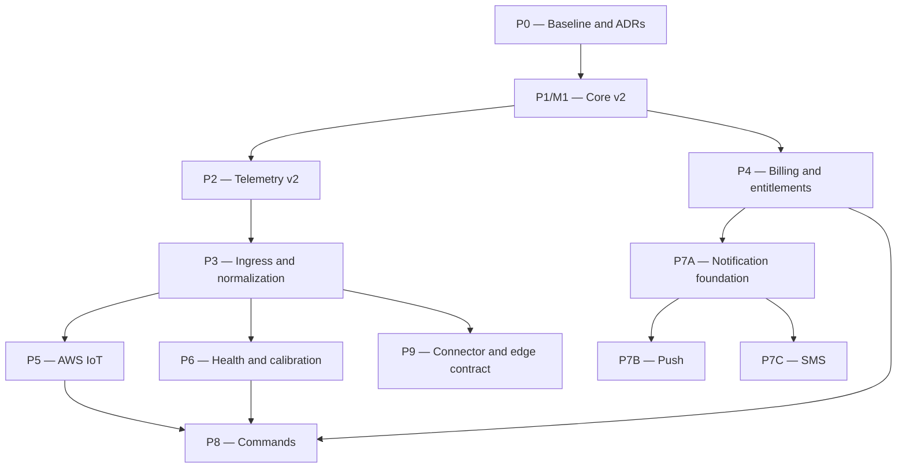

# LimnoPulse V4 Parallel Execution Design

**Date:** 2026-08-25  
**Status:** Approved for implementation planning  
**Repository:** `VINIClUS/limnopulse`  
**Baseline:** `ce46b47fd646de762098a632b12e02d482c66485` (`main`)  
**Source specification:** `docs/superpowers/specs/2026-08-16-limnopulse-platform-redesign-tech-spec-v4.md`

## 1. Purpose

This document converts the LimnoPulse Platform Redesign Tech Spec V4 into an
execution model suitable for multiple coding agents working concurrently in
isolated Git worktrees.

It defines:

- the roadmap dependency graph;
- the boundary between roadmap-level epics and implementation-ready work;
- the Phase 0 and M1 work packages;
- file ownership and integration rules;
- branch, pull-request and merge gates;
- preservation of existing GitHub backlog items;
- the conditions that permit later phases to be decomposed.

It does not change the product or platform architecture selected by V4.

## 2. Current-state evidence

The repository default branch is exactly the V4 baseline commit. There are no
open pull requests and no code drift to reconcile before planning.

Three retained branches are already fully contained in `main` and must not be
used as worktree bases:

- `agent/phase-3c-a-email-notifications`;
- `agent/phase-3c-b-telegram`;
- `feat/debian-vps-lab-v1`.

The current system already contains the FastAPI control plane, Cognito/dev
authentication, DynamoDB membership authorization, InfluxDB reads, local
Mosquitto/Telegraf ingestion, the Go alert evaluator, SES/email delivery,
Telegram delivery, durable notification state, SQS/DLQ infrastructure and an
OpenTofu scaffold.

The V4 foundation is absent: Site/Asset, device components, temporal
deployments, integration accounts, canonical telemetry v2, commercial billing,
AWS IoT, Push, SMS, health/calibration v2 and commands.

## 3. Execution decision

Use a **contract-first, vertically sliced execution model with centralized
integration ownership**.

The alternatives were rejected for the following reasons:

| Approach | Decision | Reason |
|---|---|---|
| Contract spine followed by vertical slices | Selected | Enables parallel work after one bounded serial gate while keeping each slice independently testable. |
| Immediate independent vertical slices | Rejected | Agents could invent incompatible IDs, DynamoDB keys, lifecycle states and compatibility semantics. |
| Layer-based branches for domain, persistence and API | Rejected | Produces non-functional intermediate branches and turns every merge into a cross-layer dependency. |

No long-lived integration branch is introduced. Every dependency boundary is a
merge to `main`.

## 4. Planning horizon

The complete V4 roadmap is represented at epic level. Only Phase 0 and Phase 1
(M1) are decomposed into implementation-ready tasks now.

This keeps the full dependency graph visible without prematurely fixing Push,
SMS, Stripe, command or vendor-connector implementation details before their
upstream contracts exist.

Phase 10 automatic policies and advanced analytics remains a future decision
gate. It receives no executable implementation backlog in this planning cycle.

## 5. Roadmap dependency graph

Additional hard gates:

- P6 consumes both the P2 observation contract and the P3 trusted ingestion
  path.
- P7C consumes the immutable P4 PlanVersion/UsageCounter contracts, the P7A
  destination/provider/policy contracts and durable incident acknowledgement
  semantics.
- P8 consumes P1 capabilities, P4 entitlements, P5 provider execution and P6
  health/safety inputs when AWS IoT is the first supported actuator path.
- Broad Brazil/United States launch requires both Android/FCM and iOS/APNs
  acceptance gates plus country-specific SMS readiness.

## 6. Roadmap epics

One tracker issue links these epics:

| Code | Epic | Entry dependency | Exit result |
|---|---|---|---|
| P0 | Architecture and baseline alignment | Approved V4 | Reproducible baseline, ADR inventory, `/v1` golden contract and conformance gates. |
| P1/M1 | API v2 domain foundation | P0 | Site/Asset, Device/Component, Integration and temporal Deployment with `/v1` compatibility. |
| P2 | Canonical telemetry and dual schema | P1 | Transport-independent observations, Influx v2 schema and legacy read equivalence. |
| P3 | Ingress and integration abstraction | P2 | HTTPS-to-SQS normalizer path, trusted mapping, replay safety and DLQ recovery. |
| P4 | Plans, entitlements and Stripe | P1 | Immutable PlanVersion, billing state, usage counters, Stripe sandbox and reconciliation. |
| P5 | AWS IoT direct adapter | P3 | Least-privilege provisioning, Rule-to-SQS ingestion, rotation and decommissioning. |
| P6 | Health, calibration and data quality | P2 and P3 | Deterministic device/component/connector health and calibration provenance. |
| P7A | Notification foundation | P4 | Provider-neutral delivery, typed destinations, policies, previews, escalation and no-Redis correctness. |
| P7B | AWS End User Messaging Push | P7A | Android/FCM followed by iOS/APNs using one canonical destination contract. |
| P7C | AWS End User Messaging SMS | P4 and P7A | BR/US critical SMS with verification, budgets, encoding, feedback and readiness gates. |
| P8 | Manual and assisted commands | P1, P4, P5 and P6 | Audited safety plane with approvals, execution and physical postcondition checks. |
| P9 | First vendor connector and edge contract | P3 | One demand-driven connector and a versioned edge protocol/security contract. |

Future epics remain blocked until their entry contracts are merged and their
open product/provider decisions are resolved. Their issue bodies record those
entry decisions but do not manufacture implementation tasks early.

## 7. Phase 0 and M1 execution waves

| Wave | Code | Work package | Dependencies | Worktree boundary |
|---:|---|---|---|---|
| 0 | P0-01 | Reconcile current-state inventory, architecture status and ADR mapping with V4 | None | Documentation only |
| 0 | P0-02 | Reproducible Python/Go/OpenTofu verification and CI | None | Quality automation only |
| 0 | P0-03 | Golden `/v1` OpenAPI plus tenant/no-scan conformance tests | None | Contract tests only |
| 1 | M1-00 | Freeze IDs, enums, DynamoDB keys, repository protocols and compatibility semantics | P0-01, P0-02, P0-03 | Shared contract spine |
| 2 | M1-01 | Site and Asset/PondProfile vertical slice | M1-00 | Site/Asset files only |
| 2 | M1-02 | Device, Component and Capability vertical slice | M1-00 | Device/capability files only |
| 2 | M1-03 | IntegrationAccount and DeviceIntegration vertical slice | M1-00 | Integration files only |
| 3 | M1-04 | Temporal Deployment and current-deployment pointer | M1-01 and M1-02 | Deployment files only |
| 4 | M1-05 | `/v1` Pond/Device compatibility projection | M1-01 through M1-04 | Legacy compatibility owner |
| 4 | M1-06 | Idempotent default Site/Asset migration | M1-01 through M1-04 | Migration scripts and tests |
| 4 | M1-07 | `/v2` mounting, application composition and shared configuration | M1-01 through M1-04 | Integration hotspots owner |
| 5 | M1-08 | M1 acceptance, hardening and operational documentation | M1-05, M1-06, M1-07 | Release gate; no feature scope |

P0-01, P0-02 and P0-03 may run concurrently. M1-01, M1-02 and M1-03
may run concurrently after M1-00 is merged. M1-05, M1-06 and M1-07 may run
concurrently after the vertical slices and Deployment are merged.

## 8. Contract-spine gate

M1-00 is deliberately serial and small. It fixes the shared vocabulary needed
by later agents without implementing a complete resource slice.

It must define:

- canonical ID prefixes and validation;
- entity version/status conventions;
- Asset kind and PondProfile relationship;
- Device, Component and Capability type/state enums;
- IntegrationAccount and DeviceIntegration identity;
- Deployment interval and non-overlap semantics;
- current-deployment pointer semantics;
- tenant ownership rules;
- DynamoDB key builders and access-pattern names;
- repository protocol signatures;
- `/v1` Pond and Device projection rules;
- conditional-write and idempotency expectations.

The contract is accepted through executable tests. Later worktrees consume these
types and signatures; they do not redefine them.

## 9. File ownership and collision control

Vertical slices create focused files under the target V4 structure. They do not
mount their routers or modify shared application composition.

M1-07 exclusively owns these integration hotspots during Wave 4:

- `src/limnopulse_api/main.py`;
- `src/limnopulse_api/api/router.py`;
- `src/limnopulse_api/core/config.py`;
- `.env.example`;
- `compose.yaml`;
- `scripts/dev/init_dynamodb.py`;
- `scripts/dev/seed_local.py`;
- global README and architecture wiring sections.

M1-05 exclusively owns behavioral changes to existing `/v1` Pond and Device
flows. M1-06 owns migration/backfill scripts and their idempotency fixtures.

The legacy `src/limnopulse_api/adapters/dynamodb.py` is not expanded into the
repository for every v2 entity. New bounded-context adapters keep M1-01,
M1-02, M1-03 and M1-04 from editing one monolithic file concurrently.

Shared dependency and lock files are changed only by the task that introduces
the dependency. Dependency additions require a stated need and cannot be used
for incidental upgrades.

## 10. Git worktree and branch protocol

1. Every executable issue maps to exactly one worktree and one pull request.
2. A worktree is created only after all blocking issues are merged to `main`.
3. Its branch starts from the resulting `origin/main`, never from a retained or
   unmerged feature branch.
4. Branches use `agent/v4-<task-code>-<short-name>`, lower case.
5. Agents do not cherry-pick or copy commits between active worktrees.
6. An agent may read merged work from `main`; it may not rely on another active
   agent's unmerged files.
7. Before review, the branch is updated against current `main` and reruns its
   focused and shared gates.
8. Each pull request closes one task issue and lists the exact commands and
   results used for verification.
9. A dependent worktree starts only after the prerequisite pull request is
   merged and its gate is green.
10. Worktrees are removed only after the branch is merged or explicitly
    abandoned with its state recorded.

## 11. GitHub backlog representation

The GitHub connector cannot create repository-specific labels or milestones.
The backlog therefore uses stable title prefixes and explicit issue-body
metadata instead of depending on unavailable taxonomy mutations.

The materialized set contains:

- one `[Roadmap][V4]` tracker;
- twelve `[Epic][P*]` issues;
- three `[Task][P0-*]` issues;
- nine `[Task][M1-*]` issues.

Each executable issue contains:

- goal;
- independently reviewable deliverable;
- scope and explicit exclusions;
- `Blocked by` and `Blocks` links;
- owned files and forbidden hotspots;
- consumed and produced interfaces;
- TDD implementation steps;
- acceptance criteria;
- exact focused and shared verification commands;
- rollback behavior;
- branch name;
- merge-order notes.

Epics use checklists with real issue links after all tasks have been created.
Dependencies are represented by GitHub issue links and stable task codes, not by
branch ancestry.

## 12. Definition of ready

An executable task may start only when:

- every `Blocked by` issue is merged;
- consumed interfaces exist on `main` with executable contract tests;
- owned files do not overlap another active task;
- acceptance criteria and verification commands are complete;
- required fixtures are available without production credentials;
- no unresolved product decision changes the expected behavior.

If one of these conditions fails, the task remains blocked rather than allowing
an agent to invent a local contract.

## 13. Definition of done

A task is done only when:

- its focused tests demonstrate a fail-then-pass cycle;
- existing Python and Go tests relevant to the touched boundary pass;
- tenant-isolation and no-scan invariants remain true;
- public behavior is documented where applicable;
- no secret, token, phone number or tenant-controlled authority is added to
  fixtures, logs or queue payloads;
- its pull request records verification evidence;
- review finds no out-of-scope refactor or hidden dependency;
- the branch is merged to `main`.

M1 additionally requires:

- all current Python and Go tests green;
- `/v1` golden compatibility green;
- no critical DynamoDB Scan;
- a gateway with multiple probes representable;
- a probe relocation that does not rewrite history;
- no AWS-specific identifier in core entities;
- an idempotent default Site/Asset migration;
- future site/device/component/destination quota dimensions representable;
- no new correctness dependency on Redis.

## 14. Existing backlog preservation

GitHub issue `#6`, **Model Evaluation.Value as an optional value**, remains the
canonical work item for presence-aware evaluator values and cross-language
compatibility. It is linked from the P2/P6 roadmap area and is not part of M1.

GitHub issue `#8`, **Define notification PII retention, redaction, and tenant
offboarding**, remains the canonical policy decision. P7A references it as a
blocking governance decision for retention implementation. No retention worker
is created before that decision is approved.

Completed Telegram work is not reopened or duplicated.

## 15. Deferred decision register

The following decisions do not block P0/M1. They are recorded in their entry
epics and must be resolved before those epics are decomposed:

| Decision | Owning epic | Planning constraint |
|---|---|---|
| Enterprise SMS budget currency | P4 | Launch defaults remain USD; a non-USD Enterprise contract requires an explicit versioned design. |
| Business automatic-policy entitlement | P8/P10 | It is a future capability marker, not a launch authorization. |
| PushDestination quota timing | P4/P7A | P4 defines a generic counter dimension; enforcement begins only after the destination type exists. |
| Non-AWS generic MQTT implementation | P3/P9 | P3 freezes the contract and HTTPS path; P5 supplies AWS MQTT; a separate non-AWS runtime requires a later approved slice. |
| Commercial-market enablement model | P4 | Locale, commercial market and SMS country readiness remain separate states. |
| Retention and suspension policy values | P4/P7A | Concrete values require product/legal/security approval; issue #8 remains canonical for notification PII. |
| SMS readiness freshness/evidence | P7C | The implementation plan must define an objective expiry and evidence source before production enablement. |
| Mobile client ownership and release gate | P7B | Client technology remains outside this repository; the registration contract and external release evidence are required. |

## 16. Planning and execution gates

After this design is merged and reviewed:

1. write the detailed P0/M1 implementation plan;
2. self-review it for V4 coverage, placeholders and type consistency;
3. create the roadmap, epic and task issues;
4. replace stable-code dependency references with real issue links;
5. review the complete GitHub graph for duplicate and missing edges;
6. begin Wave 0 only after that graph is accepted.

This sequence keeps planning artifacts, GitHub state and agent execution in the
same dependency order.
