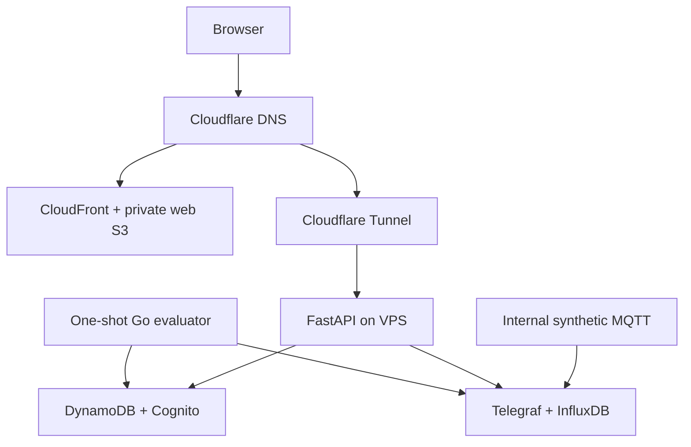

# LimnoPulse Production Deployment Design

**Date:** 2026-08-29  
**Status:** Draft for repository review; architecture approved in design discussion  
**Repository:** `VINIClUS/limnopulse`  
**Integration base:** `main`  
**Production domains:** `limnopulse.com`, `api.limnopulse.com`  
**Primary AWS region:** `us-east-2`; global edge control plane (ACM,
CloudFront-scoped WAF and Pricing Plan Manager endpoint): `us-east-1`

## 1. Purpose

Define a small, secure production portfolio deployment of LimnoPulse on the
personal Hostinger VPS plus bounded AWS services.

The deployment validates the current FastAPI, Go evaluator, DynamoDB, SQS and
InfluxDB architecture with synthetic telemetry. It is not the broad commercial
MVP described by the V4 platform redesign and must not be represented as one.

Frontend assets are served from a private S3 origin through CloudFront. The
FastAPI API, InfluxDB, Mosquitto, Telegraf and one-shot Go jobs run on the VPS.
DynamoDB, SQS/DLQ and Cognito run in AWS `us-east-2`.

## 2. Relationship to the V4 redesign

This document composes:

- `2026-08-16-limnopulse-platform-redesign-tech-spec-v4.md`;
- `2026-08-25-limnopulse-v4-parallel-execution-design.md`;
- the existing Phase 2A-3C domain and operations documents;
- the current `infra/opentofu` scaffold.

The production profile is named `portfolio-demo`. It preserves V4 domain
boundaries and durable semantics but intentionally disables commercial and
notification/delivery features whose prerequisites, costs or safety work are
incomplete.

### 2.1 Enabled

- one demo tenant and controlled synthetic devices;
- existing FastAPI membership/telemetry/alert APIs;
- InfluxDB time-series storage on the VPS;
- DynamoDB domain and audit tables;
- Cognito OIDC login;
- internal-only MQTT/Telegraf synthetic ingestion;
- one-shot Go alert evaluation;
- base SQS/DLQ infrastructure with producers and notification/delivery
  providers disabled until their product gates pass;
- static production frontend contract;
- observability, backups and deployment rollback.

### 2.2 Disabled

- Stripe and all paid plans/billing behavior;
- SES email, Telegram, Push and SMS delivery;
- Redis/Valkey;
- AWS IoT Core;
- vendor connectors and external customer devices;
- public MQTT or direct device onboarding;
- physical actuator commands and automation;
- EventBridge custom bus, SNS SMS feedback and notification provider resources;
- multi-region infrastructure;
- any patient, employee, customer or other personal data.

Disabled means no resource, secret container, worker, schedule or outbound
notification/delivery API call is created. It is stronger than a UI feature
flag.

## 3. Current repository gaps and release gates

The repository currently has no frontend/package build, no production API
container in `compose.yaml`, and no GitHub Actions workflow. The existing
Compose file is a local-development stack: it includes DynamoDB Local,
ElasticMQ, local credentials and broad host bindings unsuitable for production.

Production is blocked until application-owned work supplies:

1. a deterministic static frontend or landing/dashboard bundle with a stable
   output directory and public runtime-config schema;
2. a pinned multi-stage API image and production entrypoint;
3. production image targets for the one-shot evaluator and synthetic publisher;
4. a separate `compose.production.yaml` that does not inherit development
   emulators, credentials or port bindings;
5. runtime feature flags that fail closed for SES, Telegram, Push, SMS, Redis,
   Stripe, AWS IoT and commands;
6. OpenTofu feature boundaries that omit disabled resources entirely;
7. a `portfolio-demo` startup gate proving that the API and one-shot jobs start
   without Redis, Telegram or any of their secrets, clients, routes, workers or
   schedules; with caching disabled, membership and other ordinary reads use
   DynamoDB directly rather than constructing or probing a Redis client;
8. CI gates for Python, Go, frontend, OCI and OpenTofu artifacts.

Infrastructure must not generate a generic placeholder website: the content at
`limnopulse.com` must be versioned product code with its own tests and release
manifest.

## 4. Target topology



Mosquitto, Telegraf and InfluxDB are not reachable from the Internet. The only
public application paths are the CloudFront site and API hostname through the
Tunnel.

## 5. Component ownership

| Component | Owner | Responsibility |
|---|---|---|
| Web S3, CloudFront, ACM, dedicated WAF | LimnoPulse OpenTofu | Static distribution |
| CloudFront Free subscription | LimnoPulse release contract | Exact distribution/WAF binding |
| DynamoDB, Cognito, SQS/DLQ | LimnoPulse OpenTofu | Managed control plane |
| API/evaluator/synthetic images | LimnoPulse CI | Product runtime artifacts |
| InfluxDB/MQTT/Telegraf Compose | LimnoPulse release | Product-local data plane |
| Tunnel/API/static DNS | `personal-infra-live` | Shared edge resources |
| VPS/Nginx/deployer/backup | `infra-ansible` through live inventory | Host boundary |

The product state does not manage shared KMS, Roles Anywhere, AWS budgets,
Cloudflare Tunnel or host firewall resources.

## 6. Static site

The static design mirrors the CnesData distribution while remaining an
independent bucket and distribution:

- private S3 bucket in `us-east-2` with public access blocked;
- CloudFront Origin Access Control;
- CloudFront Free flat-rate plan with no automatic upgrade;
- one dedicated, CloudFront-scoped AWS WAF web ACL in `us-east-1`, required by
  that plan and not shared with CnesData;
- ACM certificate in `us-east-1`;
- Cloudflare DNS-only CNAME for `limnopulse.com`;
- HTTPS redirect, compression, bounded SPA rewrite and security headers;
- S3 versioning and a release lifecycle below the 5 GB Free-plan origin limit.

Before DNS cutover, the account-level gate proves Free-plan eligibility and an
available slot. A separate manual, idempotent Pricing Plan Manager API step in
`us-east-1` binds this exact distribution and WAF to an exact `FREE`
subscription and verifies `ACTIVE`. Until the AWS provider exposes a supported
resource, the subscription is tracked by signed deployment evidence and drift
checks rather than an OpenTofu provisioner. Any failure stops rollout; no
pay-as-you-go fallback or paid upgrade occurs implicitly.

Every release-coupled object -- hashed assets, manifests and public runtime
configuration -- is uploaded below the immutable prefix
`releases/<release_id>/`. Those objects use one-year immutable caching and are
never overwritten. The initial production profile has no service worker; adding
one later requires a separate design for atomic service-worker update and
rollback semantics.

Only root `index.html` is a mutable release pointer. It uses no-cache/bounded
revalidation and references one release prefix for all assets, its manifest and
runtime configuration. Deployment completely uploads and verifies the new
release prefix before replacing `index.html` last. Rollback atomically restores
the prior version of `index.html`, which therefore selects the matching prior
release as one unit, and invalidates only that entrypoint. Release-prefix
lifecycle policy must retain every release still eligible for rollback.

The bundle receives only public configuration:

- API base URL;
- Cognito issuer, User Pool client ID, authorization base URL and region;
- release ID;
- explicit `portfolio-demo` feature capabilities.

No API token, Influx token, AWS credential, tenant membership or provider
secret may be embedded in the bundle.

## 7. FastAPI deployment

The API runs as one container behind loopback Nginx and
`api.limnopulse.com` through Cloudflare Tunnel.

Required container controls:

- fixed non-root UID/GID;
- read-only root filesystem and bounded tmpfs;
- no Linux capabilities or Docker socket;
- loopback-only published port;
- CPU, memory, PID and log limits;
- separate liveness and dependency-aware readiness endpoints;
- redacted JSON stdout and optional local metrics;
- read-only mount of the temporary LimnoPulse AWS credential directory, so
  atomic host-side refreshes remain visible;
- after each successful Roles Anywhere renewal, a graceful API
  restart/recreation that drains in-flight requests and starts a new process
  against the new credential files before the old credential lifetime expires;
  existing boto3 clients are not assumed to reread a replaced shared
  credentials file;
- no access to CnesData networks, files or credentials.

Production never sets `AUTH_MODE=dev` or accepts `X-Dev-*` identity headers.
Local endpoint overrides for DynamoDB, SQS, Cognito or Influx are rejected when
`APP_ENV=prod` except the declared internal InfluxDB URL. `prod` is the only
production environment value used by Compose, Python and Go runtime contracts.

Because the site and API are different origins, the API release gate requires
CORS with the sole allowed origin `https://limnopulse.com`, methods
`GET`, `POST`, `PUT`, `PATCH`, `DELETE` and `OPTIONS`, and request headers
`Authorization`, `Content-Type` and `Idempotency-Key`. Origins, methods and
headers do not use wildcards, credentials/cookies are not allowed, and no other
production origin is admitted implicitly.

The API has no direct notification/delivery provider calls in the demo profile.
Ordinary reads remain available if an optional disabled notification provider
is unavailable.

## 8. Cognito and tenancy

The deployment creates one Cognito User Pool and a public Authorization Code +
PKCE SPA client with exact callback/logout URLs. It also provisions the managed
User Pool domain prefix `limnopulse-portfolio-demo` in `us-east-2`. Provisioning
fails closed if that exact prefix is unavailable; rollout does not silently
choose another domain. The immutable frontend runtime configuration exposes the
issuer, User Pool client ID and authorization base URL needed to construct the
`/oauth2/authorize` request. The client has no client secret, SMS, social
provider or machine-to-machine flow.

Public self-registration is disabled with
`admin_create_user_config.allow_admin_create_user_only = true`. The idempotent
seed operation creates only reviewed demo users with Cognito messages
suppressed, then sets a permanent password through an administrative path. That
password is generated, stored and delivered outside the frontend bundle,
release artifacts, logs and source control.

Cognito establishes identity only. The existing active-membership check in
DynamoDB remains authoritative for tenant access. The deployment seeds one
demo tenant, one site/pond, one synthetic device and reviewed demo accounts
through an idempotent operation that cannot overwrite another tenant.

That operation also seeds one deterministic, enabled `active` alert rule for
the synthetic device. It uses a one-minute duration and a threshold/window
matched to the versioned telemetry fixture so one sufficient complete window
breaches on the first evaluation. Its `next_evaluation_at`, evaluation bucket
and `AlertEvaluationByDue` keys make it due no later than the release smoke
evaluation time. Re-running the seed preserves the same identifiers and cannot
overwrite user-authored rules. The rule's notification outbox may exercise the
durable domain contract, but the disabled relay and delivery providers cannot
send it.

All UI and API text identifies measurements, alerts and delivery outcomes as
synthetic/demo data. No clinical or municipal operating data is copied into the
environment.

## 9. DynamoDB

The existing `LimnopulseDomain` and `LimnopulseAudit` logical tables remain
separate.

Production controls:

- `PAY_PER_REQUEST`;
- PITR enabled for 35 days;
- TTL as asynchronous garbage collection only;
- server-side encryption;
- deletion/lifecycle protection;
- maximum on-demand throughput initially 100 reads/second and 25
  writes/second per table and GSI;
- no Global Tables, autoscaling or Contributor Insights;
- CloudWatch alarms for throttling and system errors.

Existing access-pattern indexes remain. A new index is not added solely for a
deployment query or dashboard convenience; it requires an application design
and measured access pattern.

The VPS API/evaluator roles receive exact table/index actions. GitHub plan and
apply roles cannot read arbitrary tenant data.

## 10. SQS/DLQ boundary

The first infrastructure release creates the encrypted base notification jobs
queue and its DLQ because those resources and durable contracts already exist
in the codebase. Long polling, bounded retention, visibility timeout and redrive
policy follow the existing notification design.

However:

- notification relay scheduling is disabled;
- SES and Telegram workers are not deployed;
- no fake-success sender may run under `APP_ENV=prod`;
- no message is presented as delivered without a real approved provider result;
- only deployment canary messages with an explicit non-domain schema may test
  send/receive/DLQ mechanics, and they are removed without mutating a
  NotificationDelivery record.

Email/Telegram queues beyond the base lane, SES/EventBridge resources and
Telegram Secrets Manager containers are omitted until a separate approved
notification/delivery provider rollout. The OpenTofu structure uses explicit
booleans with safe
defaults; disabling a provider creates zero related resources.

## 11. InfluxDB

InfluxDB 2 runs as the only persistent application database on the VPS.

- image pinned by immutable digest;
- dedicated named volume outside release directories;
- no host-public port;
- API access only through the internal product network;
- separate initialization and application tokens;
- root/admin token unavailable to the API after bootstrap;
- application token limited to required buckets/actions;
- health, disk usage and write failures monitored;
- raw synthetic observation retention initially 90 days;
- no bucket per tenant or plan;
- high-cardinality tags prohibited as defined by V4.

The existing legacy `water_quality` compatibility path remains governed by the
V4 migration. The deployment does not stop dual-write or delete an old bucket.

## 12. Internal synthetic ingestion

Mosquitto is reachable exclusively on the private LimnoPulse Compose network.
It publishes no host port, including loopback, and is not routed by Nginx or
Cloudflare. The systemd timer invokes the one-shot synthetic publisher as a
Compose run/job attached to that same network; host-side diagnostics do not use
`localhost:1883`.

The production synthetic profile:

- sets `allow_anonymous false` and authenticates two separate principals with
  distinct secrets: the one-shot publisher may only write the exact synthetic
  topic prefix, while Telegraf may only read/subscribe to that prefix;
- denies publisher reads/subscriptions, Telegraf writes and all access to other
  topics through default-deny broker ACLs;
- uses a versioned fixture with no tenant/site identifiers supplied by the
  device payload;
- enriches through the trusted registry before InfluxDB write;
- drops unknown devices and records a bounded metric;
- runs a one-shot publisher from a systemd timer at a conservative cadence;
- never accepts an Internet or customer-device connection.

Public MQTT, TLS/mTLS device identity and credential rotation require a future
device-ingestion specification. The internal-only demo does not claim that
production device onboarding is complete.

## 13. Go evaluator and scheduled work

The existing alert evaluator remains one-shot and externally scheduled.

- a systemd timer invokes the digest-pinned container;
- a host-local lock prevents overlapping runs;
- the container receives only temporary AWS credentials and an InfluxDB
  application token;
- each one-shot process starts only after a successful Roles Anywhere renewal
  and loads the then-current credential files at process startup;
- concurrency and evaluation batch sizes are bounded;
- timeout/exit code distinguishes success, retryable dependency failure and
  terminal configuration failure;
- repeated schedules preserve the existing fencing and idempotency semantics;
- failures alert without starting a second uncontrolled loop.

No permanent notification worker, relay, Redis or notification/delivery
provider process runs in the initial profile.

## 14. Production Compose contract

`compose.production.yaml` is independent from the development defaults and
contains only:

- API;
- InfluxDB;
- Mosquitto;
- Telegraf;
- optional one-shot profiles for evaluator, synthetic publisher and backup
  verification.

It must not contain DynamoDB Local, ElasticMQ, development Redis, WireMock,
local AWS keys, fake notification providers, source builds on the VPS or
mutable image tags.

Each service has an explicit network. Only the API publishes a loopback port.
InfluxDB and Mosquitto data/configuration are mounted narrowly, and application
release rollback never deletes their volumes.

## 15. IAM Roles Anywhere and secrets

No static AWS key exists in GitHub, Compose or a persistent `.env` file.

- GitHub workflows use OIDC.
- VPS services consume a host-renewed temporary credential directory from the
  LimnoPulse Roles Anywhere profile.
- General runtime secrets use SSM SecureString under
  `/personal/prod/limnopulse/runtime/`; InfluxDB secrets use the complete
  `/personal/prod/limnopulse/influx/` namespace.
- The distinct Mosquitto publisher and Telegraf credentials use
  `/personal/prod/limnopulse/runtime/mqtt/publisher/password` and
  `/personal/prod/limnopulse/runtime/mqtt/telegraf/password` respectively and
  are rendered only to the service that owns each principal.
- InfluxDB admin/bootstrap values are read only by the initialization/backup
  boundary; the API gets a narrower token.
- Disabled Stripe, SES, Telegram, Push, SMS, AWS IoT and vendor secrets do not
  have placeholder values.
- Secret values are rendered to `/run`, mode-restricted and atomically
  replaced; containers cannot read X.509 leaf private keys.

Separate IAM policies cover API, evaluator, SQS canary validation, backup,
GitHub plan/apply and break-glass operations.

## 16. OpenTofu changes

The existing scaffold is evolved into modules with explicit production feature
boundaries:

```text
core_dynamodb       = true
core_cognito        = true
core_sqs            = true
email_delivery      = false
telegram_delivery   = false
push_delivery       = false
sms_delivery        = false
stripe_billing      = false
aws_iot             = false
redis               = false
```

Disabled modules produce no resources or secret containers. The current
unconditional SES, EventBridge and Telegram resources must be made conditional
before a real production plan.

Additional application-owned modules cover:

- static web bucket/CloudFront/ACM;
- CloudWatch alarms and IAM;
- SQS canary policy;
- relevant outputs for the shared edge stack.

State uses `limnopulse/prod/opentofu.tfstate` in the shared private versioned S3
backend with native locking. The public repository contains no backend bucket,
AWS account ID, Cloudflare ID or state.

All resources that support tags carry `Project=limnopulse`, `Environment=prod`,
`ManagedBy=opentofu`, `Owner=vinisantana`; untaggable resource types are
validated through naming, policy and inventory checks instead.

Policy denies NAT Gateway, ALB, RDS/Aurora, OpenSearch, ElastiCache, AWS IoT,
Global Tables, paid messaging resources and unapproved notification/delivery
provider infrastructure. Here and elsewhere, "provider" in a feature gate means
an outbound notification/delivery provider such as SES, Telegram, Push or SMS;
it does not mean the AWS/OpenTofu infrastructure provider plugin.

## 17. CI/CD

### 17.1 Pull-request validation

GitHub-hosted runners execute:

- Python lint/type/test and security checks;
- Go race tests and build;
- frontend lint/type/test/build once the frontend contract exists;
- production Compose schema/config policy tests;
- container builds, SBOMs and vulnerability scans;
- OpenTofu format/validate/test and provider lock verification;
- policy, secret and cost-manifest checks;
- local integration tests with pinned emulator images and unconditional
  teardown.

Pull-request workflows receive no production credential. The repository is
public, so no self-hosted production runner is allowed.

### 17.2 Release manifest

One immutable manifest records source SHA, CI run IDs, API/evaluator/publisher
image digests, frontend checksum, production Compose checksum, SBOM checksums
and OpenTofu/provider-lock digest.

All production promotions require a green `main` commit. Mutable tags are not
deployment authority.

### 17.3 Infrastructure and application promotion

OpenTofu plan and apply are separate manually joined workflows using GitHub
OIDC. Application promotion is a separate `workflow_dispatch` that:

1. verifies the immutable release manifest;
2. pulls candidates with no persistent registry credential;
3. starts the API candidate on a different loopback port;
4. validates Cognito, membership, DynamoDB and Influx reads;
5. switches Nginx and preserves the prior API digest;
6. updates one-shot timer image references;
7. uploads and verifies the immutable frontend
   `releases/<release_id>/` unit, then replaces root `index.html` last;
8. publishes the matching synthetic sample, waits until its window is eligible,
   invokes the due seeded rule and verifies one evaluated rule plus the expected
   incident/read flow;
9. records redacted evidence.

Merge to `main` never automatically deploys production. GitHub paid spending is
fixed at USD 0.

## 18. API and edge rate limiting

- Cloudflare Free protects the most sensitive public endpoint available within
  the plan's rule limit.
- Nginx applies general and auth/mutation IP zones.
- Before evaluating those zones, Nginx trusts `CF-Connecting-IP` only when the
  TCP peer is the exact loopback address or dedicated local container address
  assigned to `cloudflared` (`set_real_ip_from` is not a broad private subnet),
  using `real_ip_header CF-Connecting-IP` and `real_ip_recursive on`. The header
  is ignored for every other source, and all rate-limit keys use the restored,
  validated client address.
- FastAPI enforces tenant membership, object ownership, idempotency and
  role-based mutation limits.
- Telemetry read windows and row limits remain bounded.
- Telegram webhook, billing webhook and provider endpoints return disabled/not
  configured and are not publicly routed in the demo profile.
- MQTT has no public route, so HTTP rate limiting is not treated as device
  authentication.

## 19. Backup and recovery

InfluxDB receives a consistent daily full backup to the shared private S3
backup bucket in `us-east-2`.

Retention:

- 7 daily;
- 4 weekly;
- 3 monthly.

Bucket versioning and Object Lock Governance protect the backup. The uploader
can write but not delete or bypass retention. A lifecycle role, not the
application, expires objects.

DynamoDB PITR retains 35 days. OpenTofu state and static entrypoints are
versioned. Hostinger's included weekly backup remains the full-host recovery
path; a fresh manual snapshot is required before risky host changes.

Quarterly drills restore InfluxDB to an isolated container and verify one
synthetic tenant/read range without replacing the production volume.

## 20. Rollback

- **API:** restore previous Nginx upstream and image digest.
- **Frontend:** restore the prior root `index.html` version, which points only
  to its retained immutable `releases/<release_id>/` unit, and invalidate that
  entrypoint.
- **Timers:** restore previous evaluator/publisher digest before the next run.
- **InfluxDB:** never roll back or delete the volume during an application
  rollback; forward compatibility is required.
- **DynamoDB:** schema changes are additive; no table restore is an automatic
  release action.
- **OpenTofu:** a failed apply stops and requires a new reviewed plan.
- **Notification/delivery features:** because they are absent, rollback cannot
  accidentally send email, Telegram, Push or SMS.

## 21. Observability and SLOs

Initial targets:

- static frontend availability 99.9%;
- API availability 99.5%;
- eligible scheduled evaluator success 99%;
- API p95 below two seconds for routine demo reads;
- routine API deployment interruption at most 60 seconds.

Grafana Alloy collects bounded host, API, Nginx, Tunnel, InfluxDB, Telegraf,
Mosquitto and systemd timer telemetry. It has no Docker socket. CloudWatch
alarms cover DynamoDB, SQS/DLQ and Cognito-related errors where available.

Required alerts:

- site/API/Tunnel unavailable;
- InfluxDB unhealthy, disk high or backup failed;
- Telegraf write/drop failures and synthetic data stale;
- evaluator failed, overlapped or missed cadence;
- DynamoDB throttles/system errors;
- SQS age/depth/DLQ nonzero when the base lane is enabled;
- budget/anomaly thresholds.

Tenant, device, token, email, message and request identifiers are not metric
labels unless explicitly bounded and non-sensitive.

## 22. Cost contract

LimnoPulse receives a USD 3 monthly operational envelope. Expected managed
service spend is approximately USD 0-2 at demo traffic; InfluxDB and workers use
the already purchased VPS.

Controls:

- CloudFront Free plan and web origin below 5 GB;
- one of the account's maximum three CloudFront Free-plan subscriptions, with
  eligibility and `ACTIVE` status checked before cutover;
- DynamoDB on-demand maximum throughput and PITR;
- only the base SQS/DLQ with no paid notification/delivery provider traffic;
- no SES, Telegram infrastructure, SMS, Push, AWS IoT, Redis, NAT or load
  balancer;
- bounded CloudWatch logs/alarms and no Container Insights;
- paid Cloudflare, Grafana and GitHub usage disabled;
- shared USD 15 cost freeze blocks new cost-generating automation but preserves
  API reads and backups.

## 23. Test and acceptance matrix

### 23.1 Pre-production

- all existing Python/Go contracts and V4 M1 gates remain green;
- production settings reject dev auth, endpoint overrides and fake senders;
- `portfolio-demo` starts with Redis and Telegram absent, constructs neither
  client, exposes neither route, and serves cache-disabled reads from DynamoDB;
- an exact-origin browser preflight succeeds for the declared CORS contract,
  while wildcard, cookie and unlisted-origin/header cases fail closed;
- a staged Roles Anywhere renewal gracefully replaces the API before credential
  expiry, and a newly invoked one-shot job uses only the renewed credential set;
- Compose contains no emulator, local key or host database/MQTT binding;
- Mosquitto rejects anonymous and cross-ACL access while the authenticated
  publisher-to-Telegraf synthetic flow succeeds with distinct credentials;
- cross-tenant membership and telemetry reads fail closed;
- DynamoDB TTL/optimistic version/idempotency behavior;
- SQS redrive/canary behavior without domain delivery mutation;
- Influx retention, backup and isolated restore;
- unknown MQTT device drop and trusted enrichment;
- evaluator fencing, duplicate schedule and timeout behavior;
- deterministic seed creates an enabled, active, indexed due rule whose
  threshold/window fixture opens the expected synthetic incident on the first
  sufficient evaluation without sending a notification;
- CDN private origin, immutable release-prefix upload, last-write
  `index.html` cutover, matching-unit SPA rollback and CSP; no service worker is
  registered or served;
- CloudFront Free eligibility plus exact `ACTIVE` distribution/WAF binding;
- Cognito exact-domain availability, Authorization Code + PKCE login,
  self-registration rejection and suppressed-message admin seeding;
- disabled notification/delivery provider resources are absent from the
  OpenTofu plan;
- secret inventory contains the complete InfluxDB and per-principal MQTT paths,
  with no disabled-feature secret containers;
- Nginx derives distinct rate-limit keys from validated Cloudflare visitor IPs
  and ignores spoofed `CF-Connecting-IP` from every untrusted peer;
- aggregate cost policy remains below USD 15.

### 23.2 Production smoke

- `limnopulse.com` reports the expected release over TLS;
- its S3 origin is not publicly readable;
- `api.limnopulse.com` is healthy through Tunnel and unreachable at direct VPS
  ports;
- PKCE login resolves only the seeded membership;
- a synthetic MQTT sample reaches InfluxDB and is retrievable through FastAPI;
- one evaluator run discovers the seeded due rule, evaluates it and creates the
  expected synthetic incident state;
- no provider call, email, Telegram message, Push or SMS occurs;
- backup checksum/upload and previous API/frontend rollback succeed;
- logs, traces, plans and artifacts reveal no secret or synthetic payload body.

## 24. Definition of done

- The production frontend and image gaps in Section 3 are implemented and
  tested.
- This specification and its implementation plan are reviewed.
- Static, API, AWS and VPS resources satisfy their ownership boundaries.
- No municipal infrastructure, Infisical or self-hosted GitHub runner is used.
- No long-lived AWS or GHCR credential exists.
- Only synthetic/controlled telemetry is present and visibly identified.
- Disabled commercial and notification/delivery provider resources are absent,
  not merely idle.
- Deploy, rollback, rate-limit, backup/restore and cost-freeze drills pass.
- `limnopulse.com` and `api.limnopulse.com` meet the stated health and
  isolation contracts.
- Release notes explicitly describe this as a portfolio demo profile, not the
  complete V4 commercial MVP or production device platform.

## 25. References

- Amazon DynamoDB on-demand maximum throughput:
  <https://docs.aws.amazon.com/amazondynamodb/latest/developerguide/on-demand-capacity-mode-max-throughput.html>
- Amazon SQS dead-letter queues:
  <https://docs.aws.amazon.com/AWSSimpleQueueService/latest/SQSDeveloperGuide/sqs-dead-letter-queues.html>
- Amazon Cognito authorization-code flow:
  <https://docs.aws.amazon.com/cognito/latest/developerguide/authorization-endpoint.html>
- Amazon Cognito admin-only user creation:
  <https://docs.aws.amazon.com/cognito/latest/developerguide/user-pool-settings-admin-create-user-policy.html>
- Boto3 credential provider behavior:
  <https://docs.aws.amazon.com/boto3/latest/guide/credentials.html>
- Amazon CloudFront Origin Access Control:
  <https://docs.aws.amazon.com/AmazonCloudFront/latest/DeveloperGuide/private-content-restricting-access-to-s3.html>
- Amazon CloudFront flat-rate plan quotas:
  <https://docs.aws.amazon.com/AmazonCloudFront/latest/DeveloperGuide/flat-rate-pricing-plan.html>
- AWS Pricing Plan Manager API:
  <https://docs.aws.amazon.com/PricingPlanManager/latest/UserGuide/getting-started-pricingplanmanager-api.html>
- InfluxDB backup and restore:
  <https://docs.influxdata.com/influxdb/v2/admin/backup-restore/>
- Cloudflare original visitor IP restoration:
  <https://developers.cloudflare.com/support/troubleshooting/restoring-visitor-ips/restoring-original-visitor-ips/>
